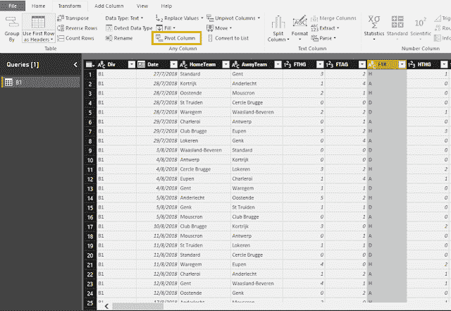
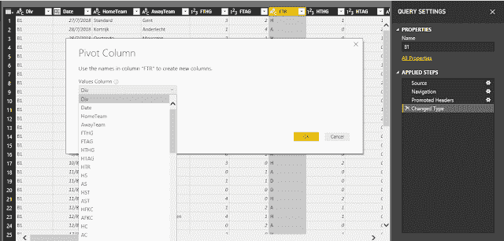
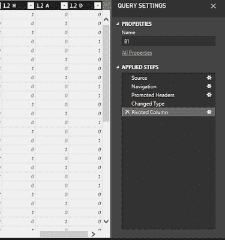
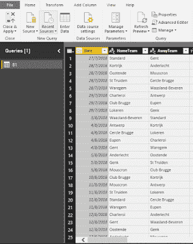
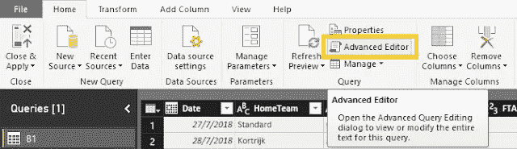
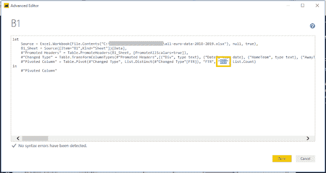

# 数据可视化提示(Power BI)-将分类变量转换为虚拟变量

> 原文：<https://towardsdatascience.com/data-visualization-tips-power-bi-convert-categorical-variables-to-dummy-variables-a53f20cdb4e?source=collection_archive---------15----------------------->

除了进行数据可视化，如绘制图表和显示 KPI，Power BI 还可以通过编写 DAX 语法来执行一些计算功能。但是，您可能会发现数据集中存在分类变量，这可能会对您计算某些值造成障碍。可能没有像 R 或 Python 中那样简单的代码将分类变量转换成哑变量。如果数据量很小或者只有 2 到 3 个类别，您仍然可以通过编写 if-else 查询或编辑查询中的条件设置来逐个转换变量。本文是为那些想在 Power BI 中快速完成一些简单的数据转换的人准备的。在本文中，我将向您展示一个分步指南，帮助您将分类变量转换为哑变量。

# 数据准备

我们将使用下面的足球数据作为演示。请下载并在您的 Power BI 文件中输入数据。

**数据:** [**足球数据(2018/2019 赛季)来自 football-data.co.uk**](http://www.football-data.co.uk/mmz4281/1819/all-euro-data-2018-2019.xlsx)

# **导轨**

首先，在将数据加载到 Power BI 中之后，转到“编辑查询”。

然后，选择分类列(选择列“FTR”进行演示)，并单击“透视列”。

并选择适当的值列。

** Power BI 不允许您选择相同的列，即“FTR”列作为值列，但这可以在以后手动更改。*

之后，您将看到虚拟列出现在最右端。

但是，当您再次检查整个数据集时，您会发现列“Div”消失了，它是 Pivot 列设置中使用的值列。

如果你想保留这个栏目或者只是使用“FTR”作为“值”栏，请转到“高级编辑器”。

将“Div”改为“FTR”。这是将透视表列的值列设置更改为“FTR”，

最后，您成功地将分类变量转换为虚拟变量。

# 编辑的话

写一篇教程文章既不容易又费时。如果你喜欢阅读它，并且觉得它很有用，请分享给你的朋友。**未来，我们会发布一系列的教程文章，敬请关注！=)**

还有，如果你有兴趣了解更多的窍门和技巧，欢迎你浏览我们的网站:[https://cydalytics.blogspot.com/](https://cydalytics.blogspot.com/)

**领英:**

黄洋[-https://www.linkedin.com/in/yeungwong/](https://www.linkedin.com/in/yeungwong/)

卡丽洛-[https://www.linkedin.com/in/carrielsc/](https://www.linkedin.com/in/carrielsc/)

# 其他文章

1.  [用 Python 制作一个让孩子学英语、玩得开心的游戏](/making-a-game-for-kids-to-learn-english-and-have-fun-with-python-d6b54af792ec?source=friends_link&sk=d174a0470ca5400fda2b20ddf633e624)
2.  [中文异形字云(Python)](https://medium.com/@yeung_cyda/written-in-chinese-step-by-step-chinese-word-cloud-with-python-53f57f65be69?source=friends_link&sk=5194e7fadf63033934fae9111ef76a98)
3.  [数据科学基础(R):从 Excel 导入数据— readxl](/data-science-fundamentals-r-import-data-from-excel-readxl-380ef47216d5?source=friends_link&sk=c8992f7ab1cdc18d1e67353215d95097)
4.  [数据科学基础(R):从文本文件导入数据— textreadr & readtext](https://medium.com/analytics-vidhya/data-science-fundamentals-r-import-data-from-text-files-textreadr-readtext-c5058c3bd0d6?source=friends_link&sk=dc3c4a22b2c02e66ceac70ad31001d0f)
5.  [数据科学基础(R):导入&导出 Excel 中的数据— xlsx](/data-science-fundamentals-r-import-export-data-in-excel-xlsx-bdb12a588735?source=friends_link&sk=15d135b8d3544f5a63f688ff309c159f)