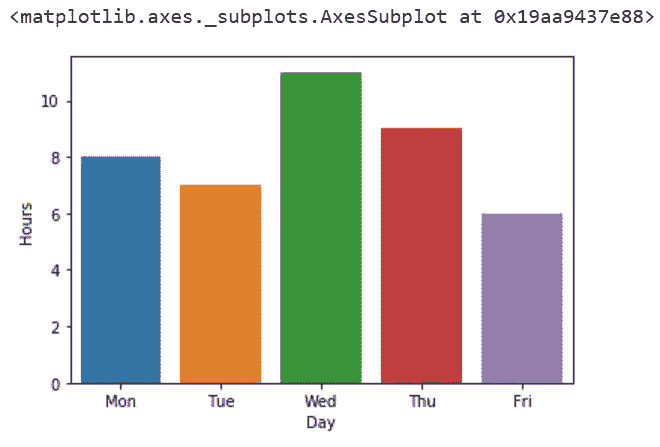
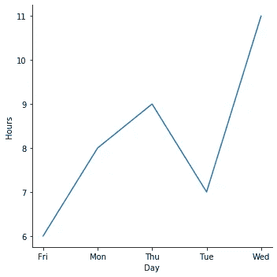
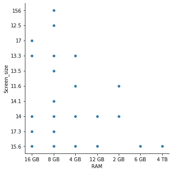
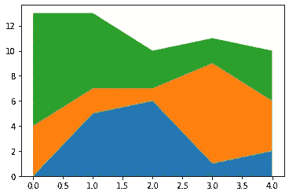
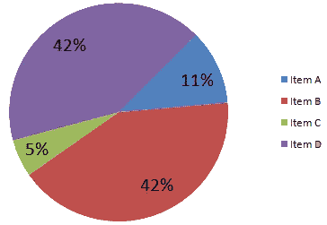
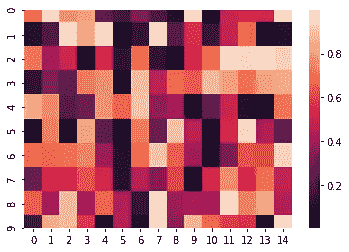
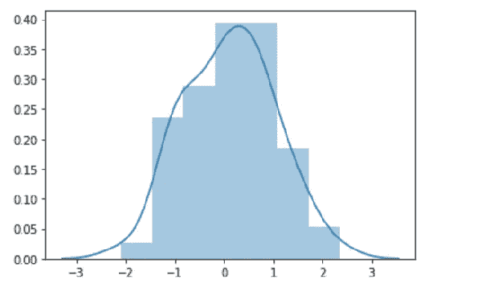
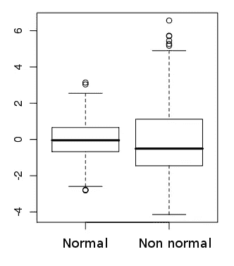
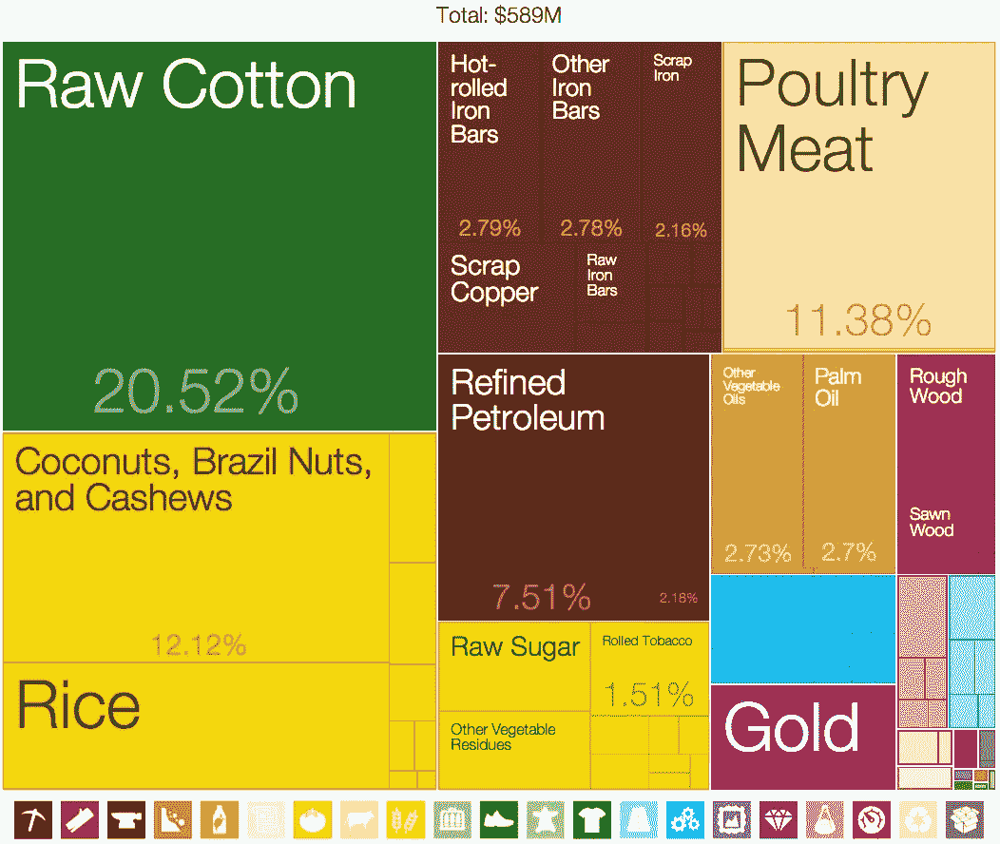

# 数据可视化—我应该使用哪些图表？(Seaborn 示例)

> 原文：<https://towardsdatascience.com/data-visualization-which-graphs-should-i-use-55e214ee9cf1?source=collection_archive---------5----------------------->


Photo by [Luke Chesser](https://unsplash.com/@lukechesser?utm_source=medium&utm_medium=referral) on [Unsplash](https://unsplash.com?utm_source=medium&utm_medium=referral)

## 如何可视化数据的简单指南

每天使用数据集使我更容易阅读和理解表统计信息。然而，虽然数字统计可能会为您提供数据的本质，但图表或可视化可以揭示数据集中潜在信息的全新维度。

当涉及到展示数据时，尤其是向客户展示数据时，使用可视化工具总是好的，它可以帮助展示您工作的范围和目的。你不希望只显示数据文件或代码，而是一组整洁的图表，使你的故事看起来更合理和清晰。

然而，为任何一组数据创建散点图并不意味着就可以了。当可视化数据时，理解三件事很重要。

*   您可以使用哪些不同类型的地块？
*   你应该用多少？你如何解释它们？
*   你能用这些情节讲一个故事吗？他们告诉你什么了？

下面，您将找到可视化类型、不同种类的图，以及何时使用和何时不使用它们。我试着尽可能地包括例子，但是如果你有任何问题没有回答，请在评论中自由发表。另外，如果你想完善数据可视化的艺术，你需要对不同的可视化类型和情节有深刻的理解。我会在这篇文章的末尾为感兴趣的人添加一些资源。

# 可视化类型

## **时间可视化**

通常用于一维数据，显示数据点之间的某种线性关系。这种数据集通常将时间作为独立变量，因此，时间序列数据以这种方式可视化。
**绘图类型:**散点图、甘特图、时间线、时间序列折线图。

## 网络可视化

顾名思义，网络可视化就是将多个数据集相互连接起来，并显示它们在每个变量相连的网络中是如何相互关联的。
**绘图类型:**节点连接图、矩阵图、冲积图&依赖图。

## 分层可视化

当数据集包含相互连接的有序变量时使用。它可以用来显示父变量和子变量之间的关系，特别是当数据可以在不同的类别下聚集时。
**绘图类型:**树形图、树状图、旭日图、环形图。

## 多维可视化

当有多个维度时使用这些类型的绘图，并且在某些情况下可以创建 3D 图。尽管多维图本身可能很复杂，但它们可以承载大量的数据(和见解)。
**策略类型:** 2D/三维直方图、2D/三维散点图、饼图、条形图、折线图。

# 地块类型

## 条形图

由于通过它们易于理解数据，所以通常被使用。这可能是呈现数据的最基本的方式，但它有助于通过简单明了获得结果。下面是一个如何在 seaborn 上创建柱状图的例子。代码的正下方是输出。

```
Import Seaborn as sb
ds = {'Day':['Mon', 'Tue', 'Wed', 'Thu', 'Fri'], 'Hours':[8,7,11,9,6]}
dx = pd.DataFrame(ds)
sb.barplot(x='Day', y='Hours', data=dx)
```



Barplot output for seaborn.

**何时使用:** ——将同一类别或数据集中的几个变量与相似的变量进行比较。
-跟踪几个(1 或 2 个)变量随时间的进展。

**不用时:** -3 类以上变量
-可视化连续数据。

## 线形图

线图也很常见。当比较股票价格或分析一段时间内的视频视图时，线图几乎随处可见。主要的好处是它们非常直观，读者可以立即掌握结果。

```
sb.relplot(x='Day', y='Hours', kind='line', data=dx)
```



**何时使用:**
——跨时间跟踪比较几个变量。
-分析趋势和变化
-预测未来值。

**何时不使用:**
-获得数据的总体概述。
-分析单个组件或部分。

## 散点图

散点图也有多种应用，就像上面提到的其他两种图类型一样。它们可用于描述关系、查看数据的各个部分以及描述数据的分布。

```
scatplot = sb.relplot(x="RAM", y="Screen_size", data=data)
```



**何时使用:**
-分析单个点
-离群点分析和理解波动
-获得变量的总体概况。

**不用的时候:**
-找精度
-一维数据。
-非数字/分类数据。

## 面积图

面积图可能是这个列表中最接近线形图的东西，然而，两者之间也有一个关键的区别。面积图能够突出不同变量之间的差异或距离，让我们看到不同项目如何相互比较以形成一个整体。

```
x=range(0,5)
y=[ [0,5,6,1,2], [4,2,1,8,4], [9,6,3,2,4] ]
plt.stackplot(x,y)
```



**何时使用:**
-分析一个时间序列中整体的各个部分如何进展
-线形图的大多数用例

**何时不用:**
——单个周期内呈现整体的部分。

## 其他情节



[https://upload.wikimedia.org/wikipedia/commons/8/87/Sample_Pie_Chart.png](https://upload.wikimedia.org/wikipedia/commons/8/87/Sample_Pie_Chart.png)

*   饼图

**当**时:比较整体的部分或相对值。

**当不在**时:比较没有加起来形成一个整体的数据。



Heatmap generated using random numbers

热图

```
ud= np.random.rand(10, 15)
sb.heatmap(ud)
```

**当**时:两个变量之间的关系。

**非**时:个别变量。



x = np.random.normal(size=60)

柱状图

```
np.random.normal(size=60)
sb.distplot(x)
```

**当**时:几个变量或数据集跨时间变化。

**非**时:超过 3 个变量或数据集。



[https://upload.wikimedia.org/wikipedia/commons/9/94/Normality_box-plot.png](https://upload.wikimedia.org/wikipedia/commons/9/94/Normality_box-plot.png)

*   箱线图

**When** :分析或比较数据集的分布。

**不在时**:分析单个数据集。



[https://upload.wikimedia.org/wikipedia/commons/d/d8/Benin_English.png](https://upload.wikimedia.org/wikipedia/commons/d/d8/Benin_English.png)

*   树形图

**When** :比较分类数据中的变量。

**当不**时:非分类数据。

本文中没有提到许多其他的情节类型。这是为了涵盖常用地块类型的主要部分。希望这些信息对你有用！

# **资源**

[](https://www.klipfolio.com/resources/articles/what-is-data-visualization) [## 什么是数据可视化？定义、图形类型以及如何使用它们

### 在某个时候，你可能已经看过、接触过或者制作过条形图。条形图是这样一个…

www.klipfolio.com](https://www.klipfolio.com/resources/articles/what-is-data-visualization)  [## 研究指南:数据可视化:多维工具

### 有两类多维可视化。第一种着眼于类别比例；或类别…

guides.lib.k-state.edu](https://guides.lib.k-state.edu/c.php?g=181742&p=1196067) [](https://365datascience.com/chart-types-and-how-to-select-the-right-one/) [## 选择正确的图表:在 14 种图表类型中选择

### 如果你想避免创建这样的图表，这是一篇完美的文章...或者这个...尤其是…

365datascience.com](https://365datascience.com/chart-types-and-how-to-select-the-right-one/) 

> 关注 Rohan Gupta 了解更多关于数据科学的内容！