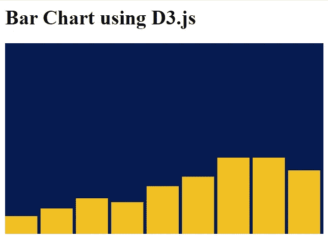
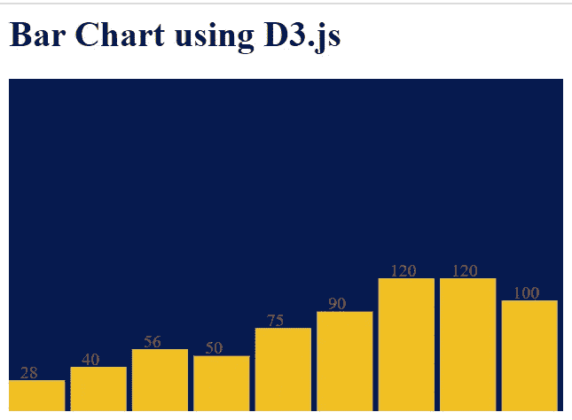
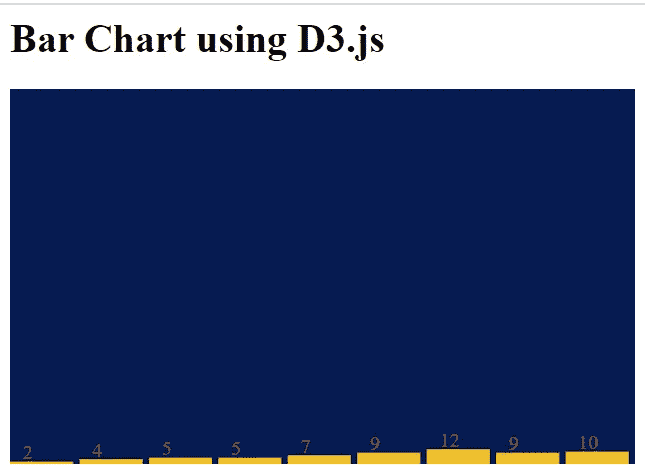
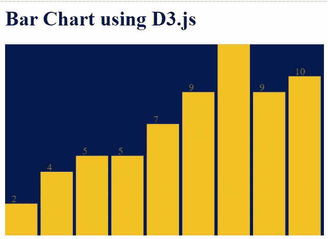
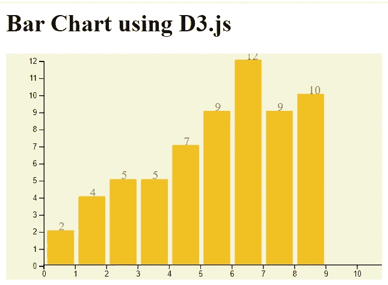
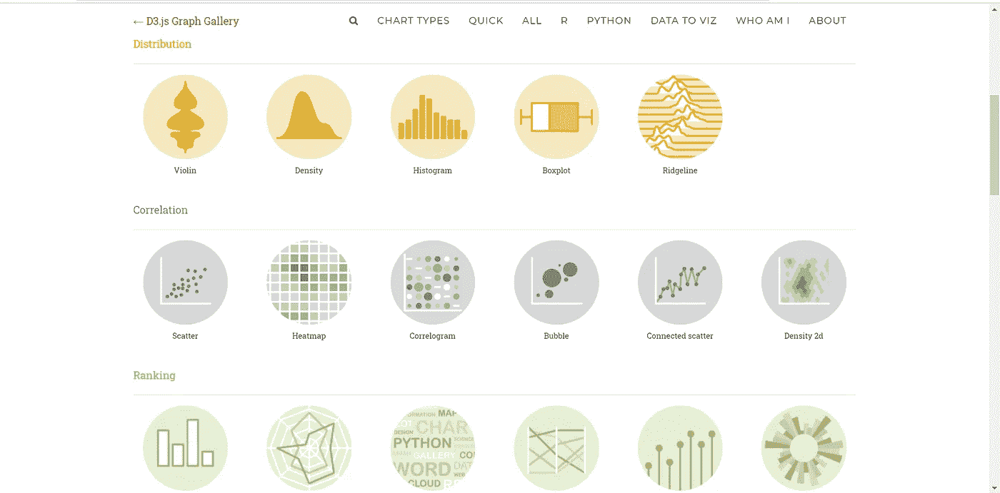

# 面向初学者的 D3.js 数据可视化

> 原文：<https://towardsdatascience.com/data-visualization-with-d3-js-for-beginners-b62921e03b49?source=collection_archive---------4----------------------->

## D3.js 可视化数据入门

你有没有走进一个拥挤的体育场或一场音乐表演，并试图猜测有多少人围着你？你错了吗？分析大量数据可能会让人不知所措。但是，当你把抽象的数据点转换成精确的、可观的视觉效果时，你将能够通过分析来看待事物。


Photo by [Carlos Muza](https://unsplash.com/@kmuza?utm_source=unsplash&utm_medium=referral&utm_content=creditCopyText) on [Unsplash](https://unsplash.com/s/photos/data-analysis?utm_source=unsplash&utm_medium=referral&utm_content=creditCopyText)

这是一个信息时代，我们有足够多的数据，但只有少数人知道如何处理这些数据。人们对视觉的依赖远远超过其他任何东西。这就是为什么直观呈现的数据比简单的数字更有说服力。优秀的可视化可以抓住人们的注意力，而无尽的列和行的数字只能混淆他们。为了使这些可视化和分析成为可能，我们需要现有语言的框架或库。这就是 D3.js 发挥作用的地方。


**D3** 代表**数据驱动文档**。如果你计划在网络上创建自定义的可视化效果，很可能你已经听说过 [D3.js](https://d3js.org/) 。一个基于 web 的可视化库，具有大量的 API 来处理在 web 上创建高级、动态和漂亮的可视化内容的繁重工作。

> D3.js 是一个基于数据操作文档的 JavaScript 库。D3.js 帮助您使用 HTML、SVG 和 CSS 将数据变得生动。D3 对 web 标准的重视使您可以获得现代浏览器的全部功能，而无需将自己束缚于专有框架，将强大的可视化组件和数据驱动的 DOM 操作方法结合起来。

D3 完成的主要任务是，它允许将任何类型的数据绑定到 DOM，然后对其进行数据驱动的转换，从而在应用程序中轻松构建交互式数据可视化。

如果你有兴趣深入研究，D3 的 Github 库和 D3 使用的 API 文档也是很好的资源。

现在开始用 D3.js 吧。你可以打开你的 IDE 或编辑器，创建一个名为 index.html 的文件，只是为了玩玩 D3.js。在我们的应用程序中使用这个库就像直接添加链接来获得你在 index.html 创建的最新版本一样简单:

```
<script src="https://d3js.org/d3.v5.min.js"></script>
```

所以现在您已经准备好在您的示例应用程序中使用 D3.js 及其所有特性。

## 元素的选择

选择意味着从名称或 css 选择器中选择 html 元素。(例如:h2，p)然后在选择了元素之后，我们可以使用 D3 来操作和转换这些 html 元素。选择允许文档对象模型(DOM)的强大数据驱动转换:设置[属性](https://github.com/d3/d3-selection#selection_attr)、[样式](https://github.com/d3/d3-selection#selection_style)、[属性](https://github.com/d3/d3-selection#selection_property)、 [HTML](https://github.com/d3/d3-selection#selection_html) 或[文本](https://github.com/d3/d3-selection#selection_text)内容，等等。使用[数据连接](https://github.com/d3/d3-selection#joining-data)的[进入](https://github.com/d3/d3-selection#selection_enter)和[退出](https://github.com/d3/d3-selection#selection_enter)选择，您也可以[添加](https://github.com/d3/d3-selection#selection_append)或[移除](https://github.com/d3/d3-selection#selection_remove)元素来对应数据。

想象我们有一个简单的 html 页面如下。

```
<html>
    <head>
        <title>My sample HTML page</title>
    </head>
    <body>
        <h1>D3.js</h3> 
        <p>I'm using D3.js here !</p>
        <p>We all are using D3.js here !</p>
        <script src="https://d3js.org/d3.v5.min.js"></script>
        <script>
             d3.select('h1').style('color', 'green');
             d3.selectAll('p').style('font-size', '30px');
        </script>
    </body>
</html>
```

这里有几件重要事情需要注意。所以这里用了两个关键词。这两种方法都使用元素名作为参数。第一个 *d3.select()* 方法返回与给定参数匹配的 DOM 元素的第一个选择。所以在上面的例子中会是*<h1>D3 . js</H3>*。第二个方法是 *d3.selectAll()* ，它返回对应于给定参数的所有 html 元素。如果它没有找到任何< p >标签，它将返回一个空选择。在给出的例子中 *< p >我这里用的是 D3.js！< /p >* 和 *< p >我们这里都在用 D3.js！< /p >* 两者都会返回。

此外，您还可以看到在选择 DOM 元素之后所做的操作。我们可以改变样式，甚至改变显示的文本。因此，在我们的示例中，当它被呈现时，标题“D3.js”将是绿色的。

你可以点击查看选择[的更多细节。](https://github.com/d3/d3-selection)

## 动态属性和数据绑定

D3 的另一个主要概念是以动态方式将一组数据映射到 DOM 元素。在这里，我们可以引入一个数据集，然后我们可以使用这些数据集实时更新、附加和显示 DOM 元素。

```
let dataset = [1,2,3,4,5]  
d3.selectAll(‘p’)      //Select 'p' element
.data(dataset)         //data()puts data into waiting for processing
.enter()               //take data elements one by one
.append(‘p’)           //for each data item appending <p>
.text(‘Sample text’);  //add sample text to each
```

这将在前端呈现文本“样本文本”5 次。这只是一个简单的例子，说明我们可以使用数据来动态和实时地操纵元素。使用同样的概念可以做很多事情。

## 数据可视化

既然我们现在对 D3 的基本概念已经很熟悉了，我们可以开始学习数据可视化组件，它包括各种类型的图表、数据表和其他可视化。

可缩放矢量图形(SVG)是一种在 DOM 中呈现图形元素和图像的方法。因为 SVG 是基于向量的，所以它是轻量级的，可伸缩的。D3 使用 SVG 来创建所有的视觉效果，比如图表。使用 SVG 的好处是我们不必担心缩放视觉效果时的失真，这与其他格式不同。基本上，D3 帮助我们弥合数据和相关可视化之间的差距，为用户提供有意义的信息。

让我们从使用 D3.js 创建一个简单的条形图开始。你需要两个名为 index.html 的文件，script.js 和 style.css，如下所示。

**index.html**

```
<html><head><link rel=”stylesheet” href=”style.css”><title>My sample D3.js App</title></head><body><h1>Bar Chart using D3.js</h1><svg width=”500" height=”800" class=”bar-chart”></svg><script src=”https://d3js.org/d3.v5.min.js"></script><script src=”script.js”></script></body></html>
```

**script.js**

```
var dataset = [28, 40, 56, 50, 75, 90, 120, 120, 100];var chartWidth = 500, chartHeight = 300, barPadding = 5;var barWidth = (chartWidth / dataset.length);var svg = d3.select(‘svg’).attr(“width”, chartWidth).attr(“height”, chartHeight);var barChart = svg.selectAll(“rect”).data(dataset).enter().append(“rect”).attr(“y”, function(d) {return chartHeight — d}).attr(“height”, function(d) {return d;}).attr(“width”, barWidth — barPadding).attr(“fill”, ‘#F2BF23’).attr(“transform”, function (d, i) {var translate = [barWidth * i, 0];return “translate(“+ translate +”)”;});
```

**style.css**

```
.bar-chart {background-color: #071B52;}
```

最终的条形图类似于这样。



这显示了可视化，但是除了趋势之外没有精确的信息。因此，我们的下一个任务是添加一些标签，以便每个条形的值将是可见的，从而在视觉上提供更多的信息。

为此，您可以在 script.js 文件的末尾添加以下代码片段。

**script.js**

```
var text = svg.selectAll(“text”).data(dataset).enter().append(“text”).text(function(d) {return d;}).attr(“y”, function(d, i) {return chartHeight — d — 2;}).attr(“x”, function(d, i) {return barWidth * i + 10;}).attr(“fill”, “#A64C38”);
```

这将产生如下所示的结果。



现在我们要做的是给我们的图表添加缩放比例。数据集中可以有不同的值；有些可能非常小，有些可能非常大。因此，为了更好地显示一致性，在图表中进行缩放是很重要的。

如果我们重新排列数据集，如下图所示，您可以看到条形图是如何呈现的。

```
var dataset = [2, 4, 5, 5, 7, 9, 12, 9, 10];
```



这样我们几乎看不到图表中的条形。所以我们必须根据图表的高度放大它。如果数据集中有较大的值，则不会显示给定图表高度内的准确高度。因此，解决方案是相应地扩展。为此，我们可以使用这样的定标器，并改变条形图。

**script.js**

```
var dataset = [2, 4, 5, 5, 7, 9, 12, 9, 10];var chartWidth = 500, chartHeight = 300, barPadding = 5;var barWidth = (chartWidth / dataset.length);var svg = d3.select(‘svg’)
.attr(“width”, chartWidth)
.attr(“height”, chartHeight);var yScale = d3.scaleLinear()
.domain([0, d3.max(dataset)])
.range([0, chartHeight])var barChart = svg.selectAll(“rect”)
.data(dataset)
.enter()
.append(“rect”)
.attr(“y”, function(d) {
return chartHeight — yScale(d);})
.attr(“height”, function(d) {
return yScale(d);})
.attr(“width”, barWidth — barPadding)
.attr(“fill”, ‘#F2BF23’)
.attr(“transform”, function (d, i) {
var translate = [barWidth * i, 0];
return “translate(“+ translate +”)”;
});var text = svg.selectAll(“text”)
.data(dataset)
.enter()
.append(“text”)
.text(function(d) {
return d;})
.attr(“y”, function(d, i) {
return chartHeight — yScale(d) — 2;})
.attr(“x”, function(d, i) {
return barWidth * i + 10;})
.attr(“fill”, “#A64C38”);
```



所以现在很明显我们的图表中遗漏了轴。因此，使用 D3.js 向我们的图表添加轴非常简单。您可以使用 D3.js 中的 x-scale 和 y-scale 创建 x 轴和 y 轴。您可以使用以下代码片段创建带有标签的缩放图表。

**script.js**

```
var dataset = [2, 4, 5, 5, 7, 9, 12, 9, 10];var chartWidth = 500, chartHeight = 300, barPadding = 6;var barWidth = (chartWidth / dataset.length -14);var svg = d3.select(‘svg’)
.attr(“width”, chartWidth)
.attr(“height”, chartHeight);var xScale = d3.scaleLinear()
.domain([0, d3.max(dataset)])
.range([0, chartWidth]);var yScale = d3.scaleLinear()
.domain([0, d3.max(dataset)])
.range([0,chartHeight — 28]);var yScaleChart = d3.scaleLinear()
.domain([0, d3.max(dataset)])
.range([chartHeight — 28, 0]);var barChart = svg.selectAll(“rect”)
.data(dataset)
.enter()
.append(“rect”)
.attr(“y”, function(d) {
return chartHeight — yScale(d) — 20;})
.attr(“height”, function(d) {
return yScale(d);})
.attr(“width”, barWidth — barPadding)
.attr(“fill”, ‘#F2BF23’)
.attr(“transform”, function (d, i) {var translate = [barWidth * i +55, 0];
return “translate(“+ translate +”)”;});var text = svg.selectAll(“text”)
.data(dataset)
.enter()
.append(“text”)
.text(function(d) {
return d;})
.attr(“y”, function(d, i) {
return chartHeight — yScale(d) — 20;})
.attr(“x”, function(d, i) {
return barWidth * i + 70;})
.attr(“fill”, “#A64C38”);var x_axis = d3.axisBottom().scale(xScale);var y_axis = d3.axisLeft().scale(yScaleChart);svg.append(“g”)
.attr(“transform”, “translate(50, 10)”)
.call(y_axis);var xAxisTranslate = chartHeight — 20;svg.append(“g”)
.attr(“transform”, “translate(50, “ + xAxisTranslate +”)”)
.call(x_axis);
```

**style.css**

```
.bar-chart {background-color: beige;}
```



就像上面的简单条形图一样，我们可以创建我们想要的多种类型的图表。这里最好的事情是我们对自己创造的东西的控制。不像其他现成的图形，它们是有限可定制的，我们可以自由地使用 D3.js 中的 SVG 创建我们自己的图形。

D3 解决了问题的原因:基于数据的文档的有效操作。这避免了专有表示，提供了非凡的灵活性，展示了 HTML、SVG 和 CSS 等 web 标准的全部功能。以最小的开销，D3 非常快，支持大型数据集和交互和动画的动态行为。

您可以在 [D3.js 图库](https://www.d3-graph-gallery.com/)中查看已经创建的复杂且有吸引力的图形。



[https://www.d3-graph-gallery.com/](https://www.d3-graph-gallery.com/)

鉴于大多数人将 D3.js 称为数据可视化库，*它不是*。D3 更像是一个由不同部分组成的框架，比如 jQuery 部分(帮助我们选择和操作 DOM 元素)、Lodash 部分、动画部分、数据分析部分和数据可视化部分。

**用 D3.js 尝试数据可视化，并与我分享结果！**