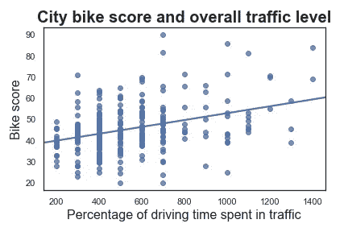
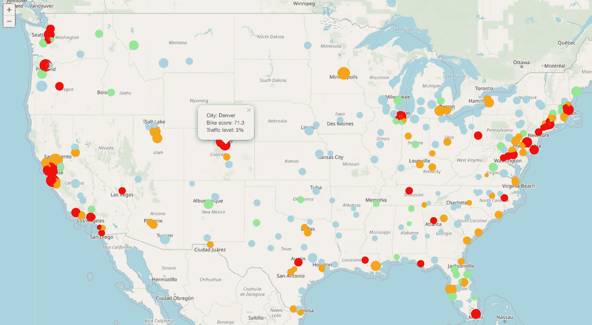

# 使用 Python follow Maps 实现数据可视化

> 原文：<https://towardsdatascience.com/data-visualization-with-python-folium-maps-a74231de9ef7?source=collection_archive---------8----------------------->


关于数据科学，我最喜欢的事情之一是数据可视化。我喜欢创建和利用视觉辅助工具来支持我的数据中的故事和趋势。python follow library 是我利用地理空间可视化分析能力的有用资源。换句话说，地图！

地图允许我在一个可视化视图中跨多个维度分析我的数据。在最近的一个项目中，我分析了 293 个美国城市，以确定哪些城市适合试点自行车和踏板车共享计划。通过使用 OLS 回归，我确定，在其他特征中，一个城市的拥堵程度(通过在交通中花费的驾驶时间百分比来衡量，从 INRIX.com 获得)与一个城市的“骑行能力”(通过 walkscore.com 的自行车评分来衡量)正相关且显著。虽然这一结果似乎有悖常理，但有理由认为，在更拥堵的城市，人们有骑自行车出行的动机(想想:“我不想坐在车流中，所以我要戴上头盔，骑着自行车去上班”)。

那么，我如何将“骑行能力”和拥堵之间的关系形象化呢？一个简单的 seaborn regplot 显示了自行车分数和交通流量之间的正线性相关性(通过交通中所花费的驾驶时间的百分比来衡量)。

```
sns.set(style = 'white')
sns.regplot(data=df, x="traffic_index", y="bike_score", ci = None)
plt.xlabel('Percentage of driving time spent in traffic', size = 16)
plt.ylabel('Bike score', size = 16)
plt.title("City bike score and overall traffic level", size = 20, weight = 'bold')
```



More bike-friendly cities are also more congested

但是如果我想在这两个维度上可视化城市的地理空间分布呢？嗯……使用地理空间分析，我可以创建一个地图，显示交通流量和自行车得分较高的城市。更好的是，改变地图标记的颜色和大小等属性意味着我可以使用一个图形来可视化所有三个维度。

为了创建这个地图，我首先安装了 Python 的 follow 库。

```
!conda install -c conda-forge folium=0.5.0 --yes 
import folium 
import webbrowser
```

我想展示的第一个维度是地理定位。我根据简单的谷歌搜索“美国经纬度”的结果设置了地图的经纬度。然后，我定义我的地图(巧妙地命名为 traffic_map)在这些坐标上初始化。默认缩放设置为 5(我不得不摆弄这个参数，直到我找到一个好的显示)。

```
latitude = 37.0902
longitude = -95.7129traffic_map = folium.Map(location=[latitude, longitude], zoom_start=5)
```

第二个维度是交通拥堵。我将我的流量变量(“流量指数”)分成四分位数:

```
df['traffic_index_quartile'] = pd.qcut(df['traffic_index'], 4, labels=False)
```

接下来，我为我的马克笔的颜色创建了一个字典。我决定了从浅蓝色(0)到红色(3)的一系列原色。我希望最高的四分之一(即最拥挤的城市)用醒目的红色突出，最低的四分之一(即最不拥挤和最不可行的候选城市)或多或少地消失在基本地图中。

```
colordict = {0: 'lightblue', 1: 'lightgreen', 2: 'orange', 3: 'red'}
```

**边注:**我从这个栈溢出帖子中找到了可行的颜色名称:
[https://Stack Overflow . com/questions/36202514/foil um-map-module-trying-to-get-more-options-for-marker-colors](https://stackoverflow.com/questions/36202514/foilum-map-module-trying-to-get-more-options-for-marker-colors)。我已经尝试了列出的大多数颜色，它们都准确地显示了它们的名字，除了“浅红色”，它要么导致错误，要么显示为黑色。

我的地图上的第三个也是最后一个维度是城市“骑行能力”。为了可视化这个维度，我将城市标记的大小设置为城市 bikescore 的 0.15 倍(这是我必须反复试验直到它“看起来”正确为止的另一个参数)。

最终地图的完整代码如下:

```
for lat, lon, traffic_q, traffic, bike, city in zip(df['latitude'], df['longitude'], df['traffic_index_quartile'], df['traffic_index'], df['bike_score'], df['city']):
    folium.CircleMarker(
        [lat, lon],
        radius=.15*bike,
        popup = ('City: ' + str(city).capitalize() + '<br>'
                 'Bike score: ' + str(bike) + '<br>'
                 'Traffic level: ' + str(traffic) +'%'
                ),
        color='b',
        key_on = traffic_q,
        threshold_scale=[0,1,2,3],
        fill_color=colordict[traffic_q],
        fill=True,
        fill_opacity=0.7
        ).add_to(traffic_map)traffic_map
```



通过这种地理空间数据可视化，我们可以快速看到关于城市和自行车的两个事实。首先，“骑行能力”与交通拥堵正相关。其次，高交通流量和“骑行能力”(即大红色标记)的城市更有可能出现在美国东北部、加利福尼亚州和太平洋西北地区(有几个明显的例外)。

*在这里* *查看我关于完整项目* [*的帖子。欢迎在评论中留下反馈或想法！*](/predicting-bikeability-in-u-s-cities-67da4ff8376)