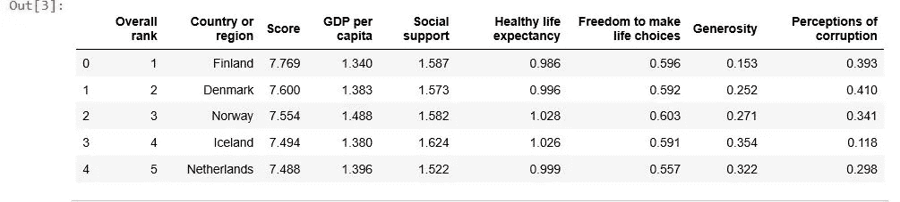
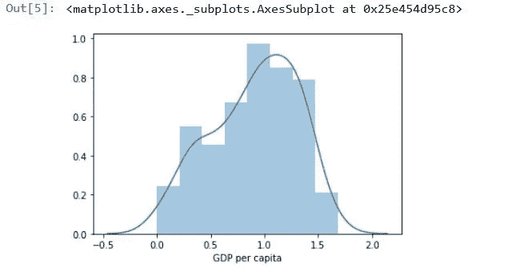
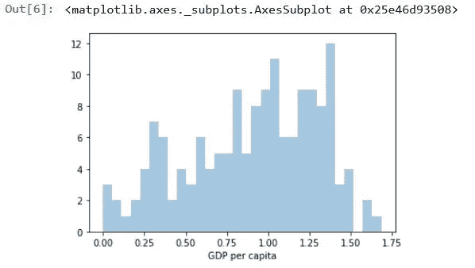
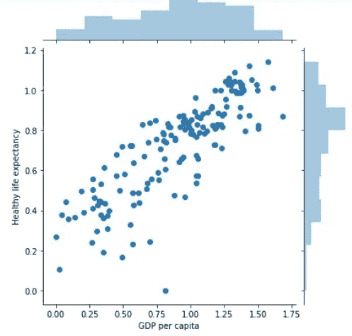
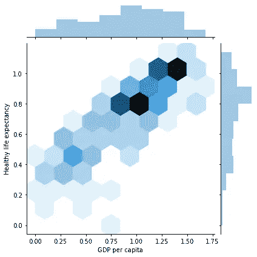
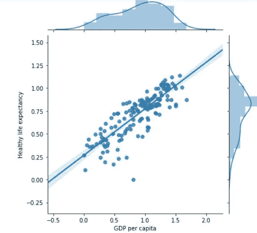
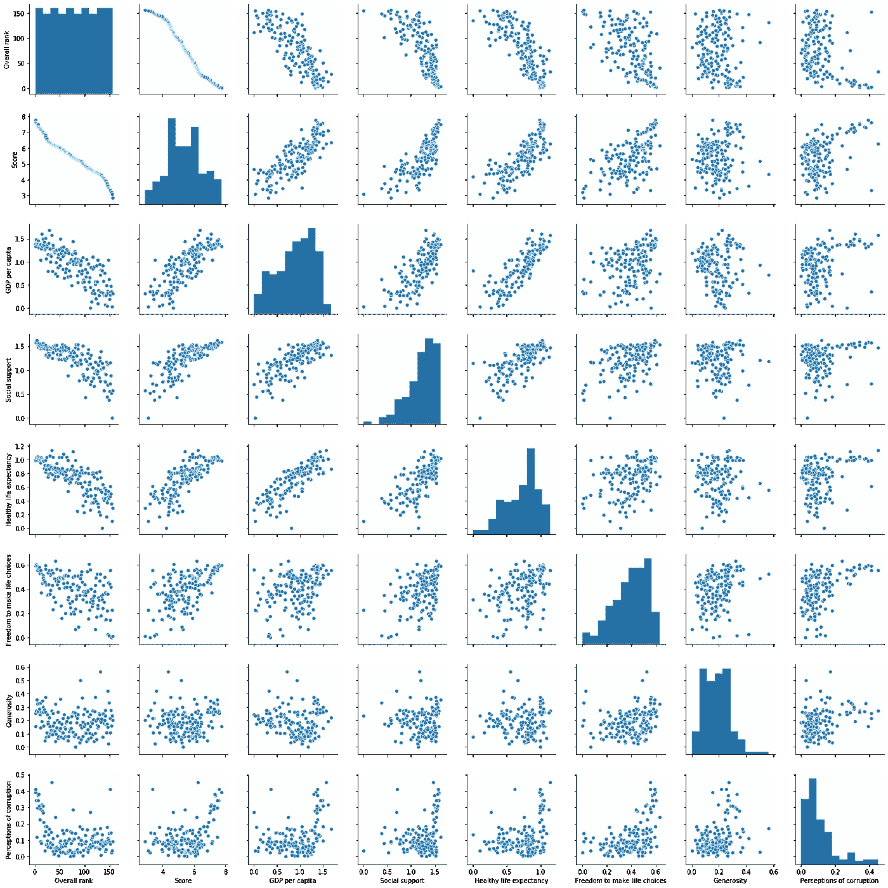
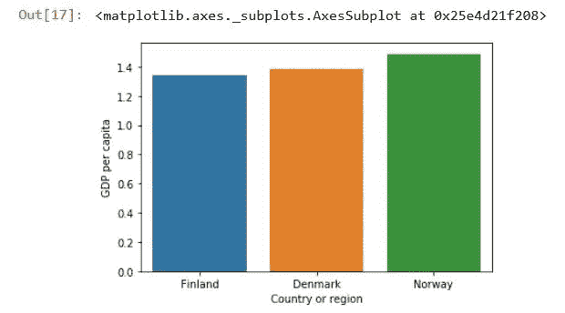
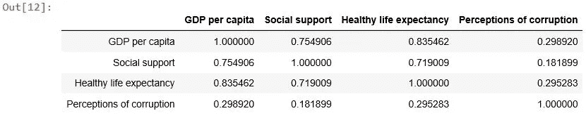
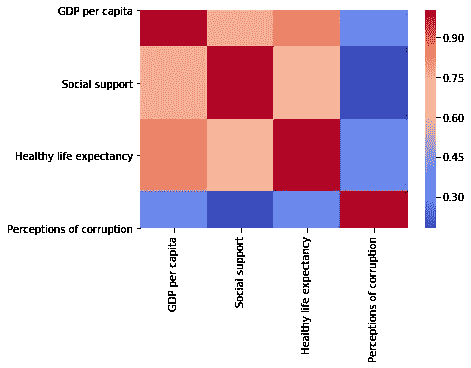

# 使用 Seaborn 和 Plotly_ 人均 GDP 和预期寿命数据集的 Python 数据可视化

> 原文：<https://towardsdatascience.com/data-visualization-with-python-using-seaborn-and-plotly-gdp-per-capita-life-expectency-dataset-cd5426e7ab3b?source=collection_archive---------8----------------------->

## 当社会和经济科学与数据科学和谐一致时。


Photo by [Lukas Blazek](https://unsplash.com/@goumbik?utm_source=medium&utm_medium=referral) on [Unsplash](https://unsplash.com?utm_source=medium&utm_medium=referral)

本教程旨在帮助您快速入门并使用 python 数据可视化库。我选择 seaborn 和 plotly，这是最常用和最棒的工具，用来可视化完全交互的图，并使数据看起来很棒。

你也会发现经济和社会因素之间的关系。我们将在此图中处理的数据集是世界各地的人均 GDP、社会支持、健康预期寿命、选择自由、慷慨程度等。

我用 jupyter 笔记本，你可以从 Anaconda 包中获得访问权限。

**如果你想在这里安装蟒蛇**[](https://www.anaconda.com/distribution/)****。****

# **Seaborn 简要概述**

**Seaborn 是一个基于 matplotlib 的可视化库，它与 pandas 库配合得非常好。**

**使用 seaborn 的原因之一是它可以生成漂亮的统计图。认识到 seaborn 是 matplotlib 的补充而不是替代是非常重要的。**

**要安装 seaborn，您可以在命令行或终端使用 **pip 或 conda** ,其中包括:**

```
!pip install seaborn
or
!conda install seaborn
```

1.  ****导入库****

**让我们从导入几个库开始，numpy(数字 python 库)，pandas 用于数据帧和数据系列，seaborn 和 matplotlib 用于可视化。**

```
import numpy as np
import pandas as pd
import seaborn as sns
import matplotlib.pyplot as plt
%matplotlib inline #use it to show plot directly below the code 
```

****2。使用熊猫读取数据****

**该数据在 csv 文件格式中称为“2019.csv”。这就是我们将在本教程中使用的数据集。**

**head()函数返回数据帧的前 5 行，如下所示:**

```
df= pd.read_csv('2019.csv')
df.head()
```

****

## **分布图**

**1.**距离图**:**

**我在这里做的只是使用 SNS . distplot(dataofsinglecolumn)绘制数据框架(人均 GDP)中单个列的分布。**

**要删除**核密度估计**图，您可以使用 **kde=False** 。**

**bins = 30 表示定义直方图形状的 bin 数量，我在左侧图中使用了 8 个 bin，在另一个图中使用了 30 个 bin，这样您就可以看到差异。**

```
sns.distplot(df['GDP per capita'], bins=8) 
out[5]sns.distplot(df['GDP per capita'], **kde = False** , bins = 30)
out[6]
```

********

**2.**联合策划**:**

**Seaborn 的 jointplot 显示了两个变量之间的关系。**

**此处使用散点图和直方图显示了数据中 x 和 y 两列的图。**

```
sns.jointplot(x=df['GDP per capita'], y= df['Healthy life expectancy'],data=df) #two ditribution
```

****

**您可以在下面添加要绘制的绘图类型，例如，kind='reg '表示绘制带有回归线的散点图，kind='hex '表示将数据分成六边形，在空白处绘制直方图。**

**你可以看到人均 GDP 和健康预期寿命是正相关的。意味着如果人均 GDP 高，健康的预期寿命也会高。**

```
sns.jointplot(x=df['GDP per capita'], y= df['Healthy life expectancy'],data=df,kind='reg') #plot in the right sidens.jointplot(x=df['GDP per capita'], y= df['Healthy life expectancy'],data=df,kind='hex') # plot in the left
```

********

```
sns.pairplot(df)#relationship entire datasets
```

**令人惊讶的是，一行简单的代码给了我们整个情节！**

**这代表了整个数据集之间的关系。直方图允许我们看到单个变量的分布，而散点图显示两个变量之间的关系。**

****

## **分类图:柱状图**

**柱状图用于绘制分类变量示例性别男/女…**

**在这里，我使用国家作为类别，并使用 head()函数绘制前 3 个国家的人均 GDP。**

```
sns.barplot(x=df['Country or region'].head(3),y=df['GDP per capita'],data=df)
```

****

## **矩阵图**

**我在这里所做的是选择 4 列数据，并使用 corr()函数来查找所选数据之间的相关性。**

```
# Matrix form for correlation data
data_select = df[['GDP per capita','Social support','Healthy life expectancy','Perceptions of corruption']]
data_select.corr()
```

**您可以在这里看到一个矩阵形式，它表示某种值，这些值代表相关程度，相关程度通常在-1 到 1 之间。**

**如果 corr 值接近 1，这意味着变量有很强的正相关性。**

****

```
sns.heatmap(df_select.corr(), cmap='coolwarm')
```

**在这里，热图真正做的是根据某种梯度标度将数据相关值表示为图表中的颜色:**

**您可以通过添加 cmap= '…'来更改颜色地图，例如'绿色'，'蓝色'，'凉爽温暖'…对于所有的颜色地图，请查看:[http://matplotlib.org/users/colormaps.html](https://matplotlib.org/tutorials/colors/colormaps.html)**

****

# **非常简单的概述**

**Plotly 是一个数据可视化库，可以用来创建不同类型的交互式图表、地图和绘图..**

**[此处 plotly 网站](https://chart-studio.plot.ly/feed/#/)**

**你能做的第一件事就是安装 plotly 和袖扣库。**

**袖扣与熊猫有着紧密的联系，除非安装了袖扣，否则你无法从数据框中绘制出情节。**

```
!pip install plotly
!pip install cufflinks
```

**要连接 chart_studio，您可以到主页 [plotly](https://plot.ly/online-chart-maker/) 注册并在设置帐户中获取您的 api_key。**

**由于 plotly 是一个在线平台，必须输入登录凭证才能在在线模式下使用。**

```
chart_studio.tools.set_credentials_file(username='XXXX, api_key='xxxxxxxxxx')
```

## **加载库**

**下面导入 jupyter 笔记本上的 plotly 和袖扣，还有 chart_studio、plotly 工具和 graph 对象。**

```
cf.go_offline()
cf.set_config_file(offline =False , world_readable= True)
```

**在本文中，我们将使用在线模式，这对于 Jupyter 笔记本来说已经足够了。**

## **折线图**

**首先，我选择数据集中的两列；健康的预期寿命和人均 GDP，然后我为标题名和 xaxis / yaxis 名创建了一个字典，并将它们放在布局对象中。**

**我用 dict()函数举例；dict(a=8，b=10)代替{"a": 8，" b": 10 }**

**要将 dataframe 绘制为折线图，您只需调用 dataframe 对象的 iplot 方法。**

**cufflinks 和 plotly 允许使用语法 data.iplot 绘制数据，然后传入文件名和创建的布局。**

```
data= df[['Healthy life expectancy', 'GDP per capita']]layout = dict(title = 'Line Chart From Pandas DataFrame', xaxis= dict(title='x-axis'), yaxis= dict(title='y-axis'))data.iplot(filename='cf-simple-line-chart', layout=layout)
```

## **散点图**

**mode 参数应该总是设置为" **markers** ，默认情况下 plotly 会在数据点之间绘制线条。所以如果你想要没有线条的点，你需要确保设置绘图模式为标记。**

**就像前面的例子一样，我们需要一个 fig 对象，它应该是一个 dictionary 对象，包含两个字典，一个用于数据，一个用于布局。**

**在数据字典中，我们定义了两组要绘制的 x 和 y 变量，在两个图中，x 变量将是相同的，这允许比较与国家列相关的人均 GDP 和健康预期寿命。**

**然后，我使用 **data.go** 语法创建包含 data1 和 data2 的数据对象，并将其赋给 mydata 变量。**

**还要创建布局对象，并传入散点图的标题。**

```
**data1**=go.Scatter(x=df['Country or region'],y=df['GDP per capita'], name="GDP per capita", **mode="markers"**) **data2**=go.Scatter(x=df['Country or region'],y=df['Healthy life expectancy'],name="Healthy life expectancy",**mode="markers"**)mydata = go.Data([data1, data2])mylayout = go.Layout( title="GDP per capita vs. Life expectancy")fig = go.Figure(data=mydata, layout=mylayout)chart_studio.plotly.iplot(fig)
```

**这就是我们使用 chart_studio 包绘制的图！**

**这里相同的代码，但我使用模式=“线+标记”，它将连接数据点作为线，同时显示散点图。**

## **创建条形图**

**这里展示了如何在 plotly 中自定义颜色。**

**这里我们需要使用一个名为 color_theme 的字典对象，我们将生成一个颜色列表，其中包含我们要在条形图中使用的颜色的 RGBA 代码。**

```
color_theme = dict(color=['rgba(169,169,169,1)', 'rgba(255,160,122,1)','rgba(176,224,230,1)', 'rgba(255,228,196,1)',
                          'rgba(189,183,107,1)', 'rgba(188,143,143,1)','rgba(221,160,221,1)'])
```

**现在我将向你展示如何使用 plotly 创建条形图。**

**这里我们使用 trace 对象来指定我们想要的图表类型。所以在这种情况下我们使用 **go。Bar()** 函数然后我们传入两个变量 x 和 y，分别代表 7 个国家的人头数据和健康预期寿命，还传入我们已经定义好的 color_theme。**

**现在，让我们指定我们的布局参数，在这段代码中，我只使用一个参数来命名我们的绘图标题，您可以添加 x 轴和 y 轴名称。**

**最后，使用 iplot()函数绘制它，然后传入我们的数据。**

```
trace0 = **go.Bar**(x=df['Country or region'].head(7), y=df['Healthy life expectancy'], **marker=color_theme**)data = [trace0]layout = go.Layout(title='Healthy life expectancy')fig = go.Figure(data=data, layout=layout)chart_studio.plotly.iplot(fig, filename='color-bar-chart')
```

## **箱形图**

**通常在统计学中使用的箱线图，它通过测量数据集的中值、平均值和众数，为我们提供了有关数据如何分布的更多信息。**

**在下面的代码中，我们只选择了 2 列数据，然后我们使用 iplot 方法，并传入一个参数来指定绘图的类型，然后我们给出了箱线图的文件名。**

```
df_select = df[['GDP per capita','Healthy life expectancy']] df_select.iplot(kind='box', filename='box-plot')
```

## **圆形分格统计图表**

**在这里，我使用 10 个国家的指数作为标签创建了一个简单的饼图，并绘制了每个国家的人均 GDP 值。**

**然后使用 go 创建一个 gragh 对象。Pie()并填写标签和值变量。最后，使用 iplot()函数绘制这个图。**

```
labels = df['Country or region'].head(10).value_counts().index
values = df['GDP per capita'].head(10).values
trace = go.Pie(labels=labels, values=values)chart_studio.plotly.iplot([trace], filename='basic_pie_chart')
```

## **等值区域图**

**使用 plotly 是用 python 生成地图的最简单的方法。**

**我们有两种主要类型的绘图对象；**数据对象**和**布局对象。****

**首先，我们需要数据传入字典，并为地图中的数据设置参数。让我们从传递 choropleth 类型开始，这意味着我们希望 plotly 生成什么类型的地图。然后定义我们的色阶，反转色阶，黄色向下，紫色向上。我们将位置设置为数据帧中的国家，z 变量由地图中的颜色表示。最后，我们将传入文本参数来定义在地图上移动时显示的文本。**

**其次，创建一个布局字典来设置我们地图的标题。然后创建一个包含数据和布局对象的新字典，我们称之为 fig。**

**为了绘制它，我们只需在 fig 对象上调用 iplot 方法，然后给出一个文件名。开始了…**

```
data = dict(
        **type = 'choropleth'**,
        colorscale = 'Viridis',
        reversescale = True,
        locations = df['Country or region'],
        locationmode = "country names",
        z = df['GDP per capita'],
        text = df['Country or region'],
        colorbar = {'title' : 'GDP per capita_world'},
      )

layout=dict(title_text = '2019 GDP per capita by State')
fig = go.Figure(data=data,layout=layout)chart_studio.plotly.iplot(fig, filename='choropleth')
```

# **结论**

**数据可视化是一个很好的工具，可以让数据更具可读性，并为您在现实世界中发现更多见解创造了巨大的机会。**

**这篇文章的所有代码都是 GitHub 上的 [**。图表都是交互式的，可以在**](https://github.com/fati8999-tech/Data-visualization-with-Python-Using-Seaborn-and-Plotly_-GDP-per-Capita-Life-Expectency-Dataset)**[**查看，这里**](https://chart-studio.plot.ly/~fatima999) 。****

**我欢迎反馈。我可以在 Linkedin [这里](https://www.linkedin.com/in/fatima-ezzahra-iazza-10354815a/)找到我。**