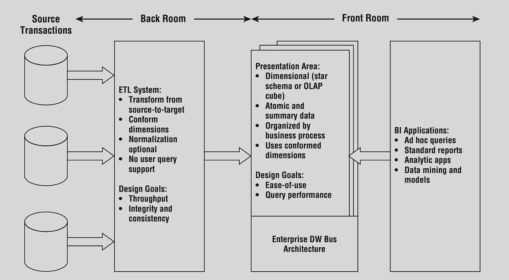
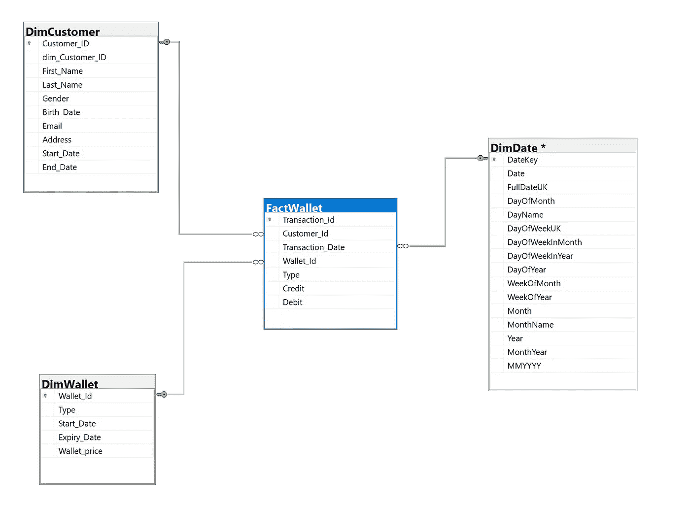

# 数据仓库|维度建模|用例研究:电子钱包

> 原文：<https://towardsdatascience.com/data-warehouse-dimensional-modelling-use-case-study-ewallet-d9d16f559181?source=collection_archive---------9----------------------->

## 通过用例解释技术概念总是更有意义。

> 基于我以前作为数据工程师和分析师的经验，我将使用一个电子钱包案例研究来解释数据仓库和维度建模。——***马诺基***

# 数据仓库

数据仓库是与业务相关的历史数据的大型集合，可用于制定业务决策。

*   数据仓库存储聚合的事务性数据，这些数据经过转换和存储后用于分析目的。
*   数据仓库存储来自多个来源的数据，这使得分析更加容易。

简单地说，数据库(运营)系统是你放入数据的地方，而数据仓库(商业智能)系统是你取出数据的地方—拉尔夫·金博尔

# 维度建模

维度建模是设计数据仓库的广泛使用的技术，主要是因为它同时解决了以下两个需求:

1.  提供业务用户可以理解的数据。
2.  提供快速查询性能。

Core elements of the Kimball DW/BI architecture

该图显示了从操作数据源到分析工具构建数据仓库所涉及的主要组件，以通过 ETL(提取、转换、加载)过程支持业务决策。

现在让我们以电子钱包的用例为例，使用维度建模技术构建一个数据仓库。

# 用例

## 背景

这家在线零售公司的特色之一是电子钱包服务，这种服务可以用来支付在该平台上购买的产品。

用户可以通过三种不同的方式获得积分:

1.  当已付款的产品购买被取消时，退款作为取消信用。
2.  用户可以获得礼品卡积分作为礼物。
3.  如果用户具有差的服务体验，则可以提供 soo-sorry 信用。

如果是礼品卡信用和 soo-sorry 信用，电子钱包中的信用将在 6 个月后过期，但如果是取消信用，则在 1 年后过期。

## 要求

公司的财务部门希望在电子钱包服务上建立报告和分析，以便他们可以了解公司的钱包负债程度。

他们想要回答的一些问题如下:

*   电子钱包服务的每日信用余额是多少？
*   下个月会有多少贷款到期？
*   特定月份的信贷结果是什么(即已用百分比、过期百分比、剩余百分比)？

## 解决方案设计

在维度模型的设计过程中做出的四个关键决策包括:

1.选择业务流程。2.申报粮食。3.确定尺寸。4.确定事实。

让我们写下电子钱包案例的决策步骤:

**1。假设:**设计是基于给定的*背景*(业务流程)开发的，但也要考虑到灵活性。假设所有必填字段都可以从公司的交易数据库中获得。

**2。粒度定义:** *原子粒度是指给定业务流程捕获数据的最低级别。*

在这种情况下，可以捕获的最低级别的数据是电子钱包交易，即电子钱包上的所有信用和借记交易。

**3。维度:** *维度提供了围绕业务流程事件的“谁、什么、哪里、何时、为什么和如何”的上下文。*

尽管可以添加大量的描述性属性，但设计维度仅限于当前的业务流程，但该模型可以根据需要灵活地添加任何更多的细节。(以 Dim 为前缀的表名)

**维度表:**

*   DimWallet

*   DimCustomer

*   DimDate: 该维度包含所有与日期相关的解析值，如日期中的月份、日期中的星期、星期几等。这将非常方便地获得基于时间的报告。

**4。事实:** *事实是来自业务流程事件的度量，并且几乎总是数字。*

事实被设计成关注具有完全可加性的事实。即使一些业务流程需求想要非累加的事实(已用百分比、过期百分比、剩余百分比等)。这些值可以通过单独计算附加事实来有效地获得。事实表中的每一行都代表了物理上可观察到的事件，而不仅仅关注于所需报告的需求。

**事实表:**

*   FactWallet

## 星型模式模型

下面是电子钱包服务的维度模型的逻辑图。

eWallet — Star schema Dimensional Model

Ralph Kimball 是数据仓库技术的先驱，他总是在他的书中展示商业价值的重要性。星型模式比雪花型模式更受青睐，因为它具有更强的分析能力。

# 参考

[1] Ralph Kimball，Margy Ross,《数据仓库工具包，第二版，维度建模完全指南》