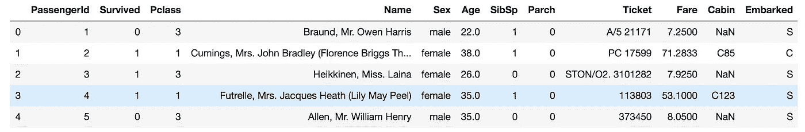
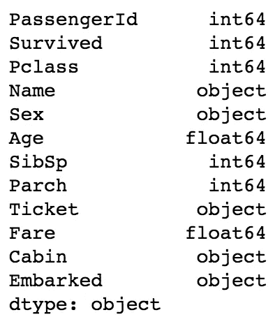
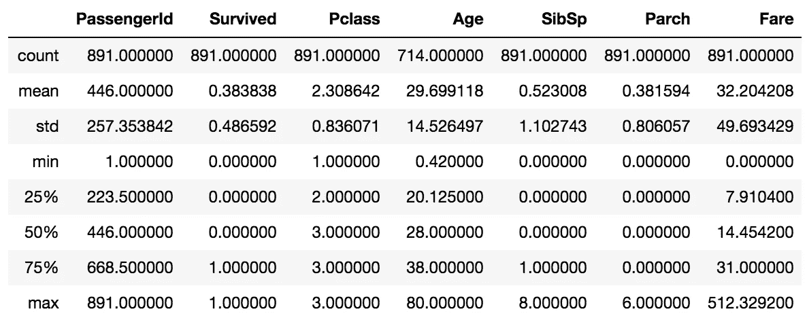
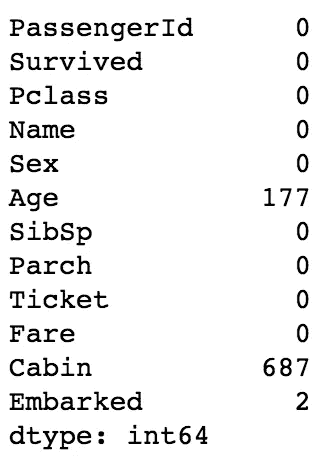
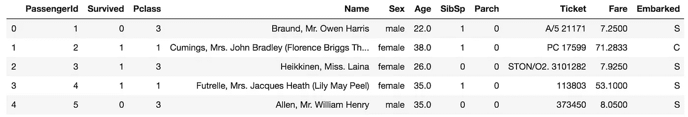
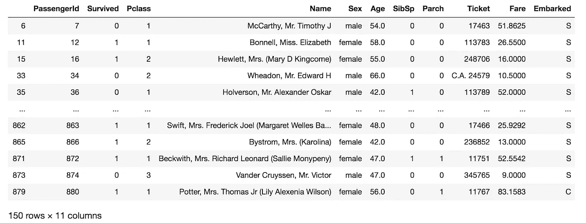
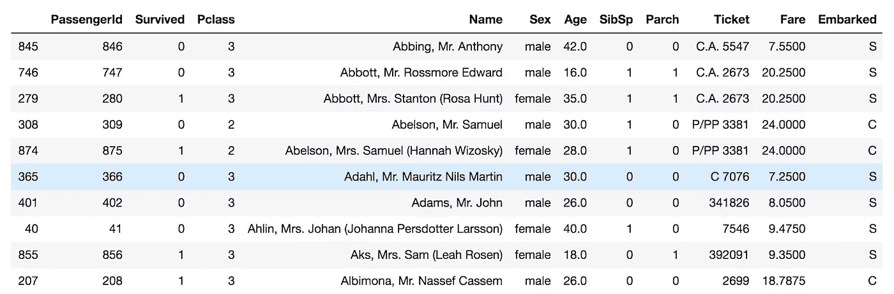
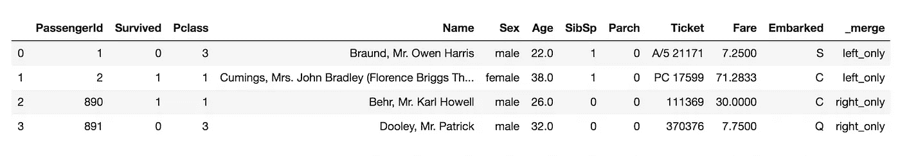

# 使用 Pandas 库的数据争论

> 原文：<https://towardsdatascience.com/data-wrangling-using-pandas-library-ae26f8bbbdd2?source=collection_archive---------22----------------------->

## 在本文中，我们将看到一些最有用的技术，用于清理和处理熊猫图书馆的数据。


Photo by [Kevin Ku](https://unsplash.com/@ikukevk?utm_source=unsplash&utm_medium=referral&utm_content=creditCopyText) on [Unsplash](https://unsplash.com/s/photos/code?utm_source=unsplash&utm_medium=referral&utm_content=creditCopyText)

数据科学涉及数据的处理，以便数据可以很好地与数据算法一起工作。数据角力是处理数据的过程，如合并、分组和连接等。Pandas 库提供了有用的函数来支持数据争论任务。

因此，如果你问任何数据分析师、数据科学家或统计学家，他们把大部分时间花在哪个任务上，答案将是数据清理或数据争论和数据操纵，而不是编码或运行使用数据的模型。

**与 Python 争论数据的目标:**

*   从众多来源收集数据以揭示更深刻的情报。
*   及时向业务/数据分析师提供可操作的准确数据。
*   减少收集和整理的时间。简而言之，在数据被使用之前对其进行清理。
*   让数据分析师和科学家专注于数据分析，而不是争论。
*   帮助组织中的高层领导做出更好的决策。

我们将在本文中讨论以下主题。

*   数据探索
*   查找缺失值
*   过滤数据
*   整理
*   合并和串联

# 数据探索

在对数据进行任何操作之前，第一步是定位文件(csv、excel 和 xlsx 等)。)，然后通过内置的 Pandas 函数读取它。在我的例子中，我将`*train.csv*`文件存储在我正在处理的同一个目录中。

```
import pandas as pd
df = pd.read_csv('train.csv')
df.head()
```



Top 5 rows

```
df.dtypes
```



Output

从上面的代码摘录中，我们探索了我们的数据及其类型。现在我们通过`*describe()*`函数来描述数据。

```
df.describe()
```



Statistics of data

`*describe()*`给出了关于数据的见解和一些有用的统计数据，如平均值、最小值和最大值等。

# 处理缺失值

你的数据集可能包含许多缺失和重复的值，因此在对它们应用任何机器学习算法之前，我们(数据科学家)有责任处理它们。如果我们为我们的机器学习模型提供尽可能多的干净和准确的数据，那么我们训练的模型就会预测尽可能多的准确预测。

我们可以将总缺失值总结如下:

```
df.isna().sum()
```



Sum of missing values

我们已经确定了数据集中缺失的值，现在我们有几个选项来处理它们，要么我们可以删除那些包含缺失值的行，要么我们可以计算平均值、最小值、最大值和中值等。如果缺失值的行数占百分比很大(大约。20% — 30%)，那么放弃它们将不是一个好的选择。所以你的工作是检验各种技术并明智地采取行动。

从上面的输出可以看出，`*Embarked*`列中缺失值的数量只有 2，但是`*Cabin*`和`*Age*`列的数量很大，所以我们不能忽略它们。首先，我们将删除包含列`*Embarked*`中缺失值的行，然后计算列`*Age*`的平均值，并用平均值填充它们，并从数据集中删除列`*Cabin*`。

```
# fill in the missing values in 'Age' column
age_mean_value=df['Age'].mean()
df['Age']=df['Age'].fillna(age_mean_value)
```

拆下立柱`*Cabin*`

```
df.drop("Cabin",axis=1,inplace=True)
```



Dataset after dropping Cabin Colum

# 过滤数据

下面这段代码对年龄大于 40 的整个数据集进行筛选，这意味着它将只包含那些列年龄大于 40 的行。

```
filtered_age = df[df.Age>40]
filtered_age
```



Filtered by age>40

如您所见，最初有 891 行，按年龄过滤后，只剩下 150 行。

# 整理

`*sort_values*`功能可以帮助你对数据帧进行升序或降序排序。默认情况下`*sort_values*`函数使用`*quick sort*`算法进行排序，如果您想使用`*heap sort*`或`*merge sort*`等。然后可以使用`*kind*`关键字。

```
# let's sort the column Name in ascending order
sorted_passengers = df.sort_values('Name',ascending=True,kind ='heapsort')
# now print the sorted data
sorted_passengers.head(10)
```

在这里，我根据`*Name*`对数据集进行了排序



Sorted Dataset

# 合并和串联

Pandas 有`*merge*`函数来合并两个数据帧，这是一个非常简单的函数。我已经从数据集中提取了上面两行和下面两行，并通过`*Pandas*` `*merge*`函数将它们组合起来。

`*head()*`和`*tail()*`函数分别返回顶行和底行，而`*outer*`帮助合并两个不常用的行。

```
merged_df = pd.merge(df.head(2),df.tail(2),how='outer',indicator=True)
merged_df
```



Merged two dataframe

# 结论

我们已经看到了如何使用 Pandas 库处理和清理数据集，以及如何执行各种技术来清理数据集。

如果你对这篇文章有任何疑问，请随时问我，我会尽力解决你的疑问。

要获取我的 Jupyter 笔记本和数据集，请点击[这里](https://github.com/himanshujbd/Data_Wrangling)。

我希望你喜欢读这篇文章，你也可以访问我的 [**网站**](http://thehimanshuverma.com/) ，在那里我会定期发布文章。

[**订阅**](https://mailchi.mp/b08da935e5d9/himanshuverma) 我的邮件列表，直接在您的收件箱中提前获得我的文章，或者关注我自己在 Medium 上发表的文章[**The Code Monster**](https://medium.com/the-code-monster)以完善您的技术知识。

# 了解你的作者

希曼舒·维尔马毕业于印度勒克瑙的 APJ 阿卜杜勒·卡拉姆大学博士。他是 Android & IOS 开发人员、机器学习和数据科学学习者、金融顾问和博客作者。