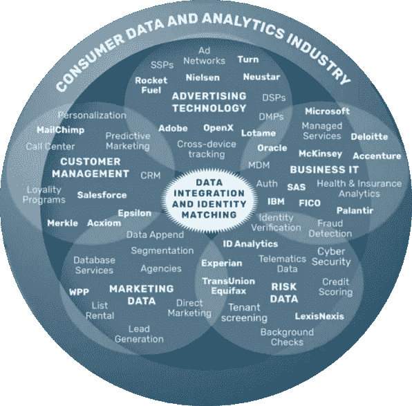
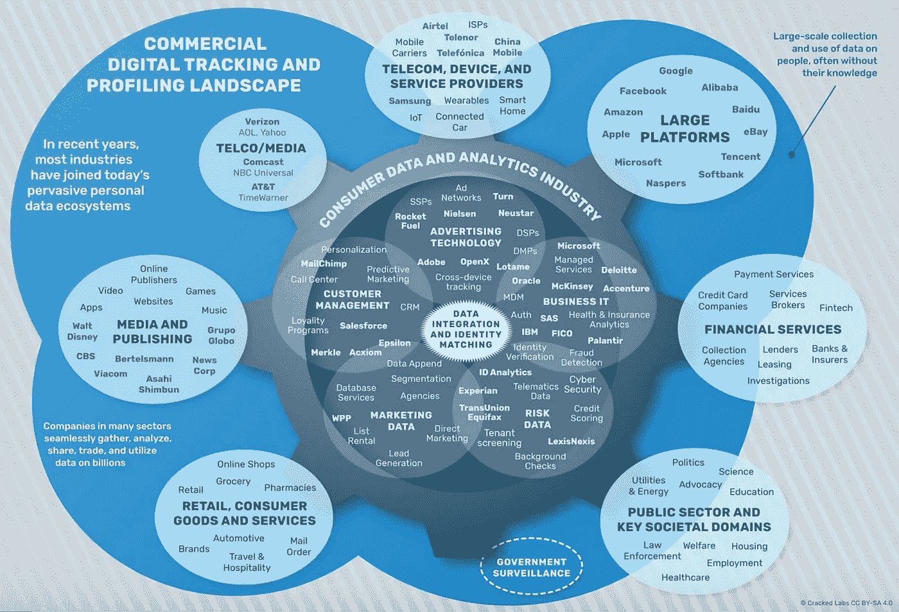
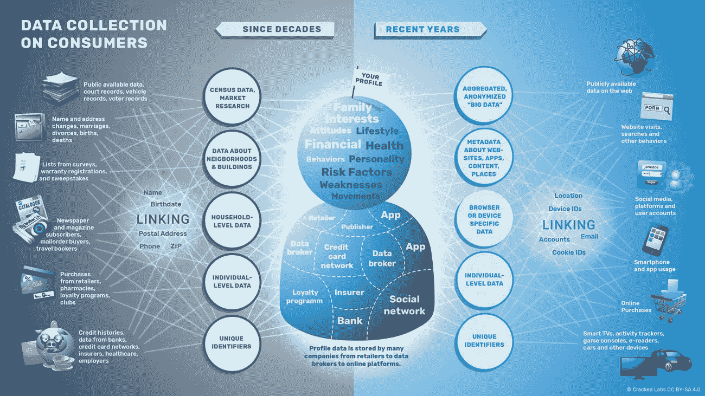
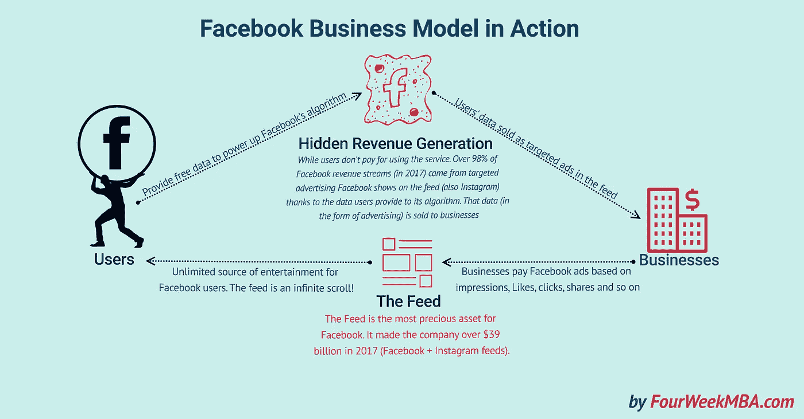
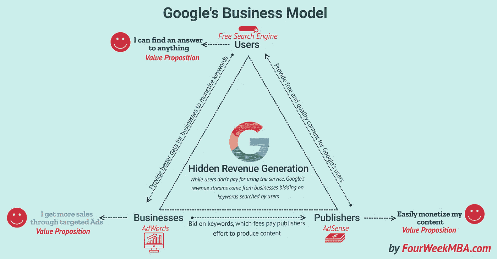
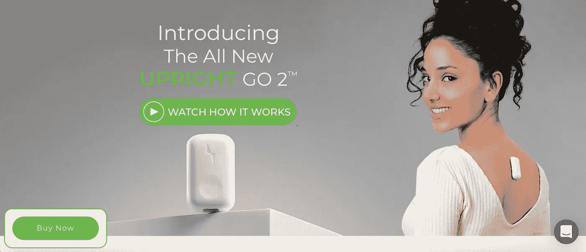
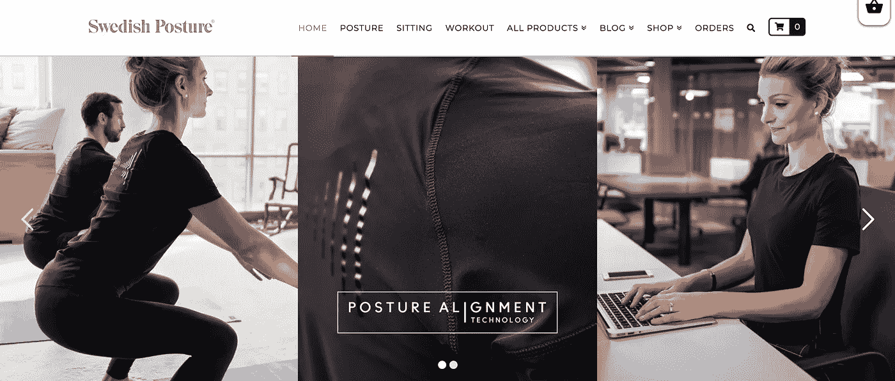

# 数据存储

> 原文：<https://towardsdatascience.com/databaiting-d26cad4c49ca?source=collection_archive---------20----------------------->

Photo by [@kxvn_lx](https://unsplash.com/@kxvn_lx)

## 获取数据的有趣方式

拉一个社会成员(通常被科技公司称为*用户*提交他们的数据的过程正在成为一种常见的做法。一个吸引你的有趣活动与未经明确同意的用户数据销售形成鲜明对比。在这篇文章中，我建议对这个过程使用简写短语 *databaiting* 。

当你加入一项服务或购买一件产品时，谁购买你的数据通常不是你所知道的，而是一个发现的过程。激动人心的用户之旅？

在写这篇文章时，我无意冒犯，而是想让你更加意识到你提供的数据是如何被使用的。如果你开始质疑你提供数据的公司，首先质疑数据是什么，那也很好。我们或许可以谈论负责任的数据贡献，但我不确定这在实践中如何发挥作用。

在定义这个术语之前，让我们看几个简短的例子，当然是为了好玩，看看你是怎么想的。

## 23andMe 和祖先 DNA

乐趣:看看你从哪里来，哇！和你的亲戚联系。
数据:来自唾液和家谱的基因数据。
购买者/合作者示例:[基因药物研究](https://www.forbes.com/sites/nicolemartin1/2018/12/05/how-dna-companies-like-ancestry-and-23andme-are-using-your-genetic-data/#5f179ea46189)。

## iRobot 物联网家居产品

有趣的是:一个打扫你房间的机器人！
资料:私宅地图。
购买者/合作者示例:谷歌广告。

## 亚马逊 Alexa 智能音箱

乐趣:命令演讲者做事！
数据:语音数据和行为数据。
买家/合作者:供亚马逊内部使用和/或最高出价者。

## 宜家智能照明

乐趣:控制你的灯光！
数据:来自连接到你手机的家庭的行为数据。
买方/合作方:内部使用和电话公司，如*小米*。

可能还有更多例子可以举出。这些例子被过分简化和简化了，也许太多了，但这仅仅意味着作为一个说明性的思路的粗略描述。

## 什么是**数据报**？

让我们从检查我放在一起的两个词开始，看看它是一个有用的术语还是不足以描述这种现象。首先是数据，然后是诱饵。

**数据**是收集在一起用于参考或分析的事实和统计数据。它是关于定性或定量变量的主体的一组值。对于我遇到的大多数处理数据的公司来说，人们的感觉是数据是可以衡量和量化的，这是一种主流观点。越来越多的人开始谈论将数据货币化，这个术语被比作石油等原始资源的[。这指的是原始数据(未处理的)可以被处理以获得价值的想法。一些人甚至谈论](https://www.economist.com/leaders/2017/05/06/the-worlds-most-valuable-resource-is-no-longer-oil-but-data)[新的淘金热](https://www.itchronicles.com/technology/data-the-new-gold-rush-for-businesses/)，并将数据比作矿物。数据可以用于许多方面，从帮助治疗癌症、优化物流和训练算法，到学习如何应对给定的情况或背景。我们可以说它不是中立的，是由收集数据和解释数据的人塑造的。

**诱饵**在这种情况下引诱某人。对诱饵的一种理解是引诱鱼或动物。人类是在动物界中被提出的，而不是超越自然或其他动物，所以我们也容易受其影响。有些人会想到的上下文可能与捕鱼有关。当与人类有关时，作为*诱饵*的受害者的人通常会感到受伤和困惑。据说某些东西会引起情绪反应，从而导致行动，即使有人知道他们被引诱，也很难知道如何处理。

**数据发送**我的建议是:*通过引发情绪反应来诱使某人提交数据*。

受害者通常不知道他们的数据是如何被使用的，当他们发现时可能会受到伤害。您的数据可以用于为保险公司、武器制造商或电子商务公司训练监控数据集。你可能不知道这个。你知道公司可能会出售你的数据，而不是卖给谁，你被一个能改善你生活的产品或服务所吸引。因此，你提交自己(你的数据)作为交换，而没有意识到后果。这是我自己多次做过的事情。

## 知情同意

一个奇特的现象是挪威和世界其他地方的烟盒上的图像。你经常会发现这样的信息:“*吸烟致命，*”，它可能伴随着一幅可怕的图片，与你经常吸烟可能导致的一系列疾病有关。

我并不认为使用软件服务或硬件收集数据会杀死你，但是它可能会以你意想不到的方式影响你的生活。

我不知道这有多大帮助。我们仍然可以想象这样的场景:科技公司收集你的数据，并将其用于你不知道的目的，并给予了你极其诚实的知情同意。

这可能不会在不久的将来发生，但它提供了一个有趣的思想实验。我不确定这是不是解决方案，但是我们可以想象以下荒谬的情况:

*   *警告:该产品可能作为行为数据出售给你最近的商店*。我们可能会把它卖给汇总数据的人，而我们自己可能不知道它去了哪里，因为法律不够透明，而且你的数据非常难以追踪。不过我们尽力了。
*   *感谢您提交您的 DNA 样本！要知道，它可能被用来为世界上一些最大的制药公司生产一两种药物。我们认为应该提到这一点，因为我们重视诚实。*
*   通过提交您的心理测量信息来换取更大的社交网络，我们希望您意识到后果。我们可以为您提供更合适的产品，但我们会更好地引导您购买。
*   *您刚才提供的信息既可用于向您销售产品/服务的公司，也可用于政治家联系您，只要他们付费，我们不会有太多歧视。此外，我们扩张得如此之快，以至于我们经常缺少在特定国家讲该语言的员工来监控可能的侵权行为。在我们有员工的国家，发布的内容量往往过高。正如你可能知道的，我们正在迅速扩张。*
*   如果你滚动得太多，并且把自己和你的朋友比较，你可能会有更高的机会变得沮丧，所以如果可能的话，限制你的滚动。记住这项服务是会上瘾的，必须小心使用。我们使用您的行为数据，让您在该平台停留更长时间，以销售更多广告。

清爽吧？

# 数据经纪人

除非你从事信息行业，否则你可能从未听说过数据经纪人，但他们听说过你。今年早些时候(2019 年)，史蒂芬·梅伦德斯和亚历克斯·帕斯捷尔纳克写了一篇关于《快公司》数据经纪人的文章。这项法律要求那些买卖数据的人进入注册中心。另一方面正如文章所说:

> 就连上个月生效的佛蒙特州首个此类法律也不要求数据经纪人披露谁在他们的数据库中，他们收集了什么数据，或者谁购买了这些数据。它也不要求经纪人让消费者访问他们自己的数据或选择退出数据收集。

这篇文章展示了一个有趣的图表。

**Types of consumer data and data companies.** Some companies included in the chart may not be covered by the Vermont law. Image by Cracked Labs an [Institute for Critical Digital Culture](https://crackedlabs.org/en/corporate-surveillance).

《快速公司》文章中的图表让我看到了 Cracked Labs 内部的关键数字文化研究院。 **Cracked Labs** 是一家位于奥地利维也纳的独立研究机构和创意实验室。它调查信息技术的社会文化影响，并在数字文化领域发展社会创新。它是一个非营利组织，成立于 2012 年，旨在加强信息和通信技术的参与性和自主使用，以及自由获取知识和信息——独立于商业或政府利益。

下面两张大图摘自文章*日常生活中的公司监控*。

Different levels, realms and sources of corporate consumer data collection by Cracked Labs an [Institute for Critical Digital Culture](https://crackedlabs.org/en/corporate-surveillance)

## 隐性创收的商业模式

2019 年 1 月[马克·扎克伯格发布了一篇关于**脸书商业模式**](https://newsroom.fb.com/news/2019/01/understanding-facebooks-business-model/) 的帖子。作为其中一部分，他写道:

> 我相信每个人都应该有自己的声音，并且能够沟通。如果我们致力于为每个人服务，那么我们需要一种每个人都负担得起的服务。做到这一点的最好方法是免费提供服务，这正是广告让我们能够做到的。[……]尽管如此，有些人对这种模式的复杂性感到担忧。在普通交易中，你向一家公司支付他们提供的产品或服务。在这里，你可以免费获得我们的服务——我们与广告商单独合作，向你展示相关的广告。这种模式让人感觉不透明，我们都不信任自己不了解的系统。有时这意味着人们认为我们做了我们没有做的事情。例如，我们不出售人们的数据，尽管经常有报道说我们这样做。事实上，向广告商出售人们的信息会违背我们的商业利益，因为这会降低我们的服务对广告商的独特价值。我们有强烈的动机保护人们的信息不被其他任何人访问。

这当然是半真半假或者根本不是真的。让我们检查一下陈述:*“…我们不出售人们的数据…”*是的，你做了标记。尽管广告商为对客户的洞察付费，但这种洞察是基于你的数据。尽管有复杂的技术基础设施和系统，但这并不是一项复杂或不透明的交易。你收集数据，将数据转化为具体的客户洞察，然后卖给广告商。这不像我去一家卖带肉汉堡包的商店，却被告知他们不卖肉，他们只卖汉堡包。这将使我严重质疑这种情况。

我们可以看看谷歌母公司 **Alphabet** 第一季度给投资者的最新投资者声明，并检查几份声明。他们正通过 Calico 进入生命科学领域，真正了解寿命和健康数据。它有义务显示任何未决诉讼，如果我们稍微多搜索一点，反垄断诉讼有一些有趣的陈述。[谷歌因违反反垄断法被罚款创纪录的 24.2 亿€元(约 27.3 亿美元)。](http://europa.eu/rapid/press-release_IP-17-1784_en.htm)

“十多年来，谷歌的搜索引擎在决定我们大多数人在线阅读、使用和购买的内容方面发挥了决定性作用。如果不加以检查，这种看门人的权力就没有多少限制。谷歌可以部署其阴险的搜索操纵做法，在它选择的几乎任何在线领域霸占最大份额的流量和收入，在这个过程中悄悄地摧毁竞争、创新和消费者选择。”
TechCrunch 援引[欧盟委员会 2017 年 6 月 27 日](https://techcrunch.com/2017/06/27/google-fined-e2-42bn-for-eu-antitrust-violations-over-shopping-searches/)。

与亚马逊在购物相关领域的竞争升级被用作谷歌行为的正当理由。欧盟委员会的决定对€处以 43 亿欧元(截至 2018 年 6 月 30 日为 51 亿美元)的罚款，并指示终止“某些安卓分销行为”的争议行为。谷歌桑德尔·皮帅首席执行官[于 2018 年 7 月 18 日发表博客](https://www.blog.google/around-the-globe/google-europe/android-has-created-more-choice-not-less/)评论这一决定:

> 快速创新、广泛选择和不断下降的价格是激烈竞争的经典标志，而 Android 实现了所有这些。今天的决定拒绝了支持 Android 的商业模式，这为每个人创造了更多的选择，而不是更少。我们打算上诉。

开放的 Android 系统是一个可以在多种系统上使用的操作系统。在一篇名为*的文章中，谷歌从你的 Android 手机中追踪的数据量令人震惊:“*谷歌收集了关于你的惊人数量的数据，尤其是从你最常用的设备，你的 Android 手机。这一切都可能在你不知情的情况下发生。”声明提到了 Quartz 的一份[报告，该报告试图了解发送给谷歌的数据包括:](https://qz.com/1183559/if-youre-using-an-android-phone-google-may-be-tracking-every-move-you-make/)

*   根据可能性，列出你的手机认为你可能在做的动作类型。(例如，步行:51%，骑自行车:4%，乘火车:3%)
*   大气压力
*   无论您是否连接到 wifi
*   您所连接的 wifi 接入点的 MAC 地址(这是唯一的标识符)
*   附近每个 wifi 接入点的 MAC 地址、信号强度和频率
*   每个附近蓝牙信标的 MAC 地址、标识符、类型和两个信号强度测量值
*   手机电池的电量以及手机是否正在充电
*   你的电池电压
*   你手机的 GPS 坐标及其准确性
*   GPS 高程及其精度
*   作为整理照片的交换，你可以让谷歌通过收集附近蓝牙信标和 wifi 网络的信息，记录你在什么商店购物，在什么餐馆吃饭。
*   你多久去跑步一次
*   [用蓝牙追踪你，尽管蓝牙已关闭](https://qz.com/1169760/phone-data/)

可能还有我不知道的其他数据点。关键是，通过了解你在一系列平台和服务上使用的关键词，谷歌可以比其他公司更清楚地知道你想要什么。这些信息就是正在出售的东西。声称谷歌是无可争议的数据测试冠军并不是没有根据的。

当然，收集的洞察力对使用谷歌的人来说是积极的，使他们更容易得到正确的东西；到达正确的地方；或者找到合适的服务或产品。

## 最后的免责声明

话虽如此，我确实很欣赏其中一些公司正在创造的服务和产品。很难想象没有谷歌和脸书的生活。这两家公司都让我的生活变得更好或更糟。这似乎是一个奇怪的说法，但是我的批评是建设性的，而不是对这些公司的极端抗议。

*让我们持批评态度，参与关于数据共享作为公民责任的辩论。在我们的社会中如何处理数据有很大的影响。*

写这篇文章是因为看到一个名为[直立姿势](https://www.uprightpose.com/?utm_source=facebook&utm_medium=ppc&utm_campaign=WW%20%7C%20Prospect%20%7C%20Broad%20%7C%20Conversion&utm_content=Upright%20life%20GO2%20ad&utm_term=Mix%20GO2%20Lunch%20%7C%20Broad%20%7C%2018-65%20%7C%20M%2BW%20%7C%20%24126%20CC&fbclid=IwAR1mQOvT5hCcFoXYk9PQk3kNQDxSIIg1TmaJiz2JtnDSjx95aqduAUJsy8I)的初创公司的广告活动。他们的口号是:“庆祝生命，自由和追求姿态。”直立姿势训练器用一个小粘合剂贴在你的背上，当你每次没精打采时，它会立即振动，提醒你纠正姿势。

[Upright Campaign website retrieved the 7th of July 2019](https://www.uprightpose.com/?utm_source=facebook&utm_medium=ppc&utm_campaign=WW%20%7C%20Prospect%20%7C%20Broad%20%7C%20Conversion&utm_content=Upright%20life%20GO2%20ad&utm_term=Mix%20GO2%20Lunch%20%7C%20Broad%20%7C%2018-65%20%7C%20M%2BW%20%7C%20%24126%20CC&fbclid=IwAR1mQOvT5hCcFoXYk9PQk3kNQDxSIIg1TmaJiz2JtnDSjx95aqduAUJsy8I)

当我看到该产品时，我的第一个想法是:这些数据会卖给谁？我发现自己也是这么想的，这种思路让我意识到这是科技公司的一种普遍做法。

尤其令人着迷的是这些可以被称为**生物反馈设备**的新型可穿戴设备，至少我在 2017 年的一篇期刊文章中看到它提到了由廖大银撰写的关于 [*协作、社交网络姿势训练以及姿势监测和生物反馈*](https://www.intechopen.com/books/biofeedback/collaborative-social-networked-posture-training-with-posturing-monitoring-and-biofeedback) 。当公司离你的身体这么近时(苹果手表等。)我们可以开始谈论生物勘探。

**生物勘探:**是基于生物资源的新产品的发现和商业化过程。然而，这些生物资源不是植物或动物，而是你和你的数据。这可能看起来像是一个批判的开始，让人想起米歇尔·福柯(法国社会理论家)或者被认为是马克思主义者(有阶级关系的社会经济学)，也许确实如此。

对数字文化的批判性研究并不是我所知道的一个领域，然而它引起了我的兴趣，因为我对社会科学、计算机科学，尤其是人工智能以及可持续发展感兴趣。我很可能会继续这篇文章，尽我最大努力去理解[关键数字文化研究院](https://crackedlabs.org/en/corporate-surveillance)所涵盖的研究领域。

作为一名挪威人，我将以一张我在一家名为 *Swedish Posture* 的公司看到的图片来结束这篇文章。姿势校准是未来吗？我无法预测未来，但是人类的*人体工程学*在这个健康科技领域看起来非常光明，所以我能说的就是保持正直。保持直立！

> **数据发送** : *通过引发情感反应来诱使某人提交数据*。

> 你认为数据留白是描述这种情况的一个有用的词吗？请在下面的评论区告诉我。

**这是#500daysofAI** 的第 35 天，请关注我关于 AI 的每日更新。

非常感谢您的阅读！

> 什么是#500daysofAI？
> 
> 我在挑战自己，用#500daysofAI 写下并思考未来 500 天的人工智能话题。这是我发明的一个挑战，来保持对这个话题的思考，和大家分享我的话。