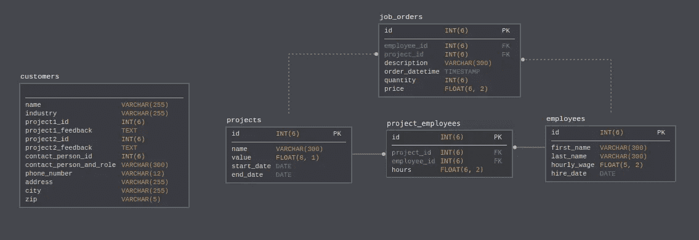
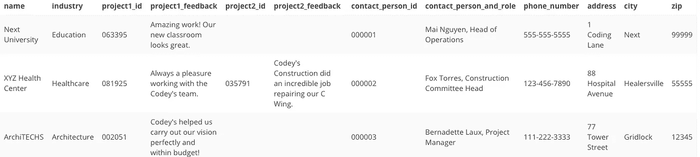
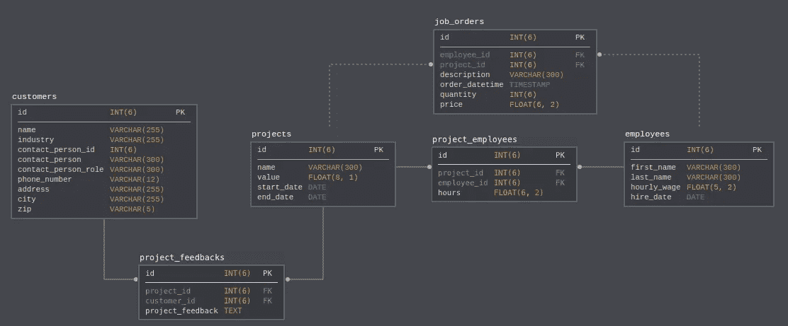
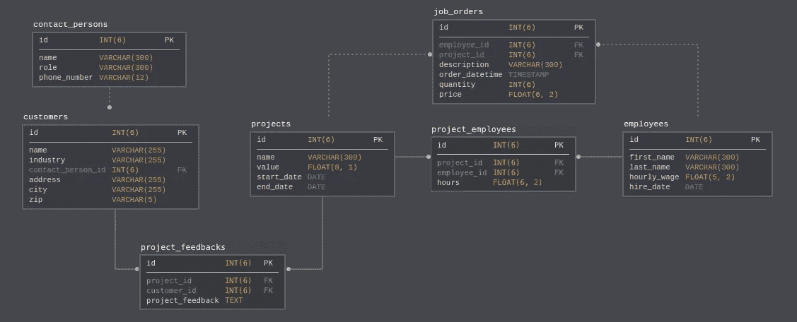
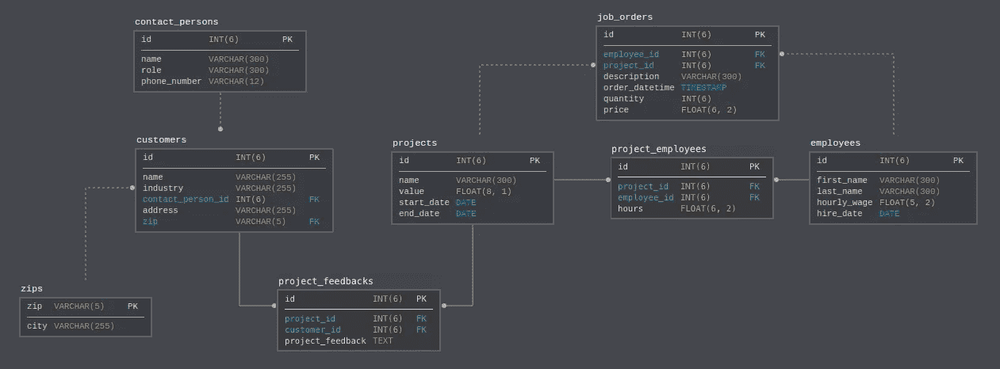

# 解释了数据库规范化

> 原文：<https://towardsdatascience.com/database-normalization-explained-53e60a494495?source=collection_archive---------4----------------------->

## 通过设计和修改示例数据库模式来了解数据库规范化！

规范化是一种在数据库中组织数据的技术。对数据库进行规范化以最小化冗余(重复数据)并确保每个表中只存储相关数据是很重要的。它还可以防止由数据库修改(如插入、删除和更新)引起的任何问题。

组织的阶段被称为**范式**。在本教程中，我们将为一家建筑公司重新设计一个数据库，并确保它满足三种范式:

## **第一范式** ( **1NF** ):

*   数据存储在表中，表中的行由主键唯一标识
*   每个表中的数据以最简化的形式存储在各个列中
*   没有重复的组

## 第二范式( **2NF** ):

*   来自 1NF 的一切
*   每个表中只存储与表的主键相关的数据

## 第三范式(3NF):

*   来自 2NF 的一切
*   每个表中的列之间没有表内依赖关系

请注意，实际上有六个级别的规范化；然而，第三范式被认为是大多数应用程序所必需的最高层次，所以我们将只讨论前三种形式。

我们开始吧！

> 本教程改编自 Next Tech 的**数据库基础**课程，该课程带有一个浏览器内 MySQL 数据库以及需要完成的交互式任务和项目。这里可以免费上手[！](https://c.next.tech/2LwLAXB)

# 我们的数据库:科迪的建设

*Codey’s Construction’s database schema with a new table that causes the database to violate the rules of normalization.*

我们将在本教程中使用的数据库是为 Codey 的建筑公司(Codey 是一个有用的编码机器人，在前面提到的课程中与您一起工作)。从上面的模式可以看出，数据库包含了表`projects`、`job_orders`、`employees`和`project_employees`。最近，添加了`customers`表来存储客户数据。

不幸的是，这个表的设计没有满足三种形式的规范化…让我们来解决这个问题！

# 第一范式

第一范式与表和列中数据的重复和分组有关。

Codey 的构造的表`customers`违反了 1NF 的全部三条规则。

1.  没有主键！数据库用户将被迫按公司名称查找公司，但不能保证公司名称是唯一的(因为唯一的公司名称是在各州注册的)。
2.  这些数据不是最简化的形式。列`contact_person_and_role`可以进一步分为两列，如`contact_person`和`contact_role`。
3.  有两组重复的列— ( `project1_id`、`project1_feedback`)和(`project2_id`、`project2_feedback`)。

以下 SQL 语句用于创建`customers`表:

Example data for ``customers`` table.

通过修改一些列，我们可以帮助重新设计这个表，使它满足 1NF。

首先，我们需要添加一个名为`id`的主键列，数据类型为`INT(6)`:

使用这个语句，我们添加了一个自动递增的主键作为表中的第一列。

为了满足第二个条件，我们需要拆分`contact_person_and_role`列:

在这里，我们简单地将其重命名为`contact_person`，并在它后面紧接着增加了一列`contact_person_role`。

为了满足第三个条件，我们需要将包含项目 id 和项目反馈的列移动到一个名为`project_feedbacks`的新表中。首先，让我们从`customers`表中删除这些列:

然后创建`project_feedbacks`表:

下面是数据库模式现在的样子:

Modified schema that now satisfies 1NF.

如您所见，在`project_feedbacks`表或`customers`表中不再有重复组。我们仍然知道哪个客户说了什么，因为`project_feedbacks.customer_id`引用了`customers`表。

现在我们的`customers`表满足 1NF！让我们继续第二范式。

# 第二范式

要实现第二范式，数据库必须首先满足 1NF 的所有条件。此后，满足 2NF 要求每个表中的所有数据都直接与表的主键标识的记录相关。

我们违反了 2NF，因为`contact_person`、`contact_person_role`和`phone_number`列跟踪的数据与联系人有关，而不是客户。如果客户的联系人发生变化，我们将不得不编辑所有这些列，这样做的风险是，我们将更改其中一列中的值，但忘记更改另一列。

为了帮助 Codey 的构造修复这个表以满足 2NF，应该将这些列移动到包含联系人数据的表中。首先，让我们删除“客户”中与我们的主键无关的列:

请注意，我们保留了`contact_person_id`，因此我们仍然知道应该联系谁。现在，让我们创建新表`contact_persons`,这样我们就有地方存储每个联系人的数据了。

Codey's Construction 的数据库模式现在如下所示:

Modified schema that now satisfies 2NF.

现在，如果客户的联系人发生变化，建筑公司只需在`contact_persons`表中插入一条记录，并更改`customers`表中的`contact_person_id`。

# 第三范式

对于处于第三范式的数据库，它必须首先满足 2NF(因此也是 1NF)的所有标准。

然后，每一列必须**非传递依赖**于表的主键。这意味着表中的所有列都应该依赖于主键，而不是其他列。如果`column_a`依赖于主键，也依赖于`column_b`，那么`column_a`过渡依赖于主键，所以表不满足 3NF。

你读那个会不会头疼？放心吧！下面会有更多解释。

这是我们满足 1NF 和 2NF 后的`customers`表:

Example data for modified `customers` table.

该表当前有依赖于传递的列。过渡依赖关系在`city`和`zip`之间。客户所在的城市依赖于客户，所以这满足了 2NF 然而，城市也取决于邮政编码。如果客户搬迁，我们可能会更新一列，而不更新另一列。因为存在这种关系，所以数据库不在 3NF 中。

为了修复我们的数据库以满足 3NF，我们需要从`customers`中删除`city`列，并创建一个新表`zips`来存储该数据:

Modified schema that now satisfies 3NF.

就是这样！发现违反 3NF 的问题可能很困难，但是确保数据库能够抵御仅部分更新数据所导致的错误是值得的。

我希望你喜欢这篇关于数据库规范化的教程！Codey's Construction 的数据库现在满足三种形式的规范化。

*如果你想继续学习数据库，Next Tech 的* ***数据库基础*** *课程涵盖了你入门数据库和 SQL 所需的所有知识。通过帮助一个名为 Codey 的交互式编码机器人，您将学习如何创建和设计数据库，修改数据，以及编写 SQL 查询来回答业务问题。这里* *可以免费上手* [*！*](https://c.next.tech/2LwLAXB)