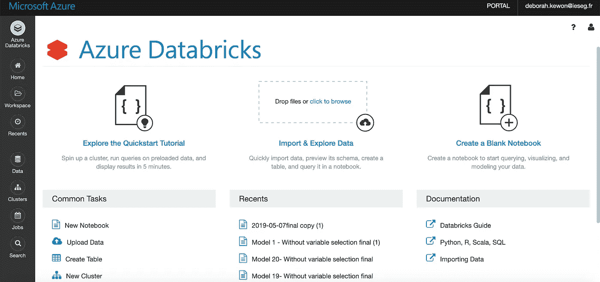
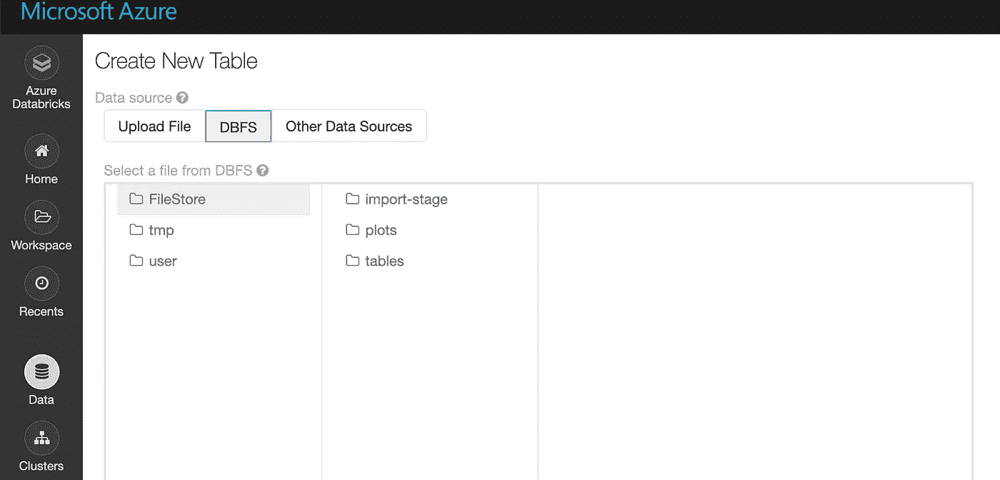
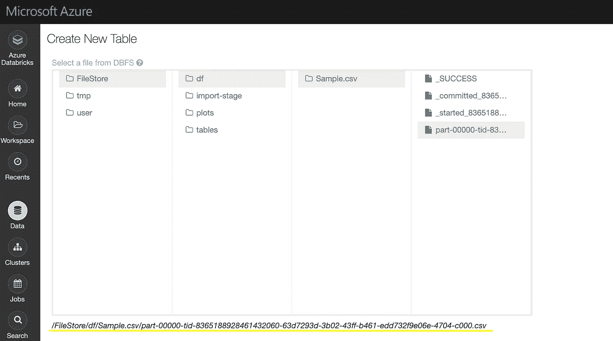
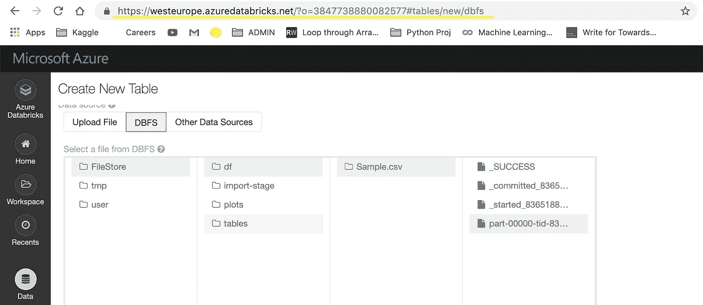
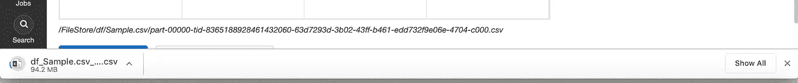
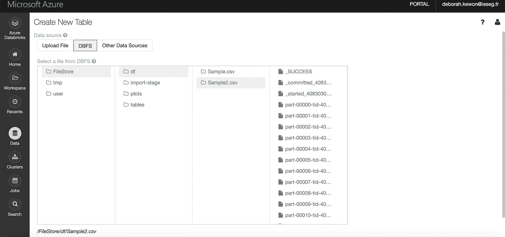
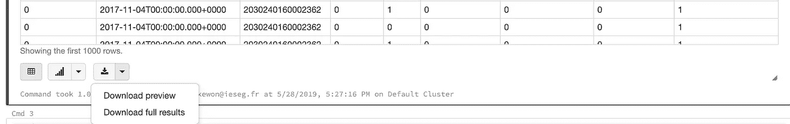

# Databricks:如何在本地计算机上将数据框保存为 CSV 文件

> 原文：<https://towardsdatascience.com/databricks-how-to-save-files-in-csv-on-your-local-computer-3d0c70e6a9ab?source=collection_archive---------2----------------------->


Photo credit to Mika Baumeister from Unsplash

当我从事处理大型数据集的 Python 项目时，我通常使用 Spyder。Spyder 的环境很简单；我可以浏览工作目录，维护大型代码库，检查我创建的数据框架。然而，如果我不对大数据进行子集化，我会不断地面临内存问题，并与非常长的计算时间作斗争。为此，我偶尔会使用数据块。Databricks 是一个微软 Azure 平台，在这里您可以轻松地将大量数据解析到“笔记本”中，并执行基于 Apache Spark 的分析。

如果您想使用 pyspark 处理数据框和运行模型，您可以很容易地参考 [Databricks 的网站](https://docs.databricks.com/spark/latest/dataframes-datasets/introduction-to-dataframes-python.html)了解更多信息。然而，在处理 Databricks 时，我注意到将文件保存为 CSV 格式并不是很简单。在接下来的部分中，我将分享如何在本地计算机上将数据框从数据块轻松保存为 CSV 格式。

# **1。探索数据块文件系统(DBFS)**



从 Azure Databricks 主页，你可以进入“上传数据”(在常见任务下)→“DBFS”→“文件存储”。



DBFS 文件存储是您创建文件夹并将数据框保存为 CSV 格式的地方。默认情况下，FileStore 有三个文件夹:导入阶段、图和表。

# **2。将数据帧保存到文件存储中的 CSV 文件中**

```
Sample.coalesce(1).write.format(“com.databricks.spark.csv”).option(“header”, “true”).save(“dbfs:/FileStore/df/Sample.csv”)
```

使用笔记本上的上述代码，我创建了一个文件夹“df ”,并将一个数据框“Sample”保存到 CSV 中。使用 coalesce(1)很重要，因为它将数据帧保存为一个整体。在本文的最后，我还将演示当代码中没有包含 coalesce(1)时会发生什么。



将数据框转换为 CSV 格式后，转到文件存储。您将看到您创建的文件夹和文件。“part-00000”是我必须下载到本地计算机上的 CSV 文件。我为步骤 3 复制了 */FileStore/* 之后的路径。

# 3.在本地计算机上下载 CSV 文件



为了在本地计算机上下载位于 DBFS 文件存储中的 CSV 文件，您必须将突出显示的 URL 更改为以下内容:

https://westeurope.azuredatabricks.net/files/**df/sample . CSV/part-00000-tid-8365188928461432060–63d 7293d-3b 02–43ff-b461-edd 732 f 9 e 06 e-4704-c000 . CSV**？o= **3847738880082577**

正如您所注意到的，以粗体显示的 CSV 路径(**df/sample . CSV/part-00000-tid-8365188928461432060–63d 7293d-3b 02–43ff-b461-edd 732 f 9 e 06 e-4704-c000 . CSV**)来自步骤 2。号码( **3847738880082577** )来自原网址。



当您如上所述更改 URL 并按 enter 时，CSV 文件将自动下载到您的本地计算机上。

```
dbutils.fs.rm(“/FileStore/df”,True)
```

如果您想删除 FileStore 中的文件，只需使用上面的代码即可。一旦被删除，你会得到评论“真”。

如前所述，下面是代码中不包含 coalesce(1)时的细节。



默认情况下，Databricks 将数据保存到许多分区中。Coalesce(1)将所有文件合并成一个文件，解决了这个分区问题。但是，当您处理非常大的数据集(> 1TB，低速)时，使用 coalesce (1)或 repartition (1)并不是一个好主意，因为它会将所有数据传输到单个工作线程，这会导致内存不足问题和处理速度缓慢。在这种情况下，建议按列解析或分发给多个工作线程。

另外，还有另外两种方法可以将数据框保存为本地计算机上的 CSV 文件:

1.  使用“下载完整结果”



这个方法是最简单的。然而，Databricks 最多只能下载 100 万行。因此，如果您的数据框超过 100 万行，我建议您使用上述方法或如下所示的 Databricks CLI。

2.使用 Databricks CLI

Databricks CLI (Databricks 命令行界面)构建在 Databricks REST API 之上，与 Databricks 工作区和文件系统 API 交互。Databricks CLI 需要一些设置，但您也可以使用此方法将数据框下载到本地计算机上。有关更多详细信息，请参考 [Databricks CLI 网页](https://docs.databricks.com/user-guide/dev-tools/databricks-cli.html)。

感谢您的阅读！如果你喜欢我所做的，不要犹豫，在 [GitHub](https://github.com/dkewon) 上关注我，在 [Linkedin](https://www.linkedin.com/in/deborah-kewon/) 上与我联系。

另外，请随意查看我的其他文章:

[*如何获得关于货币汇率的 Twitter 通知:网络抓取和自动化*](/how-to-get-twitter-notifications-on-currency-exchange-rate-web-scraping-and-automation-94a7eb240d60)