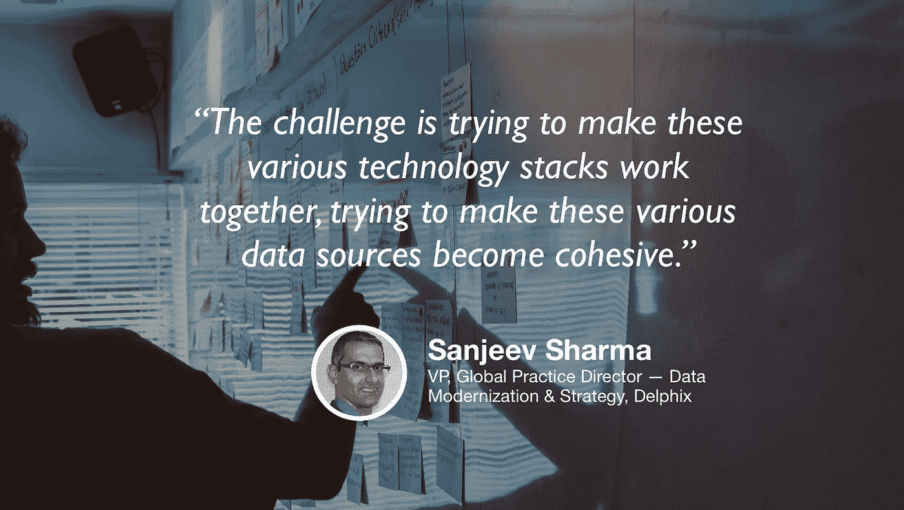

# 企业级的数据运营和数据科学

> 原文：<https://towardsdatascience.com/dataops-and-data-science-at-enterprise-scale-445883b51d8c?source=collection_archive---------22----------------------->

## [苹果](https://podcasts.apple.com/ca/podcast/towards-data-science/id1470952338?mt=2) | [谷歌](https://www.google.com/podcasts?feed=aHR0cHM6Ly9hbmNob3IuZm0vcy8zNmI0ODQ0L3BvZGNhc3QvcnNz) | [SPOTIFY](https://open.spotify.com/show/63diy2DtpHzQfeNVxAPZgU) | [其他](https://anchor.fm/towardsdatascience)

## Sanjeev Sharma 在 [TDS 播客](https://towardsdatascience.com/podcast/home)

*编者按:这是迈向数据科学播客“攀登数据科学阶梯”系列的第 11 集，由 Jeremie Harris、Edouard Harris 和 Russell Pollari 主持。他们一起经营一家名为*[*sharpes minds*](http://sharpestminds.com)*的数据科学导师创业公司。可以听下面的播客:*

如果你没有在超大型公司做过数据科学家，你可能不会意识到的一件事是，企业规模出现的问题(以及解决这些问题所需的技能)与你在初创公司可能遇到的问题完全不同。

规模是一件好事，原因有很多:它意味着访问更多的数据源，通常还意味着更多的计算和存储资源。但是，大公司只有通过促进大团队之间的成功合作才能利用这些东西(这真的非常非常困难)，并且必须应对独特的数据卫生挑战，如果不彻底改造几乎整个数据科学生命周期，这些挑战就无法解决。

所以我想说，我们为今天的专题节目请到了德尔福数据现代化和战略副总裁 Sanjeev Sharma，这是一件好事。Sanjeev 的专长是帮助拥有大量技术债务的大公司更新和升级他们的数据管道，他在企业范围内了解数据科学的来龙去脉的时间几乎比任何人都长。以下是我们从聊天中获得的最大收获:

*   企业规模的公司背后往往有并购的历史。因此，他们必须集成来自完全不同数据源的大量不同的数据集。确保来自所有这些不同来源的数据以一种让每个需要的人都能轻松访问的方式进行汇总是一项独特的挑战。
*   如果你想在一家企业公司找到一份工作，有一点要记住，没有一种特定的工具或一套工具会决定成败。上面提到的数据源的多样性意味着您最终会遇到世界上所有的数据库类型和管道架构。因此，如果你试图进入企业数据科学，Sanjeev 的建议是专注于你的基础知识，而不是专注于学习框架 X、Y 和 z。
*   过去，开发人员会构建应用程序，而“It 人员”会负责将这些应用程序部署到生产环境中。但大多数公司后来都认识到，将应用程序和部署步骤集成到一个统一的流程中(称为“DevOps”)是确保最终产品一致性的一个好方法。同样，“数据操作”(即完整数据生命周期的集成)正在成为大公司的普遍做法。你可以在这里阅读 Sanjeev 关于 DataOps 的[帖子。](https://sdarchitect.blog/2018/11/16/why-i-joined-delphix-opening-up-the-opportunity-of-data/)
*   当谈到更广泛的数据科学时，Sanjeev 认为计算和架构改进的速度是定义数据科学角色未来如何发展的主要因素之一。更多计算意味着更有能力进行试错、搜索参数和超参数空间，甚至自动化模型选择。例如，过去的情况是，数据科学家必须理解他们的模型，以便能够做出聪明的有根据的猜测，即哪些超参数最适合他们的情况。当然，这在某种程度上仍然是正确的，但是计算能力和 AutoML 工具的可用性已经大大削弱了手动超参数调优的价值。正如 Sanjeev 所说，“几年前是一项技能的东西，今天却成了商品。”
*   由于计算和基础设施的改进，越来越多的数据管道变得自动化和优化，业务知识、产品直觉和领域专业知识的重要性只会增加。机器将能够告诉我们什么样的超参数最适合给定的数据集，但在我们实现全面的 AGI 之前，它们仍然需要具有商业意识的人类来决定，例如，要删除或包含哪些离群值以及为什么要删除，如何从可用的数据集中进行采样以建立训练和验证集，等等。

你可以在推特上关注桑吉夫，网址是 [@sd_architect，](https://twitter.com/sd_architect)或者点击查看[的网站。](https://sdarchitect.blog/)