# 我们可以使用数据科学预测石油和天然气工程项目的成本超支吗？

> 原文：<https://towardsdatascience.com/datascience-in-oil-and-gas-engineering-projects-daace6e6c7f?source=collection_archive---------22----------------------->

Photo by [Dean Brierley](https://unsplash.com/@milkandbourbons?utm_source=unsplash&utm_medium=referral&utm_content=creditCopyText) on [Unsplash](https://unsplash.com/s/photos/oil-offshore?utm_source=unsplash&utm_medium=referral&utm_content=creditCopyText)

我们的调查涉及对发生在 15 个石油和天然气海上项目中的重大漂移因素的分析。漂移因素是可能的功能失调点，会导致项目绩效下降，然后在面临有害后果之前实施纠正或预防措施。然后从 15 个石油和天然气项目中收集了 720 个事件。

**第一部分:探索性数据分析**

首先，我将使用 python 编写一个经典 EDA，在第一步中，我导入经典库并上传文件:

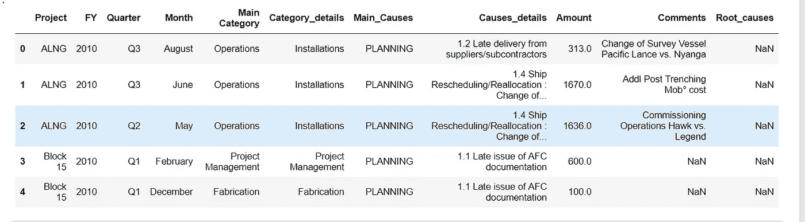

Author’s creations

该数据库包含有关石油和天然气海上工程项目中过度成本的以下信息:

**项目:**项目名称。

执行时间:**财年**:年**季**月**日**。

**主要类别**和**类别详细说明**导致项目成本过高的工程问题。

**主要原因**和**原因详情**与项目管理相关的问题相关原因。

comments 列中描述的这四个列之间有一个链接。一些问题被判断为“仅仅是工程问题”,而另一些问题被判断为“工程和项目管理问题”,这种区别是基于处理该问题并完成数据库的人给出的描述。

**金额**是每一个问题造成的金钱损失总额。

**根本原因**是问题可能的主要原因。

下一步是浏览数据库，以检查无效值:

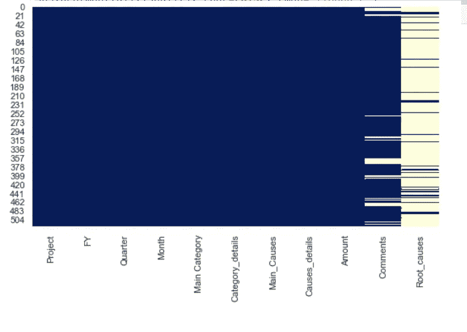

Checking for missing values and NaNs (Author’s creations)

“根本原因”一栏几乎是空的，我将删除它。comments 列对于 NLP 分析，以及与类别或原因建立关系非常有用。

然而，在第一个例子中，我将保持简单，这个探索不需要评论栏。

下一步将探究每个项目中损失的金额。

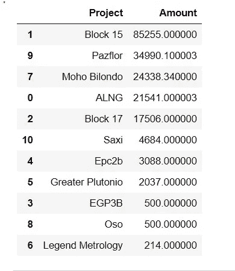

Table 1\. Author’s creations

金额以千美元为单位。

当绘制(见下图)损失金额和项目名称时，我们可以看到“负金额”，这意味着采取了一些措施来纠正错误并挽回部分损失。

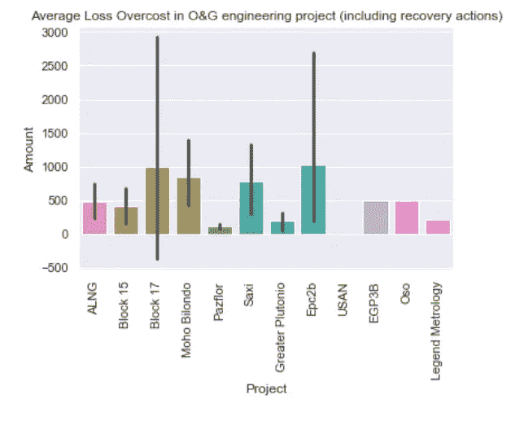

Amount of losses per project. (Author’s creations)

因为我只对正的“损失”感兴趣，所以我只保留金额的正值。我定义了一个名为 Overcost 的新数据集:

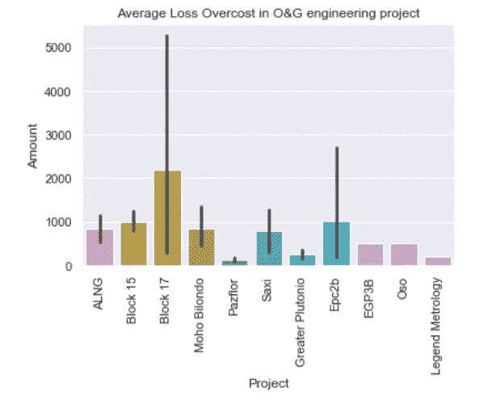

Author’s creations

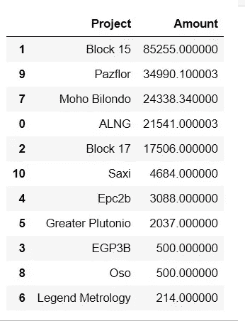

Table 2.Author’s creations

现在，我可以检查每个项目中产生的实际超额成本。

与上表相比，这些数字更高。

然而，有一些项目仍然有“小”的数字，我会放弃它们，以便专注于更大的项目。

按类别分类的结果是:

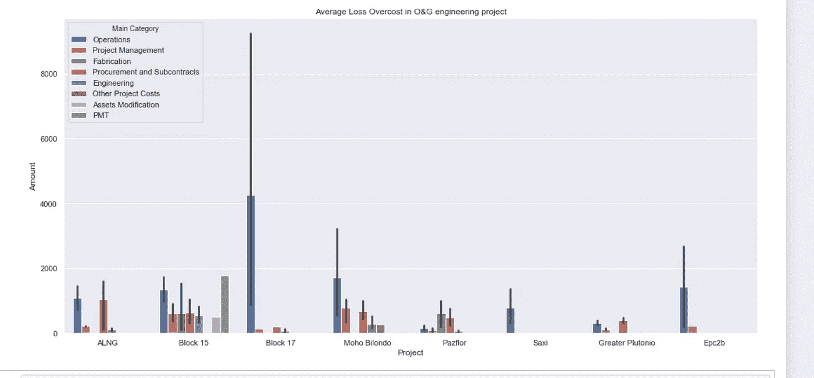

Amount of losses per project by category (Author’s creations)

因为所有的项目与项目的规模相比都有不同的损失，所以很难比较每个类别的重要性。

为了提高可视化效果，并获得所有项目的相似视图，我将每个项目行中的损失金额除以项目的总损失，对该数据进行归一化处理:

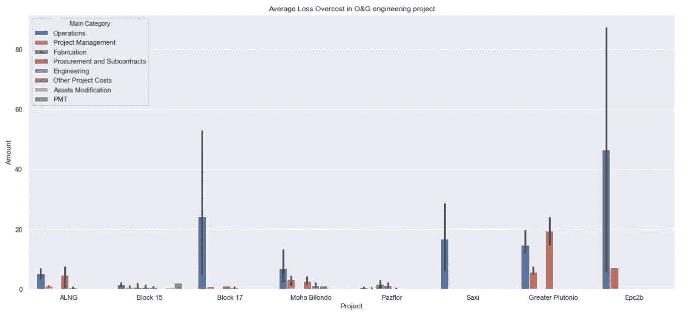

Author’s creations

该图显示了各个项目的相对损失额。它还显示了一些可以丢弃的异常值(例如，数量> 30 的值):

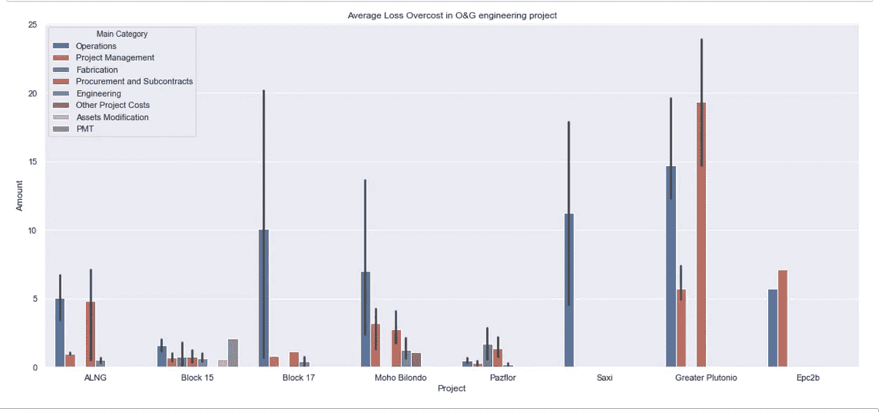

Author’s creations

最后一幅图显示了最重要项目按类别划分的标准化损失的比较分布。

最后，我们可以探索其他列。例如具有接合图。但在此之前，有必要将分类数据(如详细原因和月份)转换成数字(浮点型)。因此，我创建了下一个映射:

结果，该图给出了原因细节和月份之间的关系。举例来说，我们可以看到原因 5“设备故障”在第 2 个月和第 10 个月左右有很大影响

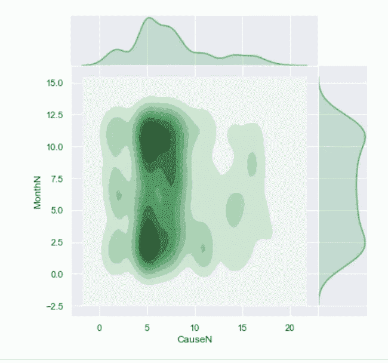

Impact of causes of project losses by month (Author’s creations)

第二部分。使用贝叶斯网络预测成本超支

研究石油和天然气项目常见问题原因的顾问选择了之前列出的原因(原因从 1.4 到 5.2)。此外，我们采访了六位行业专家。他们被提供了一个被评估项目的主要漂移因素的列表，以检查原因是否有意义以及是否与他们所属的领域一致。由于被评估的项目属于同一个行业，它们共享特定的漂移因子。我们的因果模型具有有限数量的经验定义的漂移因子。

下表显示了所研究项目中最常见的漂移因素。为了证实我们的研究，该表还显示了 PM 文献的来源，其中相同领域(石油和天然气建设)的项目试验了相同的漂移系数。

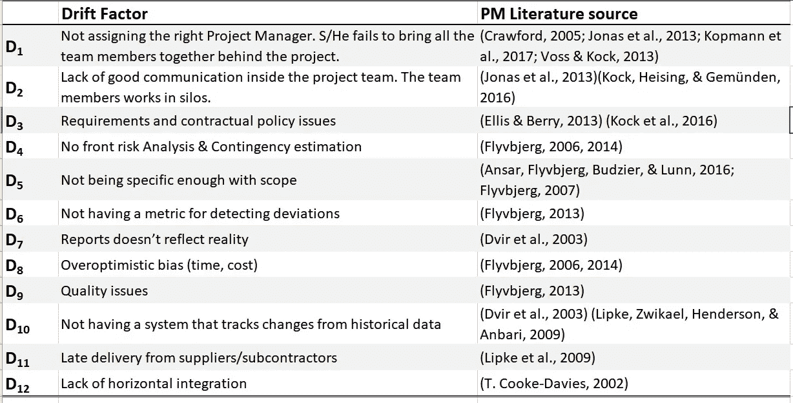

Table 3\. Selected Drift Factors. (Author’s creations)

我们调查的下一步是通过从数据库中提取知识来了解漂移因素对项目过度成本的影响。假设所有漂移因子都收敛到目标节点(没有任何其他中间节点)。标记项目集分为训练集(数据集的 90%)和测试集(数据集的 10%)。

**数据结构化:**我们调整了数据库，以获得一个适应贝叶斯网络的表，同时使用足够的行来使模型可靠。我们获得的数据如表 4 所示。对于每个项目，我们都有由于特定问题而损失的金额。

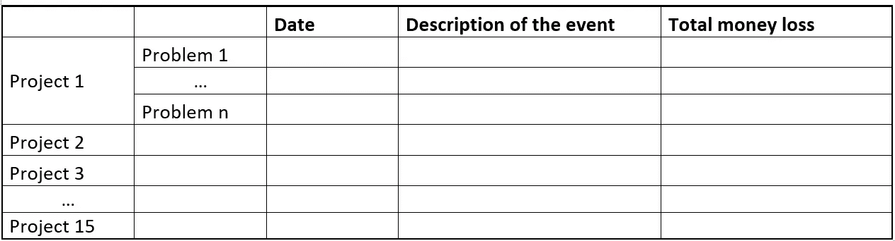

Table 4\. Raw data format (Author’s creations)

然后，我们必须将问题转化为项目中反复出现偏差的原因。这项工作也是在专家的帮助下完成的，他们根据对数据库中事件描述的理解来定义重复发生的原因。表 5 显示了与我们的第一个数据结构化相当的结构化:每个单元格显示了由于每个漂移因素(列)导致的每个项目(行)的资金损失量。

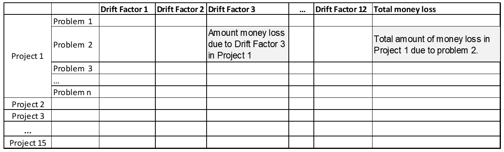

Table 5\. Data including drift factors. Real losses by drift factor by project (Author’s creations)

接下来，有必要对漂移因素的影响进行标准化。因此，我们建议将表 5 转换为另一个数据库，其中的衡量标准由每个项目的**费用**的相对资金损失组成，即每个项目的每个漂移因素造成的损失的**百分比**，如表 6 所示。

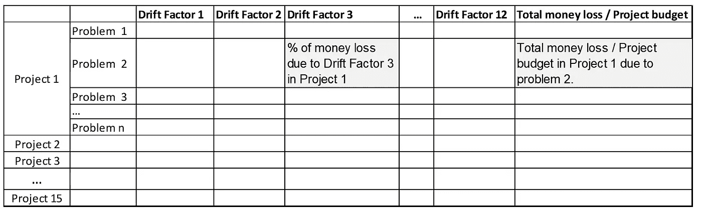

Table 6\. Data including drift factors. Percentage losses by drift factor by project (Author’s creations)

然而，该表没有足够的数据来训练贝叶斯算法。因此，我们应用了另一种数据配置策略，即按照日期以及月份和年份的分段来分离事件。数据库已重组，如下表所示。在该表中，每个单元格总结了给定月份(行)与漂移因子(列)相关的所有事件造成的资金损失百分比。这个新表格有 720 行，对应于在 48 个月内评估的 15 个项目。

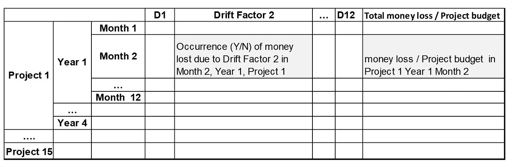

Table 7\. Final structured data format. (Author’s creations)

我们进行了几次模拟，直到我们得到一个好的特征来训练算法。在每个测试中，我们修改了超参数(输入/输出节点的数量、数据库的结构、合成节点的状态数量、输出节点的状态数量)。我们尝试了几次模拟，直到我们得到一个标准化的有用的超参数组合来训练算法。

选择和优化超参数是一项艰巨的任务，如果你有兴趣了解这个主题的更多信息，我推荐以下帖子:

 [## 贝叶斯网络中的超参数调整问题

### 在这段历史中，我们讨论了在基于贝叶斯理论建立模型时要考虑的结构标准

towardsdatascience.com](/the-hyperparameter-tuning-problem-in-bayesian-networks-1371590f470) 

表 8 总结了超参数的值。我们选择了如表 7 所示的数据库结构。该数据库使算法学习漂移因子和成本超支百分比之间的关系。它支持为目标节点构建 CPT。每一列对应一个超参数；每行显示这些超参数可以取的值。不同的 bn 可以从上述超参数的组合中构建。在表 8 中，绿色和带下划线的值表示我们在模型中采用的超参数组合。

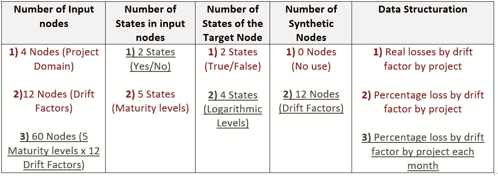

Table 10\. Overview of the Hyperparameters, and their possible values. (Author’s creations)

我们测试了几个超参数，以获得可接受的组合数量。学习算法计算合成节点和目标节点 CPT 之间的关系。

我们将学习算法应用于数据库。该算法生成与目标节点的 CPT(project over cost)相对应的*值。最终模型是使用 GeNie 软件创建的。过度成本(目标)节点的类别可以理解如下:*

**P1 _:**被评估项目有 **0%** 的概率发生相当于不到 1%费用的超额成本。即 P(Overcost) < 1% = 0。

被评估项目有 **2%** 的概率发生相当于项目费用 1%到 10%的超额成本。即 1% ≤ P(过度成本)< 10% = 0.02。

**P1 _ 100:**被评估项目有 **61%** 的概率发生相当于项目费用 10%至 100%的超额成本。即 10% ≤ P(过度成本)< 100% = 0.61

**P_100_:** 被评估项目发生大于项目费用 100%的超额成本的概率为 **37%** 。即 P(过度成本)≥ 100% = 0.37

下图显示了完整的贝叶斯网络。在这个网络中，输入节点对应于漂移因子的子原因。漂移因子对应于节点 D1 到 D12。

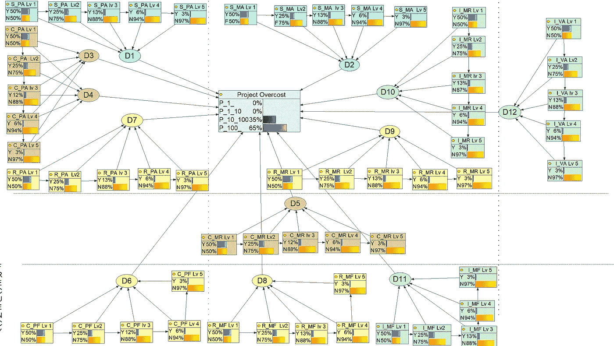

The complete Bayesian network (Author’s creations)

**模型的测试。**然后我们用新数据测试了因果模型。我们用与项目数据库中包括的项目相对应的信息来实例化每个成熟度级别，但是不在训练数据集中。注册目标节点中每个状态的相应过度开销。为每个状态值计算精度。下图显示了该模拟的结果。训练数据和测试数据之间的相对误差小于 6%。

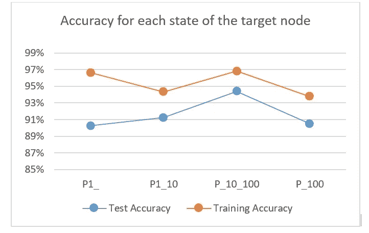

The complete Bayesian network (Author’s creations)

**改进建议。**首先，我们进行分析，以检测哪些漂移因素对因果网络影响更大。这种第一次分析允许选择具体评估项目的问题的主要原因。下图显示了该示例的反向传播分析。结果表明，节点 D1、D7、D8、D9 对项目的超额成本有很大的影响。因此，应该使用与这些节点(S_Pa、R_Pa、I_Mr、R_Mf)相关联的成熟度标准来构建建议场景，因为决策者可以对最有影响力的节点上的工作进行优先级排序。

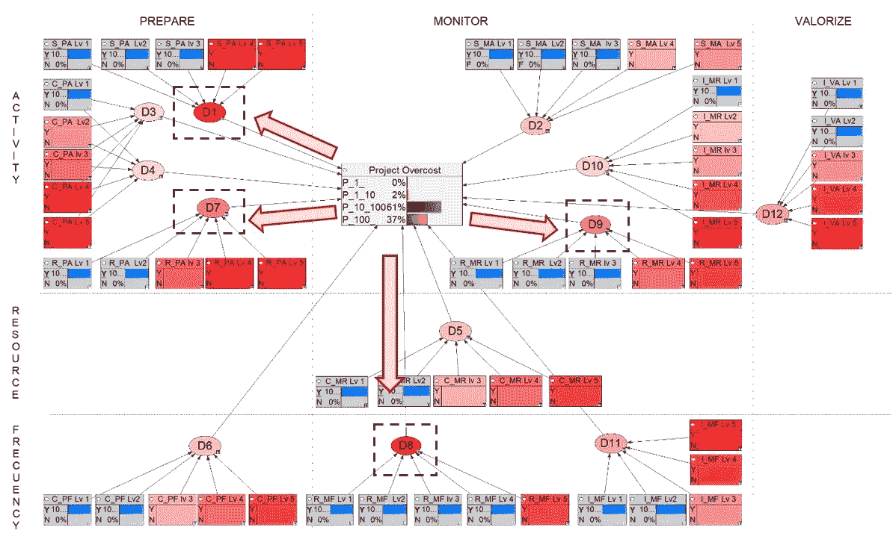

Backpropagation analysis for the given example (Author’s creations)

第二，决策者模拟了达到所选成熟度标准的新成熟度级别的假设。然后运行新的 BN 使他/她能够计算新的成熟度等级将如何改善项目超额成本的概率分布。下图显示了模拟的结果。将所选成熟度标准的节点状态从“否”更改为“是”会在项目过度成本节点中产生重大变化。用户可以决定这个结果是否足够好，或者是否需要对流程进行另一次迭代以获得更好的结果。

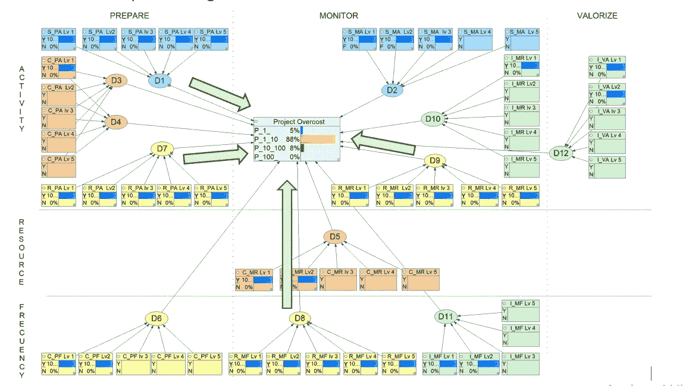

Performance prediction based on recommendations for the given example. (Author’s creations)

下图显示了此场景流程的摘要。第一列显示了模拟之前每个项目的项目超额成本概率的结果，即基线项目管理成熟度评估。第二列提出了主要的建议，这些建议被写成成熟度标准的改进，并且每一个改变都假定了一系列要付诸实践的行动。第三列显示了应用这些建议后的模拟结果。

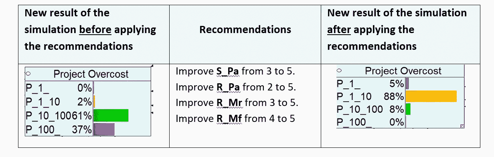

Simulation results for an improvement scenarios (Author’s creations)

由于建议与 IB2M 命名法(S_Pa、R_Pa 等)一致，因此应该将它们转化为最佳实践。当然，这些建议并不详尽，其中一些可能超出了范围。专家根据项目的具体情况对它们进行调整，并采取他/她认为必要的其他行动来支持它们。我们可以对该建议解释如下:

**从 3 级到 5 级的 S _ Pa:**改善社会/计划活动，如资源调度，从在一个项目中使用到在整个组织中使用。

**从 2 级到 5 级的 R _ Pa:**改进项目计划中使用的成本和时间活动(*任务调度、成本/收益分析、成本估算、自上而下估算等)。*)从已定义的级别(知道它们的存在，有时会使用它)到在整个组织中使用的程度。

**R_Mr 从 3 级到 5 级:**改进项目控制中使用的成本和时间监控工具(*控制图如甘特图、S 曲线、因果图*等。)从在单个项目中的使用到在整个组织中的使用。

**从第 4 级到第 5 级的 R _ Mf:**提高整个组织使用监控工具(如上所述)的频率，例如，通过改进基线计划。

如果你想阅读这篇文章的完整研究链接，请点击下一个链接:

 [## 一种基于贝叶斯网络的提高项目管理成熟度的方法

### 提出了一种建立项目管理成熟度和项目超额成本之间因果关系的方法

www.sciencedirect.com](https://www.sciencedirect.com/science/article/pii/S0166361519309480?dgcid=author) 

如果访问受限，您也可以尝试[此链接](https://www.researchgate.net/publication/340598019_An_Approach_Based_on_Bayesian_Network_for_Improving_Project_Management_Maturity_An_Application_to_Reduce_Cost_Overrun_Risks_in_Engineering_Projects):

# 感谢阅读！！！

> 如果你想继续阅读这样的故事，你可以[在这里订阅！](https://fesan818181.medium.com/membership)