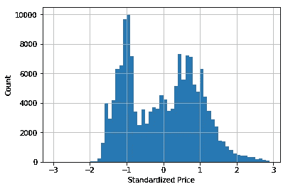

# 如何利用地理信息设计要素

> 原文：<https://towardsdatascience.com/datasciencegeography-29a12667c22c?source=collection_archive---------31----------------------->

## 理论和真实数据科学示例


Photo by [Марьян Блан | @marjanblan](https://unsplash.com/@marjan_blan?utm_source=medium&utm_medium=referral) on [Unsplash](https://unsplash.com?utm_source=medium&utm_medium=referral)

每一个销售商品或服务的企业都有一个实际地址。毫无疑问，地理位置可以决定一家企业的成败。对于数据科学家来说，提取[测地](https://en.wikipedia.org/wiki/Geodesy)特征，即与地球几何形状相关的特征，可以提供清晰的见解，并显著提高机器学习模型的性能。

在本文中，我们将使用 [Yelp 数据集](https://www.yelp.com/dataset)，特别是`[business.json](https://www.yelp.com/dataset/documentation/main)`文件来提取依赖于位置的特征。

我们还将从布朗施泰因、塞门迪亚耶夫、穆西奥尔、穆利格(链接到 PDF )的[数学手册和简菲利普马图切克](https://www.amazon.com/Handbook-Mathematics-I-N-Bronshtein/dp/3540721215)[的](http://janmatuschek.de/Contact)[摘要](http://janmatuschek.de/LatitudeLongitudeBoundingCoordinates#RefBronstein)中汲取经验

# 数据概述

Yelp [文档](https://www.yelp.com/dataset/documentation/main)很好地概述了这些特性，下面是一个简短的片段。

```
{
    // string, 22 character unique string business id
    **"business_id": "tnhfDv5Il8EaGSXZGiuQGg",**

    // string, the business's name
    **"name": "Garaje",**

    // string, the full address of the business
    **"address": "475 3rd St",**

    // string, the city
    **"city": "San Francisco",**

    // string, 2 character state code, if applicable
    **"state": "CA",**

    // string, the postal code
    **"postal code": "94107",**

    // float, latitude
    **"latitude": 37.7817529521,**

    // float, longitude
    **"longitude": -122.39612197,**

    // float, star rating, rounded to half-stars
    **"stars": 4.5,**

    // integer, number of reviews
    **"review_count": 1198**
```

某些地区往往高度发达，有很多企业。此外，相似的企业往往聚集在一起。

例如，上面的商店位于旧金山的 SoMA 社区(*有很棒的鳄梨色拉酱*)，周围聚集了许多其他餐馆。

我们将使用纬度和经度来查询其周围企业的数据框架。为此，我们需要一个地理复习员。

# 球面坐标系

地球是一个不完美的球体，半径大约为 6357 公里。[地理坐标系](https://en.wikipedia.org/wiki/Geographic_coordinate_system)是一种允许在球体上定位点的方法，在[土地测量](https://en.wikipedia.org/wiki/Surveying)以及其他专业中经常使用。

我们将纬度定义为从赤道零度到两极 90 度的角度。相反，[经度](https://en.wikipedia.org/wiki/Longitude)从一极到另一极，范围从 0 度到 180 度。下图在一个球体上说明了这两个概念。


Source: [https://en.wikipedia.org/wiki/Geographic_coordinate_system](https://en.wikipedia.org/wiki/Geographic_coordinate_system)

# 查询邻域中的点

现在我们已经定义了坐标系，我们需要一种方法来定义感兴趣点周围的边界框，并抓取它周围的定界区域中的所有点。

## 球面上的两点

作为第一种方法，我们可以计算半径为`R`的球体上两点`P(lat1, long1)`和`Q(lat2, long2)`之间的[顺行距离](https://en.wikipedia.org/wiki/Great-circle_distance):


这种方法非常慢，因为它意味着计算数据集中所有点与所有其他点之间的距离。

## 角半径

一个更好的方法是用[角半径](https://en.wikipedia.org/wiki/Angular_diameter)来描述从给定的角度看一个[球体](https://en.wikipedia.org/wiki/Sphere)或[圆](https://en.wikipedia.org/wiki/Circle)有多大。例如，如果我们想在半径为`R`的球体上覆盖距离`d`，那么角半径`r`为:


## 包围盒

然后，我们定义完全包围由角半径捕获的区域的节点。沿着纬度移动意味着我们可以沿着子午线移动，保持经度不变。因此，边界纬度定义为:


沿着纬度圈移动以找到边界经度的方式与上面的方式不同。在下图中，点`T1`和`T2`分别具有最大和最小经度。它们与兴趣点`M`不在同一纬度圈上，而是更靠近极点。


Source: [Jan Philip Matuschek](http://janmatuschek.de/Contact)

`T1`和`T2`的纬度是:


因此，极限经度计算如下:


其中:


## 数学到 Python

我们可以用 python 代码来解释上面的方法:

在 Garaje 的示例中，我们的代码将返回一个 dataframe，列出 Garaje 半径范围内的所有企业，如下图所示:


Source: [https://www.mapdevelopers.com/draw-circle-tool.php](https://www.mapdevelopers.com/draw-circle-tool.php)

# 特征工程

给定一个像我们这样的数据帧，我们可以编写一个代码来返回一个地理上有界的数据帧的副本(*注意:不是视图*)

我们能从这些信息中提取什么？事实证明，我们可以学到很多东西:

*   附近有多少商家(*密度*
*   价格范围比较
*   星级比较
*   审核计数
*   等等…

进行比较时，缩放特征通常是个好主意。例如，在比较价格时，我们可以通过使用查询数据框架的平均值和标准差来[标准化](https://en.wikipedia.org/wiki/Feature_scaling#Standardization_(Z-score_Normalization)) ( *z 得分标准化*)价格。

## 星级评定

作为第一个特征，我们可以绘制每个条目相对于其最近邻居的标准化星级。这似乎是一种高斯分布，一个街区的大多数企业在评级方面都相当同质。


## 价格幅度

价格比较似乎是[双峰](https://en.wikipedia.org/wiki/Multimodal_distribution)，更详细的分析可能会使查询更严格，只包括相同类型的企业。



## 密度计数

我们将密度定义为有界框内的企业数量。这个特性不需要做任何标准化。

请注意，根据查询半径和该地区的开发量，下图会有很大变化。


# 结论

适当的特征工程可以为您的机器学习模型提供更好地执行所需的优势。通过考虑地理因素，我们可以推导出依赖于位置的特征。

在 Yelp 数据集的情况下，当插入大地测量特征时，每个模型的 AUC 至少提高了 **5%** 。在所有算法中，它们在最重要的前 5 个特性中至少出现过一次！