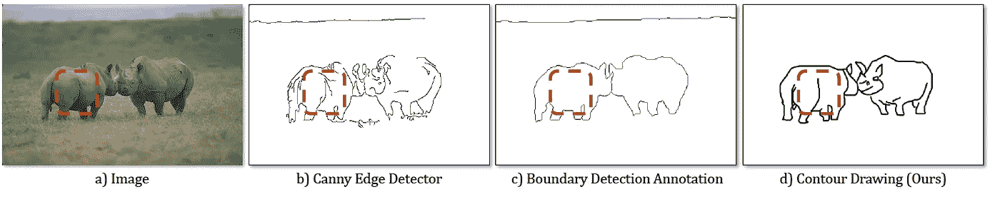
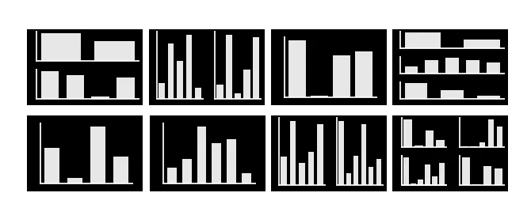
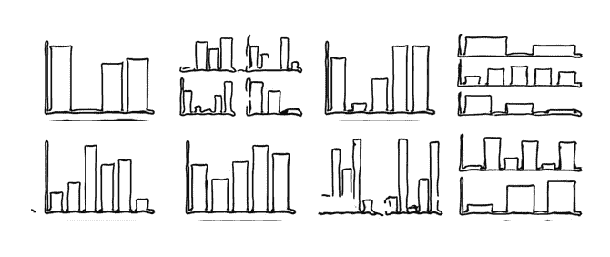

# 数据集生成:用 GANs 绘制照片草图

> 原文：<https://towardsdatascience.com/dataset-generation-photo-sketching-with-gans-b94ce53d59c1?source=collection_archive---------27----------------------->

数据是我们 ML 和 DL 模型的核心。如果我们没有合适的数据集来训练我们的算法，我们就无法构建强大的程序。大多数时候，拥有一个足以训练模型的数据集是一个瓶颈，并且很难处理，特别是当我们需要一个由图像组成的数据集时。为了解决这个问题，我们需要在增强中执行一些变形机制、图像处理技术和其他技术。然而，我们可能仍然会因为某个特定问题而缺少数据集。一种解决方案可能是创建数据集，就像用 GAN 手绘形状一样。今天，我想用 Python 和 GAN 来研究照片素描，它有助于创建这样的新图像。

首先，[这篇论文](https://www.ri.cmu.edu/wp-content/uploads/2019/01/Li-Mengtian-WACV-2019-Photo-Sketching.pdf)最近发表在**卡耐基梅隆大学**上，研究照片素描并获得惊人的结果。类边缘视觉表示就是简单的图像边缘、物体边界和线条画。主要重点是在突出的边界，以操纵图像在这个稀疏的空间，以产生更多。因此，我们可以从给定的输入图像中创建轮廓图(草图)作为输出。轮廓绘制基本由物体边界、突出的内边缘如遮挡轮廓组成；以及显著的背景边缘。

此外，本文还提高了生成轮廓图和指向对象边界的类边界图的性能。如果你在手绘图像数据集上工作，它有很大的潜力，因为我们可以尽可能多地扩展我们的数据集，而且我们仍然可以得到非常逼真的图形。

等高线图可以被描述为现实世界的物体，因此可以被认为是人类视觉的一种表达。与图像边界相比，轮廓图往往具有更多的特征，如眼睛、嘴巴、鼻子等。我在下面的文章中举了一个例子，展示了不同检测机的特性:



轮廓绘画善于采用所需的艺术风格。所以可以看做一个风格转移的应用。此外，文中还提到轮廓图是介于图像边界和抽象精细图之间的一种中间表示。

为了使用这个模型，首先要下载这个[回购](https://github.com/mtli/PhotoSketch)。你可以从[这里](http://www.cs.cmu.edu/~mengtial/proj/sketch/dataset-viewer.html)在线探索更多，它创建随机样本，该项目的网页是[这里](http://www.cs.cmu.edu/~mengtial/proj/sketch/)。您可以检查示例数据集等。

下载回购后，除非想自己训练，否则需要下载预先训练好的模型。由于在我们的问题中，我们有一个稀缺的数据，我们不能训练这个模型。我提到的这个预训练模型是这里的[和来自 Adobe Stock 的 1000 幅户外图像数据集上的 5000 幅高质量图片。](https://drive.google.com/file/d/1TQf-LyS8rRDDapdcTnEgWzYJllPgiXdj/view)

在这一步之后，您需要编辑 PhotoSketch→Scripts→test _ pre trained . sh 并删除这些行:

```
results_dir ${dataDir}/Exp/PhotoSketch/Results/ \
checkpoints_dir ${dataDir}/Exp/PhotoSketch/Checkpoints/ \
```

创建一个文件，并将你的预训练文件添加到 PhotoSketch→check points→pre trained。您需要将源图像数据添加到 PhotoSketch→示例中，生成的图像将位于 PhotoSketch→results 中的同一目录下。我将使用这样的数据集，因为我需要创建更多的手绘绘图:



要从 shell 运行，请分别执行以下命令:

> cd 目录/to/PhotoSketch
> 
> 。/scripts/test_pretrained.sh

你可以在你的终端上看到这个过程。我将这个模型应用到我的 matplot 条形图数据中。我需要有很多手绘的情节，这是产生一些好方法。



Results

从结果中，我们可以看到预训练的模型从输入源生成了很好的绘图。你可以用它们来进一步训练你自己的模型，比如物体检测，图像分类等等。