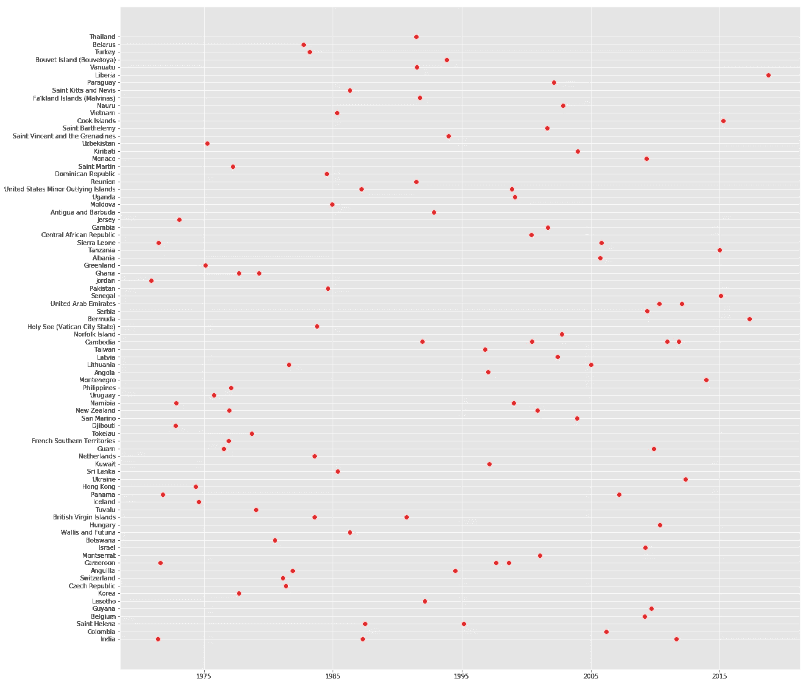

# 数据集不可用？没问题！

> 原文：<https://towardsdatascience.com/dataset-unavailable-no-problem-b5031311d59d?source=collection_archive---------31----------------------->


source: [https://pixabay.com/photos/code-code-editor-coding-computer-1839406/](https://pixabay.com/photos/code-code-editor-coding-computer-1839406/)

互联网上有大量可用的数据集，但我还是要提到一些令人惊叹的资源。如果你已经在 LinkedIn 上与我联系，那么你可能已经看到这个列表，如果你没有联系，请点击这个 [**链接**](https://www.linkedin.com/in/kunaldhariwal/) **。**以下网站可能有助于您获得所需的数据集:

**流行的开放式数据仓库:**

1.  加州大学欧文分校机器学习资源库:[https://lnkd.in/f5CUDj7](https://lnkd.in/f5CUDj7)
2.  Kaggle 数据集:[https://lnkd.in/fKWqVbw](https://lnkd.in/fKWqVbw)
3.  亚马逊的 AWS 数据集:[https://lnkd.in/fnVYnm5](https://lnkd.in/fnVYnm5)

**元门户(他们列出了开放的数据仓库):**

1.  [http://dataportals.org/](http://dataportals.org/)
2.  [http://opendatamonitor.eu/](http://opendatamonitor.eu/)
3.  [http://quandl.com/](http://quandl.com/)

**其他页面列出了许多流行的开放数据仓库:**

1.  维基百科的机器学习数据集列表:[https://lnkd.in/f6wujcB](https://lnkd.in/f6wujcB)
2.  [Quora.com](http://quora.com/)提问:[https://lnkd.in/fuHPfFF](https://lnkd.in/fuHPfFF)
3.  数据集子编辑:[https://lnkd.in/fmqkisy](https://lnkd.in/fmqkisy)

## 如果你甚至在这些网站上都找不到数据集呢？你会怎么做？

你会责怪互联网没有给你你需要的数据集，或者你会诅咒整个宇宙吗？

嗯，我不会做上面提到的两件事。我会创建我自己的数据集，相信我，不会超过 5 分钟。

现在，让我向您展示如何快速创建自己的数据集。我们将使用名为 **Faker 的 python 包。**

1.  安装 Faker 库。

```
pip install faker
```

2.导入库。

```
from faker import Faker
```

3.将 Faker 函数赋给一个变量，并设置一些随机种子。

```
fake = Faker()
fake.seed(4321)
```

我们将创建一个酒店数据集。为了保持本教程的简短和精确，我们将总共创建 8 列，您可以创建任意多的列。

4.给每个变量分配一个空数组，这样我们可以向其中插入一些数据。

```
ID=[]
name=[]
phone=[]
age=[]
gender=[]
address=[]
checkin=[]
checkout=[]
```

5.让我们插入 100 个电话、地址、入住、结账和姓名条目。

```
for _ in range(100):
 phone.append(fake.phone_number())
 address.append(fake.country())
 checkin.append(fake.date_time_ad())
 checkout.append(fake.date_time_ad())
 name.append(fake.name())
```

6.我们必须分别插入 ID、年龄和性别的值。ID 将包含范围从 1 到 100 的数据。在年龄变量中，我们将最小年龄设置为 8 岁，最大年龄设置为 80 岁，并且我们将大小指定为 100。性别部分相当复杂，因为你不能随机分配男性和女性。此外，一些 ML 算法只接受数字。我们将为男性和女性分配 0 和 1，比例分别为 60:40。

```
ID=pd.Series(range(1,101))
age=np.random.randint(8, high=80, size=100)
gender=np.random.choice([0, 1], size=100, p=[.6, .4])
```

7.现在，我们已经成功地将数据插入到那些空数组中。让我们将数据分配给 dataframe 列。

```
data= pd.DataFrame({‘Timestamp’:timestamp,’ID’:ID,’name’:name,’Phone number’:phone,’age’:age, ‘gender’:gender, ‘address’:address,’checkin’:checkin,’checkout’:checkout})
```

## 就是这样！我们已经成功创建了自己的自定义数据集。


First 10 rows of our custom dataset

您可能需要在这里执行**探索性数据分析**，因为数据集不够干净，您必须找到变量关系、异常值等等。但在那里你可以学到数据科学最重要的部分，即 EDA。

**让我们做一些基本的 EDA。**

8.分别用男性和女性替换 0 和 1。

```
data.gender.replace(1,’female’,inplace=True)
data.gender.replace(0,’male’,inplace=True)
```

9.将签入和签出转换为日期时间格式。

```
data[‘checkin’]=pd.to_datetime(data.checkin, errors=’coerce’)
data[‘checkout’]=pd.to_datetime(data.checkout, errors=’coerce’)
```

10.现在让我们将退房日期设置为入住+ 3 天

```
import datetime
enddate = pd.to_datetime(data.checkin) + pd.DateOffset(days=3)
data[‘checkout’]=enddate
```

11.让我们策划一些事情。

```
plt.figure(figsize=(20,20))
plt.scatter(list(data.checkin.values),list(data.address.values),color=’r’)
```



Scatter plot

我们可以在这里执行大量的 EDA，但是为了保持文章简短和精确，我把接下来的步骤留给你。祝 EDA 和本教程愉快。

以下是完整代码的链接:【https://github.com/kunaldhariwal/Building-a-custom-dataset

**我希望这已经帮助你增强了你的知识基础:)**

**关注我了解更多！**

感谢您的阅读和宝贵时间！