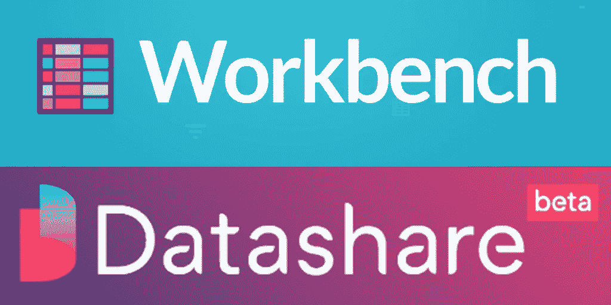
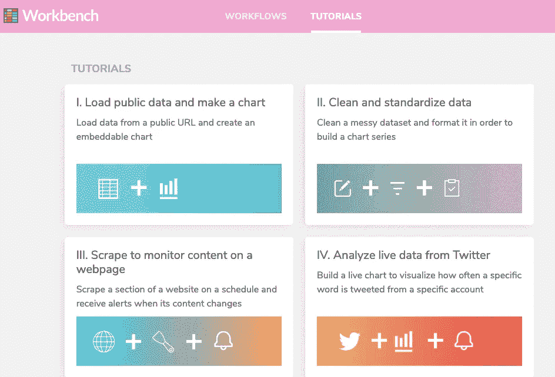
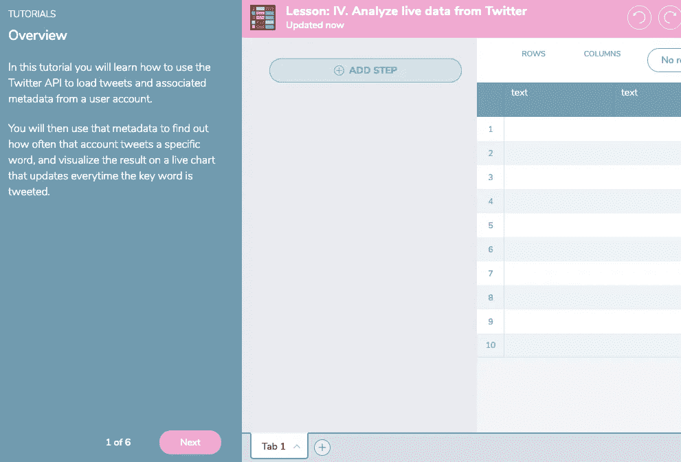
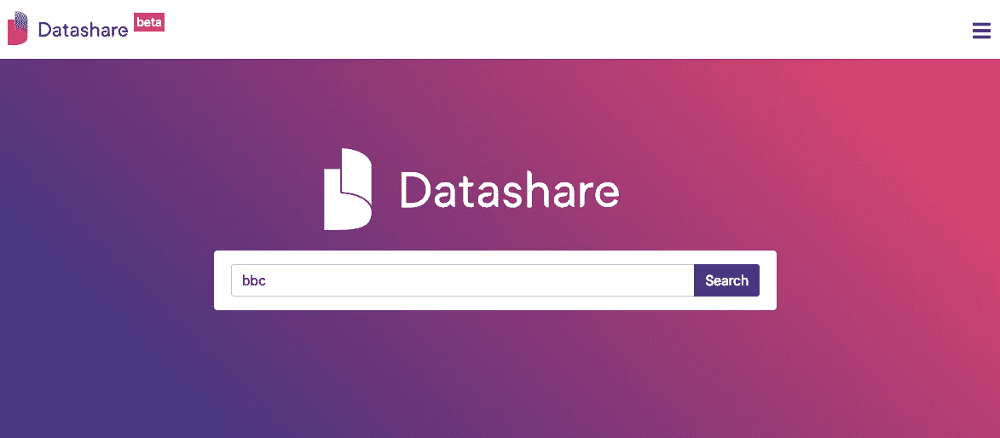
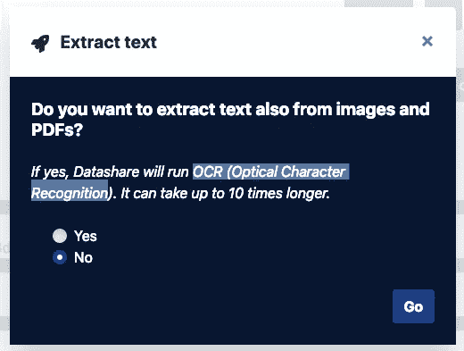
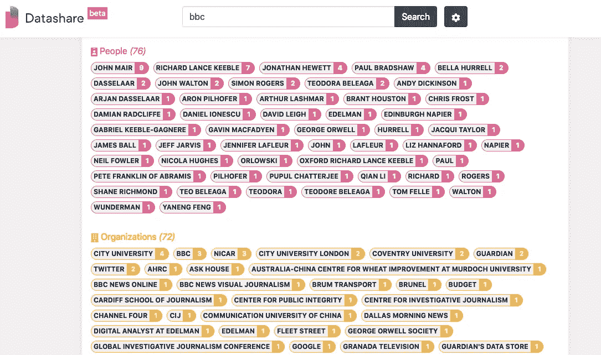

# 数据共享和工作台:试验数据新闻应用

> 原文：<https://towardsdatascience.com/datashare-and-workbench-experimenting-data-journalism-apps-af79bb031687?source=collection_archive---------18----------------------->

## 本周，我有一点时间来玩两个新的(对我来说)数据新闻工具，它们已经在我的雷达上了。

第一个是名为 [Workbench](http://workbenchdata.com/) 的现成数据新闻应用。这个项目是计算记者 Jonathan Stray 的创意，得到了哥伦比亚新闻学院的支持。那么它是做什么的呢？嗯，[据开发者称，这是一个内置培训的数据新闻平台](https://medium.com/@Workbench/data-journalism-made-easier-faster-and-more-collaborative-e33081bf0080):

> “Workbench 是一个集成的数据新闻平台，无需任何编码即可轻松完成数据搜集、清理、分析和可视化任务。您可以从已经使用的来源加载实时数据，包括开放的政府门户、社交媒体、SQL 数据库和 Google Drive。完成的工作流可以与故事一起共享，以向观众展示图表背后的故事。”

该应用程序可在 https://app.workbenchdata.com[在线下载。一旦你注册(你可以使用谷歌或脸书以及电子邮件)并登录，你就可以直接进入教程了。](https://app.workbenchdata.com/)

教程遵循一种*读>做>下一步*的格式，鼓励你完成各个步骤，建立一个收集、清理、过滤和可视化数据的“工作流程”。这是令人印象深刻的东西，教程涵盖了很多领域非常快。它还有助于建立工作流的概念，这是 Workbench 的核心。

有一些预定义的“配方”,你可以复制并建立你的工作流程，如果你不怕做一点点击(并使用几次撤销功能！)来学习应用程序喜欢的工作方式，然后你可以从教程中学习你需要的东西。一旦你创建了一个工作流，平台的开源方法意味着原则上应该很容易共享它。现在，观众可以看到你的工作，同事可以从你的过程中学习。

我对这里的游戏有点晚了，因为 [Workbench 已经开发了一段时间](http://jonathanstray.com/introducing-the-cj-workbench)。但是感觉很成熟稳重。当我玩 Workbench 的时候，当我现在写这篇文章的时候，我有一种似曾相识的感觉。Workbench 是“有点像 google sheets”和“有点像 google fusion”。它有 IFTTT 的迹象，其中一些是“一个小而笨重的笔记本”。但这并不是一件坏事，恰恰相反。这意味着它正在成为数据驱动报告的一站式商店。我可以很容易地看到我推荐这是一个很好的工具，为学生和记者们提供一些自我导向的学习。

我本周试用的第二个应用是由国际调查记者联盟[开发的](https://andydickinson.net/2019/02/14/datashare_and_workbench/(http://www.icij.org/) [Datashare](https://datashare.icij.org/) 。来自 ICIJ [的 Will Fitzgibbon 很好地概括了创建 Datashare](https://www.icij.org/blog/2019/02/datashare-help-test-and-improve-our-latest-journalism-tool/) 的动机:

> Datashare 是一个允许你有效地搜索和组织你的文档的应用程序
> 
> Datashare 建立在帮助 ICIJ 制作其最大项目的一些相同技术之上，如 [**巴拿马论文**](https://www.icij.org/investigations/panama-papers/) 和 [**天堂论文**](https://www.icij.org/investigations/paradise-papers/)——但 Datashare 可以安装在你自己的电脑上，而不是依赖 ICIJ 的服务器。

Julien Martin 提供了更多关于 Datashare 如何做到这一点的背景(和一个很好的案例研究)

> Datashare 集成了 ICIJ 久经考验的提取技术，该技术从文件中提取机器可读的文本(使用 [**Apache Tika**](https://tika.apache.org/) )，对图像应用光学字符识别([**tesserac OCR**](https://github.com/tesseract-ocr/))，然后将信息添加到搜索引擎([**elastic search**](https://www.elastic.co/))。)

换句话说，您得到了一个“开箱即用”的 ICIJ 工具包，用于处理和管理大量文档。

与 Workbench 不同，Datashare 是一个驻留在您的计算机上而不是 web 上的应用程序。有道理；为什么潜在的敏感文件会在网上流传？事实上，该平台的未来计划包括记者安全合作的方式。这在技术上是很严肃的事情，这里的工作流程很大程度上是调查性新闻的多机构深潜模式。但是不要被推迟。安装程序很棒，支持文档也很棒。

安装完成后——这可能需要一段时间——您需要将所有调查文档移动到一个文件夹中。然后你从菜单中选择**分析我的文档**就可以了。

你能做的第一件事是**提取文本**。如果您有一堆 PDF 文件要处理，并且可以选择使用 OCR(光学字符识别，虽然更耗时，但也意味着您可以从扫描的文档图像中获取文本),这将非常有用。即使在我的旧 mac book air 上，小小的进度条也飞快地滑过。

您还可以**在文档中查找人员、组织和地点**。这使用自然语言处理(NLP)，一种机器学习技术，可以从“自然语言”中分析和提取信息。这里真正发生的是一种叫做“实体提取”的东西，它提取大块的内容，并试图对它们进行分类。

这对于文档级别的工作非常有用，但是如果能够跨文档连接名称、地点和组织就更好了。谁出现在哪里，在什么样的背景下，有助于建立一个联系的画面。

很明显，Datashare 的目标是那些有更多内容需要研究的人。对于不经意的实验者来说，这是一个有趣的窗口，可以看到像 ICIJ 这样的组织的交易工具。我希望工具包中未来的工具将包括可视化这些联系的方法。但最终，Datashare 的核心功能是将文档转化为结构化数据。

如果我对应用程序的开发有更直接的建议，那就是在菜单上添加一个“我的文档”按钮。很难找到你添加的文档。我知道这将是铁杆用户不需要的东西——它是关于文档中的内容而不是文档本身。我也知道，对于像我这样直到被卡住才使用 RTFM 的人来说，这是一种安慰。但它将有助于浏览器的易用性，实际上不会超过一个链接，比如说“我的文档库”或“文件”。

## 结论

如果你对计算、数据新闻或调查性新闻有短暂的兴趣，我真的会向你推荐一部两者兼具的剧。我想很多人可能会对您使用 Workbench 所能做的事情感到惊喜。这绝对不仅仅是一个边做边学的平台。这里有一些可用的工具和足够的可扩展性来分散“但我可以在 python 中这样做”的批评者的注意力。不要让 DataShare 稍微简单一点的技术性让你分心。正如我所说的, [Datashare 用户指南](https://icij.gitbook.io/datashare)非常出色。

这两款应用在技术和复杂性方面为数据新闻实践的发展提供了一个有趣的高峰——仅此一点就是玩的好理由。他们或许也代表了对这一点的某种认可，以及我们对新闻业能否跟上时代步伐的担忧。但这是另一篇博文要思考的问题。现在，给他们一个机会，给他们你的反馈。