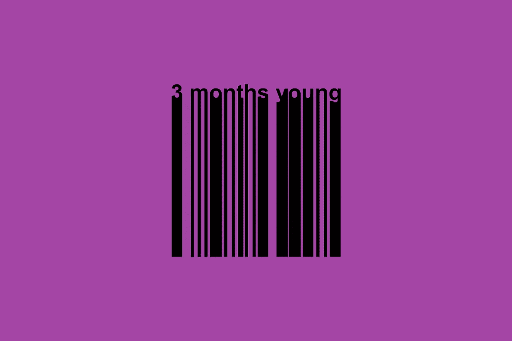

# 数据故事如何通过设计帮助您解决分析挑战并推动影响

> 原文：<https://towardsdatascience.com/datastories-c6fb7106126e?source=collection_archive---------17----------------------->

## 结合设计和数据驱动的问题解决方法，在分析学和民族志的交叉点上展现故事。他们是你的向导，确保你在正确的问题上工作，你的解决方案实际上导致了期望的结果。

当我们最近举行一场旨在帮助一家非政府组织打击人口贩运的 24 小时黑客马拉松时，参赛团队的构成有着天壤之别:有许多团队具有分析咨询方面的丰富背景。然后是我的团队:一名数据工程师和三名设计师。该活动的目标是从客户提供的数据中获得见解。游戏开始了。客户简报是最重要的。每个队都有自己的锤子。

可能很难看出这样一个重设计的团队与看似明显的数据分析挑战有什么关系，但我们没有绝望。相反，这一挑战让我们能够展示一些有价值的经验，说明结合数据驱动和设计驱动的方法如何能够产生以前被忽视的独特见解。到达那里的关键是在分析学和人种学的交汇处寻找浮出水面的故事。

# 忽略锤子——从问题开始，而不是数据

设计思维成功的一个原因是它是解决方案不可知的，这让问题解决者比使用其他方法(如假设驱动的问题解决方法)探索更广阔的解决方案空间。在以数据为中心的环境中工作时仍然如此。当我们被要求在数据中寻找一个问题的答案时，我们有义务首先确保这个问题是正确的。这通常被认为是对任何项目资源的额外消耗，尤其是当团队已经处于交付模式时，设计才被引入到项目中。然而，当早期引入时，设计有助于与业务一起驱动问题定义过程。潜在地，而团队中的其他人则忙于后勤工作——尤其是臭名昭著的“获取数据”步骤。通过这种方式，一旦一个团队致力于解决一个问题，就可以确定解决这个问题将会给业务和用户带来影响。

在我们的项目室中，我们确保数据在我们需要时可用，但随后就不管它了。我们大多数人甚至没有在最长的时间里看一眼数据字典，以便不使我们的思维产生偏见，从而导致潜意识中消除潜在的丰富研究领域。相反，我们从两个熟悉的问题开始:真正的潜在问题是什么？我们到底在解决谁的问题？试图回答这些问题成为实际的初步目标，这使我们沿着著名的双钻石的第一个斜坡踏上了探索之旅。

# 使用数据作为约束

有许多工具可以用来定义问题空间和目标人物角色:利益相关者映射、服务蓝图、我们可能做的事情、五个为什么、通过视频会议的专家访谈，以及许多许多的便利贴(仔细想想，你真的可以在一个晚上安排很多发现——我们的开球时间是下午 4 点)。分析项目与不同类型的转型项目的不同之处在于，对特定数据和信息及其流动的关注提供了额外的限制；创造力喜欢约束。

想想这种认识如何影响任何设计活动。服务蓝图增加了一个数据层，关于该主题的访谈问题被添加到脚本中，重点领域和想法不仅根据业务、技术和人力约束进行优先排序，还根据与数据相关的约束进行优先排序。在这一阶段，数据成为推动研究和想法向前发展的推动者，并增加了关注可以实现什么和缺少什么的额外镜头。

# 在数据中寻找人类的故事

大约在上个世纪中叶，[美国空军正与一系列无法解释的坠毁飞行员作斗争。飞行员无法保持对他们新设计的飞机的控制。他们后来发现，这个问题的原因是，在设计驾驶舱时，他们使用了人体各种尺寸的平均值，这使得驾驶舱对许多人来说非常不符合人体工程学。一旦发现这一点，他们改变驾驶舱，以适应个别飞行员和坠毁停止。](https://www.thestar.com/news/insight/2016/01/16/when-us-air-force-discovered-the-flaw-of-averages.html)

当面对关于人类的数据时，非人化的风险是非常真实的。这里是散点图，那里是钟形曲线，在你知道之前，你已经做出了对任何人都不适用的概括陈述。取而代之的是，思考通过把数据点看作人类可以学到什么，并尝试想象它们在现实世界中可能意味着什么。通常，你会发现一些人类故事的元素，这些元素可以作为研究的输入并被进一步研究。浏览关键参数列表，问问自己，如果<metric>是<x>，这对一个人来说意味着什么。此外，如果您对一系列指标进行这样的操作，这会告诉您关于个人的什么故事呢？你可能会开始看到，这是数据注入人物角色的基础，可以通过进一步的研究来建立。</x></metric>

在我们打击人口贩运的黑客马拉松中，幸存者的年龄分布给了我们这样一个故事中最引人注目和悲惨的例子。当观察年龄和缓解干预的有效性之间的相关性时，我们可以看到最年轻的受害者只有几个月大。这不仅是一个可怕的见解，而且它也为我们的研究提供了信息，因为我们现在知道要与我们的客户进行一系列非常不同的对话，其中包括最年轻的受害者的特殊需求。

# 听听关于数据的故事

当你围绕数据和人们与数据的互动、他们的数据需求等进行一些研究时，要特别注意哪里*遗漏了*。虽然这可能与手头的分析项目没有太大的相关性，但在定义未来的数据战略时，这是非常宝贵的。

通过揭示一个组织目前在数据方面正在进行或考虑的其他事情，您可以构建一个各种计划交叉点的路线图，利用连接而不是完全孤立地构建另一个东西。

在研究过程中，这两点都有助于在服务蓝图或流程图中捕捉，并在设计多接触点干预时占据中心位置。

在黑客马拉松的第一个晚上，客户已经对我们提出的一系列问题留下了深刻的印象，说我们这半天的工作已经产生了令人兴奋的和非常不同的见解，这些见解是由纯粹的分析团队在两个月的工作后发现的。他们也很高兴能够着手其中的一些工作，最终形成了一份路线图提案。我们进一步了解了正在进行的旨在收集全新数据的工作，并准备制定一项战略，在这些新数据流准备就绪后充分利用(但不依赖)它们。

在黑客马拉松期间，有人可能会担心，在我们的团队真正开始“真正的工作”之前，所有这些设计活动都浪费了很多时间。然而，当我们已经产生了一系列人种学的、数据引导的见解，并针对特定的高价值业务问题设定了目标时，其他团队已经深陷在数据中，仍然在广泛地探索可用的东西，一些团队仍然在努力在他们的笔记本电脑上设置他们的环境。有了一个能让我们阐明这些见解的概念，我们感觉很好，可以回家睡一觉，然后第二天早上重新开始。

# 通过洞察力推动行动

如果最先进的分析结果没有被采用并推动产生结果的行动，那么它们就毫无价值。事实上，随着围绕分析和人工智能的技术得到更广泛的理解，并走向商业主流，模型采用和其他人为因素成为主要障碍和机会。因此，了解用户的背景和需求(如果你愿意，也可以说是他们自己的故事)并在叙述中提供分析见解，从而使他们能够采取行动，这一点至关重要。以结果为中心的分析团队的工作在交付模型时不能被认为已经完成。

通过应用设计思维和以人为中心的人工智能方法，团队可以发明令人信服的解决方案，帮助用户理解分析见解的真正含义，并在正确的上下文中为他们提供正确的信息。值得注意的是，这可能不需要最先进的技术。

对于我们的项目，我们创建了一个概念，说明了整个用户旅程的未来状态，在此期间，社会工作者开始与一系列干预措施进行互动，以帮助他们做好工作——其中一些是低技术和基于纸张的。至关重要的是，这不是一个天马行空的艺术概念，而是一个非常基于现实并在今天可以执行的概念，同时强调了未来的潜力。

A regular war room? Not so much, once you notice the smileys used in our prioritisation matrix.

# 包扎

当然，在一场黑客马拉松的结尾，来自不同背景的许多有才华的人讨论了一个非常真实和令人感动的话题，每个人都是赢家。我们离开时不仅对我们所有新产生的见解的潜在影响感到高兴，而且还兴奋地将一个图画书案例研究放入口袋，该案例研究介绍了不同解决问题方法的组合如何能够在不消耗资源的情况下提高团队的效率。

顺便说一下，今天生活在奴隶制下的人比以往任何时候都多。如果你想帮助打击侵犯人权的行为，向国际特赦组织捐款。

*这篇文章的节略版已经发表在* [*QuantumBlack 博客*](https://medium.com/@QuantumBlack/weaving-data-stories-and-driving-impact-a-design-led-approach-4ec72e43e70a) *上。*

*原载于*[*www.thomasessl.com*](https://www.thomasessl.com/blog/datastories)*。本文表达的观点纯属个人观点，不一定代表我的雇主的观点。*