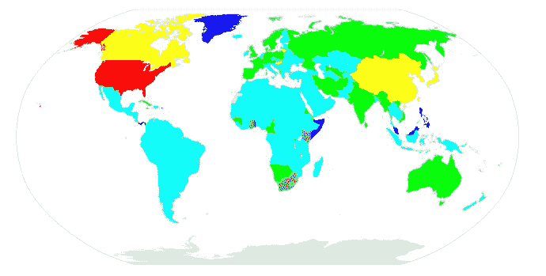
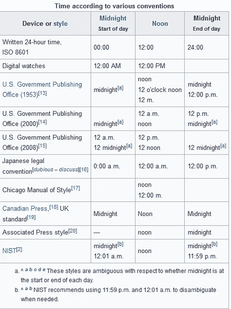
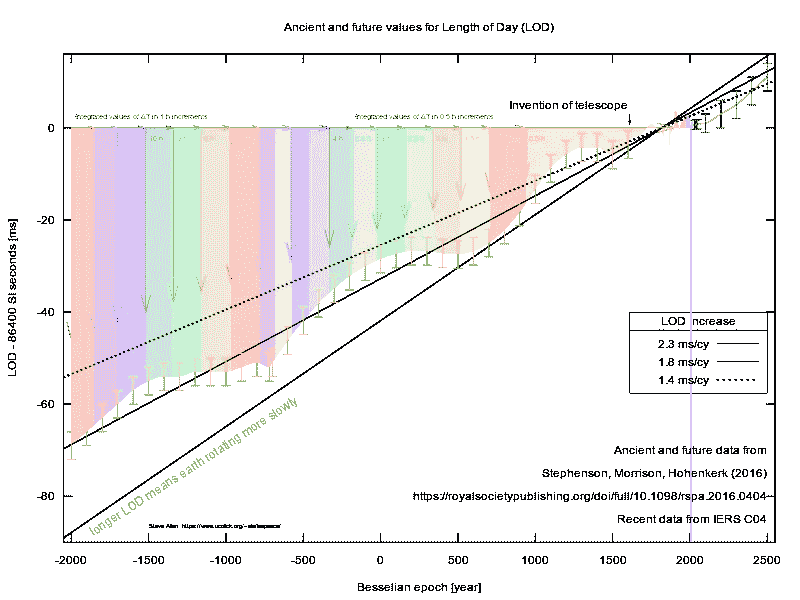
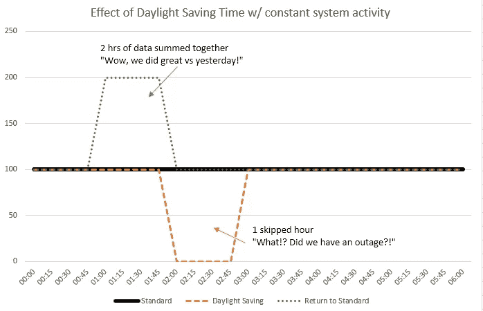
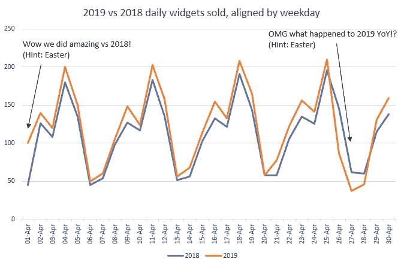

# 日期、时间、日历——数据科学创伤的普遍来源

> 原文：<https://towardsdatascience.com/dates-times-calendars-the-universal-source-of-data-science-trauma-92a887fdedd1?source=collection_archive---------24----------------------->

## 一份列出了大多数主要疯子的名单，以及一些生存建议


Just some clock in the city. (Photo: Randy Au)

很少有所有数据人共享的共性。我们称之为“数据科学”的领域非常广泛，从人工智能和机器学习的理论工作，一直到个人数据分析师被迫在 Excel 中进行前/后分析以“发现变化的影响”。

但是总有一个话题能让我和一个数据人员建立联系:日期、时间和日历。开始讲一个你在工作中发现的疯狂的故事，你会立刻产生共鸣和友情。每个人以前都被烧伤过。很糟糕。

所以让我们来谈谈好的，坏的，完全疯狂的，以及一些应对的方法。

# 部分列表

*   [ISO 8601 是希望，ISO 8601 是爱](#476f)
*   [爱你的图书馆](#638e)

> [—来自工程/数据同行的痛苦—](#c41c)

*   [日/月/YY 对日/月/YY 对年/月/日等等。](#e8bd)
*   [12 小时和 24 小时时钟](#e714)
*   [Unix/POSIX 时间](#58d3)
*   [处理毫秒/微秒](#49d5)
*   [其他怪异的时代](#b39e)
*   [解析/输出日期/时间](#2d87)
*   [时钟同步](#4d72)

> [—来自自然的痛苦—](#f7c0)

*   [闰年](#1102)
*   [闰秒](#906a)

> [—来自社会的痛苦—](#b27d)

*   [非公历](#15fd)
*   [农历……任何事情](#7dfb)
*   [时区](#5e39)
*   [夏令时](#b461)
*   [节假日](#fd80)

# ISO 8601 是希望，ISO 8601 是爱

```
YYYY-MM-DDThh:mm:ss.sTZ (and many variations thereof)
```

ISO 8601 很神奇，每个人在交流日期和时间时都应该默认使用它。句号。

如果每一个数据导出、数据输入 UI、手写表单、过去和现在都符合这一标准，我们就不会陷入今天这个畸形的地狱般的境地。这太重要了，这是我唯一记得的 ISO 标准编号。还有一个专门的子编辑，[荣耀归于 ISO8601](https://www.reddit.com/r/ISO8601/) 。

[ISO 8601](https://en.wikipedia.org/wiki/ISO_8601) 有很多部分，但人们通常认为它是 *YYYY-MM-DD* 日期和 *hh:mm:ss.s* 时间格式，以及连接两者以创建日期时间、表示时区、小数秒等的无数变体..标准中甚至有更多关于时间间隔和周数的内容，但是这些内容并没有被经常使用。

需要说明的是，关于 ISO 8601 最重要的部分是术语的顺序，它明确且易于记忆和解析。正是这种易于理解的特点使它成为交流日期和时间的首选方法。它还可以很好地进行字符串排序。

当你输出日期时，帮大家一个忙，输出一个 ISO 8601 标准输出，**不要发明你自己的格式顺序**。总有一天，当您必须解析匿名用户的日期输出时，您会感谢他们。

# 热爱你的图书馆

谈到日期、时间和日历，**你绝对不想重新发明轮子**。有很多边缘情况并不明显。除非你已经穷尽了重用别人代码的所有可能性，否则不要去做。

有很多可供你选择语言的库。我说的不仅仅是标准的日期/时间库，这些库可能内置在您的核心语言中，帮助您进行基本的日期计算并输出到特定的格式。通常有一些工具可以帮助你在不发疯的情况下阅读和破译格式。

例如，Python 有 [dateparser](https://pypi.org/project/dateparser/) ，这是一个很棒的小库，它试图为您解析最常见的日期格式，并将它们转换成 *datetime* 对象。它还有许多其他有趣的功能，比如时区处理、相对时间(“1 分钟前”等)和一些备用日历。很酷的东西。

也许你选择的语言有这样一个库。一定要看。

随着理智的高点(仅有的一点点)消失，让我们慢慢陷入疯狂。

# —来自工程/数据同行的痛苦—

这部分是我们最能控制的。这是我们或我们的同事建立的东西。这是我们自己造成的痛苦。在很大程度上，当我们了解问题并避免不良做法时，我们可以将损害最小化。我们可以更少地伤害他人，希望它会回来。

# 日/月/YY 对日/月/YY 对年/月/日等等。



Cyan: DMY, Yellow: YMD, Magenta: MDY, Green: DMY/YMD, Blue:DMY/MDY, Red:MDY/YMD, Grey: MDY/YMD/DMY ( [https://en.wikipedia.org/wiki/Date_format_by_country](https://en.wikipedia.org/wiki/Date_format_by_country))

看看这张按国家划分的日期格式图。任何必须与多个国家合作的人，尤其是在美国(MDY)和欧洲(DMY)之间工作的人，都面临着可怕的“8/5/14 是什么意思？”。

您可能认为这种格式与我们电子数据人无关，但这并不是因为您可能要处理**本地化的日期时间标记**。也许你正在使用网络抓取工具。我从根据我的语言环境“有益地”导出数据的东西那里得到了数据导出，而不是一些理智的东西。我不知道他们为什么这样做，这没有帮助。

从各种传统系统输入的数据和手写笔记可以使用传统的本地格式。真正疯狂的系统(就像收购后拼凑在一起的两个不相交的系统)甚至可能给你不同国家的本地化时间戳，所以你会想知道日期来自哪个国家。

**尤羞调出电子表格。**为什么电子表格都试图使用 DD/MM/YYYY 类型的格式？！Excel，Google Sheets，Libreoffice，唉！最重要的是，他们有胆量在大量数据导入时不一致地这样做！

**处理这个问题的技巧:**除了找出数据的正确解析方案之外，别无选择，有时通过痛苦的分析和反复试验，有时通过询问某人或阅读文档。理想的情况是说服数据源输出更干净的东西。尽你所能去做。

# 12 小时与 24 小时时钟

24 小时时钟格式最常见于日志记录等，但 12 小时格式在人机界面中仍然很常见。当您必须解析/打印供人们使用的数据时，您必须处理这个问题。

不得不解析 AM/P.M .的各种写法实在是太难看了。不要忘记它也因地区而异。不同的国家会用不同的方式来表示上午和下午。请参考您的区域设置以了解预期情况。

说到这里，你知道正午和午夜的命名会因你遵循的习俗而不同吗？因为它当然会。



[https://en.wikipedia.org/wiki/12-hour_clock#Confusion_at_noon_and_midnight](https://en.wikipedia.org/wiki/12-hour_clock#Confusion_at_noon_and_midnight)

生成输出时，坚持使用 24 小时时钟。大多数人都能理解 24 小时时钟，所以数据输出没什么大不了的。为实际的时钟 ui 保存 AM/PM。

# Unix/POSIX 时代——还不算太糟，但仍然有缺陷

[Unix 时间](https://en.wikipedia.org/wiki/Unix_time)定义为从*1970–01–01t 00:00:00Z 开始的秒数。*每天正好有 86400 秒，**忽略闰秒**。这是一个平稳增长的计数器，是一个很好的属性。这意味着使用 unix 时间的软件不太可能会感到惊讶，也不太可能会有与日历相关的奇怪错误。(我们稍后将回到闰秒，因为那是一个完全独立的主题)。

Unix 时间忽略闰秒的问题在于它是如何实现忽略的…通过**重用**相同的时间戳 23:59:60(闰秒)作为 00:00:00，因为它认为它们相等。这意味着时差计算将会偏离闰秒数，除非你考虑到它们(如果你在乎的话)。当然，这还会让人觉得一秒钟内发生了 2 秒钟的活动，这也是不可逆的数据丢失，因为您无法仅从时间戳区分这 2 秒钟内的事件。对于人类规模的使用来说，这并不太疯狂，但这几秒钟对于分析来说很重要。对于更敏感的应用程序，有一些方法可以让[抹去一天中的闰秒](https://developers.google.com/time/smear)。

Unix 时间通常存储为 32 位整数，尤其是在较旧的系统上。这当然意味着当整数溢出时，还有 2038 年的[问题](https://en.wikipedia.org/wiki/Year_2038_problem)在等待。希望到那时，大多数系统都将转换到 64 位整数，这可以覆盖比当前宇宙年龄更多的秒。

尽管对闰秒的处理不可靠，**如果由于各种原因，ISO 8601 由于某种原因不切实际，Unix time 是一个很好的替代选择，**尤其是在闰秒模糊的情况下。与紧凑 ISO 8601 的 18+字符串相比，它是一个相对紧凑的 32 或 64 位整数(或 10 个字符串),通常表现良好。

主要的缺点是它不是人类可读的，但是大多数编程语言都很容易处理它。不断地调用 *unixtime_to_timestamp()* 类型转换函数是一件令人烦恼的事情，但是我很乐意接受它，而不是其他选择。

如果你关心时钟、秒和时间，POSIX 选择(不)处理闰秒的方式显然有点疯狂。这是对历史的一次惊人解读，它是如何变成那样的。

# 处理毫秒和微秒

大多数时间规范对小数秒的规定相当简单:添加一个小数点，然后是小数的数字:*例如 hh:mm:ss.sss* 。

需要知道的是，因为[计算机上的浮点数学可能有准确性问题](https://en.wikipedia.org/wiki/Floating-point_arithmetic#Accuracy_problems)，分数通常在内部用整数或类似结构表示，小数点是为了*显示*的目的。

这方面的一个例子是 [NTP 协议](https://www.eecis.udel.edu/~mills/time.html#format)实际上使用一个定点 64 位 int 来表示时间。它使用最高有效的 32 位来表示自纪元以来的秒，剩余的 32 位来表示小数秒。

> “这种表示的精度大约是 200
> 皮秒，这应该足以满足最奇特的
> 需求。”— [RFC-1305](https://tools.ietf.org/html/rfc1305) ，NTP v3 规范

因为大多数系统不需要 200 皮秒的时间表示，所以大多数系统不遵循这样的设置。相反，您会更常见地看到将 Unix 时间扩展为带点的整数分数秒参数的变体， *s.ssss* 。另一种常见的格式是将时间存储为一个大整数，称为“自(Unix)纪元以来的毫秒/微秒”。这是可行的，因为毫秒和微秒分别是 10⁻和 10 ⁻⁶，所以用`milliseconds_since_epoch/1000 = unixtime.milliseconds`除以/乘以正确的因子来来回转换是微不足道的

# 其他奇怪的时代

Epoch 是任意的构造，所以除了 POSIX Epoch 之外，当您在环境之间移动时，还会遇到许多其他的 Epoch。

最著名的可能是 Excel，它开始于 1900 年 1 月 0 日(是的，1 月 0 日…)，并计算自纪元开始以来的天数。但是其他有趣的包括从 1980 年 1 月 6 日开始的 GPS 时间，以及从 1900 年 1 月 1 日开始的 NTP 纪元。Twitter 开始了他们的 twepoch 他们的第一条 tweet。

99.99999%的时间里，您可以生活和做日期计算，而不必过多考虑纪元，这要感谢良好的库和接口(以及有多少事情默认为 unix 时间)。

但是偶尔你会遇到突然变得重要的情况。我最近不得不与 Excel 的时间格式作斗争，因为将 1 小时添加到时间戳涉及到将超级直观的 1/24 添加到时间戳(因为它是以天为单位的)。

在其他情况下，时代很重要，当你超越它们的时候(通常是在它们之前)。例如，TAI 原子刻度的[纪元是 1961–01–01t 20:00:00(UT2)](https://www.ucolick.org/~sla/leapsecs/taiepoch.html)，也就是我们称为 TAI 的原子秒基本上开始累积的时间。如果你以某种方式在纪元前进行推断，这就提出了你到底在用什么的问题。如果提到 1600 年这个原子秒尺度的时间，这又意味着什么呢？那实际上是一派胡言。

# 解析/输出日期/时间—处理 strptime/strftime 等。

ISO8601 仅仅定义了日期/时间的各个部分应该出现在哪里，以什么方式出现。它不是一种定义处理这类事情的语法的语言规范。因此，我们必须把这个问题作为一个单独的问题来处理。

我不知道出于输出或解析目的表示日期/时间部分的标准方法。最接近标准的东西来自于 [POSIX](https://pubs.opengroup.org/onlinepubs/9699919799/functions/strftime.html) 和基于它的 C 库。

```
*#The familiar %-based syntax we all know and constantly forget
%Y-%m-%d*
```

由于 POSIX 标准中的一些不明确的地方，尤其是在混合了各种语言环境设置的情况下，不同种类的系统之间的语法有时会略有不同，从这个意义上说，这并不是一个严格的“标准”。但这是我能找到的最接近的东西了。

POSIX 库的好处在于它已经过实战测试，可以正常工作。由于日期/时间代码如此混乱，很少有人想重新发明轮子。最终发生的情况是，许多植根于 C 和 Unix 的语言广泛使用这种格式，因为 C 系统 API 可供使用。例如，Python、R、Ruby 和 Golang 就是这样，因此它们的日期格式字符串非常相似。

但是并不是所有的语言都使用 strftime！ [Java](https://docs.oracle.com/javase/8/docs/api/java/text/SimpleDateFormat.html) 有自己的 SimpleDateFormat，Javascript 有 [Intl。DateTimeFormat](https://developer.mozilla.org/en-US/docs/Web/JavaScript/Reference/Global_Objects/DateTimeFormat) ， [C#自带东西](https://docs.microsoft.com/en-us/dotnet/standard/base-types/custom-date-and-time-format-strings)。他们彼此都非常不同。有时在库中有一个单独的 strftime 选项会很方便，例如 Perl 有一个本机的 [*time*](https://metacpan.org/pod/Time::Format) 格式，但是可以选择使用 *time_strftime。*

**一般都是巨乱。当你需要它们时，只需查找函数，尤其是当你跨越不同的系统和语言时。如果你必须熟悉一个，POSIX one 可能是最普遍的。但是要知道总有一些东西可以利用，永远不要发明自己的东西。**

# 时钟同步

每个时钟都是独一无二的。它们可以比旁边的一个完全相同的时钟跳动得稍快或稍慢。所有的时钟也不是完全稳定的。由于包括温度、方向、电压甚至相对论在内的大量影响，时钟将会失去同步。即使对于超精确和昂贵的原子钟来说也是如此，更不用说你主板上的便宜的水晶钟了，它们的精确度要差很多倍。

有一个精确的时钟对这个世界没有用，关于时钟最重要的事情是时钟应该**同意**高精度。在分布式系统、云计算、虚拟机和物联网的现代世界中，到处都有不同质量的多个时钟需要在时间上达成一致。

通常，作为一名数据科学家，你不会涉及到确保连接到你的系统的每台计算机都有一个准确的时钟这一困难的工程问题。但是，你很可能是所有这些时钟数据的主要消费者之一，如果这些时钟出了问题，你将受到严重影响。

当时钟不同步时，你就无法说事件 A 发生在事件 b 之前。根据时钟不同步的严重程度，你甚至可以看到事件和因果关系似乎在时间上倒流。像 Cloud Spanner 和 cocroach DB[这样的数据库花费了大量精力](https://www.cockroachlabs.com/blog/living-without-atomic-clocks/)(在 Spanner 的情况下，还有原子钟)来保持时间准确，以便 db 事件对于可以跨越全球的系统来说保持正确的时间顺序([可串行化和可线性化](http://www.bailis.org/blog/linearizability-versus-serializability/))。

虽然我们大多数人都不必过多考虑时钟误差，但如果您正在构建数据库系统，或者在一个时间尺度非常精确的领域中工作，或者远程传感器可能存在严重的时钟误差，您就需要注意了，因为时钟误差可能非常细微，并会导致非常奇怪的错误。认真考虑使用哪个时钟来设置时间戳变得很重要(服务器端还是客户端，等等)。

顺便提一下，计算机使用 NTP 协议来相互同步时钟已经有很长时间了。NTP 通常被认为能够在时间服务器的[毫秒](https://in.uninett.no/ntp-clock-synch-accuracy-its-time-for-microseconds/)内获得时钟(多少毫秒，是 10ms 还是 100ms，取决于你的网络和设置)。为了获得更高的精度，还有 [PTP](https://en.wikipedia.org/wiki/Precision_Time_Protocol) ，它允许额外的(昂贵的)硬件时钟辅助来提高性能(我经常看到提到在微秒内同步到[的时钟](https://blog.meinbergglobal.com/2013/11/22/ntp-vs-ptp-network-timing-smackdown/) orb 更好)。

# —来自自然的痛苦—

这一部分是关于痛苦和复杂的事情，仅仅是因为大自然没有完全符合人类的习俗。我们能做的不多，只能生活在我们所拥有的一切中，并充分利用它。

# 闰年

人们熟悉公历，但闰年的规则比简单地每四年有一个闰年要复杂得多。还有 100/400 法则。

> 除了能被 100 整除的年份之外，每一个能被 4 整除的年份都是闰年，但如果能被 400 整除，这些百年就是闰年。— [维基百科](https://en.m.wikipedia.org/wiki/Leap_year)

这很难实现，也很容易忘记，请在处理日期时重用一个正确实现的日历模块，即使是简单的事情，比如增加未来的日期。

日历已经有几个世纪没有改变了，现有的代码已经稳定运行了几十年。

# 闰秒

闰秒的存在是因为我们的原子钟与地球的自转相比太精确了。这让生活变得复杂。

这个迷人的时间兔子洞的简短故事是，如果我们将一天精确地定义为 86，400 秒，那么使用 SI 秒的原子时间刻度比地球自转速度略快，可以将太阳放在中午天空的同一部分。我们的日常民用时标(UTC)由于使用原子定义的 SI 秒，比太阳秒(平均太阳日的 1/86，400，这是 UT1 时标)略快。由于民用时间是基于太阳中午在格林威治上空的正确位置，无论何时`|UT1-UTC|> 0.9s`，我们都故意通过增加 1 秒来延迟 UTC，并使一天为 86，401 秒，以保持两个时标同步。

如果地球转得更快，我们一天也需要 86，399 个小时，也有类似的协议。显然，有过这样的例子，地质构造显著地加速了地球的自转，但不足以跨越 0.9 秒的门槛来触发闰秒。想象一下，当 23:59:59 一天都不存在的时候，我们会发现多么疯狂的错误。



Changes of the length of day (ms difference per day) over history, colored bands are integral sums of 1 or 0.5hrs over the year

闰秒的主要问题是它们不可预测。地球的自转受到潮汐、月亮、地幔和地核中发生的事情等的影响..这是一个测量值。所以，你唯一能做的就是查看[官方公告中的闰秒公告](https://www.iers.org/SharedDocs/News/EN/BulletinC.html)。

在大多数应用中，闰秒是我们可以安全忽略的东西。大多数日期计算都基于日历天数的差异，然后根据 86，400 秒/天计算秒数。

例如，从 12 月 31 日开始到 1 月 3 日开始有 3 天的时间(不包括 1 月 3 日)。我们会计算 3 个日历日，31 日，1 日和 2 日。我们通常不会说有 259，200 秒(或 259，201 w/ a 闰秒)，除非明确要求该值。失去 1 闰秒将代表该时间长度中 0.00038%的误差。

对于那些重要的实例，有所有闰秒的列表，比如[这个](https://www.ietf.org/timezones/data/leap-seconds.list)。这样，您可以返回并更正任何受影响的数据。

# 闰秒错误

闰秒经常会导致意想不到的错误，因为时钟的行为可能不直观，人们很少会忘记它们。一个令人难忘的例子发生在 2012 年，当时一个 6 月 30 日的闰秒触发了 [Linux 内核和 Java](https://www.wired.com/2012/07/leap-second-glitch-explained/) 中的错误，导致各地一系列系统瘫痪。我记得看到停电，第二天每个人都对即将到来的闰秒保持警惕。

尽管如此，错误仍然会发生。2017 年 1 月， [Cloudflare 的 DNS 也遭到了一次。这种东西很微妙，也很罕见，你可能没有测试来防范它。所以请放心，每一个闰秒，在某个地方，都会有人度过一个糟糕的夜晚。](https://blog.cloudflare.com/how-and-why-the-leap-second-affected-cloudflare-dns/)

# —来自社会的痛苦—

这类问题可能是所有问题中最糟糕的。整个社会充满了矛盾、不一致和武断的规则。他们也可以在任何时候，以任何理由改变技术标准。

# 非公历日历

我们大多数人都生活在公历中，这很好，因为虽然我们不得不处理闰年之类的事情，但我们至少都同意使用相同的日历。

直到我们没有。

我甚至没有谈论有趣的替代日历，比如没有人真正使用的修订儒略历，或者在伊朗使用的 T2 波斯历。历史上有很多不同的日历需要被调和。历史学家和天文学家最敏锐地意识到这一点，因为他们最有可能不得不使用追溯到几个世纪或几千年前的记录。我们其余的人是幸运的。

相反，我说的是用于[零售/商业目的](https://blog.rjmetrics.com/2017/03/02/why-use-a-retail-calendar/)的人造日历，比如[4–4–5 日历](https://en.wikipedia.org/wiki/4%E2%80%934%E2%80%935_calendar)。这些在世界上被广泛使用！我在一个必须处理商品生产和装运的电子商务网站工作时遇到了这个问题，所以他们用它来跟踪他们的工厂工作。

我仍然没有完全理解 4–4–5，而是依靠转换函数/表格来处理它。

**处理这种情况的技巧** : *在没有精确算法的情况下，永远不要试图自己复制另一种日历的逻辑。他们是神秘的！自己写就像发明自己的加密算法。不要这样做。你会搞砸的。必须有一个库可以做到这一点，即使它是针对另一种语言或者只是一个查找表。使用现有资源。*

事实上，永远不要试图实施自己的日历，即使是公历。

# 月球…任何东西

阴历(目前使用的大多数是阴阳历)的表现与我们熟悉的阳历非常不同。

我是出生在纽约的华裔。我和其他人一样是用公历长大的。但在一年中看似随机的时间点，直到很久以后才会明朗，我的家人会在农历庆祝节日。有些年份的农历新年是在二月初，有时迟至三月。

这有什么关系？因为世界上的一些主要节日都与月亮挂钩。中国新年是其中之一，超过 10 亿人为了它去度假一个多星期。

不在亚洲？还有复活节，这是许多受基督教影响的国家的主要节日。这种东西会导致你的时间序列数据出现各种异常。

幸运的是，有代码和表格可以找出这些重要的日期在哪里！你只需要知道这些东西的存在，这样你就可以补偿。

# 时区

没有关于日期和时间的疯狂的讨论，就不能提到时区概念这种特殊的疯狂。它考虑了所有复杂的计时问题(闰秒、闰日等),并加入了明显的人为(和政治)因素。

简言之，避免像对待瘟疫一样使用当地时间。因为最终会溃烂成伤害你的东西。**用 UTC 存储所有东西，或者像 Unix 时间一样与 UTC 挂钩的东西**(没有夏令时诡计，没有政府改变他们的时间规则)。必要时，您可以随时以当地时间显示事物。

我们为什么要和他们打交道呢？因为人类。一些分析使用当地时间效果更好，例如测量早餐活动。人们使用本地时间来协调他们的个人生活，但这是计算机的噩梦。

One of my favorite videos on YouTube, ever. The pain and frustration is real.

时区变化相当频繁。不是每个时区都是整数小时，印度标准时间是 UTC+5:30，新西兰的查塔姆岛标准时间是 UTC+12:45。夏令时/夏令时规则可能会增加/减少一个小时(或更多)，在某些地区可能会遵守，也可能不遵守。我甚至不确定我是否理解[由于政治原因，一个地方有两个当地时间](https://www.timeanddate.com/news/time/gaza-dst-2011.html)的情况。

如果你想了解世界上所有时区的变化，你可以下载时区数据库，订阅 IANA 的公告和讨论。事情经常出人意料地变化。

# 夏令时，时间序列的破坏者

夏令时涉及整个国家或地区，让他们的时钟改变到另一个小时，通常(但不总是！)以 1 小时为增量完成。这只是一群人可以决定去做的事情。更糟糕的是，政府可以随时改变其发生的细节。如果你幸运的话，他们会提前宣布，这样人们就可以做好准备。这是一件不得不处理的可怕事情。



What Daylight Saving shuffles look like to an analyst working in local time who forgets it happened

这就是为什么**总是存储带有 UTC** 时间戳的数据被认为是最佳做法，因为 1)它没有夏令时，2)它不能在未来的任何时候决定采用夏令时。

第二点很重要。仅仅因为一个地方现在没有日光节约问题，并不保证将来也不会有。只有 UTC 真正拥有这种保证。

# 假日

作为一名网络分析和广告出身的人，我对我经常打交道的市场(主要是美国)的假日越来越敏感。主要原因是因为当有一个影响整个国家的重大节日时，网络流量、广告点击量、小配件销售量都会下降。



复活节尤其令人头疼，因为它是由月亮的位置决定的，这意味着它每年都在不同的日期，中国的农历新年也是如此。在我职业生涯的早期，我数不清有多少次年度或月度报告显示巨大的变化数字，仅仅是因为复活节在现在或过去已经到来。现在我知道要检查它(如果有必要，事件会提前发出警告)。

关于假期的另一件令人沮丧的事情是，它们对不同的事情有不同的影响。如果每个人都回家度假，车流量就会增加，但如果他们都呆在原地，车流量就会减少。购买一些东西(如玉米糖)在特定季节会增加，而其他物品则不是季节性的。你的特定目标人群可能会庆祝其他人不庆祝的事情。不仅仅取决于外界，还取决于你在乎什么。

你如何处理这个？你唯一能做的就是看看过去的行为，认真思考你的用户群，并询问主题专家。

# 外面可能还有更多

一篇稍长的中篇文章可能涵盖所有时空的错乱。我已经尽了最大努力来涵盖你应该注意的真正大的领域，但是具体的要由你来决定。如果我错过了什么，让我知道！

# 谢谢

感谢所有善良的人们，是他们温柔地鼓励我敢于写下这种疯狂。

你知道你是谁。

# 参考资料，链接到关于时间的酷东西

对于任何想深入研究计时历史的人来说，这里有一些参考资料，是我在理解 unixtime 如何处理闰秒以及闰秒是什么时使用的

*   维基百科页面为 [UT](https://en.wikipedia.org/wiki/Universal_Time) 、 [Unixtime](https://en.wikipedia.org/wiki/Unix_time) 、 [UTC](https://en.wikipedia.org/wiki/UTC) 、[地球自转](https://en.wikipedia.org/wiki/Earth%27s_rotation)、[时间格式化/存储 bug](https://en.wikipedia.org/wiki/Time_formatting_and_storage_bugs)
*   [POSIX UNIX 时间标准形成的历史](https://www.mail-archive.com/leapsecs@rom.usno.navy.mil/msg00109.html)
*   [一个非常深入的时标列表，不仅仅是史蒂夫·艾伦的 UT1 和 UTC](https://www.ucolick.org/~sla/leapsecs/timescales.html)
*   [史蒂夫·艾伦 w/r/t 更多关于时间的东西，取消 UTC 的闰秒意味着什么](https://www.ucolick.org/~sla/leapsecs/)
*   [IERS 的网站关于 UT1 和一天的长度](https://www.iers.org/IERS/EN/Science/EarthRotation/UT1LOD.html)
*   [PHP 时间表的解释终于让我明白了](https://alexwebdevelop.com/php-time-handling-part-1/)
*   [我发现 unix time(不)如何处理闰秒，另一页解释 PHP 的时间](https://derickrethans.nl/leap-seconds-and-what-to-do-with-them.html)
*   [Chrono:用于日期计算的低级算法](http://howardhinnant.github.io/date_algorithms.html) —它们从 3 月 1 日开始计算日历，以更优雅地处理闰年(闰年会将一天添加到一年的最后一天，而不是随机放入其中)
*   [NIST 闰秒常见问题](https://www.nist.gov/pml/time-and-frequency-division/leap-seconds-faqs)和 [UT1-UTC 信息](https://www.nist.gov/pml/time-and-frequency-division/atomic-standards/leap-second-and-ut1-utc-information)
*   [泰纪元是 1961 年 01 月 01 日 20:00:00 UT2](https://www.ucolick.org/~sla/leapsecs/taiepoch.html)
*   一份假期清单，其中只有极小的一部分会困扰你，直到更多的假期突然来临。
*   程序员相信的关于时间的错误列表——有人在我写这篇文章的中途把它和我联系起来，我想我的例子涵盖了很多这样的例子，但不是所有
*   您是否知道 [*ntpd*](http://www.ntp.org/) 并不是 NTP 的唯一实现？还有 [Chrony](https://chrony.tuxfamily.org) ，和 [openntpd](http://www.openntpd.org/) ，针对不同需求设计[。](https://chrony.tuxfamily.org/comparison.html)