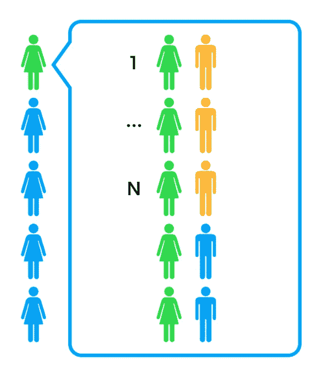
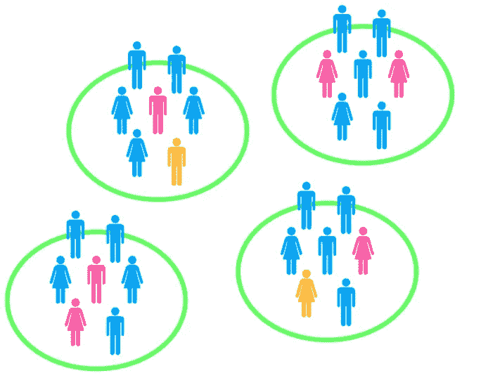
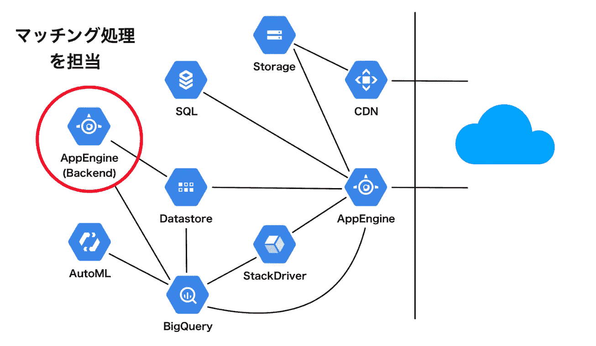
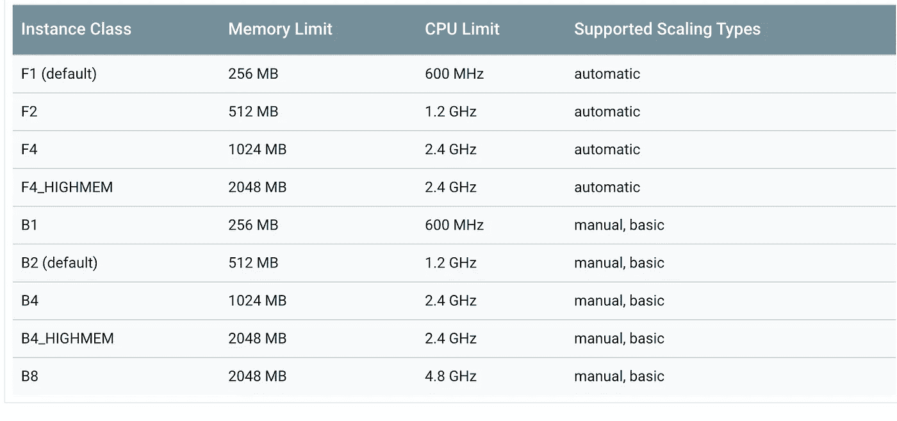
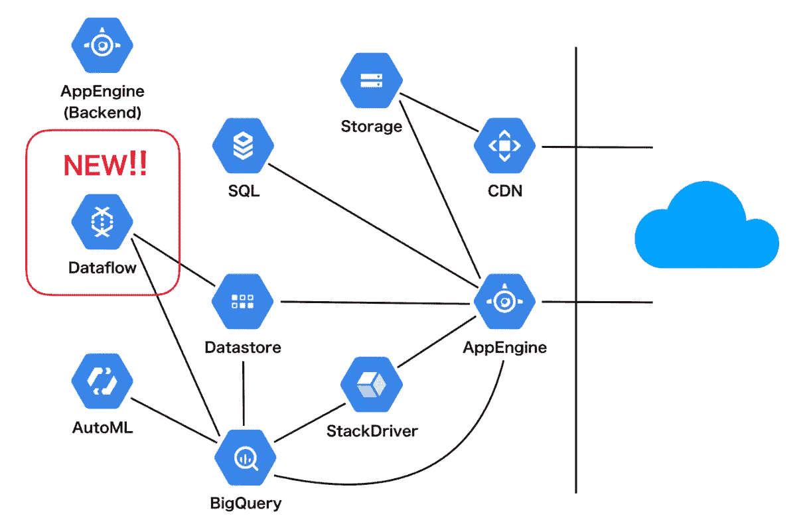
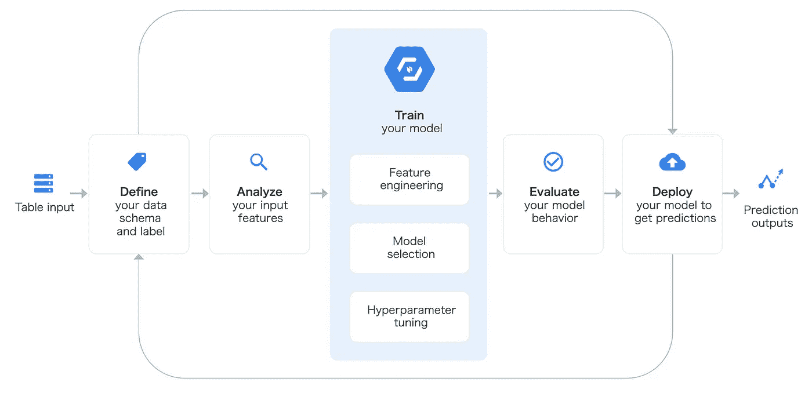

# 交友 App 匹配优化开发

> 原文：<https://towardsdatascience.com/dating-app-matching-optimization-development-d42ace4ed83c?source=collection_archive---------39----------------------->

## 来自 Dine 首席执行官在 PyCon JP 2019 的体验

Photo by [freestocks.org](https://unsplash.com/@freestocks?utm_source=unsplash&utm_medium=referral&utm_content=creditCopyText) on [Unsplash](https://unsplash.com/search/photos/dating?utm_source=unsplash&utm_medium=referral&utm_content=creditCopyText)

[PyCon JP 2019](https://pycon.jp/2019/) 于 2019/9/16~ 2019/9/17 举办，为期两天。这个帖子是关于第二天的一个讲座。

[盛冈孝](https://twitter.com/_ok_mario)是约会应用 [Dine](http://dine.dating/) 的首席执行官。他的演讲主要集中在他在匹配优化方面的开发经验。数据处理在 Google Cloud data flow(Apache Beam Python SDK)下，ML 部分由 Cloud ML 引擎完成。[幻灯片](https://drive.google.com/file/d/1SXn7_u9OddelLPQ0Jn2H8vflL-hBp2Az/view)在这里。

# 背景

约会应用的目标是匹配两个用户。主要的匹配方法有两种，搜索法和推荐法。

*   搜索方法:用户根据自己的喜好进行搜索
*   推荐方式:交友网站会为用户推荐候选人

盛冈隆告诉 Dine 主要采用推荐法。

为了解决 [**稳定婚姻问题**](https://www.wikiwand.com/en/Stable_marriage_problem) ，Dine 采用了 [**大风**–**沙普利算法**](/gale-shapley-algorithm-simply-explained-caa344e643c2) **。**但是这个算法有一个很大的问题，计算成本巨大。

# 降低计算成本

看，我们总共有 N 个用户。我们首先计算用户 A 相对于其他 N-1 个用户的得分。然后，我们对 N 个用户进行排名，为用户 a 进行推荐，运行时间将为 O(N log N)。

为了降低计算成本，Dine 将用户分成不同的组(演讲者没有提到划分标准)。分组的优点是可以将用户数从 N 个减少到组数，并可以并行计算得分。

但还是有两个问题。

*   匹配性能低
*   分组方法对少数用户产生了不良影响

但是演讲者没有提到如何解决这些问题。他在接下来的演讲中主要讲了如何提高计算能力。

# 基础设施改善

原来的系统架构如下图所示。

AppEngine 正在进行匹配过程计算。但是对于 GAE 实例的 CPU 和内存来说，计算量仍然很大。

来解决问题。Dine 用提供 Java 和 Python SDK 的 Could Dataflow 代替 GAE。

这个系统的容量比以前增加了 10 倍。

# 与 can AutoML 表集成

数据流的一个优势是与其他机器学习服务的高度兼容性。Dine 使用 Cloud AutoML Table 从用户配置文件中构建表格功能。它会自动调整参数。第一天介绍 AutoML，[业界使用的 AutoML 库概述](https://medium.com/@bramblexu/overview-of-automl-from-pycon-jp-2019-c8996954692f)。

根据 AB 测试的结果，匹配分数(f1)增加了 20%。以下是演讲者在使用 Cloud AutoML Table 时的一些想法。

优点:

*   使用 BigQuery 很容易
*   批量预测和在线预测非常容易部署

缺点:

*   无法下载模型
*   不知道模型架构

> ***查看我的其他帖子*** [***中等***](https://medium.com/@bramblexu) ***同*** [***一分类查看***](https://bramblexu.com/posts/eb7bd472/) ***！
> GitHub:***[***bramble Xu***](https://github.com/BrambleXu) ***LinkedIn:***[***徐亮***](https://www.linkedin.com/in/xu-liang-99356891/) ***博客:***[***bramble Xu***](https://bramblexu.com)

# 参考

*   [https://pycon.jp/2019/schedule/?sessionId=207](https://pycon.jp/2019/schedule/?sessionId=207)
*   [https://drive . Google . com/file/d/1 sxn 7 _ u 9 oddell pq 0 jn 2h 8 vfll-HBP 2 az/view](https://drive.google.com/file/d/1SXn7_u9OddelLPQ0Jn2H8vflL-hBp2Az/view)