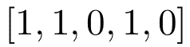

# 用决策树确定文本的日期

> 原文：<https://towardsdatascience.com/dating-texts-with-decision-trees-c716841a33f1?source=collection_archive---------21----------------------->

## 使用决策树来估计一本书的写作年份

Photo by [Kiwihug](https://unsplash.com/@kiwihug?utm_source=unsplash&utm_medium=referral&utm_content=creditCopyText) on [Unsplash](https://unsplash.com/s/photos/manuscripts?utm_source=unsplash&utm_medium=referral&utm_content=creditCopyText)

# 介绍

> 如果我们使用机器学习来估计这本书的写作时间会怎么样？

想象你自己在你祖父母的旧阁楼里，仔细阅读布满灰尘的旧书架，这时一本不熟悉的大部头吸引了你的目光。这似乎是一部小说。你不知道它是什么时候写的，这个答案似乎连谷歌自己都不知道。你拍下其中一页的照片，然后使用文本提取器，获得文本的数字表示。如果我们使用机器学习来估计这本书的写作时间会怎么样？

在这篇文章中，我们将讨论和实现一些方法来尝试确定文本的日期。除了所述的例子，这种类型的模型在一系列领域中有应用，从检测假新闻，到打击历史修正主义，到改善历史上准确的小说，到确定死后文学作品的真实性。

这项任务最容易解释的模型之一是决策树，它可以提供关于哪些类型的单词可以用来区分文本日期的有趣推论。

# 资料组

我们的首要任务是收集数据进行训练。我们将要使用的数据集包含大约 200 个文本，按时间分布如下

Time spread of the dataset

我们将自己限制在这个时间段内，因为在一个更长的时间段内，英语的不同状态之间的绝对语言距离太大了(对于一个说现代英语的人来说，14 世纪的英语是难以理解的)。查找较旧的文本数据也是乏味的，因为许多较旧文本的可用版本只是用更近的、可理解的英语转录的(使用这些版本而没有适当的谨慎相当于给数据贴错标签)。我们的优先任务之一是确保在每个时间段，文本包括不同的主题，以防止我们的模型识别文本主题或格式，而不是纪元。

# 特征选择

作为健全性检查，为了确保文本可以可行地聚类，我们可以执行[主成分分析](https://medium.com/@aptrishu/understanding-principle-component-analysis-e32be0253ef0) (PCA):

PCA on the dataset

我们有相当多的聚类，然而，蓝点的聚类(17 世纪晚期)可能是因为这一时期的文本处理了类似的主题。这凸显了从多个来源获取数据的重要性，因为它显示了模型倾向于选择最简单的要素。

# 表示文本

有无数种方式来表示文本数据，最常见的一种是 **word2vec，**将所有的单词放在一个 n 维向量空间中，相似的单词在空间上很接近**。**然而，出于我们的目的，我们注意到基于 word2vec 的模型对于决策树来说既慢又低效。

相反，让我们使用一种**单词袋**方法，其中每本书是一个向量，其索引代表一个唯一的单词，包含该单词在书中的实例数量。向量的大小将取决于词汇的大小(即，如果你的书中有 1000 个独特的单词，则输入的大小将是 1000)。

例如，假设您的词汇量为 5，表示为列表

Vocabulary for the example

我们想把“我饿了”这句话编码产生的向量将简单地是:

Encoding for “I am hungry” with the given vocabulary

相反，如果是“我饿了，我”，我们就会

Encoding for “I am hungry, I” with the given vocabulary

既然我们有了对每本书进行编码的方法，那么让我们定义一个准确性度量。

# 定义准确性

假设我们的模型声称一本书写于 1527 年，但它实际上写于 1531 年。模型准确吗？

尽管均方误差(MSE)是确定模型准确性的显而易见的方法，但它不是很直观。为了产生更简单的度量，让我们定义 **𝛿** 、容差(以年为单位)，以获得以下精度函数:

换句话说，如果模型在 **𝛿** 年内猜测正确，那么我们说它是准确的；否则就是不准确的。在下文中，我们将使用𝛿的**= 50 年和𝛿的**= 100 年。****

# 什么是决策树？

让我们来看看我们将要用来学习将文本与日期相关联的模型，决策树。

决策树分类器类似于流程图，终端节点代表分类输出/决策。从一个数据集开始，测量熵以找到一种分割数据集的方法，直到所有数据都属于同一个类。

Basic example of a decision tree¹

点击[此处](https://medium.com/@chiragsehra42/decision-trees-explained-easily-28f23241248)查看更多关于决策树的文章。

# 结果和解释

## 模型的准确性

一旦对决策树进行了训练，我们就可以在测试集上绘制一些预测:

Results for a decision tree with pruning

上面的图是线性的，表明决策树的性能很好。事实上，在我们的测试集上，我们获得了 84%的准确率(对于𝛿100 年)和 82%的准确率(对于𝛿50 年)。

## 解释和可视化

在这里，我们可以看到树的顶部本身的可视化。

树的许多分裂决定是智能的，对我们人类来说是有意义的。例如，电话在 1900 年开始流行，珀西这个名字的流行程度在 19 世纪晚期达到顶峰，从那以后稳步急剧下降。这里有一个表格，包含一些有趣的分裂，可以在树中找到。

Some interesting splits in the decision tree

# 结论

我希望您现在对如何使用决策树来估算一本书的写作日期有了更好的了解。

# 感谢

我要感谢保罗·塞格斯和法布里斯·海底平顶山-西奥内斯对本文的贡献。

# 参考

[1] Chirag Sehra，决策树易解释(2018)，[https://medium . com/@ Chirag se HRA 42/Decision-Trees-Explained-Easily-28f 23241248](https://medium.com/@chiragsehra42/decision-trees-explained-easily-28f23241248)