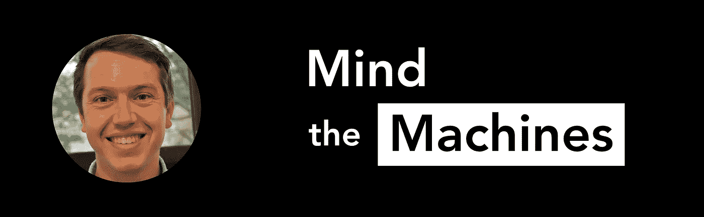

# David Duvenaud 谈学术界人工智能和机器学习的未来

> 原文：<https://towardsdatascience.com/david-duvenaud-on-the-future-of-ai-and-machine-learning-in-academia-7c3ae5aa290d?source=collection_archive---------27----------------------->

在成为多伦多大学机器学习助理教授之前，David Duvenaud 曾在剑桥、牛津和谷歌大脑工作过。

他在神经颂歌方面做了开创性的工作，并且在过去十年的大部分时间里一直处于该领域的前沿。

大卫和我们坐下来谈论机器学习的发展方向，以及学术生涯是如何形成的。

在 Twitter 上关注他: [@DavidDuvenaud](http://twitter.com/DavidDuvenaud) 点击这里查看这一集: