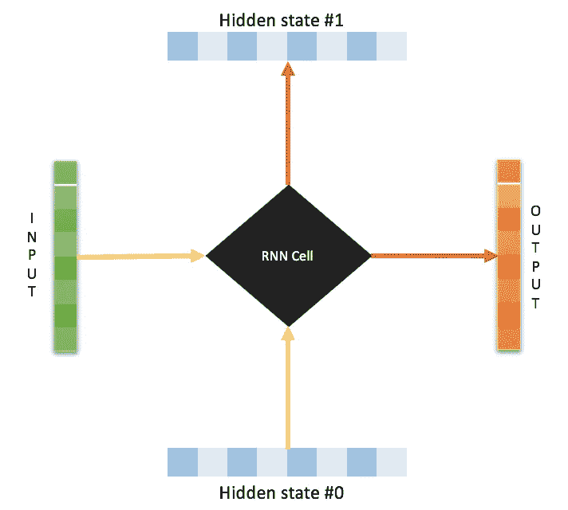
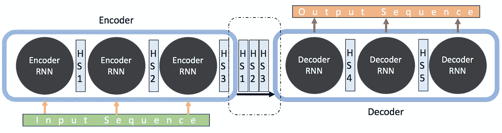
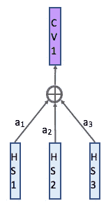

# 注意— Seq2Seq 型号

> 原文：<https://towardsdatascience.com/day-1-2-attention-seq2seq-models-65df3f49e263?source=collection_archive---------2----------------------->

*序列间* (abrv。Seq2Seq)模型是深度学习模型，在机器翻译、文本摘要和图像字幕等任务中取得了很多成功。谷歌翻译在 2016 年末开始在[生产中使用](https://blog.google/products/translate/found-translation-more-accurate-fluent-sentences-google-translate/)这样的模型。这两个开创性的论文中解释了这些模型( [Sutskever 等人，2014](https://papers.nips.cc/paper/5346-sequence-to-sequence-learning-with-neural-networks.pdf) ， [Cho 等人，2014](http://emnlp2014.org/papers/pdf/EMNLP2014179.pdf) )。

# Seq2Seq 模型是什么？

Seq2Seq 模型是一种模型，它接受一系列项目(单词、字母、时间序列等)并输出另一系列项目。

Seq2Seq Model

在神经机器翻译的情况下，输入是一系列单词，输出是翻译的一系列单词。

现在让我们努力减少我们的黑匣子的黑色。该模型由一个*编码器*和一个*解码器*组成。编码器以*隐藏状态向量*的形式捕获输入序列的*上下文*，并将其发送至解码器，解码器随后产生输出序列。由于任务是基于序列的，编码器和解码器都倾向于使用某种形式的 RNNs、LSTMs、GRUs 等。隐藏状态向量可以是任何大小，尽管在大多数情况下，它被视为 2 的次方和一个大数字(256，512，1024 ),这在某种程度上可以表示完整序列和域的复杂性。

# 我们再深入一点！RNNs！

RNN Cell

根据设计，RNNs 有两个输入，一个是它们看到的当前示例，另一个是以前输入的表示。因此，时间步长 *t* 处的输出取决于当前输入以及时间 *t-1* 处的输入。这就是为什么他们在面对与序列相关的任务时表现得更好。顺序信息保存在网络的隐藏状态中，并在下一个实例中使用。

由 RNNs 组成的编码器将序列作为输入，并在序列的末尾生成最终嵌入。然后将它发送到解码器，解码器使用它来预测序列，在每次连续预测之后，它使用前一个隐藏状态来预测序列的下一个实例。

Encoder-Decoder Model for Seq2Seq Modelling

***缺点:*** 输出序列严重依赖编码器最终输出中隐藏状态定义的上下文，使得模型处理长句具有挑战性。在长序列的情况下，初始上下文很可能在序列结束时丢失。

***解决方案:*** [Bahdanau 等人，2014](https://arxiv.org/abs/1409.0473) 和 [Luong 等人，2015](https://arxiv.org/abs/1508.04025) 论文介绍了一种称为“注意力”的技术，它允许模型在输出序列的每个阶段关注输入序列的不同部分，从而允许上下文从头到尾得到保留。

# 现在我引起你的注意了！；P

简而言之，由于问题是编码器末端的单个隐藏状态向量是不够的，我们发送与输入序列中实例数量一样多的隐藏状态向量。这是新的表现形式:

Seq2Seq with Attention — incomplete

听起来很简单，不是吗？让我们引入更多的复杂性。解码器到底是如何使用隐藏状态向量集的？到目前为止，这两个模型之间的唯一区别是在解码阶段引入了所有输入实例的隐藏状态。

创建基于注意力的模型的另一个有价值的补充是*上下文向量*。这是为输出序列中的每个时间实例生成的。在每一步，上下文向量是输入隐藏状态的加权和，如下所示:

Context Vector

但是如何在预测中使用上下文向量呢？而权重 *a1，a2，a3* 又是如何决定的呢？让我们一次解决一个问题，先解决一个简单的问题——上下文向量。

所生成的上下文向量通过级联与隐藏状态向量相结合，并且这个新的*注意力隐藏向量*用于预测该时刻的输出。注意，这个注意力向量是为输出序列中的每个时间实例生成的，并且现在取代了隐藏状态向量。

Attention hidden state

现在我们到了谜题的最后一块，注意力得分。

同样，简单地说，这些是另一个神经网络模型*比对模型*的输出，该模型最初与 seq2seq 模型联合训练。对齐模型对输入(由其隐藏状态表示)与先前输出(由注意力隐藏状态表示)的匹配程度进行评分，并对每个输入与先前输出进行匹配。然后对所有这些分数取一个最大值，得到的数字就是每个输入的注意力分数。

Attention scoring

因此，我们现在知道输入的哪一部分对于输出序列中每个实例的预测是最重要的。在训练阶段，模型已经学会了如何将各种实例从输出序列对齐到输入序列。下面是一个机器翻译模型的示例，以矩阵形式显示。注意，矩阵中的每个条目都是与输入和输出序列相关联的注意力分数。

French to English conversion. Notice how the model weighted the input sequence while outputing European Economic Area”

所以现在我们有了最终完整的模型

Seq2Seq Attention Based Model

如我们所见，我们开始使用的黑盒现在变成了白色。以下是图片摘要:

我希望你觉得这很有用并且容易理解。如果有任何更正或任何形式的反馈，我希望收到您的来信。请在这里评论，让我知道。

# 参考资料:

 [## 可视化神经机器翻译模型(Seq2seq 模型的机制，注意)

### 翻译:中文(简体)，韩文观察:麻省理工学院的深度学习艺术讲座引用此贴…

jalammar.github.io](https://jalammar.github.io/visualizing-neural-machine-translation-mechanics-of-seq2seq-models-with-attention/)  [## LSTMs 和递归神经网络初学者指南

### 数据只能反向理解；但它必须向前看。-索伦·克尔凯郭尔，日记内容实际上…

skymind.ai](https://skymind.ai/wiki/lstm)  [## 通过联合学习对齐和翻译的神经机器翻译

### 神经机器翻译是最近提出的机器翻译方法。不同于传统的统计…

arxiv.org](https://arxiv.org/abs/1409.0473)  [## 张量流/nmt

### TensorFlow 神经机器翻译教程。通过在…上创建帐户，为 tensorflow/nmt 的发展做出贡献

github.com](https://github.com/tensorflow/nmt)  [## 在翻译中发现:谷歌翻译中更准确、流畅的句子

### 在 10 年里，谷歌翻译已经从仅仅支持几种语言发展到 103 种，连接陌生人，达到…

博客.谷歌](https://blog.google/products/translate/found-translation-more-accurate-fluent-sentences-google-translate/)  [## Seq2seq 关注自我关注:第 1 部分

### Seq2seq 与注意模型

medium.com](https://medium.com/@bgg/seq2seq-pay-attention-to-self-attention-part-1-d332e85e9aad)  [## 基于注意力的神经机器翻译的有效方法

### 一种注意力机制最近被用于通过选择性地聚焦于……来改善神经机器翻译(NMT)

arxiv.org](https://arxiv.org/abs/1508.04025)  [## 为什么神经元或卷积的数量选择 2 的等幂？

### 感谢您为 Data Science Stack Exchange 贡献答案！请务必回答问题。提供…

datascience.stackexchange.com](https://datascience.stackexchange.com/questions/16416/why-the-number-of-neurons-or-convolutions-chosen-equal-powers-of-two) 

Sutskever，Ilya，Oriol Vinyals 和 Quoc V. Le。"用神经网络进行序列对序列学习."*神经信息处理系统的进展*。2014.

使用统计机器翻译的 RNN 编码解码器学习短语表达 *arXiv 预印本 arXiv:1406.1078* (2014)。

https://www . guide light . com . au/the-guide light-psychology-blog/？类别=生活+教练