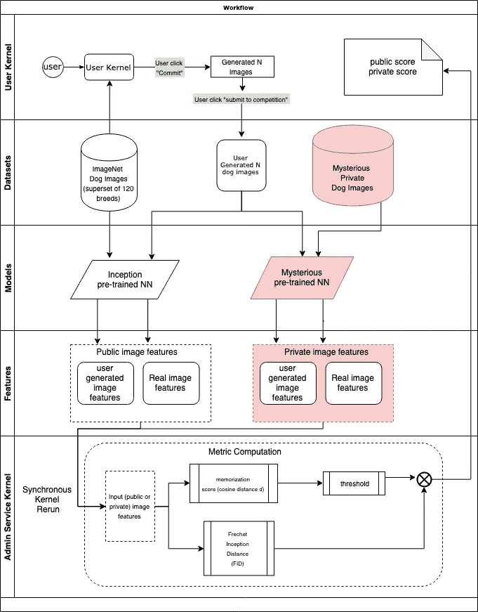

# DCGANs —使用 Tensorflow 和 Keras 生成狗的图像

> 原文：<https://towardsdatascience.com/dcgans-generating-dog-images-with-tensorflow-and-keras-fb51a1071432?source=collection_archive---------3----------------------->

# 基于 Kaggle 的生殖狗比赛(2019)

DCGAN Dog Generation over epochs (~8 hours of runtime on Kaggle)

这篇文章是一个关于 **DCGANs** 有效性背后的基本思想的教程，以及一些提高他们性能的方法/技巧。这些方法都是我在 **Kaggle 的** [**生财狗大赛**](https://www.kaggle.com/c/generative-dog-images) **期间的经验。教程也有，要么在我原来的** [**内核**](https://www.kaggle.com/jadeblue/dcgans-and-techniques-to-optimize-them) **上笔记本格式，要么在**[**GitHub**](https://github.com/JadeBlue96/DCGAN-Dog-Generator)**上。**

要在本地或使用 **Colab** 运行这个例子，您将需要一个 **Kaggle 帐户**，以便检索其 API 密钥并使用所提供的数据集。完整教程可在 [**这里**](https://medium.com/@yvettewu.dw/tutorial-kaggle-api-google-colaboratory-1a054a382de0) 。

# 生成对抗网络

与大多数流行的神经网络架构不同， **GANs** 被训练来同时解决两个问题——**辨别**(有效地将真实图像与虚假图像分开)和**“真实的”虚假数据生成**(有效地生成被认为是真实的样本)。正如我们所看到的，这些任务是完全对立的，但是如果我们把它们分成不同的模型，会发生什么呢？

嗯，这些模型的通称是**发生器(G)** 和**鉴别器(D)** ，被认为是**甘斯**理论背后的构建模块。

**发生器**网络将简单的随机噪声 N 维向量作为输入，并根据学习的目标分布对其进行转换。其输出也是 N 维的。另一方面，**鉴别器**模拟概率分布函数(类似于分类器)并输出输入图像是真实还是虚假的概率**【0，1】**。考虑到这一点，我们可以定义生成任务的两个主要目标:

**1。训练 G 使 D 的最终分类误差最大化。**(使得生成的图像被感知为真实)。

**2。训练 D 以最小化最终分类误差。**(以便正确区分真实数据和虚假数据)。

为了实现这一点，在**反向传播**期间， **G** 的权重将使用**梯度上升**进行更新，以使误差最大化，而 **D** 将使用**梯度下降**将其最小化。


GAN inputs and outputs — (note that the two networks don’t use the true distribution of images directly during training but instead use each other’s outputs to estimate their performance)

那么我们如何定义一个**损失函数**来估计两个网络的累积性能呢？嗯，我们可以使用**绝对误差**来估计 **D** 的误差，然后我们可以对 **G** 重复使用相同的函数，但要最大化:


Mean Absolute Error — the distance between the real and fake distributions of images

在这种情况下， ***p_t*** 代表图像的真实分布，而 ***p_g*** 则是由 **G** 创建的分布。

我们可以观察到这个理论是基于**强化学习**的一些关键概念。它可以被认为是一个两个玩家的极大极小游戏，其中两个玩家相互竞争，从而在各自的任务中逐步提高。

我们看到了**甘斯**理论背后的基本思想。现在让我们更进一步，通过应用来自**卷积神经网络**的思想和方法来学习**DC gan**是如何工作的。

# 深度卷积生成对抗网络

**DC gan**利用了**CNN**的一些基本原理，并因此成为实践中使用最广泛的架构之一，这是因为它们收敛速度快，并且还因为它们可以非常容易地适应更复杂的变体(使用标签作为条件，应用残差块等等)。以下是 **DCGANs** 解决的一些更重要的问题:

*   **D 是这样创建的，它基本上解决了一个有监督的图像分类任务。**(对于这种情况狗还是不狗)
*   **GAN 学习的过滤器可用于在生成的图像中绘制特定对象。**
*   **G 包含可以学习对象非常复杂的语义表示的矢量化属性。**

以下是创建稳定的 **DCGAN** 时要考虑的一些核心准则，与标准的 **CNN** (摘自官方[论文](https://arxiv.org/pdf/1511.06434.pdf))相对照:

*   用步长卷积代替池函数。(这允许 **D** 学习其自己的空间下采样和 **G** 其各自的上采样，而不会给模型增加任何偏差)
*   **使用 BatchNorm** (它通过标准化每个单元的输入来稳定学习，使平均值和单元方差为零，这也有助于创建更健壮的深度模型，而不会出现梯度发散)
*   **避免使用全连接隐藏层(非输出)。**(这方面的例子是全局平均池，这似乎会影响收敛速度)
*   **对于 G-使用 ReLU 激活和 Tanh 进行输出。**(当您将图像作为输出时，tanh 通常是更优选的激活，因为它的范围为[-1，1])
*   **对于 D-使用泄漏激活(以及输出概率的 sigmoid 函数)。**(这是经过经验测试的，似乎适用于更高分辨率的建模)

下面是一个 **DCGAN 发生器**的最标准结构:


DCGAN Generator structure

正如我们所看到的，它的初始输入只是一个 **(1，100)** 噪声向量，它通过 **4 个卷积**层进行上采样，并以 **2** 的步长产生大小为(64，64，3)的结果 RGB 图像。为了实现这一点，输入向量被投影到 1024 维的输出上，以匹配第一个 **Conv** 层的输入，我们将在后面看到更多。

标准的鉴别器是什么样的？好吧，关于你所期望的，让我们来看看:


DCGAN Discriminator structure

这一次我们有一个 **(64，64，3)** 的输入图像，与 **G** 的输出相同。我们将它传递给 **4 标准下采样 Conv 层**，再次以 **2** 的步幅。在最终的输出层中，图像被展平为一个向量，该向量通常被馈送给一个 sigmoid 函数，然后该函数输出该图像的 **D** 的预测**(一个表示概率在[0，1] — dog = 1 或 no dog = 0)** 范围内的单个值)。

好了，现在你看到了 **GANs** 和 **DCGANs** 背后的基本思想，所以现在我们可以继续使用 **Tensorflow 和 Keras** :)生成一些狗。

# 图像预处理和 EDA(探索性数据分析)

在我们继续创建**甘**模型之前，让我们先快速浏览一下我们将要使用的**斯坦福狗**数据集。因为我们也有每张图片的注释，我们可以用它们将每张狗图片映射到它各自的品种。为此，我们可以首先创建一个字典，将文件名中的品种代码映射到实际的品种名称。

接下来，我将使用 **OpenCV** 作为快速函数来读取图像并将其转换为 **RGB** 。

如果我们查看数据集，我们可以看到每个注释文件夹都包含一个 **xml** 文件列表。这些文件与特定的图像相关联，包含非常有用的信息，主要是图像中每只狗周围的边界框。也有图像中有多只狗，这使我们能够准确地裁剪它们，并制作一个只包含**单身狗的数据集**图像。

在这里，我们可以利用 **xml** 库来创建一个树，并为该注释找到相关的元素。对于每个对象，我们可以提取边界框坐标，裁剪图像，并根据结果**图像宽度**通过**收缩**或**扩展**来标准化裁剪。最后，我们将图像保存在一个 numpy 数组中。

Use ET to find the annotations of each dog in the image

```
for o in objects:                           
   bndbox = o.find('bndbox')                            
   xmin = int(bndbox.find('xmin').text)                           
   ymin = int(bndbox.find('ymin').text)                           
   xmax = int(bndbox.find('xmax').text)                           
   ymax = int(bndbox.find('ymax').text)                                 .. Add some margins and adjust the width ..                             # Crop the image                           
   img_cropped = img[ymin:ymin+w, xmin:xmin+w, :]      # [h,w,c]                           .. Interpolation step ..                           
# Resize the image                           
   img_cropped = cv2.resize(img_cropped, (image_width, image_height), interpolation=interpolation)
# Save the images and labels
dog_images_np[curIdx,:,:,:] = np.asarray(img_cropped)
dog_breed_name = dog_breed_dict[dog_ann.split('_')[0]]
breeds.append(dog_breed_name)
curIdx += 1

return dog_images_np, breeds
```

*加载这些功能大约需要 2-3 分钟。*

通过试验，我们可以得出只有单条狗的结果图像是 **22125** ，因此我们可以指定 numpy 数组的确切大小。有 **120** 不同的狗品种。

现在我们有了要素和标注，我们可以在正方形网格中绘制它们，以查看作物的外观并确保它们的标注正确。

```
def plot_features(features, labels, image_width=image_width, image_height=image_height, image_channels=image_channels,
examples=25, disp_labels=True): 

    if not math.sqrt(examples).is_integer():
        print('Please select a valid number of examples.')
        return
    imgs = []
    classes = []
    for i in range(examples):
        rnd_idx = np.random.randint(0, len(labels))
        imgs.append(features[rnd_idx, :, :, :])
        classes.append(labels[rnd_idx]) fig, axes = plt.subplots(round(math.sqrt(examples)), round(math.sqrt(examples)),figsize=(15,15),
    subplot_kw = {'xticks':[], 'yticks':[]},
    gridspec_kw = dict(hspace=0.3, wspace=0.01))

    for i, ax in enumerate(axes.flat):
        if disp_labels == True:
            ax.title.set_text(classes[i])
        ax.imshow(imgs[i])
```

注意，我们需要归一化像素值，以确保狗被正确绘制。

```
plot_features(dog_images_np / 255., breeds, examples=25, disp_labels=True)
```


Visualizing the image features

# 模型超参数列表

这里我们有一个超参数的完整列表，您可以调整并尝试改进该模型。我主要是从研究论文中收集这些值，并对它们进行了一点调整，这就是我最终得到的结果。以下是你可以尝试的一些事情:

*   **样本大小** —特征的数量
*   **批量大小** — 64 或 32 可以提高性能，但是计算量很大，并且只能运行少量时期的模型
*   **权重初始标准值和平均值** —这些值来自研究论文，似乎可以稳定模型训练
*   **泄漏 ReLU 斜率**—**D**激活的阈值看起来也很稳定
*   **缩小因子和比例因子**——设置使得 **G** 的噪声向量可以被整形为(4，4，512)，其他组合也可能有效
*   **漏失** —漏失层的数量、位置和速率可以提高性能。
*   **学习率和学习率衰减** —对模型收敛非常重要，很难精确调整， **G** 和 **D** 可以有不同的学习率。
*   **噪声矢量形状**——通常 128 或 100 似乎就足够了

# 创建影像数据集

现在让我们使用我们的 numpy 特性数组来构造一个 **Tensorflow** dataset 对象。首先，我们可以将数据类型转换为 **float32** ，这总是有助于保留一些内存。

```
dog_features_tf = tf.cast(dog_images_np, 'float32')
```

我们还可以将**数据扩充**应用到我们的数据集。这包括随机的**水平翻转**，在随机区域缩放和裁剪图像。在这些方法中，我发现只有第一种方法对向数据集添加更多的方差有点用，因为其他方法会引入很多噪声。

因此，在这种情况下，我们数据集中的图像将有 **50%** 的机会从左向右翻转。

```
def flip(x: tf.Tensor) -> (tf.Tensor):
    x = tf.image.random_flip_left_right(x)
    return x
```

现在，我们可以使用 **Tensorflow** 来创建数据集，方法是将它混洗，应用一些增强，最后将它分成指定**批处理大小**的批处理。

```
dog_features_data = tf.data.Dataset.from_tensor_slices(dog_features_tf).shuffle(sample_size).map(flip).batch(batch_size, drop_remainder=True)
```

# 标准化技术

在我们实际制作**生成器**之前，让我们来看看一些可以逐渐加快 **DCGAN** 收敛速度的规范化。

# 重量初始化

其中一种方法是**权重初始化**。原来训练稳定的**甘斯**还是蛮重要的。首先，模型重量需要在**零中心**上稍微增加**标准值** (0.02)。这在训练期间稳定了 **D** 和 **G** ，并防止模型梯度消失或爆炸。这是每种情况下的关键一步，我们必须在模型中使用随机变量(随机噪声向量)。

下面是一个关于**权重初始化**如何严重影响神经网络学习过程的例子。


The impact of weight initialization on model training

我们也可以使用 **Keras** 应用**截尾正态分布**，这将丢弃超过平均值 2 个标准偏差的**值。这也许可以在训练期间消除一些异常点。**

```
weight_initializer = tf.keras.initializers.TruncatedNormal(stddev=weight_init_std, mean=weight_init_mean, seed=42)
```

# 光谱归一化

**谱归一化**是一种新型的权重初始化，专门针对 **GANs** 设计的，似乎可以进一步稳定模型训练(你可以从这篇[论文](https://arxiv.org/pdf/1802.05957.pdf)中读到更多)。关于**光谱归一化**的更详细的解释以及它为什么工作也值得看看这篇[文章](https://christiancosgrove.com/blog/2018/01/04/spectral-normalization-explained.html)，它有非常直观的例子。

**我们网络中单个权重的频谱归一化**可定义如下:


Applying Spectral Normalization on a single weight

这里 *u* 和 *v* 是相同大小的简单随机向量。对于每个学习步骤，它们被用来对特定权重执行所谓的**幂迭代**操作，并且它被证明比简单地惩罚梯度在计算上高效得多。

之后，在反向传播步骤中，我们使用 *WSN(W)* 代替 *W* 来更新权重。

对于这个项目，我将重用一些由 **IShengFang** ( [官方代码](https://github.com/IShengFang/SpectralNormalizationKeras))实现的自定义 **Keras** 图层，在 **Conv** 和**密集**图层之上应用**光谱归一化**。

这里还有一个关于**光谱归一化**效果的好例子:


DCGAN training with SN


DCGAN training with standard layers

让我们也在 **Keras** 中定义一些模板层，以便我们稍后可以更容易地创建 **G** 和 **D** 。各层的标准模式将是:

**TP _ conv _ Block =[(conv(SN)2d transpose(上采样))->(batch norm)->(ReLU)]**

**conv _ 布洛克= [(Conv(SN)2D(下采样))->(batch norm)->(leaky relu)】**

对于本例，我将在 G 中使用标准**Conv2D 转置模块，在 d 中使用频谱归一化 conv 2d 层**

```
def transposed_conv(model, out_channels, ksize, stride_size, ptype='same'):
    model.add(Conv2DTranspose(out_channels, (ksize, ksize),
                              strides=(stride_size, stride_size), padding=ptype, 
                              kernel_initializer=weight_initializer, use_bias=False))
    model.add(BatchNormalization())
    model.add(ReLU())
    return model

def convSN(model, out_channels, ksize, stride_size):
    model.add(ConvSN2D(out_channels, (ksize, ksize), strides=(stride_size, stride_size), padding='same',
                     kernel_initializer=weight_initializer, use_bias=False))
    model.add(BatchNormalization())
    model.add(LeakyReLU(alpha=leaky_relu_slope))
    #model.add(Dropout(dropout_rate))
    return model 
```

# 发电机

我们终于可以定义我们的生成器了。模型结构主要基于官方的 DCGAN [论文](https://arxiv.org/pdf/1511.06434.pdf)，做了一些我认为对性能有益的调整。总体结构如下:

**【输入(128，1)——>密集(2048，)——>重塑(4，4，128)——>TP _ conv _ Block(深度=512，K = 5×5，S = 1×1)——>Dropout(0.5)->TP _ conv _ Block(深度=256，K = 5×5，S = 2×2)->Dropout(0.5)->TP _ conv _ Block(深度=128，K**

```
def DogGenerator():
    model = Sequential()
    model.add(Dense(image_width // scale_factor * image_height // scale_factor * 128,
                    input_shape=(noise_dim,), kernel_initializer=weight_initializer))
    #model.add(BatchNormalization(epsilon=BN_EPSILON, momentum=BN_MOMENTUM))
    #model.add(LeakyReLU(alpha=leaky_relu_slope))
    model.add(Reshape((image_height // scale_factor, image_width // scale_factor, 128)))

    model = transposed_conv(model, 512, ksize=5, stride_size=1)
    model.add(Dropout(dropout_rate))
    model = transposed_conv(model, 256, ksize=5, stride_size=2)
    model.add(Dropout(dropout_rate))
    model = transposed_conv(model, 128, ksize=5, stride_size=2)
    model = transposed_conv(model, 64, ksize=5, stride_size=2)
    model = transposed_conv(model, 32, ksize=5, stride_size=2)

    model.add(Dense(3, activation='tanh', kernel_initializer=weight_initializer))

    return model
```

# 鉴别器

**鉴别器**相对更容易实现，因为它基本上是一个小型的 **CNN** 两类分类器。我们可以选择是否应用**光谱归一化**并观察性能效果。对于这个例子，我将尝试只在 **D** 中应用 **SN** 。下面是 **D** 的结构:

**【输入(128，128，3)——>conv(SN)2D(深度=64，K=5x5，S=1x1，相同)——>leaky relu——>conv _ Block(深度=64，K=5x5，S = 2 x2)——>conv _ Block(深度=128，K=5x5，S = 2 x2)——>conv _ Block(深度=256，K=5x5，S = 2 x2)——【T57**

还要注意，所有的 **Conv** 和**密集**层都用上面定义的**截断正态**分布初始化。另一件事是**偏差**项从 **Conv** 层中移除，这也稍微稳定了模型。

```
def DogDiscriminator(spectral_normalization=True):
    model = Sequential()
    if spectral_normalization:
        model.add(ConvSN2D(64, (5, 5), strides=(1,1), padding='same', use_bias=False,
                         input_shape=[image_height, image_width, image_channels], 
                         kernel_initializer=weight_initializer))
        #model.add(BatchNormalization(epsilon=BN_EPSILON, momentum=BN_MOMENTUM))
        model.add(LeakyReLU(alpha=leaky_relu_slope))
        #model.add(Dropout(dropout_rate))

        model = convSN(model, 64, ksize=5, stride_size=2)
        #model = convSN(model, 128, ksize=3, stride_size=1)
        model = convSN(model, 128, ksize=5, stride_size=2)
        #model = convSN(model, 256, ksize=3, stride_size=1)
        model = convSN(model, 256, ksize=5, stride_size=2)
        #model = convSN(model, 512, ksize=3, stride_size=1)
        #model.add(Dropout(dropout_rate))

        model.add(Flatten())
        model.add(DenseSN(1, activation='sigmoid'))
    else:
        ...
    return modeldog_discriminator = DogDiscriminator(spectral_normalization=True)
```

# 标签平滑

一种可以在训练期间应用的正则化方法被称为**标签平滑**。这实际上是防止了 **D** 在其预测中过于自信或过于自信。如果 **D** 变得过于确定在特定的图像中有一只狗，那么 **G** 可以利用这个事实，并且持续地开始只生成那个种类的图像，并且依次停止改进。我们可以通过将负类的类标签设置在范围**【0，0.3】**内，将正类的类标签设置在范围**【0.7，1】**内来解决这个问题。

这将防止总体概率非常接近两个阈值。

```
# Label smoothing -- technique from GAN hacks, instead of assigning 1/0 as class labels, we assign a random integer in range [0.7, 1.0] for positive class
# and [0.0, 0.3] for negative class

def smooth_positive_labels(y):
    return y - 0.3 + (np.random.random(y.shape) * 0.5)

def smooth_negative_labels(y):
    return y + np.random.random(y.shape) * 0.3
```

# 将噪声引入标签

这种技术也被称为**实例噪声**。通过给标签增加少量误差(假设 5%)，这往往会使真实分布和预测分布更加分散，从而开始相互重叠。这反过来使得在学习过程中拟合生成图像的定制分布更加容易。

下面是一个很好的例子，展示了使用这些技术时这两个发行版的样子:


The impact of Insance Noise and Label smoothing on the real and fake distributions of images

下面是我们如何实现**实例噪声**:

```
# randomly flip some labels
def noisy_labels(y, p_flip):
    # determine the number of labels to flip
    n_select = int(p_flip * int(y.shape[0]))
    # choose labels to flip
    flip_ix = np.random.choice([i for i in range(int(y.shape[0]))], size=n_select)

    op_list = []
    # invert the labels in place
    #y_np[flip_ix] = 1 - y_np[flip_ix]
    for i in range(int(y.shape[0])):
        if i in flip_ix:
            op_list.append(tf.subtract(1, y[i]))
        else:
            op_list.append(y[i])

    outputs = tf.stack(op_list)
    return outputs
```

# 优化者

这个任务的最佳验证优化算法是 **Adam** ，两个模型的标准学习率为 **0.0002** ，beta 为 **0.5** 。

```
generator_optimizer = tf.train.AdamOptimizer(learning_rate=lr_initial_g, beta1=0.5)
discriminator_optimizer = tf.train.AdamOptimizer(learning_rate=lr_initial_d, beta1=0.5)
```

# 定义损失函数

最近优化 **GANs** 的另一个新趋势是应用**相对论**损失函数，而不是标准损失函数。这些函数测量真实数据比生成的数据更“真实”的概率。其中比较流行的相对论函数选择有 **RaLSGAN(相对论平均最小二乘法)、RaSGAN(相对论平均标准)和 RaHinge(相对论铰链损耗)**。

但在这一切之前，让我们先定义一下标准**甘**损失:


正如我们所观察到的，这基本上是用于分类任务的标准**二元交叉熵损失**或者真实分布和生成分布之间的**逻辑损失**。在**张量流**中，这可以定义如下:

相比之下，这里是一个 **RSGAN(相对论标准)**损耗的样子:


在这种情况下，任务是不同的，测量**真实(r)** 和**虚假(f)** 数据分布之间的相似性。RSGAN 在 D(x) = 0.5 时达到最优点(即*C*(*xr*)=*C*(*xf*))。有许多相对论损失函数变体，它们都包含不同的方法来测量这种相似性。在这个项目中，我尝试了似乎拥有最佳记录的 **MIFID** 得分 **(RaLSGAN、RaSGAN 和 RaHinge)** 的 **3** 。随意给自己尝试不同的损耗，看看是否能提高性能；).

这里有一个最常用的列表:


Standard and Relativistic GAN losses

在针对这个特定问题的多次试验中，我没有发现通过切换到**相对论性**损耗来提高性能，所以我决定坚持使用标准的 **GAN** 损耗函数，因为它更容易估计，尽管在某些情况下，这些损耗确实可以加快模型的收敛。

这里是应用了**标签平滑和实例噪声**的**鉴别器**损失函数的样子。它基本上是两个子损失的总和**(假的——根据 G 的图像，真实的——根据实际的训练图像)**。

```
def discriminator_loss(real_output, fake_output, loss_func, apply_label_smoothing=True, label_noise=True):
    if label_noise and apply_label_smoothing:
        real_output_noise = noisy_labels(tf.ones_like(real_output), 0.05)
        fake_output_noise = noisy_labels(tf.zeros_like(fake_output), 0.05)
        real_output_smooth = smooth_positive_labels(real_output_noise)
        fake_output_smooth = smooth_negative_labels(fake_output_noise)
        if loss_func == 'gan': 
            real_loss = cross_entropy(tf.ones_like(real_output_smooth), real_output)
            fake_loss = cross_entropy(tf.zeros_like(fake_output_smooth), fake_output) else:
... other loss function variants loss = fake_loss + real_loss
        return loss
```

而**生成器**损失函数**(应用了标签平滑)**只是一个标准的**物流损失**:

```
def generator_loss(real_output, fake_output, loss_func, apply_label_smoothing=True):
    if apply_label_smoothing:
        fake_output_smooth = smooth_negative_labels(tf.ones_like(fake_output))
        if loss_func == 'gan':
            return cross_entropy(tf.ones_like(fake_output_smooth), fake_output)
        else:
... other loss function variants return loss
```

# 主训练循环

让我们也确定用于训练的时期的数量和提供给**生成器**用于可视化中间结果的图像的数量。

```
EPOCHS = 280
num_examples_to_generate = 64
seed = tf.random.normal([num_examples_to_generate, noise_dim])
```

**DCGAN** 的一个训练步骤由三个标准步骤组成:

1.  **前进道具** — **G** 制造一批假像；这和一批真实图像一起被传送到 **D** 。
2.  **计算 G 和 D 的损失函数**。
3.  **反投影** —计算 **G** 和 **D** 的梯度，优化权重。

```
def train_step(images, loss_type='gan'):
    noise = tf.random.normal([batch_size, noise_dim])

    with tf.GradientTape() as gen_tape, tf.GradientTape() as disc_tape:
        generated_images = dog_generator(noise, training=True)

        real_output = dog_discriminator(images, training=True)
        fake_output = dog_discriminator(generated_images, training=True)

        gen_loss = generator_loss(real_output, fake_output, loss_type, apply_label_smoothing=True)
        disc_loss = discriminator_loss(real_output, fake_output, loss_type, 
                                       apply_label_smoothing=True, label_noise=True)

    gradients_of_generator = gen_tape.gradient(gen_loss, dog_generator.trainable_variables)
    gradients_of_discriminator = disc_tape.gradient(disc_loss, dog_discriminator.trainable_variables)

    generator_optimizer.apply_gradients(zip(gradients_of_generator, dog_generator.trainable_variables))
    discriminator_optimizer.apply_gradients(zip(gradients_of_discriminator, dog_discriminator.trainable_variables))

    return gen_loss, disc_loss
```

让我们也定义一些函数来直观显示按时期和作为一个整体的模型损失。

```
def plot_losses(G_losses, D_losses, all_gl, all_dl, epoch):
    plt.figure(figsize=(10,5))
    plt.title("Generator and Discriminator Loss - EPOCH {}".format(epoch))
    plt.plot(G_losses,label="G")
    plt.plot(D_losses,label="D")
    plt.xlabel("Iterations")
    plt.ylabel("Loss")
    plt.legend()
    ymax = plt.ylim()[1]
    plt.show()

    plt.figure(figsize=(10,5))
    plt.plot(np.arange(len(all_gl)),all_gl,label='G')
    plt.plot(np.arange(len(all_dl)),all_dl,label='D')
    plt.legend()
    #plt.ylim((0,np.min([1.1*np.max(all_gl),2*ymax])))
    plt.title('All Time Loss')
    plt.show()
```

我们还可以使用下面的函数来绘制生成图像的网格。

```
def generate_and_save_images(model, epoch, test_input, rows, cols):
    # Notice `training` is set to False.
    # This is so all layers run in inference mode (batchnorm).
    predictions = model(test_input, training=False)
    fig = plt.figure(figsize=(14,14))
    for i in range(predictions.shape[0]):
        plt.subplot(rows, cols, i+1)
        plt.imshow((predictions[i, :, :, :] * 127.5 + 127.5) / 255.)
        plt.axis('off') 

    plt.subplots_adjust(wspace=0, hspace=0)
    plt.savefig('image_at_epoch_{:04d}.png'.format(epoch))
    plt.show()
```

为了生成单个测试图像，我们也可以重用相同的方法。

```
def generate_test_image(model, noise_dim=noise_dim):
    test_input = tf.random.normal([1, noise_dim])
    # Notice `training` is set to False.
    # This is so all layers run in inference mode (batchnorm).
    predictions = model(test_input, training=False)
    fig = plt.figure(figsize=(5,5))
    plt.imshow((predictions[0, :, :, :] * 127.5 + 127.5) / 255.)
    plt.axis('off') 
    plt.show()
```

# 评估 GANs

我们还没提到一个**甘**平时是怎么评价的。大多数使用基准来评估一个**甘**表现如何的研究论文通常基于所谓的**初始分数**。这测量输入图像的两个主要特征:

*   **品种(例如生成不同类型的狗品种)**
*   **图像的区别(或质量)**

如果两件事都是真的，分数就高。如果其中一个或两个都是错误的，分数将会很低。分数越高越好。这意味着您的 GAN 可以生成许多不同的清晰图像。最低分可能是零分。数学上的最高可能分数是无穷大，尽管实际上可能会出现一个非无穷大的上限。

**Inception Score** 来源于 Google 的 [Inception Network](/a-simple-guide-to-the-versions-of-the-inception-network-7fc52b863202) ，是最先进的图像分类深度架构之一。通过将来自我们的 GAN 的图像通过分类器，我们可以测量我们生成的图像的属性。为了产生分数，我们需要计算图像的真实和虚假分布之间的相似性/距离。这是使用**KL(kull back–lei bler)散度公式**完成的:


这里， **P 和 Q** 是两个测量分布。在这种情况下，**更高的 KL 散度**意味着更好的结果——图像的质量是相似的，并且存在各种各样的标签。在相反的情况下，**低 KL 偏差**可能是由于标签质量低或种类少:


Measuring the performance with KL divergence

# 弗雷歇起始距离

**的一个缺点是**如果每个类只生成一个图像，它可能会歪曲性能。为了解决这个问题，我们可以使用 **FID(弗雷歇初始距离)**。这种方法将前面两种类型的图像定义为具有平均值 *μ* 和协方差σ(适马)的多元**高斯分布**。让我们看看这个距离是如何计算的:


这里， *x* 和 *g* 代表图像的真假分布，而 *Tr* 是结果的对角元素之和。

> ***FID 值越低，图像质量和多样性越好。***


Example of how the diversity factor impacts the scoring on different datasets

以下是一些有用的注释，说明为什么 **FID** 是一个好的衡量标准:

*   FID 比 is 对噪声更鲁棒。
*   **如果模型每类只生成一个图像，距离会很高。因此，FID 是一种更好的图像多样性度量。**
*   **通过计算训练数据集和测试数据集之间的 FID，我们应该期望 FID 为零，因为两者都是真实图像。(虽然通常会有少量误差)**
*   **FID 和 IS 基于特征提取(特征的有无)。**

# 记忆通知弗雷歇起始距离

以下是 Kaggle 对生殖狗比赛的官方评估工作流程:



There are two stages of evaluation — public and private on different datasets. The MIFID metric is calculated using the standard FID, combined with a Memorization Score.

正如我们所看到的，除了 **FID** 指标之外，还有一个额外的**记忆分数**被添加到计算中。这基本上是一个**余弦距离**公式，用于测量真实(来自私人数据集的图像)和虚假图像之间的相似性。我猜这样做是为了确保提供给评估内核的图像实际上是由 **GAN** 生成的，而不仅仅是从真实数据集复制或修改的。

谢天谢地， **MIFID** 赋值器已经被 Kaggle 团队[(此处)](https://www.kaggle.com/wendykan/demo-mifid-metric-for-dog-image-generation-comp)实现了，我们不用担心这个问题。

# 图像压缩和保存功能

我将再添加两个，用于压缩最终的 **10K** 图像以供提交，并生成临时图像以计算训练期间特定时期之间的 **MIFID** 。

```
def zip_images(filename='images.zip'):
    # SAVE TO ZIP FILE NAMED IMAGES.ZIP
    z = zipfile.PyZipFile(filename, mode='w')
    for k in range(image_sample_size):
        generated_image = dog_generator(tf.random.normal([1, noise_dim]), training=False)
        f = str(k)+'.png'
        img = np.array(generated_image)
        img = (img[0, :, :, :] + 1.) / 2.
        img = Image.fromarray((255*img).astype('uint8').reshape((image_height,image_width,image_channels)))
        img.save(f,'PNG')
        z.write(f)
        os.remove(f)
        #if k % 1000==0: print(k)
    z.close()
    print('Saved final images for submission.')

def save_images(directory=OUT_DIR):
    for k in range(image_sample_size):
        generated_image = dog_generator(tf.random.normal([1, noise_dim]), training=False)
        f = str(k)+'.png'
        f = os.path.join(directory, f)
        img = np.array(generated_image)
        img = (img[0, :, :, :] + 1.) / 2.
        img = Image.fromarray((255*img).astype('uint8').reshape((image_height,image_width,image_channels)))
        img.save(f,'PNG')
        #if k % 1000==0: print(k)
    print('Saved temporary images for evaluation.')
```

终于到了实现最终培训功能的时候了，该功能总结了整个过程。这里还有一些我还没有提到的技巧。让我们看看它们是什么。

# 学习率衰减

这是一个实验，并不总是有助于提高性能，但我不认为它会伤害任何一种方式。这里的想法是，对于每个训练步骤，将**学习率**降低一个非常小的量，以便稳定训练过程并加速收敛(并逃离局部最小值)。对于这个项目，我使用 **Tensorflow** 中的 [**余弦学习率衰减**](https://www.tensorflow.org/api_docs/python/tf/train/cosine_decay) 来降低每`decay_step`次迭代的学习率。

# 处理模式崩溃

除了**不收敛**和**消失和爆炸梯度**之外， **GANs** 有时还会遇到另一个主要问题，叫做**模式崩溃**。当开始生产有限种类的样品时，就会发生这种情况。下面是一个在 **MNIST** 数据集上训练的**甘**的**模式折叠**的好例子，其中 **G** 连续地仅产生单个类标签的图像:


G learns to fool D by only generating samples from a single class, which causes the model to lose diversity

我们已经看到了一些可能消除**模式崩溃**的方法，如**标签平滑**、**实例噪声**、**权重初始化**等等。我们可以在培训中应用的另一种方法叫做**体验回放**。

**体验回放**在内存中保存一些最近生成的图像。对于每一次`replay_step`迭代，我们在那些先前的图像上训练 **D** ，以“提醒”先前世代的网络，从而减少**在训练期间过度拟合**到数据批次的特定实例的机会。在这个例子中，我使用了稍微不同形式的**经验重放**，在这个意义上，我为每个训练步骤生成一个新的额外图像以存储在一个列表中，而不是从以前的迭代中馈送实际生成的图像，因为在**急切执行**期间存储数据不是一件容易的任务。

```
'''
        generated_image = dog_generator(tf.random.normal([1, noise_dim]), training=False)
        exp_replay.append(generated_image)
        if len(exp_replay) == replay_step:
            print('Executing experience replay..')
            replay_images = np.array([p[0] for p in exp_replay])
            dog_discriminator(replay_images, training=True)
            exp_replay = []    
'''
```

由于 Kaggle 在运行了大约 7-8 个小时后遇到了内存问题，我决定不使用体验回放。如果您找到了解决方法，请告诉我

# **训练功能**

总而言之，训练过程相当简单。显示中间结果(如图像、损耗)和计算 **MIFID** 还有其他步骤。在学习过程的最后，我们打印出最终评估和最终图像的较大网格。

```
display_results = 40
calculate_mifid = 100
replay_step = 50
decay_step = 50

def train(dataset, epochs):
    all_gl = np.array([]); all_dl = np.array([])
    for epoch in tqdm(range(epochs)):

        G_loss = []; D_loss = []

        start = time.time()
        new_lr_d = lr_initial_d
        new_lr_g = lr_initial_g
        global_step = 0

        for image_batch in dataset:
            g_loss, d_loss = train_step(image_batch)
            global_step = global_step + 1
            G_loss.append(g_loss); D_loss.append(d_loss)
            all_gl = np.append(all_gl,np.array([G_loss]))
            all_dl = np.append(all_dl,np.array([D_loss]))

        if (epoch + 1) % display_results == 0 or epoch == 0:
            plot_losses(G_loss, D_loss, all_gl, all_dl, epoch + 1)
            generate_and_save_images(dog_generator, epoch + 1, seed, rows=8, cols=8)

        if (epoch + 1) % calculate_mifid == 0:            
            OUT_DIR.mkdir(exist_ok=True)
            save_images(OUT_DIR)
            evaluator = MiFIDEvaluator(MODEL_PATH, TRAIN_DIR)
            fid_value, distance, mi_fid_score = evaluator.evaluate(OUT_DIR)
            print(f'FID: {fid_value:.5f}')
            print(f'distance: {distance:.5f}')
            print(f'MiFID: {mi_fid_score:.5f}')
            shutil.rmtree(OUT_DIR)
            print('Removed temporary image directory.')

        # Cosine learning rate decay
        if (epoch + 1) % decay_step == 0:
            new_lr_d = tf.train.cosine_decay(new_lr_d, min(global_step, lr_decay_steps), lr_decay_steps)
            new_lr_g = tf.train.cosine_decay(new_lr_g, min(global_step, lr_decay_steps), lr_decay_steps)
            generator_optimizer = tf.train.AdamOptimizer(learning_rate=new_lr_d, beta1=0.5)
            discriminator_optimizer = tf.train.AdamOptimizer(learning_rate=new_lr_g, beta1=0.5)          

        print('Epoch: {} computed for {} sec'.format(epoch + 1, time.time() - start))
        print('Gen_loss mean: ', np.mean(G_loss),' std: ', np.std(G_loss))
        print('Disc_loss mean: ', np.mean(D_loss),' std: ', np.std(D_loss))

    # Generate after the final epoch and repeat the process
    generate_and_save_images(dog_generator, epochs, seed, rows=8, cols=8)
    checkpoint.save(file_prefix = checkpoint_prefix)

    OUT_DIR.mkdir(exist_ok=True)
    save_images(OUT_DIR)
    evaluator = MiFIDEvaluator(MODEL_PATH, TRAIN_DIR)
    fid_value, distance, mi_fid_score = evaluator.evaluate(OUT_DIR)
    print(f'FID: {fid_value:.5f}')
    print(f'distance: {distance:.5f}')
    print(f'MiFID: {mi_fid_score:.5f}')
    shutil.rmtree(OUT_DIR)
    print('Removed temporary image directory.')

    print('Final epoch.')
```

以下是在训练过程中生成的一些狗的图像:


Epoch 120 — MIFID ~ 90.5


Epoch 200 — MIFID ~ 64.8


Epoch 280 (final) — MIFID ~ 60.99

正如我们所观察到的，MIFID 在 280 个周期(约 8 小时)内稳步提高。我在比赛中使用这个模型取得的最好成绩是 **55.87** 。学习过程确实有点随机，所以我认为在**【50，65】**附近的分数应该是现实的。如果你有时间的话，可以继续训练这个模型，因为它有不断改进的潜力:)。

最后，我将向您展示如何制作一个有趣的 **GIF** 来查看 **DCGAN** 学习过程的一个漂亮的小模拟(代码来自 Tensorflow 的 [DCGAN 教程](https://www.tensorflow.org/beta/tutorials/generative/dcgan))。

```
anim_file = 'dcgan.gif'

with imageio.get_writer(anim_file, mode='I') as writer:
    filenames = glob.glob('image*.png')
    filenames = sorted(filenames)
    last = -1
    for i,filename in enumerate(filenames):
        frame = 1*(i**2)
        if round(frame) > round(last):
            last = frame
        else:
            continue
        image = imageio.imread(filename)
        writer.append_data(image)
    image = imageio.imread(filename)
    writer.append_data(image)

import IPython
if IPython.version_info > (6,2,0,''):
    IPython.display.Image(filename=anim_file)
```

# 结论

综上所述， **DCGANs** 似乎对超参数选择极其敏感，在训练过程中会出现很多问题，包括**模式崩溃**。它们也是非常计算密集型的，并且难以置信地难以为运行时间 **~9 小时**构建高分模型。幸运的是，有一个完整的列表，列出了可能的方法和技术，这些方法和技术都有很好的文档记录，可以很容易地应用到您的模型中，以稳定培训过程。

对我个人来说，试验这些技术并在这个过程中打破一些核心真的很有趣:d .随时在评论中留下任何建议(改进模型或修复我搞砸的东西)。

非常感谢**克里斯·德奥特、那那西、查德·马拉和尼尔哈·罗伊**在比赛中提供的 Kaggle 内核和示例。我会在下面留下他们的链接。

总的来说，这是我参加的第一个**卡格尔**比赛，这是一个非常有趣的了解**甘斯**并和他们一起玩耍的方法。这似乎是 Kaggle 的第一次涉及生成建模的比赛，让我们希望未来会有更多类似这样令人兴奋的挑战出现；).

# 参考

# 有用的内核和笔记本

[1].我之前在 [EDA 上的内核和图像预处理](https://www.kaggle.com/jadeblue/dog-generator-starter-eda-preprocessing)

[2]. [Xml 解析并裁剪到指定的边界框](https://www.kaggle.com/paulorzp/show-annotations-and-breeds)

[3].[带插值的图像裁剪方法](https://www.kaggle.com/amanooo/wgan-gp-keras)

[4].[Chad Malla 的另一个基于 Keras 的 DCGAN 方法](https://www.kaggle.com/cmalla94/dcgan-generating-dog-images-with-tensorflow)

[5]. [DCGAN 帮助您提高模型性能的方法](https://www.kaggle.com/c/generative-dog-images/discussion/98595)

[6]. [Tensorflow DCGAN 教程](https://www.tensorflow.org/beta/tutorials/generative/dcgan)

[7].[那那西拍摄的 DCGAN 狗图片](https://www.kaggle.com/jesucristo/introducing-dcgan-dogs-images)

[8].[甘犬首发 24-7 月 Nirjhar Roy 定制层](https://www.kaggle.com/phoenix9032/gan-dogs-starter-24-jul-custom-layers)

[9].[克里斯·德奥特监督的生殖狗网](https://www.kaggle.com/cdeotte/supervised-generative-dog-net)

[10].[我的最佳参赛作品](https://www.kaggle.com/jadeblue/dogdcgan-v6-ksize)

# 研究论文、帖子和讨论

[1].Ian Goodfellow，J. Pouget-Abadie，M. Mirza，B. Xu，S. Ozair，Y. Bengio **，** [生成性对抗网络](https://arxiv.org/pdf/1406.2661.pdf) (2014)

[2].罗卡，[理解生成性对抗网络](/understanding-generative-adversarial-networks-gans-cd6e4651a29)

[3].J. Brownlee，[生成性对抗网络的温和介绍](https://machinelearningmastery.com/what-are-generative-adversarial-networks-gans/)

[4].a .拉德福德，l .梅斯，s .钦塔拉，[深度卷积生成对抗网络的无监督表示学习](https://arxiv.org/abs/1511.06434) (2015)

[5].惠， [GAN — DCGAN(深度卷积生成对抗网络)](https://medium.com/@jonathan_hui/gan-dcgan-deep-convolutional-generative-adversarial-networks-df855c438f)

[6].S. Yadav，[神经网络中的权重初始化技术](/weight-initialization-techniques-in-neural-networks-26c649eb3b78)

[7].T. Miyato，T. Kataoka，M. Koyama，Y. Yoshida，[生成性对抗网络的谱归一化](https://arxiv.org/pdf/1802.05957.pdf) (2018)

[8].IShengFang，[在 Keras 实现光谱归一化](https://github.com/IShengFang/SpectralNormalizationKeras)

[9].c .科斯格罗维，[光谱归一化解释](https://christiancosgrove.com/blog/2018/01/04/spectral-normalization-explained.html)

[10].许军，[氮化镓——提高氮化镓性能的方法](/gan-ways-to-improve-gan-performance-acf37f9f59b)

[11].J. Brownlee，[如何在 Keras 中实现 GAN Hacks 来训练稳定的模型](https://machinelearningmastery.com/how-to-code-generative-adversarial-network-hacks/)

[12].焦裕禄，[GANS 的诡计](https://lanpartis.github.io/deep%20learning/2018/03/12/tricks-of-gans.html)

[13].C. K. Sø nderby，[实例噪声:稳定 GAN 训练的技巧](https://www.inference.vc/instance-noise-a-trick-for-stabilising-gan-training/)

[14].J. Hui， [GAN — RSGAN & RaGAN(新一代代价函数。)](https://medium.com/@jonathan_hui/gan-rsgan-ragan-a-new-generation-of-cost-function-84c5374d3c6e)

[15].D. Mack，[对初始得分的简单解释](https://medium.com/octavian-ai/a-simple-explanation-of-the-inception-score-372dff6a8c7a)

[16].J. Hui，[GAN——如何衡量 GAN 的性能？](https://medium.com/@jonathan_hui/gan-how-to-measure-gan-performance-64b988c47732)

[17].你所需要的就是甘的黑客

[18].如何训练你的敏感神经——这些方法似乎很有效。

[19].[解释公制 FID](https://www.kaggle.com/c/generative-dog-images/discussion/97809#latest-591866)