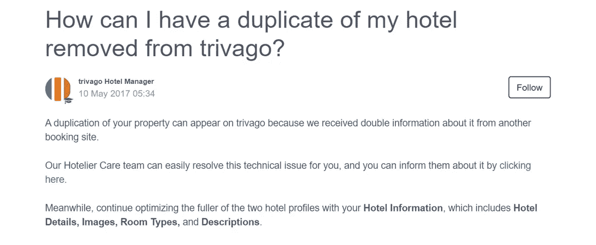
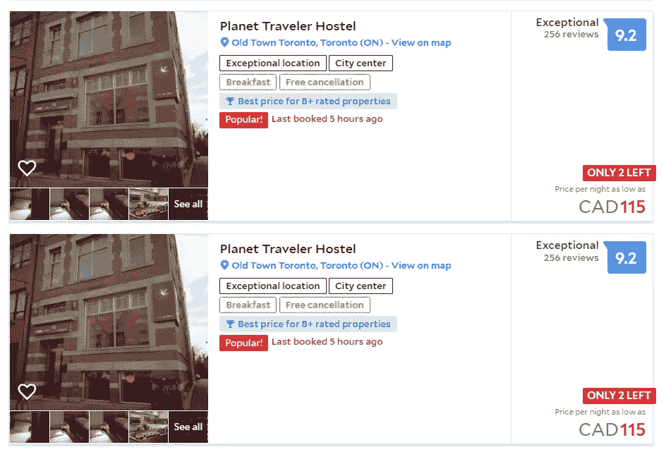
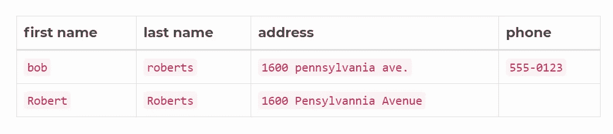
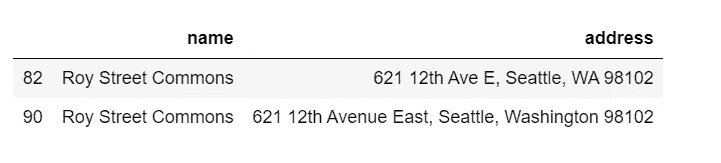
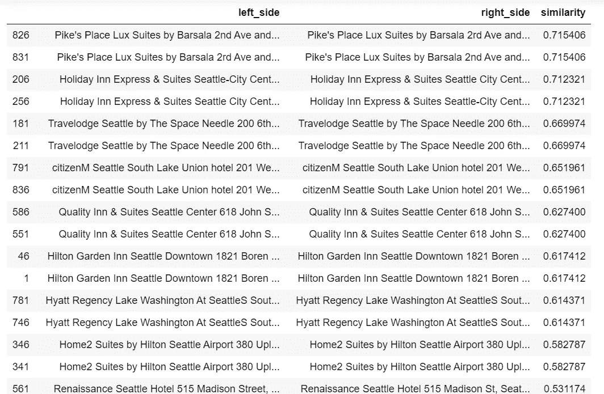
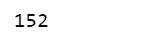

# 从头开始消除重复记录

> 原文：<https://towardsdatascience.com/de-duplicate-the-duplicate-records-from-scratch-f6e5ad9e79da?source=collection_archive---------13----------------------->



Photo credit: Trivago

## 识别相似记录，稀疏矩阵乘法

网络世界充满了重复的列表。特别是，如果你是一个在线旅行社，你接受不同的供应商为你提供相同的财产信息。

有时重复的记录是显而易见的，这让你想:这怎么可能？



Photo credit: agoda

还有一次，两个记录看起来像是重复的，但是我们不确定。


Photo credit: expedia

或者，如果您为一家拥有大量公司或客户数据的公司工作，但是因为这些数据来自不同的源系统，而这些系统通常以不同的方式写入。那么您将不得不处理重复的记录。



Photo credit: dedupe.io

# 数据

我觉得最好的数据集是用我自己的。使用我不久前创建的西雅图酒店数据集。我去掉了酒店描述特征，保留了酒店名称和地址特征，并特意添加了重复记录，数据集可以在这里找到[。](https://raw.githubusercontent.com/susanli2016/NLP-with-Python/master/data/Seattle_Hotels_Duplicates.csv)

两个酒店如何重复的例子:

duplicate.py



Table 1

最常见的复制方式是街道地址的输入方式。一些人使用缩写，另一些人没有。对于人类读者来说，很明显上面的两个列表是同一个东西。我们将编写一个程序来确定并删除重复的记录，只保留一个。

# TF-IDF + N-gram

*   我们将使用名称和地址作为输入要素。
*   我们都熟悉 tfidf 和 n-gram 方法。
*   我们得到的结果是一个稀疏矩阵，每行是一个文档(name_address)，每列是一个 n 元文法。为每个文档中的每个 n 元语法计算 tfidf 分数。

tfidf_ngram.py

# 稀疏点顶

我发现了一个由 ING 批发银行、 [sparse_dot_topn](https://github.com/ing-bank/sparse_dot_topn) 开发的优秀的[库，它只存储每个项目的前 N 个最高匹配，我们可以选择显示高于阈值的最高相似性。](https://medium.com/wbaa/https-medium-com-ingwbaa-boosting-selection-of-the-most-similar-entities-in-large-scale-datasets-450b3242e618)

它声称，它提供了一种更快的方法来执行稀疏矩阵乘法，然后是 top-n 乘法结果选择。

该函数将以下内容作为输入:

*   a 和 B:两个 CSR 矩阵
*   ntop: n 个最佳结果
*   lower _ bound:A * B 的元素必须大于输出的阈值

输出是一个结果矩阵。

awesome_cossim_top.py

运行该功能后。该矩阵仅存储前 5 个最相似的酒店。

以下代码解包生成的稀疏矩阵，结果是一个表，其中每个酒店将与数据中的每个酒店匹配(包括其自身)，并计算每对酒店的余弦相似性得分。

get_matches_df.py

除了它本身，我们只对顶级赛事感兴趣。因此，我们将视觉检查结果表排序相似性得分，其中我们确定一个阈值一对是相同的属性。

```
matches_df[matches_df['similarity'] < 0.99999].sort_values(by=['similarity'], ascending=False).head(30)
```



Table 2

我决定我的安全赌注是删除任何相似性得分高于或等于 0.50 的配对。

```
matches_df[matches_df['similarity'] < 0.50].right_side.nunique()
```



在那之后，我们现在还有 152 处房产。如果你记得，[在我们的原始数据集中，我们有 152 个属性](/building-a-content-based-recommender-system-for-hotels-in-seattle-d724f0a32070)。

[Jupyter](https://github.com/susanli2016/NLP-with-Python/blob/master/Dedupe.ipynb) 笔记本和[数据集](https://github.com/susanli2016/NLP-with-Python/blob/master/data/Seattle_Hotels_Duplicates.csv)可以在 [Github](https://github.com/susanli2016/NLP-with-Python) 上找到。祝你一周工作顺利！

参考资料:

[https://github . com/ing-bank/sparse _ dot _ topn/blob/master/sparse _ dot _ topn/awesome _ cossim _ topn . py](https://github.com/ing-bank/sparse_dot_topn/blob/master/sparse_dot_topn/awesome_cossim_topn.py)

 [## Python 中的超快速字符串匹配

### 传统的字符串匹配方法，如 Jaro-Winkler 或 Levenshtein 距离度量，对于…

bergvca.github.io](https://bergvca.github.io/2017/10/14/super-fast-string-matching.html)