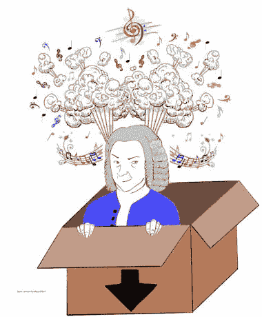
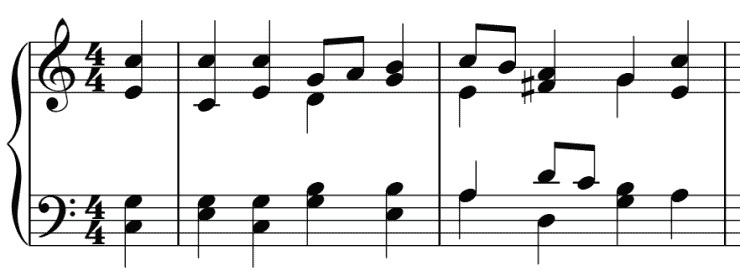

# 去谷歌搜索巴赫

> 原文：<https://towardsdatascience.com/de-googling-bach-counterpointing-bachs-rules-of-the-road-with-american-populist-music-ccbaa27a149f?source=collection_archive---------14----------------------->

# 将巴赫的《公路规则》与美国民粹主义音乐进行对比

“Thnking Outside the Bachs” by Max Harper Ellert

本周，我玩谷歌涂鸦从简单的旋律中创造巴赫和声，玩得很开心。浏览一些关于融合人工智能的过程和对位原则的文章也很有趣，比如艾丽莎·拜尔娜的这篇综合文章[和微软音乐理论工程师丹尼尔·汤普金斯的一篇精心构思的文章中对涂鸦的回应:](https://slate.com/technology/2019/03/google-doodle-bach-ai-music-generator.html)[谷歌的巴赫人工智能。](https://medium.com/@tompkinsguitar/googles-bach-ai-a-machine-learning-scientist-with-a-phd-in-music-theory-reacts-68d055f2461d)

这些文章和许多其他文章倾向于解释和批评这一过程，对人工智能在正确遵循对位规则方面缺乏成功提出了一些批评。虽然对我来说，一些由音乐家和非音乐家创作的曲调充斥着交叉的声音、平行的音程、怪异的节奏和狂野的跳跃，有些甚至相当俏皮，但你仍然有一个古老的难题，即猴子与打字机和莎士比亚的比例。没有一台机器，无论程序设计得多么好，多么聪明，能够重现巴赫的天才。

为了证明这一点，我在 Feste Burg 涂鸦了*——最熟悉的巴赫合唱曲之一。所以我可以分享它，我把它写到我的符号程序中，作为下面的 png 图形导入。这是最初的协调:*

Ein Feste Burg, Bach’s original harmonization

我不能准确地把它写进去——涂鸦不允许记笔记。但由于涂鸦似乎存在于节拍之外，并且使用节拍作为地标，而不是形成节拍逻辑，这似乎并不重要。涂鸦带回来的东西和原来的没什么不同，但显然没有魔力。你可能会认为这是一个展示它的东西的绝佳机会，但我猜 *Ein Feste Burg* 不是用来载入电脑的 360 首曲子之一(她说，双臂交叉，双脚轻敲)。

Ein Feste Burg as seen by Google Doodle

然后我肯定去了一个野毛。我放了两小节 1941 年的流行蓝调音乐，约翰尼·默瑟和哈罗德·阿伦的《夜色中的蓝调》(我妈妈告诉我的)，看看会发生什么。这两个小节来自合唱部分的火车汽笛部分— *“一声呜呼，一声呜呼”*其中旋律跳过一个三度音，滑到第五度，然后在第二个“汽笛”时回到第四度。这与《西区故事》中伯恩斯坦的《玛丽亚》的开场有着相同的动机。像这样:

最初的动机有一个引出三连音的八分音符。我看不出涂鸦中的三连音，所以我只能用第八个音符。我想看看如果我强制拾音会有什么效果，所以我在第一小节结束时将第八个音符拾音。然后点击“和声”，让它进城。AI doodle 疯了！它不能解析这个信号，所以它写了一堆笔记来引导我的动机。以下是巴布亚新几内亚:

Google Doodle can’t handle the blues

正如你所看到的，它看起来很奇怪——如果你能在钢琴上演奏它，它听起来很奇怪。它一点也不像巴赫，但听起来也不像《夜色中的布鲁斯》。我非常震惊。

然后，当我着手沏一杯茶时，我有了一点小小的惊喜(这是一个人神志不清后所必需的)。降半音——蓝调——三度、五度、六度，在我们所有的民粹主义文学中都能立即辨认出来:蓝调、节奏蓝调、爵士、摇滚，而不仅仅是美国歌曲集的一点点。为什么蓝调音乐会让巴赫在坟墓里翻身？啊哈！

因为规则不一样。

巴赫的对位法到今天有 250 年的演变时间。与美国民粹主义联系最紧密的音乐的大部分基本构件都是在 1940 年建立的，在摇滚乐的发展过程中加入了一些曲折和呐喊。随着规则的改变，对这种演变最有责任的一群美国人可能是非裔美国人，他们从战前在田间劳作时用来保持理智的蓝调圣歌开始。

请注意，野外圣歌和夜晚的布鲁斯没有太多相似之处。现场喊叫声、圣歌和回应叫喊声是非常典型的。来自锡盘巷的蓝调歌曲非常自然。换句话说，他们遵循我们所遵循的以欧洲为基础的作曲规则。学生们在音乐学院里汗流浃背，但有点反常。20 世纪，无论是在艺术音乐还是迅速发展的民粹主义形式中，大多数对位法的规则都变得宽松了(很多)。然而，我们的流行音乐，尤其是 20 世纪上半叶的流行音乐，与古典主义(想想:莫扎特)相比，与巴洛克音乐有更多的共同点，但即使它坚持现在几乎是我们音乐 DNA 一部分的古老的六二五一和声结构，流行音乐也遵循着自己的逻辑，将它与古典主义区分开来。那么，巴洛克对位只是和声结构中的低语。一个重要的耳语，是的，但消退了。

许多民粹主义逻辑与非裔美国人、拉丁美洲人和各种移民对我们音乐的贡献有关。田野圣歌的蓝调，桑巴舞的交叉节奏，阿巴拉契亚民歌曲调的圣歌般的形式都演变成了我们称之为我们自己的音乐，并从那里继续演变。如今，蔓越莓的印地音乐与吉米·罗杰斯音乐并没有太大的不同——在大多数情况下，它归结于添加的层次、复杂的和声和大量的机械处理。理解不同的文化对音乐有不同的理解并不是一个很大的飞跃，但是亲爱的读者们，我希望你们考虑的是进化是如何发生的。

当然，通过打破规则。

显而易见，20 世纪美国民粹主义音乐与巴洛克对位法存在(认知)不和谐，所以有人会问，我们为什么还要为巴赫的谷歌涂鸦这样的东西费心。我有几句话要说，但我现在的观点是，如果我们把一首田间圣歌演变成一首流行歌曲，或者一首调式民谣演变成一首印度流行歌曲，那么我们为什么不能把所有这些音乐的基本 DNA 转变成一种新的古典形式呢？

戏弄、强迫或哄骗平民音乐成为一套新的对位规则？嗯…

这丝毫无损巴赫的贡献！如果他今天突然还活着(在一个主要的文化调整期之后)，他会对我们可以获得的各种音乐感到惊讶，我相信他会喜欢的。你知道，他是个吉格斯爵士。在为他的周日演出创作清唱剧的间隙，他在咖啡馆演奏——如果你愿意的话，也可以说是巴洛克鸡尾酒大键琴。他利用现有的材料，并将其与自己的即兴才华相结合。纵观历史，作曲家都知道天才的标志是能够窃取音乐并使其焕然一新(而不会被起诉)。

那么，如果我们的音乐不符合巴洛克式对位法的限制，那又怎么样呢？谷歌涂鸦很有趣，音乐制作也应该有趣，并以允许人们探索的方式呈现。我度过了一个愉快的周六下午，摆弄着涂鸦，把我的努力改写成西贝柳斯。对于新手来说，我可以看到这可以让创作音乐的神秘过程变得不那么神秘(尽管正如我们从结果中看到的那样，并不那么复杂)——有点像科学探索博物馆。音乐是一门科学，所以应该有音乐探索馆，你觉得呢？

然而，如果谷歌推出这些有趣的小应用有什么好处的话，必须有两种理解。

一是巴赫给我们留下了一份巨大的遗产，我们当前音乐文化的一切都依赖于此。从我们西方文化教育音乐的角度来看，我们整个音乐知识的很大一部分来源于他的变革性作品。每当我的学生领会到五度圈近乎形而上学的意义，并意识到如果没有巴赫，音乐物理学的原始真理就不会在我们的掌握之中时，我都会泪眼模糊。

其次，考虑到我们现在已经在这条路上走了 250 多年，我们是不同时代的不同文化和不同的人，音乐*必须*继续发展的方式取决于我们现在是谁，在我们丰富多彩的多样性中。*学校教育*是一个传统问题，也是如何呈现的问题。这让我想到了苏族萨满要学习 10 年或更长时间才能成为强大的治疗师——这与通过塔夫茨医学院所花的时间差不多。

无论如何，不管我们喜不喜欢，文化转型就在此时此地发生，所以让我们顺其自然吧。但是，仅仅因为我们停止抵制文化变革，并不意味着我们要抛弃好的旧方式。事实上，我们依靠这种智慧来保持我们对艺术的诚实。这可以追溯到亚里士多德。

这里有几个听力选择给你。首先，一个神话般的版本*蓝调之夜*，由艾拉·费兹杰拉献上

[https://youtu.be/hXhxXYgKXd8](https://youtu.be/hXhxXYgKXd8)

然后，你可以在威廉·格兰特·斯蒂尔的《非裔美国人交响曲》第一乐章中听到一些相同的降蓝音符。这是一部伟大的作品，你不必太费力就能看出音乐中固有的古典结构。

[https://youtu.be/2OXmKehGDmE](https://youtu.be/2OXmKehGDmE)