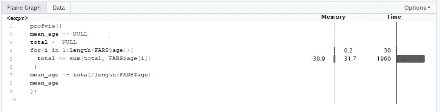
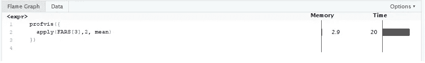
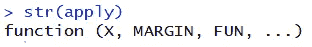
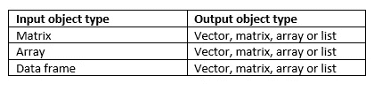
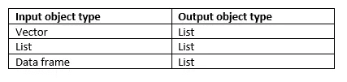
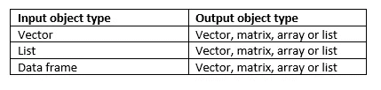

# 在 R 中处理应用函数

> 原文：<https://towardsdatascience.com/dealing-with-apply-functions-in-r-ea99d3f49a71?source=collection_archive---------9----------------------->


Apply functions in R

迭代控制结构(像 for、while、repeat 等循环。)允许多次重复指令。然而，在大规模数据处理中，使用这些循环会消耗更多的时间和空间。借助于 **Apply** 函数，r 语言有一种更高效、更快速的方法来执行迭代。

在这篇文章中，我将从视觉角度讨论`**apply**`函数在循环中的效率，然后进一步讨论`**apply**` 家族的成员。

在进一步讨论`**apply**`函数之前，让我们先看看与基本循环相比，使用`**apply**`函数的代码执行如何花费更少的迭代时间。

考虑在 r 的`gamclass`包中可用的`**FARS(Fatality Analysis Recording System)**`数据集。它包含 17 个不同特征的 151158 个观察值。该数据集包括至少有一人死亡的所有事故，数据仅限于前排乘客座位有人的车辆。

现在让我们假设我们想要计算年龄列的平均值。这可以使用传统的循环和应用函数来完成。

方法 1:使用 for 循环

```
library("gamclass")
data(FARS)
mean_age <- NULL
total <- NULL
for(i in 1:length(FARS$age)){
  total <- sum(total, FARS$age[i])
 }
mean_age <- total/length(FARS$age)
mean_age
```

方法 2:使用 apply()函数

```
apply(FARS[3],2, mean)
```

现在让我们借助`Profvis`包，通过可视化模式来比较这两种方法。

`Profvis` 是一个代码剖析工具，它提供了一个交互式图形界面，用于可视化指令在整个执行过程中的内存和时间消耗。

为了使用`profvis`，把指令放在`profvis()`中，它在 R studio 的一个新标签中打开一个交互式的 profile visualizer。

```
#for method 1
profvis({
mean_age <- NULL
total <- NULL
for(i in 1:length(FARS$age)){
  total <- sum(total, FARS$age[i])
 }
mean_age <- total/length(FARS$age)
mean_age
})
```

使用方法 1 输出



在火焰图选项卡下，我们可以检查指令所用的时间(毫秒)。

```
#for method 2
profvis({
  apply(FARS[3],2, mean)
})
```

使用方法 2 输出



在这里，人们可以很容易地注意到，使用方法 1 所花费的时间几乎是 1990 ms (1960 +30)，而对于方法 2，它仅仅是 20 ms。

## 应用函数优于传统循环的优势

1.  执行起来更有效率和更快。
2.  易于遵循的语法(而不是使用 apply 函数只编写一行代码来编写一组指令)

## 在 R 中应用系列

Apply family 包含各种不同的函数，适用于不同的数据结构，如列表、矩阵、数组、数据框等。apply 家族的成员有`apply()`、`lapply()`、`sapply()`、`tapply()`、`mapply()`等。这些函数是循环的替代品。

每个应用函数至少需要两个参数:一个对象和另一个函数。该函数可以是任何内置的(如平均值、总和、最大值等。)或用户自定义函数。

# 浏览成员

## 1.apply()函数

`apply()`的语法如下



其中`X` 是一个输入数据对象，`MARGIN`表示函数如何适用于行或列，margin = 1 表示行，margin = 2 表示列，`FUN`指向一个内置或用户定义的函数。

输出对象类型取决于输入对象和指定的函数。`apply()`可以返回不同输入对象的向量、列表、矩阵或数组，如下表所述。



```
#---------- apply() function ---------- 
#case 1\. matrix as an input argument
m1 <- matrix(1:9, nrow =3)
m1
result <- apply(m1,1,mean)   #mean of elements for each row
result
class(result)                #class is a vector
result <- apply(m1,2,sum)    #sum of elements for each column
result
class(result)                #class is a vector
result <- apply(m1,1,cumsum) #cumulative sum of elements for each row
result                       #by default column-wise order
class(result)                #class is a matrix
matrix(apply(m1,1,cumsum), nrow = 3, byrow = T) #for row-wise order 
#user defined function 
check<-function(x){
  return(x[x>5])
}
result <- apply(m1,1,check)  #user defined function as an argument
result
class(result)                #class is a list#case 2\. data frame as an input
ratings <- c(4.2, 4.4, 3.4, 3.9, 5, 4.1, 3.2, 3.9, 4.6, 4.8, 5, 4, 4.5, 3.9, 4.7, 3.6)
employee.mat <- matrix(ratings,byrow=TRUE,nrow=4,dimnames = list(c("Quarter1","Quarter2","Quarter3","Quarter4"),c("Hari","Shri","John","Albert")))
employee <- as.data.frame(employee.mat)
employee
result <- apply(employee,2,sum)     #sum of elements for each column
result
class(result)                       #class is a vector
result <- apply(employee,1,cumsum)  #cumulative sum of elements for each row
result                              #by default column-wise order
class(result)                       #class is a matrix
#user defined function 
check<-function(x){
  return(x[x>4.2])
}
result <- apply(employee,2,check)   #user defined function as an argument
result
class(result)                       #class is a list
```

## 2.`lapply()`功能

`lapply()`总是返回一个列表，`lapply()`中的‘l’指的是‘list’。`lapply()`处理输入中的列表和数据帧。`MARGIN`此处不需要参数，指定的函数仅适用于列。请参考下表了解输入对象和相应的输出对象。



```
#---------- lapply() function ---------- 
#case 1\. vector as an input argument
result <- lapply(ratings,mean)
result
class(result)                       #class is a list#case 2\. list as an input argument
list1<-list(maths=c(64,45,89,67),english=c(79,84,62,80),physics=c(68,72,69,80),chemistry = c(99,91,84,89))
list1
result <- lapply(list1,mean)
result
class(result)                       #class is a list
#user defined function
check<-function(x){
  return(x[x>75])
}
result <- lapply(list1,check)       #user defined function as an argument
result
class(result)                       #class is a list#case 3\. dataframe as an input argument
result <- lapply(employee,sum)     #sum of elements for each column
result
class(result)                       #class is a list
result <- lapply(employee,cumsum)  #cumulative sum of elements for each row
result                              
class(result)                       #class is a list
#user defined function 
check<-function(x){
  return(x[x>4.2])
}
result <- lapply(employee,check)   #user defined function as an argument
result
class(result)                      #class is a list
```

`**apply()**`**vs**`**lapply()**`

*   `lapply()`总是返回一个列表，而`apply()`可以返回一个向量、列表、矩阵或数组。
*   `lapply()`中没有`MARGIN`的范围。

## 3.`sapply()`功能

`sapply()`是`lapply()`的简化形式。它有一个额外的参数`**simplify**` ，默认值为 true **，**如果`simplify = F`那么`sapply()`返回一个类似于`lapply()`的列表，否则返回最简单的输出形式。

请参考下表了解输入对象和相应的输出对象。



```
#---------- sapply() function ---------- 
#case 1\. vector as an input argument
result <- sapply(ratings,mean)
result
class(result)                       #class is a vector
result <- sapply(ratings,mean, simplify = FALSE)
result 
class(result)                       #class is a list
result <- sapply(ratings,range)
result
class(result)                       #class is a matrix#case 2\. list as an input argument
result <- sapply(list1,mean)
result
class(result)                       #class is a vector
result <- sapply(list1,range)
result
class(result)                       #class is a matrix
#user defined function
check<-function(x){
  return(x[x>75])
}
result <- sapply(list1,check)       #user defined function as an argument
result
class(result)                       #class is a list#case 3\. dataframe as an input argument
result <- sapply(employee,mean)
result
class(result)                       #class is a vector
result <- sapply(employee,range)
result
class(result)                       #class is a matrix
#user defined function
check<-function(x){
  return(x[x>4])
}
result <- sapply(employee,check)    #user defined function as an argument
result
class(result)                       #class is a list
```

## 4.`tapply()`功能

`tapply()`在处理分类变量时很有用，它将一个函数应用于分布在不同类别中的数字数据。`tapply()`最简单的形式可以理解为

`tapply(column 1, column 2, FUN)`

其中`column 1`是函数应用的数字列，`column 2`是因子对象，`FUN`是要执行的函数。

```
#---------- tapply() function ---------- 
salary <- c(21000,29000,32000,34000,45000)
designation<-c("Programmer","Senior Programmer","Senior Programmer","Senior Programmer","Manager")
gender <- c("M","F","F","M","M")
result <- tapply(salary,designation,mean)
result
class(result)                       #class is an array
result <- tapply(salary,list(designation,gender),mean)
result
class(result)                       #class is a matrix
```

## 5.by()函数

`by()`执行与`tapply()`类似的工作，即对分布在不同类别中的数值向量值进行运算。`by()`是`tapply()`的一个包装函数。

```
#---------- by() function ---------- 
result <- by(salary,designation,mean)
result
class(result)                       #class is of "by" type
result[2]                           #accessing as a vector element
as.list(result)                     #converting into a list
result <- by(salary,list(designation,gender),mean)
result
class(result)                       #class is of "by" type
library("gamclass")
data("FARS")
by(FARS[2:4], FARS$airbagAvail, colMeans)
```

## 6.`mapply()`功能

`mapply()`中的“m”是指“多元”。它将指定的函数逐个应用于参数。请注意，在这里，function 被指定为第一个参数，而在其他应用函数中，它被指定为第三个参数。

```
#---------- mapply() function ---------- 
result <- mapply(rep, 1:4, 4:1)
result
class(result)                       #class is a list
result <- mapply(rep, 1:4, 4:4)
class(result)                       #class is a matrix
```

**结论**

我相信我已经介绍了所有最有用和最流行的 apply 函数以及所有可能的输入对象组合。如果你认为缺少了什么或者需要更多的输入。在评论里告诉我，我会加进去的！