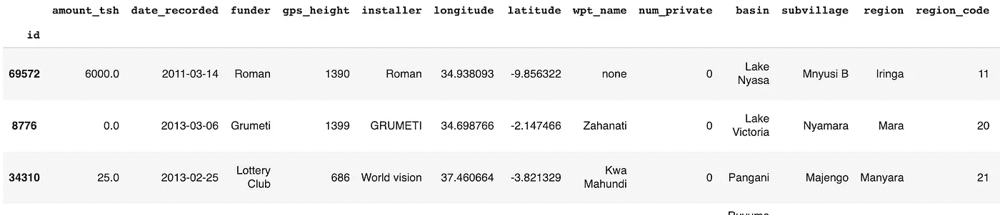
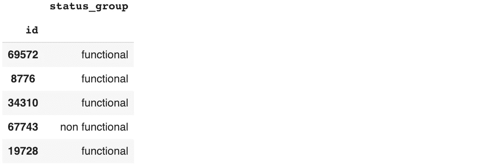
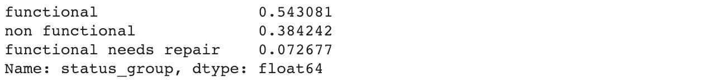
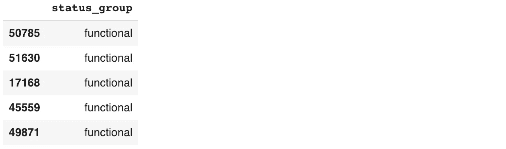
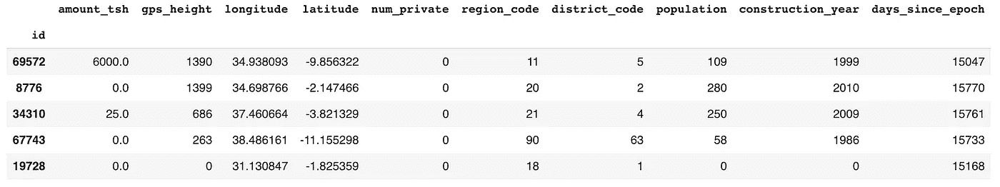
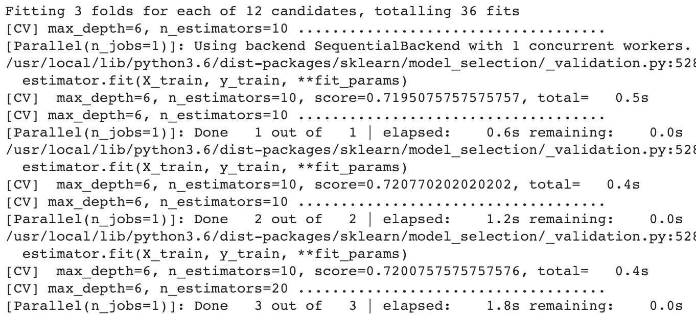
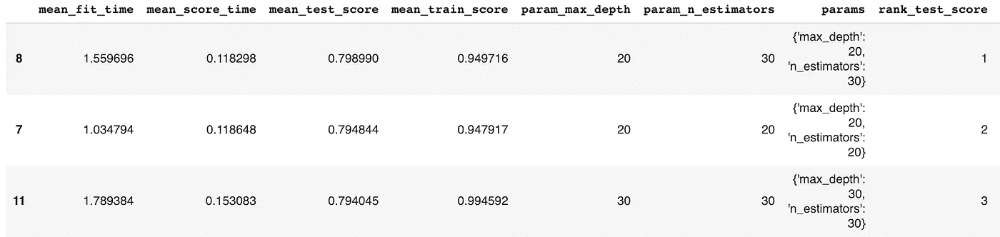

# 快速处理分类数据—一个例子

> 原文：<https://towardsdatascience.com/dealing-with-categorical-data-fast-an-example-d4329b44253d?source=collection_archive---------4----------------------->


早上 9 点你在办公室。你的老板进来，给了你一些数据，并要求你在中午 12 点之前创建一个模型。将召开一次会议，会上将展示这个模型。你是做什么的？

我们将查看来自私人 Kaggle 竞赛的示例数据集，创建一些快速模型并选择一个。完整的 github 库在这里是。

我们得到了训练数据集(特征和目标)。我们还获得了测试特性数据集，并被要求预测测试目标。为了测试您的预测，您创建了一个预测文件并将其上传到 Kaggle。然后 Kaggle 会给你一个分数(数值从 0 到 1)。值越高，你的预测就越好。我们将重点关注准确度分数，因为这是 Kaggle 将在本次比赛中测试的分数。

在 Jupyter 笔记本中首先导入您需要的课程。保持这个块是独立的，因为您可以向它添加更多的库并单独执行它。

```
import numpy as np
import pandas as pdfrom sklearn.metrics import accuracy_score
from sklearn.model_selection import train_test_split
from sklearn.model_selection import cross_val_score, GridSearchCV
from sklearn.linear_model import LogisticRegression
from sklearn.tree import DecisionTreeClassifier
from sklearn.ensemble import RandomForestClassifierpd.set_option('display.max_columns', None)  # Unlimited columns.
pd.options.mode.use_inf_as_na = True        # Any inf or -inf is 
                                            # treated as NA.
```

读入训练特征数据:

```
X_train_original = pd.read_csv('./train_features.csv', 
                               header = [0],  # Top row is header.
                               index_col = 0) # First col is index.
X_train_original.head()
```



读入训练目标数据:

```
y_train_original = pd.read_csv('./train_labels.csv', 
                               header = [0],  # Top row is header.
                               index_col = 0) # First col is index.
y_train_original.head()
```



你的目标很明确。让我们看看它有多少个类别:

```
pd.value_counts(y_train_original.status_group, normalize = True)
```



由于一半以上只是一个类别，我们可以预测我们所有的目标值都是“功能性的”。这将在训练数据集上给我们 0.54 的准确度。让我们看看它在测试数据集上做了什么。

# 多数类预测

我们进行多数类预测的原因是为了衡量我们未来的预测分数应该有多好。这给了我们一个基线，我们希望在下一个模型中跨越它。

让我们先来看看测试特性:

```
X_test_original = pd.read_csv('./test_features.csv', 
                              header = [0], 
                              index_col = 0)
X_test_original.shape
```

(14358, 39)

此形状显示我们在预测输出中需要 14358 个值(输入的每行一个)。因此，我们创建了一个具有所需行数的数组，值为“functional”:

```
y_pred = ['functional'] * len(X_test_original)
y_pred = pd.DataFrame(data = y_pred,
                      index = X_test_original.index.values,
                      columns = ['status_group'])
y_pred.head()
```



然后我们把它写到一个文件中，并导入到 Kaggle 中。Kaggle 的准确率为 0.53(这和我们的预期差不多)。区别只是因为测试数据集不包含与训练数据集完全相同的目标类值比例。

# 仅使用数字特征进行预测

```
X_train_numerical = X_train_original.select_dtypes(
                         include = np.number).copy()
```

将“日期 _ 记录”字段转换为“天数 _ 自 _ 纪元”。在计算机编程中，对于 unix 计算机，纪元被认为是 1970 年 1 月 1 日。这只是一个通常使用的惯例——我们可以在这里的任何一天使用。对于机器学习，我们只关心值的相对比例是否相同。

```
days_since_epoch = \
        pd.to_datetime(X_train_original['date_recorded']) \           
            - pd.datetime(1970, 1, 1)
X_train_numerical['days_since_epoch'] = days_since_epoch.dt.days
X_train_numerical.head()
```



```
X_train_numerical_indices = X_train_numerical.index.values
y_train_numerical = y_train_original[y_train_original.index. \
                                    isin(X_train_numerical_indices)]
```

## 逻辑回归

让我们尝试一个逻辑回归分类器:

```
cv_score = cross_val_score(LogisticRegression(), 
                            X_train_numerical, y_train_numerical,
                            scoring = 'accuracy',
                            cv = 3,
                            n_jobs = -1,
                            verbose = 1)
cv_score
```

逻辑回归给我们的分数是 0.55。与多数班级模式没有太大区别。

## 决策图表

决策树分类器怎么样:

```
clf = DecisionTreeClassifier()
cv_score = cross_val_score(clf, 
                            X_train_numerical, y_train_numerical,
                            scoring = 'accuracy',
                            cv = 3,
                            n_jobs = -1,
                            verbose = 1)
cv_score
```

这个分数在 0.65 就好多了。让我们获得测试数据集的预测，并将其写出到文件中。然后我们可以提交给 Kaggle:

```
clf.fit(X_train_numerical, y_train_numerical)
X_test_numerical = X_test_original.select_dtypes(include = \ 
                                                 np.number).copy()
days_since_epoch = pd.to_datetime(X_test_original['date_recorded']) 
                      - pd.datetime(1970, 1, 1)
X_test_numerical['days_since_epoch'] = days_since_epoch.dt.daysy_pred = clf.predict(X_test_numerical)y_pred = pd.DataFrame(data = y_pred, 
                      index = X_test_numerical.index.values,
                      columns = ['status_group'])y_pred.to_csv('./decision_tree_pred.csv', 
              header = ['status_group'],
              index = True,
              index_label = 'id')
```

# 检查数据中是否有缺失值或异常值

```
X_train_original.isnull().sum()
```

39 个要素中有 7 个要素的值为空。让我们放弃这些功能:

```
X_non_nulls = X_train_original.dropna(axis = 1)
```

让我们找出每个特征中有多少个唯一值:

```
X_non_nulls.nunique().sort_values(ascending = True)
```

根据[这篇文章](https://medium.com/data-design/visiting-categorical-features-and-encoding-in-decision-trees-53400fa65931)，当分类值编码为数字或二进制时，决策树分类器更快。
让我们对具有< 50 个唯一值的非空列进行编码，将数字列添加到数据帧中，并运行不同深度的决策树分类器。

```
X_selected = X_non_nulls.loc[:, X_non_nulls.nunique().sort_values()\
                             < 50]
cat_cols = list(X_selected.select_dtypes(['object']).columns.values)X_categorical = X_selected[cat_cols]. \
                  apply(lambda x: x.astype('category').cat.codes)
X_train_selected = X_train_numerical.join(X_categorical)clf = DecisionTreeClassifier()
cv_score = cross_val_score(clf, 
                            X_train_selected, y_train_original,
                            scoring = 'accuracy',
                            cv = 3,
                            n_jobs = -1,
                            verbose = 1)
cv_score
```

这给了我们 0.75 分。这是训练分数，所以我们应该将相同的分类器应用于测试数据，并请 Kaggle 评估其准确性:

```
clf.fit(X_train_selected, y_train_original)X_test_non_nulls = X_test_original.dropna(axis = 1)
X_test_selected = X_test_non_nulls.loc[:, \
                      X_test_non_nulls.nunique().sort_values() < 50]cat_cols = list(X_test_selected.select_dtypes(['object']). \
              columns.values)
X_test_categorical = X_test_selected[cat_cols]. \
                        apply(lambda x: \ 
                                  x.astype('category').cat.codes)X_test_selected = X_test_numerical.join(X_test_categorical)y_pred = clf.predict(X_test_selected)
y_pred = pd.DataFrame(data = y_pred, 
                      index = X_test_selected.index.values,
                      columns = ['status_group'])
```

测试数据集给我们的分数是 0.76，这个分数更高，因为我们的模型对测试数据集的拟合程度肯定比训练数据集好一点。仍然在相同的值左右，这是意料之中的。

# 既然我们的决策树给了我们一个好的结果，让我们试试随机森林分类器

随机森林分类器适用于多项目标(具有多个分类值的目标)。该分类器从训练数据集中随机抽取样本，因此不需要对其进行交叉验证。我们可能会做 GridSearchCV 来尝试不同的 n_estimators 和 max_depth(如果我们的分数不是很好的话)。

随机森林分类器由许多决策树组成。通过从整个特征列表中随机选择树的每个节点处的特征来创建每个树。与单个决策树分类器相比，树的数量给予随机森林分类器更少的偏差。

```
X_train, X_test, y_train, y_test = train_test_split(
    X_train_selected, y_train_original, test_size=0.2)clf = RandomForestClassifier()
clf.fit(X_train, y_train)
clf.score(X_test, y_test)
```

决策树分类器给我们的分数是 0.79。很好，但是没有以前跳得高。这是我们通常会发现的情况——早期的模型通常得分较低，可以很容易地被击败，但后期的模型很难被击败。我们还没完呢。我们将使用网格搜索来搜索最佳随机森林分类器:

```
param_grid = {
    'n_estimators': [10, 20, 30],
    'max_depth': [6, 10, 20, 30]
}gridsearch = GridSearchCV(RandomForestClassifier(n_jobs = -1), 
                          param_grid=param_grid, 
                          scoring='accuracy', cv=3, 
                          return_train_score=True, verbose=10)gridsearch.fit(X_train, y_train)
```



param_grid 是分类器所需参数的字典。如果您不确定在这个字典中放入什么，可以使用这个函数调用，它会给出您可以使用的参数列表:

```
RandomForestClassifier().get_params().keys()
```

在 GridSearchCV 函数内部，我们用 n_jobs = -1 创建了一个 RandomForestClassifier 对象。这将允许我们使用机器上的所有内核，从而使这个作业运行得更快。

变量“cv”给出了该网格搜索应该使用的交叉验证折叠数。cv = 3 会将我们的数据分成 3 个相等的部分，然后使用其中的两个部分来训练 RandomForest 分类器，并使用剩余的数据进行测试。它会一直这样做，直到所有的组合都用完为止。

verbose 值将告诉 grid search 要打印多少信息。值越大，打印的信息越多。值为 10 时，您将会看到在 param_grid 字典中指定的变量值的每个组合与测试/训练分割的迭代编号一起打印出来。您还将看到在数据的测试部分获得的分数。您不必阅读所有内容，我们会打印出一份更易于阅读的摘要:

```
pd.DataFrame(gridsearch.cv_results_).sort_values( \
                                         by='rank_test_score')
```



此数据帧的顶行显示了 param_grid 选项，这些选项在数据的测试部分给出了最好的分数。这显示在 mean_test_score 列中，我们的分数是 0.79。这与决策树分类器相同。

让我们在 Kaggle 测试集上运行这个:

```
clf = RandomForestClassifier(max_depth = 20, 
                             n_estimators = 30, 
                             n_jobs = -1)
clf.fit(X_train, y_train)
clf.score(X_test, y_test)
```

我们得到了 0.81 分。这与决策树分类器得分 0.79 没有太大的不同。不同的是决策树有偏差，而随机森林没有。如果你在多组新的测试数据上测试这个随机森林分类器，你会发现它比决策树分类器做得更好。

# 结论

既然你知道随机森林比决策树更好，也许你可以使用以下步骤更快地找到解决方案:

1.  永远，永远，先做个快速预测。对于像这样的分类问题，如果目标中有一个多数类，多数类预测将是一个好的开始。
2.  如果有很少的空值(或者如果它们只存在于某些特征中)，则丢弃观察值/特征。
3.  删除具有大量值的分类要素。他们可能不会做出好的特写。此外，删除具有单一值的要素，因为它们无法区分不同的类。
4.  将日期转换为天或秒(为了更精确)。大多数分类器都是和数字一起工作的，所以最好都给它们数字。将分类列转换为数字。
5.  不要运行决策树分类器，因为它是有偏见的，只需用随机森林分类器运行网格搜索。