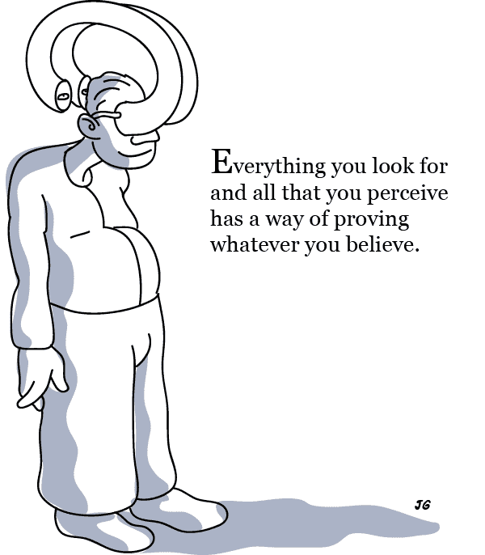

# 处理认知偏差:数据科学家的观点

> 原文：<https://towardsdatascience.com/dealing-with-cognitive-biases-a-data-scientist-perspective-5c359d1e3a2d?source=collection_archive---------14----------------------->

偏见是影响我们日常生活的一个重要原则。我们都有自己的偏见，这些偏见是由我们的生活经历、教育、文化和社会交往形成的。偏见这个词与负面含义和偏见联系在一起，但在帮助人类在史前时代生存下来的“认知偏见”这个总括术语下，还有一个完全不同的偏见类别。

认知偏差是我们进化过程的结果。它们旨在通过在关键的时间敏感的情况下做出快速决策来帮助我们生存，并处理人类大脑有限的信息处理能力。简单地说，他们是我们*直觉*背后的原因。这些偏见往往会导致违背事实的非理性行为，并导致判断上的系统性错误。

在过去的 70 年里，社会心理学和行为经济学领域的研究人员发现了 200 多种不同的偏见。他们研究了这些偏见如何影响金融、管理和临床判断等领域。

随着数据科学模型在真实世界应用(如信用评分、欺诈检测、个人推荐)中的流行程度不断提高，数据科学家对认知偏差有更透彻的理解至关重要。通过意识到人类判断中的这些系统性错误，我们有望采取必要的措施，并在构建精确模型的方法中更加自觉。

数据科学项目通常包括五个主要步骤，

1.  理解业务问题
2.  数据收集和清理
3.  探索性数据分析
4.  模型构建和验证
5.  洞察和交流结果

没有多少人关注覆盖数据科学项目中由于认知偏差而出现的盲点的必要性。下面，我列出了可能影响数据科学生命周期几个阶段的相关偏见。

## 数据收集

一旦数据科学家很好地理解了业务问题，他们就需要准备一个数据集来构建模型。在这个阶段，我们需要小心生存偏差、可用性偏差等引入的逻辑错误。

***生存偏差*** 的产生是由于人类倾向于关注那些被选择的或成功超过潜在标准的数据点。

例如，如果我们开始建立一个模型来预测成功企业家的特征，那么现有的数据很可能主要集中在那些在企业中发家致富的人身上，而不是那些在创业过程中失败的人。我们都知道如果我们只建立正面标签的模型会有什么样的结局。

***可用性偏差*** 是一种认知捷径，导致过度依赖我们能立即想到的事件或数据。通常，这种偏差可能会导致忽略可能会提高模型性能的新数据源。

例如，如果手头的任务是建立一个信用风险模型，我们的思维过程会引导我们收集财务和人口统计信息，因为这些信息很容易获得，也很容易收集。

我们并不真正关注可以从用户的网络浏览模式中推断出的个性特征。由于金融稳定并不意味着现实世界中偿还贷款的倾向，我们的模型将无法捕捉到这一信号。

## 探索性数据分析

数据探索是交付成功模型的关键部分。仔细的 EDA 提供了对数据的直观理解，并极大地有助于设计新功能。数据科学家需要注意现阶段的聚类错觉、锚定等谬误。

***群集幻觉*** 指人类倾向于在随机事件中寻找模式，当它们不存在的时候。尽管随机性是普遍存在的，我们也很熟悉，但人类心理学的研究表明，我们很难识别它。

由于数据探索的目标是发现数据中的模式，我们更容易因为这种错觉而犯错误。适当的统计测试和持怀疑态度做额外的检查有助于克服这种错觉。

***锚定*** 是一种偏见，这种偏见是由于过于重视首先发现/提供的信息而产生的。我们倾向于在第一手信息的基础上“锚定”我们所有的未来决策。

这是一个经常被电子商务和产品公司利用的原则，通过为第一个项目提供高得多的价格，以便连续的项目可以被认为是“便宜的”

在 EDA 过程中，第一个自变量的非常弱的线性相关性可能会影响我们对后续变量与因变量相关性的解释。拥有一套预定义的指导方针和阈值来指导分析的重要性将有助于克服这种偏见。

## 模型结构

在这个阶段，数据科学家的任务是选择和建立一个机器学习模型，提供最有效和最稳健的解决方案。在这一阶段，由于诸如热手谬误或跟风效应之类的偏见，有可能犯错误。

***热手谬误*** 是一种现象，一个最近经历了成功结果的人被认为在未来的尝试中有更大的成功机会。这在体育运动中最常见，连续获胜的球队被认为是“热门”/“连胜”，因此有望获得更高的成功率。

类似地，我们这些数据科学家经常觉得，在没有检查其他合适模型的情况下，使用在前一个问题中给我们最好分数的模型是好的。

***从众效应*** 是一种认知偏差，它解释了选择某个选项或跟随特定行为的冲动，因为其他人正在这样做。这导致了一个危险的循环，因为越来越多的人继续跟风，使得其他人更有可能跟风。

我们经常在分析中观察到这一点，在分析中，从业者经常追求深度学习/强化学习等时髦词汇，而不理解约束和相关成本。

通过试验一系列合适的机器学习算法和适当的交叉验证周期，我们可以克服模型选择阶段的偏差。

## 模型解释

在我们成功地构建了一个模型之后，同样重要的是解释模型输出，并提出一个连贯的故事以及可操作的见解。由于确认偏差，这一关键阶段可能会受到影响。

***确认偏差*** 是所有偏差中最流行、最普遍的认知偏差。我们只听到我们想听到的，我们只看到我们想看到的。

我们强大的信念系统迫使我们忽略任何与我们先入为主的观念不符的信息。

任何挑战现有信念的新信息都应该以开放的心态对待。说起来容易做起来难，我同意。

上面提到的认知偏见绝不是一个详尽的清单，还有许多其他的原则和谬误驱动着人类的思维过程。我希望这篇文章为您提供了一些额外的见解，让您在未来的项目中更加怀疑和谨慎。

如果你有兴趣探索更多关于认知偏见的东西，看看巴斯特·本森写的这篇精彩的文章。