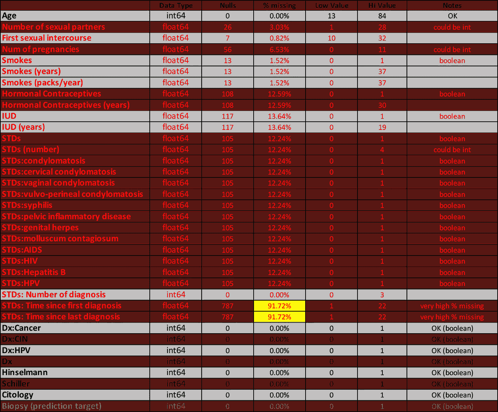
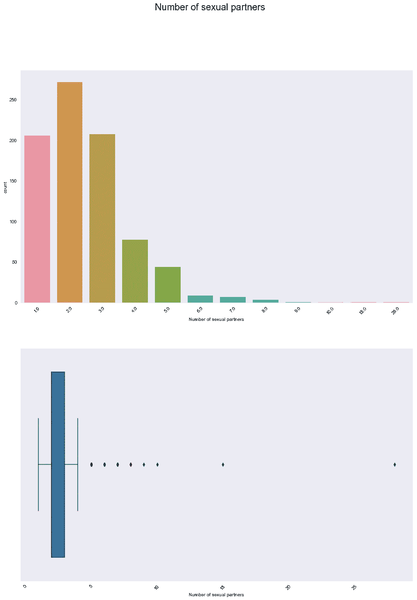
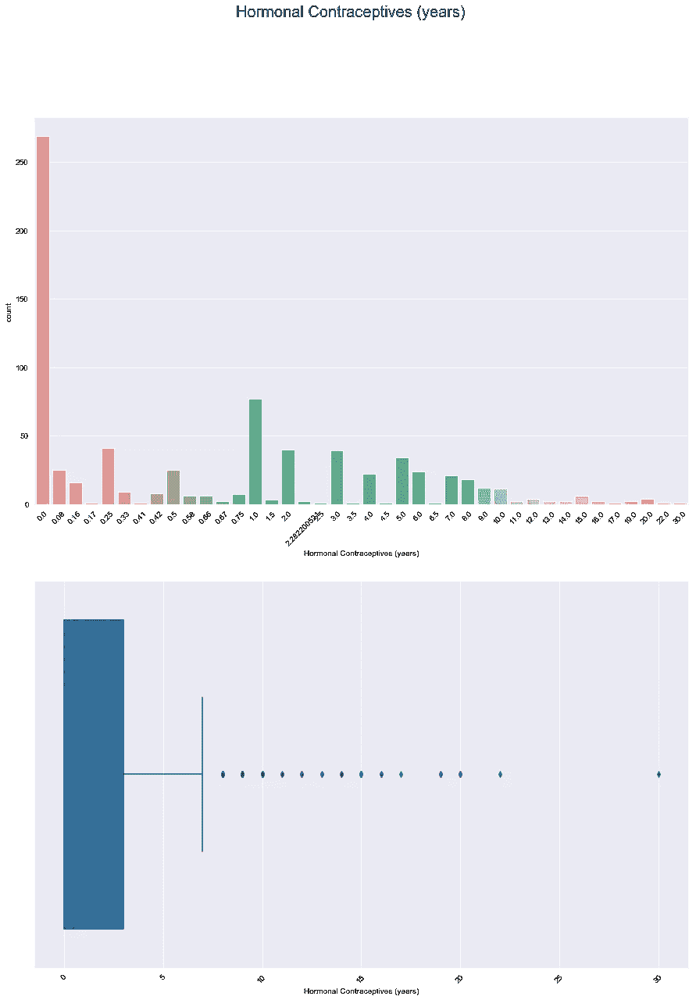

# 处理缺失数据

> 原文：<https://towardsdatascience.com/dealing-with-missing-data-17f8b5827664?source=collection_archive---------20----------------------->


我最近完成了一个使用机器学习预测宫颈癌的项目 Jupyter 笔记本和所有相关的原始资料都可以在这个 GitHub [repo](https://github.com/giorosati/dsc-3-final-project-online-ds-pt-100118) 中找到。该项目的挑战之一是如何处理许多预测变量中的缺失值。本文描述了我是如何处理这些缺失数据的。

许多机器学习模型在遇到缺失数据时会抛出一个错误，并且有许多方法(和观点！)用于处理缺失值。最简单的方法之一是用某个特定变量的平均值来填充缺失值，我见过很多项目都是采用这种方法。它又快又简单，有时还能有好的效果。更困难的是，通过比较缺失值的记录和没有缺失该因子值的类似记录，使用复杂的方法来估算缺失值。每种方法都有优点和缺点，在我看来，最好的选择总是根据具体情况而定。

由于这是我的第一个涉及重大缺失值的机器学习项目，我决定采取一种容易解释的方法，即逐个查看每个因素，以更好地了解每个因素的分布。为此，我查看了计数图、箱线图和中心性度量(均值、中值、众数)。在评估这些信息后，我使用了以下一种或多种方法来处理缺失的信息:

1.  如果因子缺少很大比例记录的值，请从数据集中删除该因子。
2.  如果一小部分记录缺少某个因子的值，请删除这些记录。
3.  向分类因子添加新选项。例如，如果因子有三个值:“val_1”、“val_2”、“val_3”，则可以添加一个额外的“未知”值。现在，因子将有四个值:“val_1”、“val_2”、“val_3”和“未知”。
4.  将布尔因子转换为具有 3 个可能值的分类因子:“真”、“假”和“未知”。
5.  创建一个新的布尔因子，将每条记录分类为包含(或不包含)有关该因子的信息。当然，这使得原始因子中的值仍然缺少一些信息。在这种情况下，原始因子的缺失值将使用剩余选项之一来填充。
6.  用该因子的平均值、中值或众数填充缺失值。
7.  用该因子中已经存在的值之一填充缺失的布尔值或分类值。可以使用因子中出现的每个值的相同比例来随机分配该值，或者如果有一个值出现频率最高，则缺失的值可以用最常见的值来填充。

这是我所处理的数据集中的因子的概述，显示了每个因子的缺失数据百分比，红色文本表示某个因子缺失信息。该信息最初是在委内瑞拉加拉加斯的“加拉加斯大学医院”收集的，由 35 个变量组成，包括 858 名患者的人口统计信息、习惯和历史医疗记录。出于隐私考虑，一些患者决定不回答一些问题，因此产生了缺失值。该数据集来自于 2017 年 5 月首次在线发表的一篇研究论文。



大多数变量都缺少数据，包括具有布尔值和数值的变量。因为我的策略涉及为多个因素重复创建相同的图和统计数据，所以我为此创建了一个函数:

```
def countplot_boxplot(column, df):
    fig = plt.figure(figsize=(15,20))
    fig.suptitle(column, size=20)

    ax1 = fig.add_subplot(2,1,1)
    sns.countplot(dataframe[column])
    plt.xticks(rotation=45)ax2 = fig.add_subplot(2,1,2)
    sns.boxplot(dataframe[column])
    plt.xticks(rotation=45)
    plt.show()

    print('Min:', dataframe[column].min())
    print('Mean:', dataframe[column].mean())
    print('Median:', dataframe[column].median())
    print('Mode:', dataframe[column].mode()[0])
    print('Max:', dataframe[column].max())
    print('**********************')
    print('% of values missing:', (dataframe[column].isna().sum() / len(dataframe))*100)
```

对于我想要创建一个新的布尔因子的情况，我创建了一个函数:

```
def new_bool(df, col_name):
    bool_list = []
    for index, row in df.iterrows():
        value = row[col_name]
        value_out = 1
        if pd.isna(value):
            value_out = 0 bool_list.append(value_out) return bool_list
```

我还创建了几个简单的函数，使传递列名作为参数来填充缺失值变得容易:

```
# function to replace missing values with the mediandef fillna_median(column, dataframe):
    dataframe[column].fillna(dataframe[column].median(), inplace=True)
    print (dataframe[column].value_counts(dropna=False))

# function to replace missing values with the meandef fillna_mean(column, dataframe):
    dataframe[column].fillna(dataframe[column].mean(), inplace=True)
    print (dataframe[column].value_counts(dropna=False))# function to replace missing values with a value provideddef fillna_w_value(value, column, dataframe):
    dataframe[column].fillna(value, inplace=True)
    print(dataframe[column].value_counts(dropna=False))
```

让我们看一个因子的例子，我创建了一个新的布尔因子，然后用中值填充原始因子中缺少的值。首先，我将运行 countplot_boxplot 函数:

```
countplot_boxplot('Number of sexual partners', df2)
```



```
Min: 1.0
Mean: 2.527644230769231
Median: 2.0
Mode: 2.0
Max: 28.0
**********************
% of values missing: 3.0303030303030303
```

在选择如何填充缺失的信息之前，我希望保留包含在 3%的记录中的信息，这些记录缺失了该因子的值。通过调用上面显示的函数，我创建了一个名为“is_number_partners_known”的新布尔因子:

```
df['is_number_partners_known'] = new_bool(df, 'Number of sexual partners')
```

既然我已经获得了这些信息，我就来看看源因素的分布。平均值和众数都是 2.0，但是平均值被上限值的异常值拉高了。我选择用中位数(2.0)来填充缺失的值。

```
fillna_median('Number of sexual partners', df2)
```

现在，让我们来看一个具有非常偏斜的分布和高得多的缺失值百分比的因子。同样，首先我运行我的函数来查看分布。

```
countplot_boxplot('Hormonal Contraceptives (years)', df2)
```



```
Min: 0.0
Mean: 2.2564192013893343
Median: 0.5
Mode: 0.0
Max: 30.0
**********************
% of values missing: 12.587412587412588
```

到目前为止，零是该因素最常见的值，然而该值的范围长达 30 年，在该范围的较高区域有几个异常值。这些高异常值将平均值拉得远远高于中值。可以使用众数(0)或中位数(0.5)来填充缺失值。由于超过 12%的记录缺少某个值，因此该选择可能会对模型的性能产生重大影响，尤其是当该因素在给定的预测模型中很重要时。我选择用模式(0)填充缺失的值。

对于最后一个示例，我们来看两个单独的布尔标准因子:

*   性病:结肠瘤病
*   性病:艾滋病

这两个布尔因子(“STDs”，也是布尔型)的“父”列与其所有“子”列具有相同的缺失值百分比(大约 12%)。我之前选择用 False(零)填充父因子的缺失值。然后，我选择用 False(零)填充所有“儿童”因素(每个因素代表一种不同的性传播疾病)中缺失的值。后来，当我为数据集中的所有因素运行相关矩阵时，我注意到有两行是空白的。这就是我如何发现在这两个因素中，零是唯一发生的价值。这些因素中的原始数据只有假(零)或缺失。当我用零填充缺失值时，因子不包含任何信息，因为每个记录都有相同的 False 值。我选择从数据集中删除这两个因素。

在对所有因素重复上述过程之后，我检查了整个数据库中 NaN 的计数:

```
df2.isna().sum()
```

下面的输出显示不再有丢失的值——这正是我需要看到的。

```
Age                                   0
Number of sexual partners             0
First sexual intercourse              0
Num of pregnancies                    0
Smokes                                0
Smokes (years)                        0
Smokes (packs/year)                   0
Hormonal Contraceptives               0
Hormonal Contraceptives (years)       0
IUD                                   0
IUD (years)                           0
STDs                                  0
STDs (number)                         0
STDs:condylomatosis                   0
STDs:vaginal condylomatosis           0
STDs:vulvo-perineal condylomatosis    0
STDs:syphilis                         0
STDs:pelvic inflammatory disease      0
STDs:genital herpes                   0
STDs:molluscum contagiosum            0
STDs:HIV                              0
STDs:Hepatitis B                      0
STDs:HPV                              0
STDs: Number of diagnosis             0
STDs: Time since first diagnosis      0
STDs: Time since last diagnosis       0
Dx:Cancer                             0
Dx:CIN                                0
Dx:HPV                                0
Dx                                    0
Hinselmann                            0
Schiller                              0
Citology                              0
Biopsy                                0
is_number_partners_known              0
is_first_intercourse_known            0
is_number_pregnancies_known           0
dtype: int64
```

数据现在已经准备好被分成训练组和测试组，用于我将要探索的监督学习模型。更多信息，请看这里的 Jupyter 笔记本[。](https://github.com/giorosati/dsc-3-final-project-online-ds-pt-100118)

## 数据集引用:

凯尔温·费尔南德斯、海梅·卡多佐和杰西卡·费尔南德斯。具有部分可观察性的迁移学习应用于宫颈癌筛查。伊比利亚模式识别和图像分析会议。斯普林格国际出版公司，2017 年。[https://archive . ics . UCI . edu/ml/datasets/宫颈癌+癌症+% 28 风险+因素%29#](https://archive.ics.uci.edu/ml/datasets/Cervical+cancer+%28Risk+Factors%29)