# 处理多类数据

> 原文：<https://towardsdatascience.com/dealing-with-multiclass-data-78a1a27c5dcc?source=collection_archive---------5----------------------->

## 森林覆盖类型预测


Photo by [Sergei Akulich](https://unsplash.com/@sakulich?utm_source=unsplash&utm_medium=referral&utm_content=creditCopyText) on [Unsplash](https://unsplash.com/search/photos/forest?utm_source=unsplash&utm_medium=referral&utm_content=creditCopyText)

当你遇到一个包含三个以上类别的分类问题时，你有没有想过该怎么办？你是如何处理多类数据的，你是如何评估你的模型的？过度适应是一个挑战吗——如果是，你是如何克服的？

请继续阅读，了解我是如何在我的最新项目中解决这些问题的——从美国林务局提供的数据集分析森林覆盖类型，该数据集存放在 [UCI 机器学习库](https://archive.ics.uci.edu/ml/datasets/covertype)。

这个数据集特别有趣，因为它由分类变量和连续变量混合组成，这在历史上需要不同的分析技术。这些变量描述了每个样本森林区域的地质情况，一个多类标签(七种可能的树木覆盖类型之一)作为我们的目标变量。

根据 [Kaggle](https://www.kaggle.com/c/forest-cover-type-prediction) 的说法，这七种可能的封面类型如下:

1.  **云杉/冷杉**
2.  **黑松**
3.  **美国黄松**
4.  **杨木/柳树**
5.  **阿斯**
6.  花旗松
7.  **克鲁姆霍尔茨**

我认为这是我在[sharpes minds](https://www.sharpestminds.com/)研究期间所学知识的一个很酷的应用，因为成功的森林覆盖类型分类有如此多的积极变化的潜力，特别是在环境保护、动植物研究和地质研究等领域。

这篇中型博客文章将专注于我探索的基于树的方法来分析这个数据集，但你可以查看我的整个回购，其中包含其他机器学习方法，在这里:[*https://github.com/angelaaaateng/Covertype_Analysis*](https://github.com/angelaaaateng/Covertype_Analysis)

# 探索性数据分析

第一步是探索性的数据分析。我用 pandas 加载数据并将信息读入数据帧。

然后，我检查了数据类型，以确保我的数据集中没有异常——并更好地了解我正在处理哪种数据。基于这一点，我们还看到没有 NaN 值，列是合理的，并且总的来说，数据集非常干净，在这个阶段和这个项目的目标中不需要额外的清理。

我们还看到，我们正在处理一个相当大的数据集，因此很可能需要从 581，012 个条目中进行缩减采样。我们还知道我们有 55 个列或特性，这将在下一节中更彻底地探讨。接下来，让我们看看这些森林覆盖类型的频率分布。

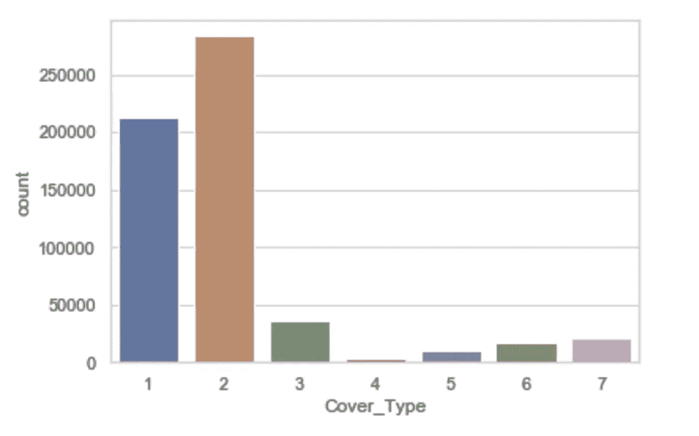

数据集的大部分由 covertype 1 和 covertype 2 组成，对于这种不平衡的数据集，我们必须选择缩减采样或构建玩具数据集的方式。关键在于理解这个问题的答案:我们的目标是平等地表示所有的覆盖类型，还是按照每个覆盖类型在整个数据集中出现的频率比例来表示它？

一个重要的考虑因素是，下采样确实减少了我们可以用来训练模型的数据点的数量，所以尽管有这种分析，使用所有样本总是可能是更明智的选择。这在很大程度上取决于业务优先级，包括将一个 covertype 误认为另一个 cover type 的相对成本。例如，如果我们同样关注每个覆盖类型的分类准确性，那么通过缩减采样来获得覆盖类型的均匀分布可能是最有意义的。然而，如果我们只关心封面类型 1 相对于其他 6 个封面类型的分类，那么我们可以使用不同的采样方法。

尽管如此，对于这个项目，我将从假设我们同样关心正确地分类每个 covertype 开始，并且我将在文章的结尾探索这个决定的影响。

更深入地研究每种封面类型的统计数据，我们会发现样本之间的计数差异很大，我们还会看到每个变量的数据分布很广。

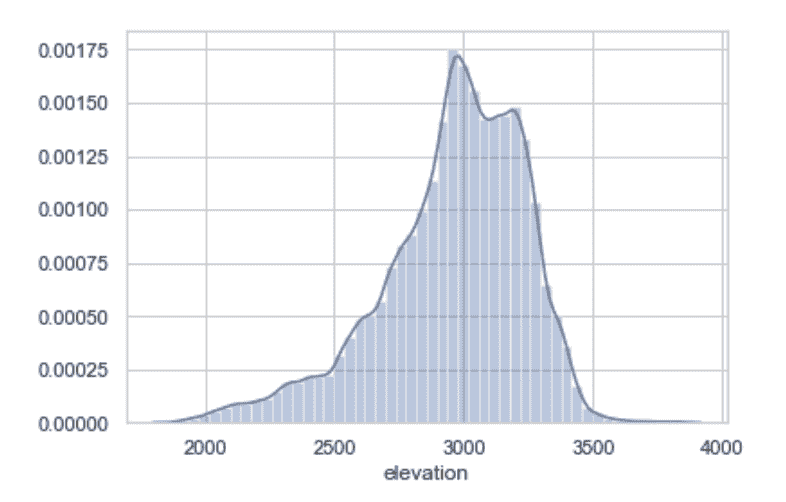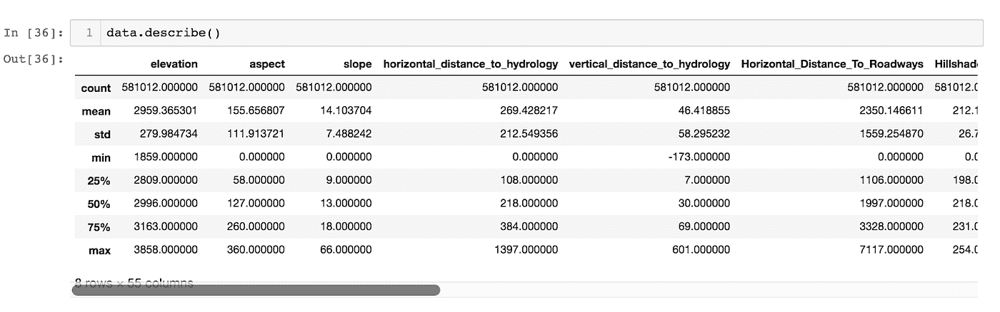

特别是对于高程，我们看到覆盖类型 1 至 7 的标准偏差范围为 95 至 196。我们还看到，对于封面类型 4，我们最少有 2，747 个数据点，而对于封面类型 2，我们有 28，8301 个数据点，这进一步表明我们有一个不平衡的数据集。

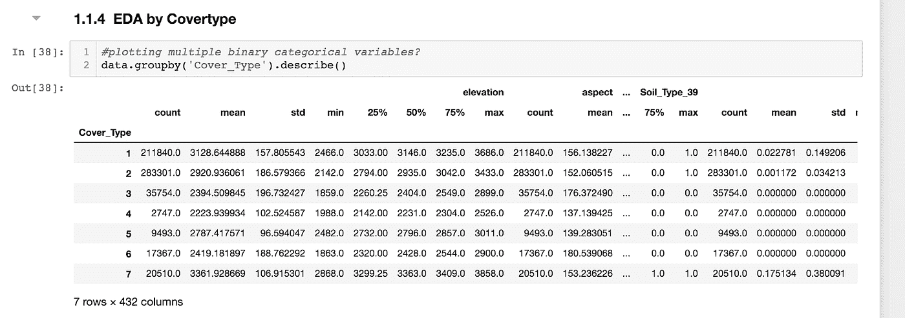

我们可以探索连续变量之间的相关性，以便使用相关矩阵更好地理解数据中的潜在关系:

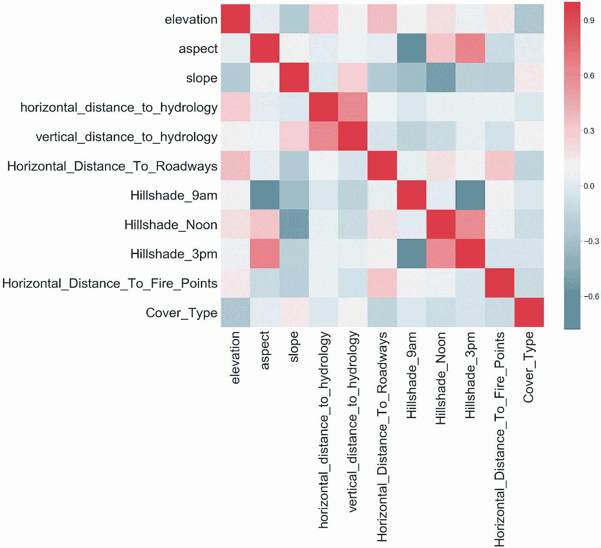

请注意，我特意在此相关图中省略了分类变量，因为相关矩阵显示了不同特征对之间的皮尔逊相关系数，皮尔逊相关对于非连续输入没有意义。根据上述相关矩阵，似乎与覆盖类型线性相关的连续变量是坡度和高程以及坡向。我们的三个山体阴影特征似乎也高度相关。这是意料之中的，而且看起来也合乎逻辑，因为它们都测量相似的东西。这些山体之间的相关性表明，它们可能包含大量冗余信息——当我们进行特征选择时，我们将回到这个想法。

# 数据探索和建模并不总是不同的事情

基于我们之前展示的数据探索，我们看到目标变量是多类和二进制的。为了确定什么是“好”的模型，以及我们如何定义这个项目的成功，我首先研究了建立一个基线模型。

然而，在我们开始训练多类基线模型之前，我们需要首先对数据进行采样。在我们所有的 500，000+个条目上训练一个模型不仅耗时，而且效率非常低。

对于我们的特定数据集，我们将从一个简单的随机抽样方法开始，其中我们确保了一个平衡的类分布，原因在本文的开始部分有概述。这意味着我们想要从 1 到 7 的每个 covertype 中抽取 n 个条目的样本，并确保每个类都有相同数量的条目。

我们将从 n = 2700 开始，这是最小类的最小数据点数，我们将从使用简单的决策树来建模数据开始。我们这样做的目的是通过研究我们的决策树如何查询我们的数据集来更好地理解我们的数据，并获得我们的分类性能的下限。这一步将我们置于数据探索和预测建模之间的模糊边界，这是一个灰色地带，我发现它特别有助于探索，尤其是基于树的模型。

# 决策树基线模型

让我们从更好地理解我们的数据开始。我首先用一个非常短的决策树来拟合缩减采样数据集(使用 max _ depth 3)，并可视化结果:

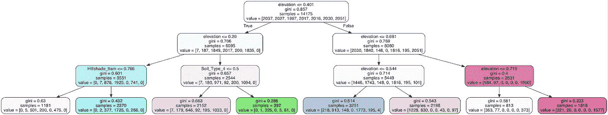

我们要注意的第一件事是 elevation 参数的重要性，在这个公认的简单模型中，它似乎支配着所有其他参数。这与我们之前在相关矩阵中发现的一致，相关矩阵显示高程是与我们的目标变量(Cover_Type)最相关的连续特征。

虽然这个模型的 max_depth 是严格限制的，但它仍然比随机猜测表现得好得多:它在所有 7 个类中获得的预测准确性是 X%(训练准确性)和 Y%(验证准确性)。

接下来，我想看看无约束模型(没有 max_depth 为 3)将如何执行，以更好地了解简单决策树对该数据集的全部预测能力。我用 sklearn 提供的默认参数训练了一个新的树(其中包括一个 max _ depth None，这意味着树将无限制地增长)。结果如下:

我们将使用准确度分数来衡量绩效。

```
predictions = dtree.predict(X_test)print ("Decision Tree Train Accuracy:", metrics.accuracy_score(y_train, dtree.predict(X_train)))
print ("Decision Tree Test Accuracy:", metrics.accuracy_score(y_test, dtree.predict(X_test)))from sklearn.metrics import classification_report
print(classification_report(y_test, y_pred))
```

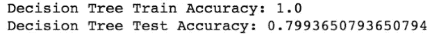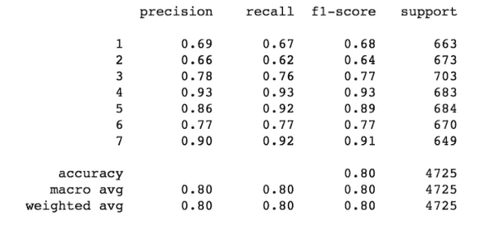

我们可以看到这里有过度拟合，因为训练数据的准确度分数是 1。这是一个重要的结果，因为它与决策树倾向于过度拟合的一般趋势是一致的。为了好玩，我想通过绘制作为 max_depth 参数的函数的训练和验证精度来展示这种过度拟合过程是如何进行的:

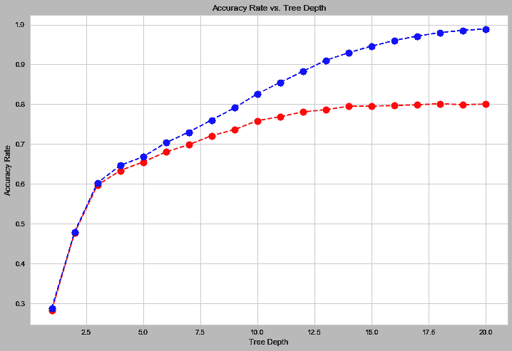

上图向我们展示了测试精度低于训练精度，这就是过度拟合的定义:我们的模型正在将自己扭曲成完美捕捉训练集中趋势的形状，代价是无法归纳出看不见的数据。

为了总结我们的数据探索和初始建模步骤，让我们来看看将我们的深度树应用于验证集所产生的混淆矩阵:

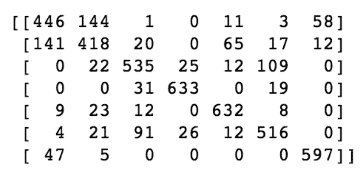

看上面的混淆矩阵，似乎这些错误大部分来自类 1 和类 2。

# 随机森林基线模型

既然我们知道了我们的问题会带来什么，是时候认真对待建模了。随机森林是我将在这里使用的模型，因为 1)它们是健壮的，并且概括得很好；2)它们易于解释。随机森林是决策树的集合:它们由一堆独立的决策树组成，每个决策树都只使用我们训练集中的一个子集进行训练，以确保它们正在学习以不同的方式进行预测。他们的输出然后通过简单的投票汇集在一起。

和往常一样，我的第一步是使用开箱即用的随机森林分类器模型。这导致了性能的大幅提升:验证集的准确率为 86%，训练集的准确率为 100%。换句话说，这个模型是过度拟合的(或者说，集合中的每一个决策树都是过度拟合的)，但是我们仍然看到了通过将一堆过度拟合的决策树汇集在一起在性能上的巨大改进。

# 随机森林特征选择

F 首先，让我们进行特征选择，以确定影响我们的随机森林集合模型准确率的最具预测性的变量。人们为此使用了许多不同的方法，但是在这里，我们将集中于排列特征重要性。[置换特征重要性](https://blogs.technet.microsoft.com/machinelearning/2015/04/14/permutation-feature-importance/)的工作原理是在我们的验证集中选择一列(即特征)，然后随机洗牌，从而破坏该特征与我们的模型用来进行预测的所有其他特征之间的相关性，最后在这个新洗牌的验证集上测量我们的模型的性能。如果性能显著下降，这就告诉我们，我们改变的特性一定很重要。

使用排列重要性，我们看到以下结果:

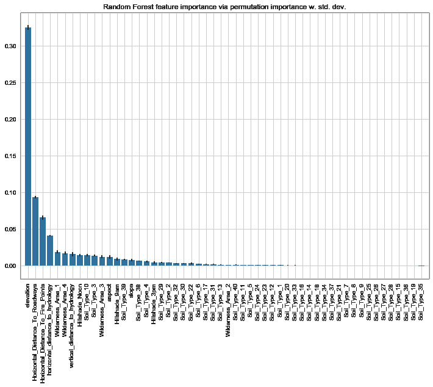

基于这一点，似乎只有我们的一小部分特征支配着其他特征。事实上，如果当我试图只保留这里指出的前 13 个特征时，我最终只牺牲了可以忽略不计的准确性，在验证集上再次获得了 86%的准确性。

# 随机森林-超参数调整

O 随机森林中超参数调整的一个关键是，一般来说，模型的性能只会随着我们添加到集合中的决策树数量的增加而增加。因此，在我们使用 GridSearchCV 调优完所有其他相关参数(如 max_depth、min_samples_leaf 和 min_samples_split)之后，它实际上是我们要调优的最后一个参数。

我们得到最后一组最佳估计值，给出这些最佳参数，然后将它们应用于我们的模型并比较结果:

```
n_best_grid = n_grid_search.best_estimator_n_optimal_param_grid = {
    'bootstrap': [True],
    'max_depth': [20], #setting this so as not to create a tree that's too big
    #'max_features': [2, 3, 4, 10],
    'min_samples_leaf': [1],
    'min_samples_split': [2],
    'n_estimators': [300]
}nn_grid_search = GridSearchCV(estimator = n_rfc_gs, param_grid = n_optimal_param_grid, 
                          cv = 3, n_jobs = -1, verbose = 2)nn_grid_search.fit(X_train, y_train)nn_rfc_pred_gs = nn_grid_search.predict(X_test)nn_y_pred_gs =  nn_grid_search.predict(X_test)
print ("Random Forest Train Accuracy Baseline After Grid Search and N-estimators Search:", metrics.accuracy_score(y_train, nn_grid_search.predict(X_train)))
print ("Random Forest Test Accuracy Baseline After Grid Search and N-estimators Search:", metrics.accuracy_score(y_test, nn_grid_search.pre
```

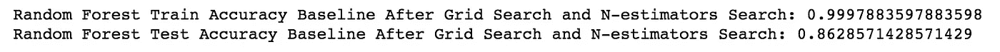

我们的模型性能有了适度的提高，从 0.860 提高到 0.863。这并不完全令人惊讶——超参数调优并不总是对性能产生巨大影响。

最后，我们将查看 num_estimators 参数，注意一起绘制训练集和验证集的精度。正如所料，两者都随着 num_estimators 近似单调增加，直到达到一个平稳状态:

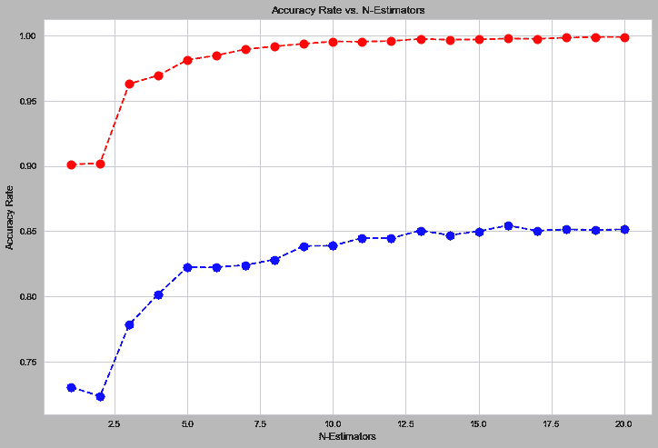

然后，我们可以比较我们当前的模型及其基于准确性的性能，并将其与原始的开箱即用模型进行比较。

这里要讨论的重要一点是，在最初的运行中(没有在这篇博文中显示，但在笔记本[这里](https://github.com/angelaaaateng/Covertype_Analysis))，我们的测试准确率如何从没有参数搜索的 86%上升到使用 GridSearchCV 后的 84%。我们可以看到，调整后的模型并不比根据默认值训练的 RF 表现得更好。这是因为方差对我们数据集的影响 GridSearch 很难区分最好的超参数和最差的超参数，因此使用开箱即用的随机森林模型可能会节省时间和计算能力。

与这一点相关的一些重要的可能性如下:

*   我们使用 cv = 3 的 GridSearch(三重交叉验证)。这意味着对于每个超参数组合，模型仅在训练集中的 2/3 的数据上进行训练(因为 1/3 被保留用于验证)。因此，基于这一点，我们预计 GridSearch 会产生更悲观的结果。避免这种情况的一种方法是增加 cv 的值，这样就有了更小的验证集和更大的训练集。
*   总是有噪声(或“方差”)要考虑:当我们在不同的数据集上训练我们的模型时，它通常会给出不同的结果。如果我们的模型的方差足够高(这意味着它的性能很大程度上取决于它被训练的特定点)，那么 GridSearch 实际上可能无法区分“最好”的超参数和最差的超参数。这是对我们目前结果最可能的解释。这意味着我们还不如使用默认值。
*   我们可以更深入探索的另一个领域是 [max_features](/random-forests-and-the-bias-variance-tradeoff-3b77fee339b4) 。

那么，我们如何做得更好呢？根据我们的混淆矩阵，似乎类 1 和类 2 是大部分错误的来源。在我的下一个项目中，我们将探索模型堆叠，看看我们是否可以在这里获得任何准确性。

如有任何问题或意见，欢迎在[推特](https://twitter.com/ambervteng) [@ambervteng](https://twitter.com/ambervteng) 联系我。感谢阅读，下次见！

**Github 回购:**[https://github.com/angelaaaateng/Covertype_Analysis](https://github.com/angelaaaateng/Covertype_Analysis)

**Heroku Web App:**[https://covertype.herokuapp.com/](https://covertype.herokuapp.com/)

**Jupyter 笔记本:**[https://github . com/angelaaaateng/Projects/blob/master/cover type _ Prediction/Scripts/Tree-Based % 20 and % 20 bagging % 20 methods . ipynb](https://github.com/angelaaaateng/Projects/blob/master/Covertype_Prediction/Scripts/Tree-Based%20and%20Bagging%20Methods.ipynb)

## 参考资料:

[1] DataCamp 决策树教程[https://www . data camp . com/community/tutorials/Decision-Tree-classification-python](https://www.datacamp.com/community/tutorials/decision-tree-classification-python)

[2] Seif，g .用于 ML 的决策树[https://towardsdatascience . com/a-guide-to-Decision-Trees-for-machine-learning-and-data-science-Fe 2607241956](/a-guide-to-decision-trees-for-machine-learning-and-data-science-fe2607241956)

[3] Matplotlib 文档[https://Matplotlib . org/3 . 1 . 1/API/_ as _ gen/Matplotlib . py plot . x ticks . html](https://matplotlib.org/3.1.1/api/_as_gen/matplotlib.pyplot.xticks.html)