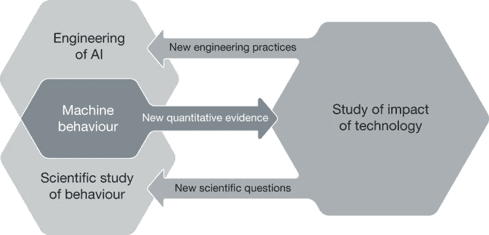

# 人工智能安全辩论

> 原文：<https://towardsdatascience.com/debating-the-ai-safety-debate-d93e6641649d?source=collection_archive---------22----------------------->

Photo by [@drewbutler](https://unsplash.com/@drewbutler) Unsplash

## 杰弗里·欧文、保罗·克里斯蒂安诺和达里奥·阿莫代伊谈人工智能安全

当我进入人工智能(AI)领域的 AI 安全领域时，我发现自己既困惑又不知所措。你从哪里开始？我昨天在报道了 OpenAI 的金融发展，他们是 AI 安全方面的最权威之一。因此，我认为看一看他们的论文会很有趣。我将关注的论文名为[人工智能安全辩论](https://arxiv.org/pdf/1805.00899.pdf)，于 2018 年 10 月发表。你当然可以在 arXiv 里自己看文章，反过来批判我的文章；那将是最理想的情况。这场关于 AI 辩论的辩论当然还在继续。

## 这篇论文的作者是谁？

**杰弗里·欧文**是 [OpenAI](https://openai.com/) 人工智能安全团队的成员。他之前一直在[谷歌大脑](http://research.google.com/teams/brain)工作。他收集了大量论文，从模拟、匹配、张量流。

**Paul Christiano** 从事人工智能校准工作。他是 OpenAI 安全团队的成员。他也是人类未来研究所的副研究员。他被引用最多的论文之一是关于人工智能安全中的具体问题。

达里奥·阿莫德伊是 OpenAI 的研究主管。此前，他是谷歌的高级研究科学家，是斯坦福大学医学院的博士后学者，在那里他致力于将质谱应用于细胞蛋白质组的网络模型以及寻找癌症生物标志物。

## 零和辩论游戏

该论文建议通过在零和*辩论*游戏中的自我游戏来训练代理人。

> 给定一个问题或提议的行动，两个代理人轮流在一定限度内做简短的陈述，然后一个人判断哪个代理人给出了最真实、最有用的信息

这是因为需要学习复杂的人类目标和偏好。在让人工智能保持安全方面，我们有哪些挑战？他们列举了几个例子:

*   学会让一个智能体的行为与人类的价值观和偏好保持一致，这可能会导致不安全的行为，而且随着系统变得越来越强大，情况可能会变得更糟。
*   结盟是一个训练时的问题:很难追溯性地修正受过训练的非结盟代理的行为和激励。
*   对于人类来说太难完成的任务，但是人类仍然可以判断行为或答案的质量。因此，这就是**基于人类偏好的强化学习(HumRe)** 。

## 将机器行为与人类行为联系起来很难

作者认为，人类有时可能无法判断答案。行为可能太难理解，或者问题本身可能有缺陷。他们要求读者想象一个既能给出答案又能指出缺陷的系统。当系统指出缺陷时，对缺陷的过程或判断可能是错误的。

**他们的最终目标是自然语言辩论，由人类来评判代理之间的对话。**

他们的论文结构如下:

1.  介绍对齐的辩论模型及其有用性
2.  提出使用图像任务的初步实验
3.  讨论辩论模式乐观和悲观的原因
4.  展示辩论如何减少不对称或合并多个代理
5.  采用辩论和放大方法的混合模型
6.  结束语是对未来工作的要求。

## 辩论模型(TDM)

在展示给两个代理的 TDM 问题中，两个代理都给出答案，然后由人类决定谁赢。作者声称，在辩论游戏中，撒谎比反驳谎言更难。他们宣称*简短的辩论*是强大的。然而，还有许多更复杂的任务。他们列出了一系列可以改进模型的方向:

*   **查询可能太大:**问题可能太大而无法向人类展示，或者无法期望人类理解。
*   **答案可能太大:**同样，一个问题的最佳答案可能大得惊人。例如，答案可能是一个很长的文档。
*   **人类的时间是昂贵的:**我们可能缺乏足够的人类时间来评判每一场辩论。
*   **环境交互:**如果我们想要一个系统采取影响环境的行动，比如操作一个机器人，期望的输出是一系列的行动。
*   **长期状态:**每个辩论都是一个独立的游戏，但是代理可以使用过去辩论的信息来做出更好的决策

## TDM 实验

在实验中，他们预先指定一个诚实的代理人和一个说谎的代理人。他们还训练了另一个诚实优点的例子。为这家报纸建立了一个名为 https://debate-game.openai.com 的网站。在这个页面上可以进行实验。

## 乐观的理由

我在论文中观察到的一个有趣的句子是关于**诚实** : *“为了保持诚实的行为，人类法官应该被指示奖励那些承认无知并成功证明无知是合理的代理人。”*然而，正如这篇论文所指出的，承认无知存在一个平衡问题:如果最佳策略是争论我们永远无法确定地知道任何事情，那么争论是无用的。

*“****没有对手会因为愚弄人类而获得奖励*** *，这很好，因为(1)我们不知道这意味着什么，以及(2)我们没有明确地训练代理人进行欺骗。”*

作者认为，人类之间现存的对抗性辩论是一个有用的类比。**法律论证**特别包括领域专家向没有领域知识的人类法官或陪审团解释论证的细节。

## 担忧的理由

辩论作为一种人工智能对齐的方法可能会失败，他们列出了一些原因。一是:也许人类想听什么就相信什么？如果一个演员以一个人类已经相信的虚假陈述开场，那么另一个演员的任何论点会说服他们吗？

另一个问题是，人类是否会理解这些争论。他们提出了一个问题:一个真实的人是否能玩好这个游戏，以至于最佳的游戏是诚实的行为。其中一个代理能够偷偷插入一个看似合理但包含隐藏缺陷的语句，而另一个代理却没有指出这个缺陷吗？

人类作为足够的法官是一个经验性的问题。如果答案是否定的，我们可以问这个模型是否在诚实承认无知时失败了。作者质疑诚实是否是最好的视角:

*   许多判断需要综合不同的证据，而辩论只探索一条证据。
*   复杂的辩论将依赖于法官无法理解的概念。
*   复杂的推理可能涉及人类尚不了解的过程。

接受辩论训练的特工会失去表现吗？直接培训可能更难；广告系列是一种很好的思考方式；我们可能不想要无法解释的答案。辩论可能无法与其他方法竞争，因为辩论需要人的参与。他们建议:“… *训练人类法官的模型，并将其用于采样，但与纯模拟环境竞争可能仍然具有挑战性。”*

**安全漏洞**:一个足够强大的错位人工智能可能能够通过文本通道说服人类做危险的事情

人工智能安全二分法:如果代理在整个训练过程中保持诚实，我们会更安全，但如果辩论进行得足够好，突然的大规模叛逃得到纠正，我们也会更安全。

一个足够强大的错位爱丽丝可以从内部侵入辩论环境，让游戏不再是零和游戏。

## 训练超人 AI 令人信服听起来很危险！

这是我最喜欢的标题，它有一个感叹号，所以我决定在这个标题中逐字引用它。最大化说服的训练安全吗？

## 有变化的 TDM 辩论

辩论模型依赖于在力量上近似匹配的代理。对称性被提出:(1)如果一个玩家移动另一个玩家；(2)比较两个游戏；(3)科米( *from Go* )第二个玩家获得额外的积分来对抗第一个玩家的优势。

不完全信息博弈是一个挑战。此外，许多智能体的一个困难是:*“…人类必须能够判断辩论中的陈述是好是坏，这可能比判断整个辩论要困难得多。”*

他们将辩论和扩展总结为:

*   辩论:两个代理人轮流在对抗的环境中说服一个人类法官。
*   **扩增:**一个智能体在一个人身上训练，结合对智能体的递归调用。

他们建议，通过对提问者进行对抗性训练，让放大更接近辩论。作者声明:*“我们可以通过训练辩论者根据人类提供的陈述进行辩论，这相当于将演示注入 RL 中。”*

## 他们的结论

未来的工作领域将包括:更丰富的理论模型；测试价值判断的人体实验；模拟辩论中人的方面的 ML 实验；自然语言辩论；以及辩论和其他安全方法之间的相互作用。

## 旁注机器行为

作为最后的补充说明，我想说这些想法可能已经导致或影响了该领域的其他讨论。在麻省理工学院媒体实验室 2019 年 4 月 24 日发表的一篇名为《机器行为》的论文中，一群科学家呼吁研究:
*“…一个广泛的研究机器行为的科学研究议程，该议程纳入并扩展了计算机科学学科，并包括了来自各个科学领域的见解。”*

Machine behaviour lies at the intersection of the fields that design and engineer AI systems and the fields that traditionally use scientific methods to study the behaviour of biological agents.

我今天浏览的论文的作者之一 Dario Amodei 在机器行为文章中提到了他的工作:[人工智能安全中的具体问题](https://arxiv.org/abs/1606.06565)。安全这个词经常在机器行为的上下文中被提及，看到诚实或说谎的行为者产生的困境是完全有意义的。

## 辩论辩论

老实说，我觉得很难对这场辩论进行辩论。这似乎是一个显而易见的结论，然而其中的复杂性远远超出了我的能力和理解。通过阅读这篇文章，我可以肯定的一件事是，有一些优秀的人正在研究这个主题，但他们正在以非常工程化的重点来处理这个问题。然而，他们确实说得很清楚，需要更多的人参与到这个过程中来，与此同时，他们还认为“人的时间是昂贵的”。

考虑到声明的上下文，这是可以理解的。特别是通过 OpenAI 的首席技术官 Greg Brockman 最近的另一个声明“OpenAI 的 DOTA 2 机器人已经训练了相当于 45000 人类年的时间。”OpenAI Five 在一场著名的视频游戏中击败了世界冠军。尽管这是很好的营销，但同样多的时间和抽象成扭曲的时间观的实践可能会给人以人工智能的错误印象。

这就是人类和/或机器行为之间具有挑战性的区别。从处理或计算转移到与人类的进一步比较，进一步模糊界限——有用吗？

这场辩论当然仍未结束。

## 我今天文章中的关键概念

**基于人类偏好的强化学习**:对于人类来说太难执行的任务，但是人类仍然可以判断行为或答案的质量

**机器行为**:位于设计和工程人工智能系统的领域和传统上使用科学方法研究生物制剂行为的领域的交叉点。

**辩论模型安全漏洞**:一个足够强大的错位 AI 或许能够说服人类去做危险的事情。

人工智能安全二分法:如果代理在整个训练过程中保持诚实，我们会更安全，但如果辩论进行得足够好，突然的大规模叛逃得到纠正，我们也会更安全。

**这是第 500 天的第 52 天**

我已经坚持每天写一篇文章 50 天了。这些文章在探索人工智能领域中社会科学和计算机科学的交叉方面表现得很一般。