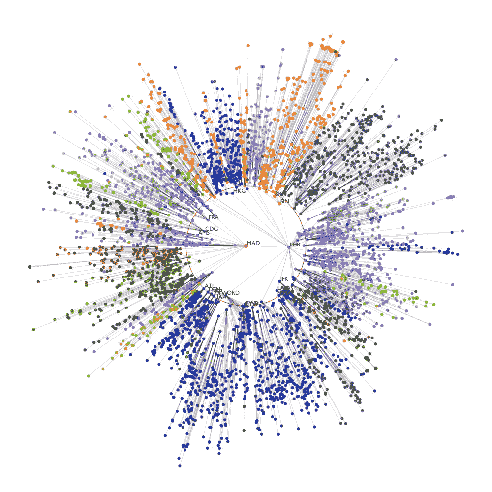

# 正确调试 tensorflow 代码(没有那么多令人痛苦的错误)

> 原文：<https://towardsdatascience.com/debugging-your-tensorflow-code-right-without-so-many-painful-mistakes-b48bd9145d5c?source=collection_archive---------7----------------------->

当讨论在 tensorflow 上写代码时，总是拿它和 PyTorch 比较，谈论框架有多复杂，为什么`tf.contrib`的某些部分工作得如此糟糕。此外，我认识很多数据科学家，他们与 tensorflow 的交互只是作为预先编写的 Github repo 的依赖，可以克隆，然后成功使用。对这个框架持这种态度的原因是非常不同的，它们绝对值得再读一遍，但今天让我们关注更实际的问题:调试用 tensorflow 编写的代码并理解它的主要特性。

## 核心抽象

*   **计算图形。**第一个抽象是计算图`tf.Graph`，它使框架能够处理惰性评估范式(不是急切执行，而是通过“传统的”命令式 Python 编程实现的)。基本上，这种方法允许程序员创建`tf.Tensor`(边)和`tf.Operation`(节点)，它们不会立即被评估，而是仅在图形被执行时被评估。这种构建机器学习模型的方法在许多框架中非常常见(例如，Apache Spark 中使用了类似的思想)，并且具有不同的优点和缺点，这在编写和运行代码的过程中变得很明显。最主要也是最重要的优势是，数据流图无需显式使用`multiprocessing`模块就能轻松实现并行和分布式执行。在实践中，编写良好的 tensorflow 模型在启动后立即使用所有内核的资源，无需任何额外配置。
    然而，这种工作流程的一个非常明显的缺点是，只要你正在构建你的图形，但没有(或没有)提供一些输入就无法运行它，*你永远无法确定它不会崩溃。它肯定会崩溃。*此外，除非你已经执行了图形，否则你也无法估计它的运行时间。
    值得谈论的计算图的主要组成部分是图集合和图结构。严格地说，图结构是前面讨论的节点和边的特定集合，而图集合是变量的集合，可以对其进行逻辑分组。例如，检索图的可训练变量的常用方法是`tf.get_collection(tf.GraphKeys.TRAINABLE_VARIABLES)`。
*   **会话。**第二个抽象与第一个高度相关，并有一点复杂的解释:tensorflow 会话`tf.Session`用于连接客户端程序和 C++运行时(如您所知，tensorflow 是用 C++编写的)。为什么是 C++？答案是，通过这种语言实现的数学运算可以得到很好的优化，因此，计算图形运算可以得到很好的处理。
    如果您使用的是低级 tensorflow API(大多数 Python 开发人员都使用)，tensorflow 会话将作为上下文管理器调用:`with tf.Session() as sess:`使用语法。没有向构造函数传递参数的会话(如前一个示例)仅使用本地计算机和默认 tensorflow 图的资源，但它也可以通过分布式 tensorflow 运行时访问远程设备。实际上，没有会话就没有图(没有会话就不能执行),而会话总是有一个指向全局图的指针。
    深入研究运行会话的细节，值得注意的要点是它的语法:`tf.Session.run()`。它可以将获取(或获取列表)作为参数，获取可以是张量、操作或类张量对象。此外，feed_dict 可以和一组选项一起传递(这个可选参数是`tf.placeholder`对象到它们的值的映射(字典))。

## 可能遇到的问题及其最可能的解决方案

1.  **会话加载并通过预训练模型进行预测。**这就是瓶颈，我花了几周时间去理解、调试、修复。我想高度集中在这个问题上，并描述重新加载预训练模型(其图形和会话)和使用它的两种可能的技术。
    首先，当我们谈论加载模型时，我们真正的意思是什么？要做到这一点，我们当然需要在之前进行训练和保存。后者通常通过`tf.train.Saver.save`功能完成，因此，我们有 3 个扩展名为`.index`、`.meta`和`.data-00000-of-00001`的二进制文件，其中包含恢复会话和图形所需的所有数据。
    要加载这样保存的模型，需要通过`tf.train.import_meta_graph()`恢复图形(参数是扩展名为`.meta`的文件)。按照上一段描述的步骤，所有变量(包括所谓的“隐藏”变量，将在后面讨论)将被移植到当前图形中。为了检索某个有名字的张量(记住，由于张量创建的范围和操作结果，它可能与你初始化它的张量不同)，应该执行`graph.get_tensor_by_name()`。这是第一种方式。
    第二种方式更明确，也更难实现(在我一直在研究的模型架构中，我在使用它时没有成功地执行图形)，其主要思想是将图形边(张量)显式保存到`.npy`或`.npz`文件中，然后将它们加载回图形中(并根据它们被创建的范围分配适当的名称)。这种方法的问题是它有两个巨大的缺点:首先，当模型架构变得非常复杂时，控制和保持所有的权重矩阵也变得非常困难。第二，有一种“隐藏的”张量，它是在没有显式初始化的情况下创建的。例如，当你创建`tf.nn.rnn_cell.BasicLSTMCell`时，它*会创建所有需要的权重和偏置来实现 LSTM 单元*。变量名也会自动分配。
    这种行为可能看起来没问题(只要这两个张量是权重，并且不手动创建它们，而是让框架来处理它们似乎非常有用)，但事实上，在许多情况下，它不是。这种方法的主要问题是，当你查看图的集合时，看到一堆变量，你不知道它们的来源，你实际上不知道你应该保存什么，以及在哪里加载它。绝对诚实地说，很难将隐藏变量放在图中的正确位置，并恰当地操作它们。*比应该的要难。*
2.  **在没有任何警告的情况下两次创建同名张量(通过自动添加 _index 结尾)。**我认为这个问题没有前一个问题重要，但是只要它导致大量的图形执行错误，这个问题就一定会困扰我。为了更好地解释问题，我们来看例子。
    例如，您使用`tf.get_variable(name=’char_embeddings’, dtype=…)`创建张量，然后保存并在新会话中加载。您已经忘记了这个变量是可训练的，并且已经通过`tf.get_variable()`功能以相同的方式再次创建了它。在图形执行过程中，将会出现如下错误:`FailedPreconditionError (see above for traceback): Attempting to use uninitialized value char_embeddings_2`。当然，这样做的原因是，您已经创建了一个空变量，并且没有将它移植到模型的适当位置，而它*可以被移植到*，只要*已经包含在图*中。
    如您所见，没有出现任何错误或警告，因为开发人员已经用相同的名称创建了两次张量(即使是 Windows 也会这样做)。也许这一点只对我来说至关重要，但这是 tensorflow 的独特之处，也是我不太喜欢的行为。
3.  **在编写单元测试和其他问题时手动重置图形。由于很多原因，测试 tensorflow 编写的代码总是很困难。第一个——最明显的一个——已经在这一段的开头提到了，听起来可能很傻，但对我来说，*这至少是令人恼火的*。因为对于运行时访问的所有模块的所有张量，只有一个默认的张量流图，所以在不重置图的情况下，不可能用例如不同的参数来测试相同的功能。这只是一行代码`tf.reset_default_graph()`，但是知道它应该写在大多数方法的顶部，这个解决方案就变成了某种恶作剧，当然，也是代码复制的一个明显例子。我还没有找到任何可能的方法来处理这个问题(除了使用作用域的`reuse`参数，我们将在后面讨论),只要所有的张量都链接到默认图，并且没有办法隔离它们(当然，每个方法都可以有一个单独的张量流图，但从我的角度来看，这不是最佳实践)。
    关于 tensorsflow 代码的单元测试的另一件事也让我很困扰，那就是当构造图的某个部分不应该被执行时(它里面有未初始化的 tensor，因为模型还没有被训练)，人们并不真正知道我们应该测试什么。我的意思是对`self.assertEqual()`的论证不清楚(我们应该测试输出张量的名称还是它们的形状？形状是`None`怎么办？如果张量名称或形状不足以得出代码工作正常的结论呢？).在我的例子中，我简单地以断言张量名称、形状和维度结束，但是我确信对于不执行图形的情况，只检查这部分功能是*不合理的条件*。**
4.  **令人困惑的张量名称。许多人会说，对 tensorflow 性能的这种评论是一种非凡的抱怨方式，但人们不能总是说在执行某种操作后产生的张量的名称会是什么。我的意思是，你清楚这个名字吗？至于我，绝对不是。我知道这个张量是在动态双向 RNN 的后向单元上进行某种操作的结果，但是如果不显式地调试代码，就无法发现执行了什么操作以及操作的顺序。此外，指数结尾也是不可理解的，只要了解数字 4 从何而来，就需要阅读 tensorflow 文档并深入研究计算图。对于之前讨论的“隐藏”变量来说，情况是一样的:为什么我们在那里有了`bias`和`kernel`的名字？也许这是我资质和技术水平的问题，但这样的调试案例对我来说相当不自然。**
5.  `**tf.AUTO_REUSE**` **、可训练变量、重新编译库等调皮玩意儿。**这个列表的最后一点是简要介绍我不得不通过试错法学习的小细节。第一件事是作用域的`reuse=tf.AUTO_REUSE`参数，它允许自动处理已经创建的变量，如果它们已经存在，就不会创建两次。事实上，在许多情况下，它可以解决本段第二点所述的问题。然而，在实践中，这个参数应该小心使用，并且只有当开发人员知道代码的某个部分需要运行两次或更多次时才使用。
    第二点是关于可训练变量，这里最重要的一点是:*默认情况下，所有张量都是可训练的*。有时，只要这种行为不总是你想要的，它就会令人头疼，而且很容易忘记它们都是可以训练的。
    第三件事只是一个优化技巧，我建议每个人都这样做:几乎在每种情况下，当你使用通过 pip 安装的包时，你都会收到这样的警告:`Your CPU supports instructions that this TensorFlow binary was not compiled to use: AVX AVX2`。如果您看到这种消息，最好卸载 tensorflow，然后使用您喜欢的选项通过 bazel 重新编译它。这样做的主要好处是计算速度的提高和机器上框架更好的总体性能。

## 结论

我希望这篇长篇阅读对于正在开发他们的第一个 tensorflow 模型的数据科学家来说是有用的，他们正在努力解决框架的一些部分的不明显的行为，这些行为很难理解并且调试起来相当复杂。我想说的要点是，在使用这个库的时候犯很多错误是完全没问题的(对于任何其他事情来说也是完全没问题的)，问问题、深入文档并调试每一行都是完全没问题的。就像跳舞或游泳一样，一切都来自练习，我希望我能让这种练习变得更加愉快和有趣。