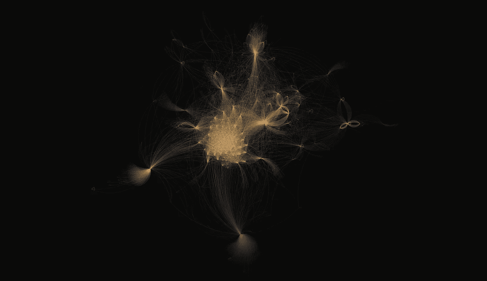
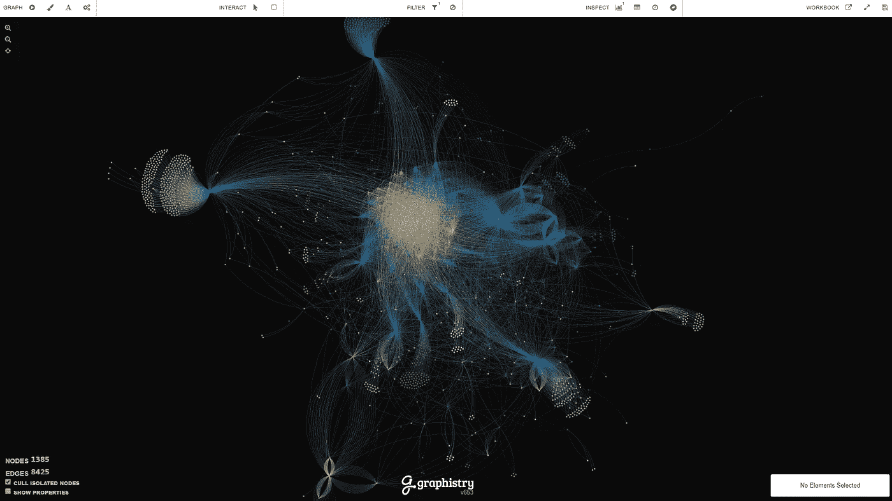
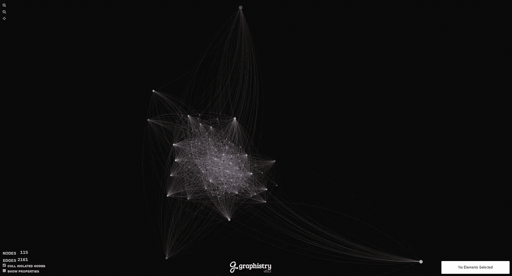

# 用你的眼睛欺骗你的思想

> 原文：<https://towardsdatascience.com/deceiving-your-mind-with-your-eyes-17c1a9bc48fb?source=collection_archive---------34----------------------->

## 确认偏差和找到你想要的东西的陷阱。

多年来，作为一名法医分析师，我必须学习的最具挑战性的技能之一是如何克服[确认偏差](https://www.britannica.com/science/confirmation-bias)。人们很容易把注意力集中在证实你的怀疑的证据上，而忽略似乎反驳你的理论的事实。随着时间的推移，我学会了如何识别何时偏见开始渗入调查，以及何时我应该采取适当的措施来解决它。

几乎不可能在开始调查时对你将要发现的东西没有偏见。知道了这一点，我会定期强迫自己后退一步，重新评估目前证据中清楚的事实，并挑战自己扮演“魔鬼代言人”，问一些与我的直觉相反的问题。这个过程帮助我坚持揭露真相，即使在发现看似确凿的证据后，这些证据很容易被断章取义。

这就是为什么当我最近发现我不知不觉地做了我一直努力阻止的事情时，我措手不及…

几个月前，我被要求帮助关注 Twitter 上的一个特定人群，因为他们可能会给其他人带来危险。我对做坏事的人有一个触发点，所以我想我会做我最擅长的事情，并开始收获他们产生的一切。我钻取了一些与该小组相关的线索，并在一个阻止列表中找到了一个 Twitter 个人资料列表，我认为这将是一个开始监控的好地方。*(这是错误 1)*

我将账户列表加载到我的 Apache NiFi 集群的处理器中，这样我不仅可以记录账户本身的活动，还可以记录其他 Twitter 用户与账户的互动。

我有两个直接目标:

*   确定可能属于同一组的其他客户
*   密切关注他们，发现与他人不寻常的互动

NiFi 在一夜之间收集了相当数量的推文后，我开始将数据加载到一个名为 [Graphistry](https://www.graphistry.com/) 的工具中，这将使我能够根据账户之间的互动量和互动方式直观地推断出它们之间的关系。仅仅因为这群人的性质，我强烈期望我会发现一个紧密结合的社区。*(这是第二个错误)*

在这种情况下，我选择只关注一个帐户回复另一个帐户的事件。根据我的经验，这些回复交互在寻求关联账户时会产生最佳模式。因为账户背后的人必须做出有意识的决定，对其他人的推文做出回应。(我认为转发是一种间接的互动形式)

当我开始对数据进行聚类时，我对我开始看到的东西感到兴奋…

Data graphed for the first time

一组密集的节点立即开始出现在中心，证实了我预期的发现。我看到了许多相互之间高度互动的账户。我抽查了位于图表最中心的一些节点的帐户名称，发现几乎每个节点都是不在我的原始收藏列表中的人。我刚刚找到了社区的其他人吗？有这么简单吗？

我最初的想法是，中间紧密聚集的黄色节点构成了我感兴趣监控的社区，但经过进一步分析，我发现我完全错了。仔细观察互动的内容，我开始注意到这些账户实际上是在口头攻击我一直在观察的大约 50 个账户。我监控的名单上的个人实际上是围绕中心的蓝色节点。

我突然意识到我完全弄错了。因为这些最初的账户被公布后引起了强烈的反应，所以一群类似私刑的网上暴民开始对该组织发布的任何东西做出积极回应。虽然我可以看到感兴趣的帐户之间的大量双向通信(蓝色节点之间的足球形状的模式)，但攻击帐户确实扭曲了数据。

这个发现之后，我坐下来，试图理清这一切意味着什么。毫无疑问，我在数据中发现了一些有趣的东西，但我几乎把几十个账户归类为他们没有的东西。事实上，我开始意识到，我对这次调查的强烈反应，源于我自己的道德和伦理，本身可能有些误导。

经过一点思考，我决定重新调查，但这一次用不同的心态。抛开我的个人偏见，我只是根据事实来讲述这个故事。我现在显而易见的第一个错误是，我最初收集的数据是基于一份在推特上公开发布的列表，这份列表很快获得了很多关注。我匆忙地选择了一份名单，成千上万的人都可以访问并直接采取行动。事实上，仅仅是这个列表的存在，就产生了我所期待的模式。

我承认第一个错误很容易犯，并将其视为一次学习经历，但我真的很生自己的气，因为我犯了第二个错误，因为*我知道得更好……*

我带着对我会发现什么的强烈意见进入调查，以至于当一个符合我预期的模式出现时，我就匆忙下了结论。这是我努力训练自己不要做的事情，也是我提醒我的学生要注意的事情。我无意中让自己的个人信仰干扰了结果。

我认为一个更好的方法是获取确认感兴趣的账户列表，列举这些账户的朋友/关注者网络，然后用产生的数据集构建一个试探性的“社区”。通过选择有 10 个或更多共同关系的节点，我可以锁定 115 个很可能与我的调查相关的账户。

Filtered list of friend/follower relationships

这个列表仍然不完美，但它将作为一个更好的起点，因为它来自朋友/追随者关系，而不是有偏见的回答。攻击帐户仍会出现在图表中，但至少在数据收集方面会有更少的偏差。

这件事给我上了宝贵的一课。尽管我觉得自己比大多数人准备得更充分，但我仍然容易被自己的情绪左右调查。对我来说，仍然有可能掉进只寻找我想找的东西的陷阱…

像 Graphistry 这样的数据可视化工具非常强大。我个人认为它们是我职业生涯中发现的最重要的技术之一。至少可以说，它们能够帮助分析师在海量数据中找到一根针的方式是令人着迷的。这次特别的调查让我意识到任何新技术都会带来新的挑战。

作为一名分析师，无论我们是在工作还是在私人时间帮助社区，我们都必须尽可能地消除研究中的个人偏见。为了做到这一点，我建议尝试不断地在可能更准确地解释结果的替代理论中循环，即使这种解释完全违背了你最初的假设。我们有责任在数据中找到真相。

最后，我决定不再追查那个组织了。在我观察的这段时间里，我看到的唯一真正有害的行为来自他们周围的暴民。我们越来越频繁地看到社交媒体上的反应主要基于情绪而不是事实。我只是不愿意分享任何容易对他人的观点产生负面影响的研究。我知道自己这么快就下了结论，我觉得正确的做法是退出这个案子，继续下一个。我对数据真相的探索仍在继续…

> “人类的模式识别天赋是一把双刃剑。我们特别擅长寻找模式，即使它们并不存在。这就是所谓的错误模式识别。我们渴望意义，渴望我们个人的存在对宇宙有特殊意义的迹象。为此，我们都太渴望欺骗自己和他人，渴望在烤奶酪三明治中发现神圣的图像，或在彗星中找到神圣的警告。”
> 
> ——尼尔·德格拉斯·泰森，*宇宙:时空漫游*