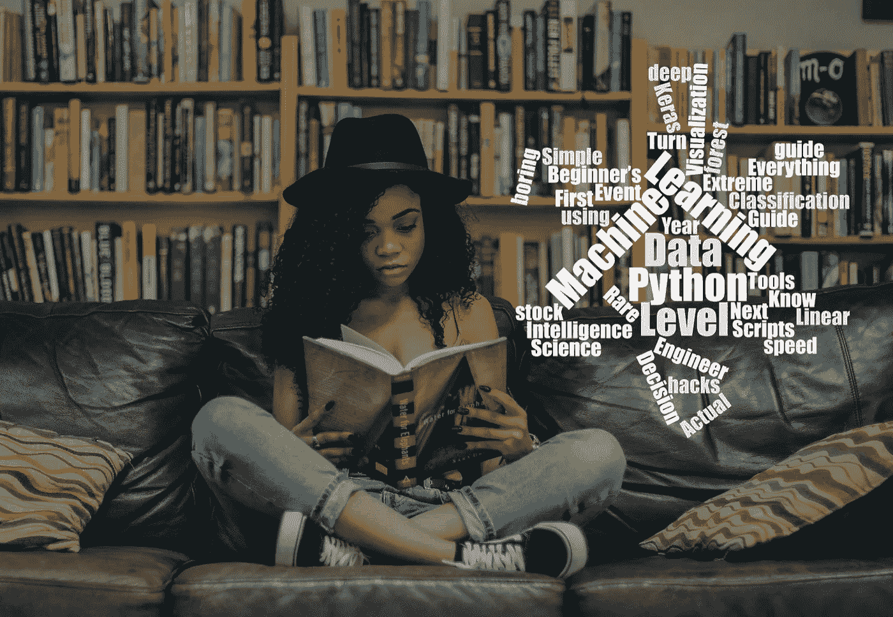

# 12 月版:我们今年最有影响力的文章

> 原文：<https://towardsdatascience.com/december-edition-our-most-influential-articles-this-year-c18f31fbe817?source=collection_archive---------23----------------------->

## 数据科学的一年。迈向数据科学社区的一年！

[Milestones](/take-a-peek-at-our-instagram-diary-6c2dbf02f08c) | [Podcast](https://towardsdatascience.com/podcast/home)

在这个每月一期的增刊中，我们想回顾一下今年最有影响力的文章(你可以在下面找到这些文章)。你可以在上面找到这些文章的标题，它们被可视化为一个单词云。正如人们所料，机器、学习和数据等词非常常见。Python 在今年也有很强的表现，似乎是我们作家的首选语言。

以入门文章为中心的另一种趋势。通过“初学者指南”、“简单技巧”和“第一年”帖子，我们的一些最有影响力的文章针对的是该领域的新手或正在寻找易于理解的介绍。

我们的社区也喜欢深入数据科学应用用例的内容。从股票市场预测到罕见事件分类，展示实际应用的文章都名列前茅。

随着我们迈入 2020 年，我们很兴奋地阅读来自我们社区的所有新的精彩内容，并期待看到新的趋势和主题将会出现。

Tyler Folkman ，TDS 编辑助理。

## [把 Python 脚本变成漂亮的 ML 工具](/coding-ml-tools-like-you-code-ml-models-ddba3357eace)

通过 [Adrien Treuille](https://medium.com/u/39dfc90d7a34?source=post_page-----c18f31fbe817--------------------------------) — 7 分钟读取

介绍专为 ML 工程师打造的应用框架 Streamlit

## [数据科学家应该知道的关于数据管理的一切*](/everything-a-data-scientist-should-know-about-data-management-6877788c6a42)

由[黄家仪](https://medium.com/u/7a83326316c0?source=post_page-----c18f31fbe817--------------------------------) — 19 分钟读完

(*但不敢问)

## [决策智能简介](/introduction-to-decision-intelligence-5d147ddab767)

凯西·科济尔科夫(Cassie Kozyrkov)—13 分钟阅读

人工智能时代领导力的新学科

## [成为 3.0 级数据科学家](/becoming-a-level-3-0-data-scientist-52641ff73cb3)

由简·扎瓦日基 — 9 分钟读完

想成为大三，大四，还是首席数据科学家？了解您需要做些什么来驾驭数据科学职业游戏。

## [使用 Keras 中的自动编码器进行极端罕见事件分类](/extreme-rare-event-classification-using-autoencoders-in-keras-a565b386f098)

由 [Chitta Ranjan](https://medium.com/u/1c9fae27a83?source=post_page-----c18f31fbe817--------------------------------) — 10 分钟阅读

在这篇文章中，我们将学习如何实现一个自动编码器来构建一个罕见事件分类器。我们将使用真实世界的罕见事件数据集

## [Python 中数据可视化的下一个层次](/the-next-level-of-data-visualization-in-python-dd6e99039d5e)

到[时，Koehrsen 将](https://medium.com/u/e2f299e30cb9?source=post_page-----c18f31fbe817--------------------------------) — 8 分钟读取

如何用一行 Python 代码制作出好看的、完全交互式的情节

## [Python 机器学习初学者指南](/beginners-guide-to-machine-learning-with-python-b9ff35bc9c51)

通过 [Oleksii Kharkovyna](https://medium.com/u/a0e39375a333?source=post_page-----c18f31fbe817--------------------------------) — 10 分钟阅读

机器学习是人工智能领域的一个重要课题，已经成为人们关注的焦点。

## [我作为机器学习工程师第一年学到的 12 件事](/12-things-i-learned-during-my-first-year-as-a-machine-learning-engineer-2991573a9195)

丹尼尔·伯克 — 11 分钟阅读

成为你自己最大的怀疑者，尝试不可行的事情的价值，以及为什么沟通问题比技术问题更难。

## [利用深度学习的最新进展预测股价走势](/aifortrading-2edd6fac689d)

由鲍里斯·B—34 分钟读完

在这本笔记本中，我将创建一个预测股票价格变动的完整过程。

## [了解随机森林](/understanding-random-forest-58381e0602d2)

由[饶彤彤](https://medium.com/u/840a3210fbe7?source=post_page-----c18f31fbe817--------------------------------) — 9 分钟读出

该算法如何工作以及为什么如此有效

## [数据科学很无聊](/data-science-is-boring-1d43473e353e)

由[伊恩肖](https://medium.com/u/a0eb4622a0ca?source=post_page-----c18f31fbe817--------------------------------) — 9 分钟读完

我如何应对部署机器学习的无聊日子

## [用 Python 加速数据分析的 10 个简单技巧](/10-simple-hacks-to-speed-up-your-data-analysis-in-python-ec18c6396e6b)

通过 [Parul Pandey](https://medium.com/u/7053de462a28?source=post_page-----c18f31fbe817--------------------------------) — 8 分钟读取

提示和技巧，尤其是在编程领域，非常有用。

## [统计学和机器学习的实际区别](/the-actual-difference-between-statistics-and-machine-learning-64b49f07ea3)

马修·斯图尔特博士研究员——15 分钟阅读

不，它们不一样。如果机器学习只是美化了的统计学，那么建筑学只是美化了的沙堡建造。

## [用 Scikit 学习 Python 线性回归的初学者指南——学习](/a-beginners-guide-to-linear-regression-in-python-with-scikit-learn-83a8f7ae2b4f)

由 Nagesh Singh Chauhan — 11 分钟阅读

有两种类型的监督机器学习算法:回归和分类。

我们也感谢最近加入我们的所有伟大的新作家，[安东·穆勒曼](https://medium.com/u/4e398f0112fa?source=post_page-----c18f31fbe817--------------------------------)，[查扬·卡图里亚](https://medium.com/u/72dde4fb13bd?source=post_page-----c18f31fbe817--------------------------------)，[亚历克斯·金](https://medium.com/u/23f323fda1a4?source=post_page-----c18f31fbe817--------------------------------)，[辛然·威贝尔](https://medium.com/u/fe6e329e82b3?source=post_page-----c18f31fbe817--------------------------------)，[布兰登·沃克](https://medium.com/u/7a2fdf88eacf?source=post_page-----c18f31fbe817--------------------------------)，[布伦达·哈利](https://medium.com/u/2d4f80038b03?source=post_page-----c18f31fbe817--------------------------------)，[蒂莫西·谭](https://medium.com/u/41b263f1f6fd?source=post_page-----c18f31fbe817--------------------------------)，[詹姆斯·布里格斯](https://medium.com/u/b9d77a4ca1d1?source=post_page-----c18f31fbe817--------------------------------)，[丽贝卡·麦克梅洛](https://medium.com/u/6fde3b97d377?source=post_page-----c18f31fbe817--------------------------------)，[拉兹·泽利克](https://medium.com/u/63c049539d4?source=post_page-----c18f31fbe817--------------------------------) [瑟琳娜·](https://medium.com/u/1955c2371896?source=post_page-----c18f31fbe817--------------------------------)、[凯瑟琳·王](https://medium.com/u/65f68453d97b?source=post_page-----c18f31fbe817--------------------------------)、[李宏玮](https://medium.com/u/8231fa2cbef7?source=post_page-----c18f31fbe817--------------------------------)、[因娜·托卡列夫·塞拉](https://medium.com/u/f6066bba43f?source=post_page-----c18f31fbe817--------------------------------)、[迈克尔·里坡](https://medium.com/u/912c466c26f5?source=post_page-----c18f31fbe817--------------------------------)、[妮维迪莎·马坦·库马尔](https://medium.com/u/a2e16ad355f3?source=post_page-----c18f31fbe817--------------------------------)、[瓦莱森·德·奥利维拉](https://medium.com/u/ad744e5f5159?source=post_page-----c18f31fbe817--------------------------------)、[王家辉](https://medium.com/u/4037e6e33535?source=post_page-----c18f31fbe817--------------------------------)、[阿德里安·易捷·徐](https://medium.com/u/c834a59b6354?source=post_page-----c18f31fbe817--------------------------------)、[杰森·布格](https://medium.com/u/ce6b366dc638?source=post_page-----c18f31fbe817--------------------------------)以及 我们邀请你看看他们的简介，看看他们的工作。