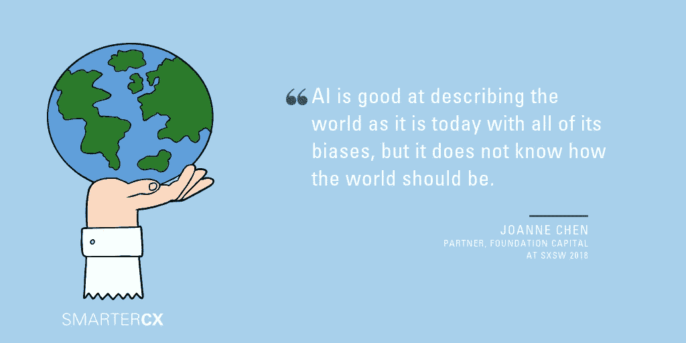
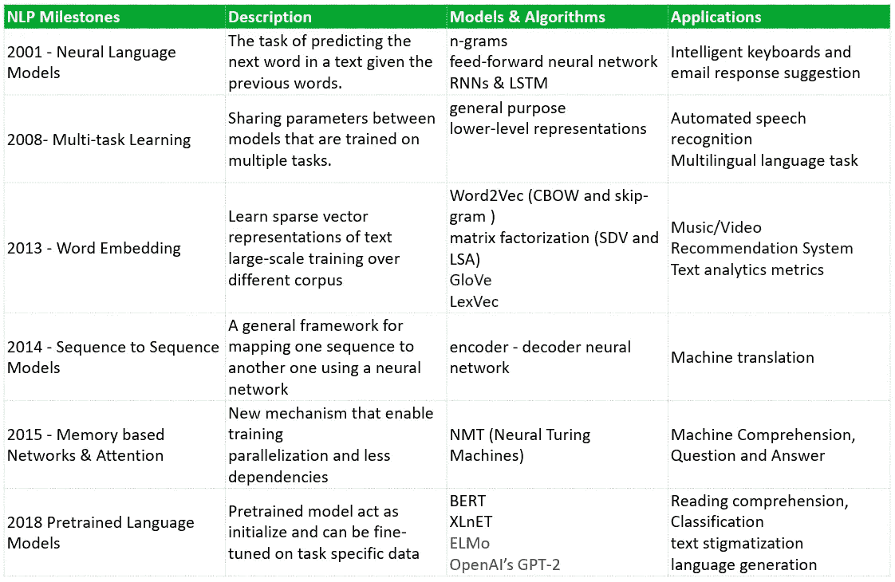
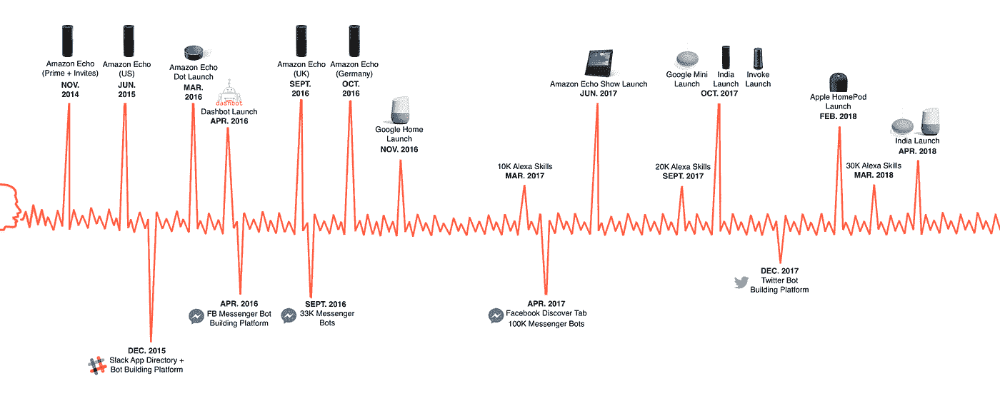
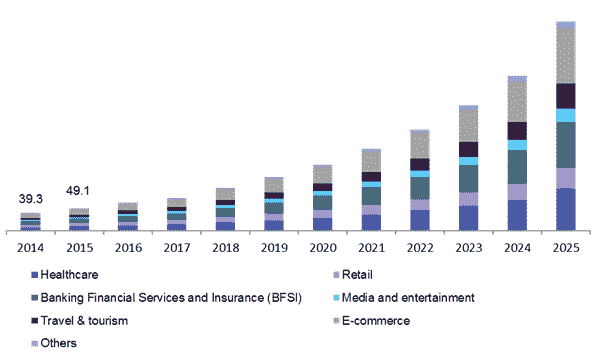
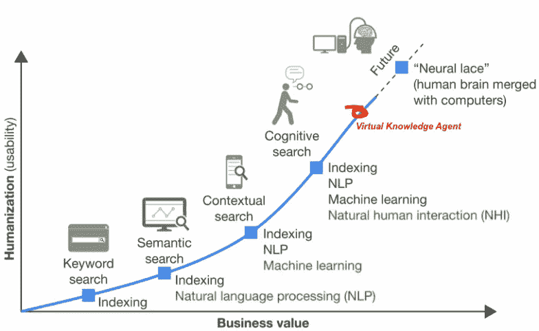
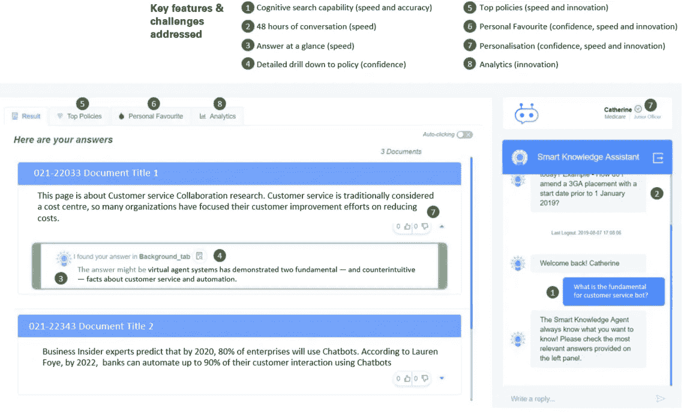
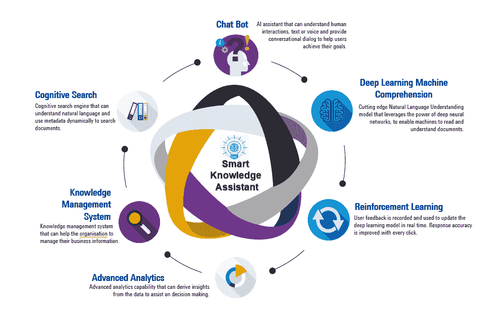
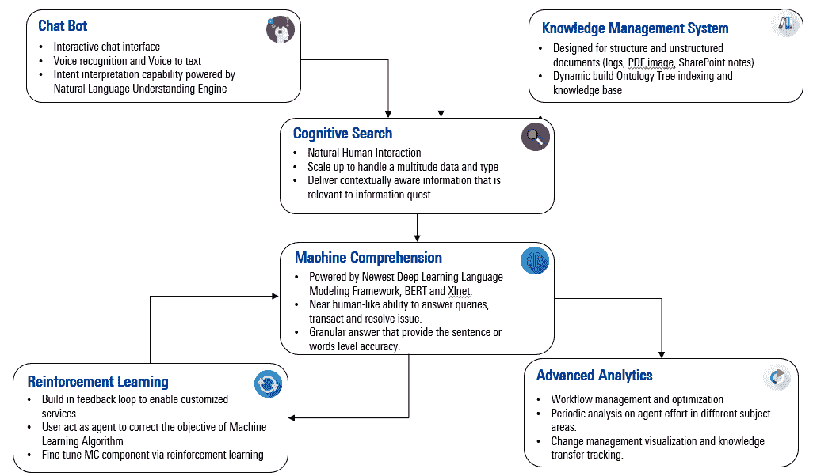
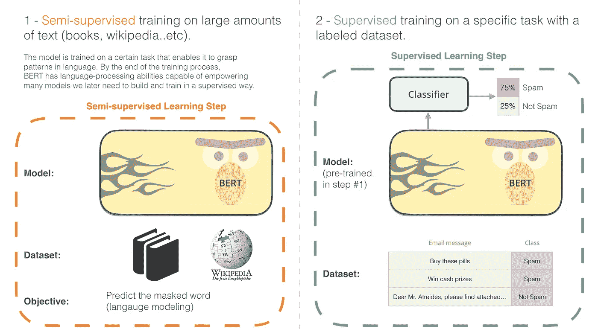

# 工业中的人工智能:虚拟知识助手

> 原文：<https://towardsdatascience.com/deciphering-ai-in-industrial-context-virtual-knowledge-assistant-689f2a8ba290?source=collection_archive---------21----------------------->

*使用深度学习和语言建模设计服务重工业的人工智能解决方案*🤖

## 为什么工业背景很重要？

在人类历史上，技术一直是经济的基本驱动力。

人工智能是通用技术的代表之一，它催化了现代创新和机会的浪潮，推动了第四次工业革命。它开始重塑商业格局、日常生活以及不同实体之间的关系。

对我来说，人工智能是社会上最激动人心和最有意义的探索未知的旅程之一。

事实是，在这个行业，谈论人工智能的人比做人工智能的人多。人工智能解决方案的适用性仍然非常狭窄，大多数人工智能计划都失败了，因为缺乏能够证明投资和工程努力的核心价值。

拼图中缺少的不仅仅是技术含量，还有合适的**工业背景**。但是在我们深入实际例子之前，让我们先来看看自然语言处理。

## 自然语言处理

自然语言处理是人工智能和语言学的一个分支，其本身涉及使用自然语言与人类交流的计算机器的设计和实现。

在其最雄心勃勃的时候，科学家和研究人员旨在为机器设计一个通用框架和系统，使其能够像人类一样流利灵活地使用语言。

虽然自然语言处理本身并不等同于人工智能，但如果你考虑到体验学习是必不可少的，它仍然是初步之一。简单来说，一个真正聪明的身体需要从外部世界学习，包括阅读、观察、交流、体验等。

据 DeepMind 的研究科学家 [Sebastian Ruder](http://ruder.io/) 称，NLP 15 年的工作可以浓缩为 8 个里程碑，这也引发了行业反应和合并应用。

History of Natural Language Processing

## 语音助手和聊天机器人

虚拟助手(或聊天机器人)是自然语言处理技术的工业实现。它可以被视为一个在通用大型语料库或服务抄本上训练的自动化系统，可以使用 AI 来识别和响应客户请求。当我们谈到 Chabot 的时候，你首先想到的是 Siri 或者 Google Assistant(你今天可能已经和它们互动过了)。事实上，如下图所示，科技巨头们都在竞相发布消费者语音产品，

Virtual Agent Release Timeline

语音助手可以针对水平功能进行设计，例如，对话代理、问答机器人、调查机器人和虚拟代理。也可以与垂直行业保持一致，包括银行和金融服务、消费者、公共服务、政府、医疗保健等。一个简单的语音助手应该能够与人互动，提供相关信息，甚至完成基本功能，如填表或预订和安排回电。

Chatbot Market Size and Share

一般来说，语音助手的成功大规模实现依赖于三个前提，

1.  ***一个亟待解决的问题:*** 一家公司在客户服务上投入了巨额资金，但仍面临着扩大规模的挑战。
2.  ***用于训练一个 ML 引擎的内容:*** 由用户生成的数以千计的抄本或对话，其能够实现深度学习模型的训练。
3.  ***人类 AI 协作模型:*** 虚拟助手应该被设计来增强人类的活动，而不是取代它们。这将允许虚拟代理和人工代理一起工作。

但是，一个成功的 NLP 解决方案在现实世界中是什么样的，或者更具体地说，我应该如何设计一个虚拟助理系统来解决现有的问题。在下面的内容中，我阐述了通用 bot 解决方案背后的设计思想——智能知识助手。

## 如何建立知识助理

人类在过去两年产生的数据比人类过去 5000 年产生的数据还多。五年后，这些数据中大约 80%将是非结构化的。全球各地的公司都面临着同样的挑战，即如何更好地管理、搜索和分析这些非结构化数据。

让我们看一个场景。一个审计小组正在进行一个项目，以评估一个跨国组织的财务运作和财务记录。他们需要对照不同县的法规检查合规性，这需要花费大量时间手动处理文档，然后搜索并比较条款和条件。

即使有针对这些监管政策的内容管理系统，标准的搜索引擎也不足以帮助他们得到他们想要的东西，因为，

*   典型的搜索引擎只能接受关键词， ***不能理解自然语言，或者抽象关键词***
*   搜索结果 ***很少调出目标文档***
*   一个搜索引擎通常会返回一长串结果，并且需要大量的人工阅读来找到正确的答案
*   搜索结果与用户使用的术语高度相关
*   ***没有定制***

这里最大的问题是，现有的系统没有认知理解能力。为了弥合这一差距，我们需要整合最新的马力 NLP 来增强搜索解决方案。

The development of Search Engine

虚拟知识助手在解决上述挑战时派上了用场。一个适当范围的设计的知识助理的目标可以提供，

*   *高速检索信息功能，允许用户一次查询一个大型语料库*
*   ****高准确度*** 仅向最终用户提供最高结果(基于置信度得分小于 3)*
*   *集成到内部文件系统，构建自我管理的知识库*
*   *向最终用户提供 ***粒度答案*** 的能力*

*例如，我问虚拟知识助理:“我如何才能成为注册公司审计师(RCAs)？”然后助理浏览了上万份保单，告诉你“要成为 RCA，你需要向澳大利亚证券和投资委员会(ASIC)证明你符合 2001 年公司法第 1280 条的要求”*

*随着深度学习和自然语言处理的最新突破，这不是一个梦想。*

## *解决方案架构和设计*

*对于前端用户体验设计，该团队将反馈和人为因素纳入了设计思路。下面是解决方案用户界面快照。了解我们如何将解决方案体验从标准的 SharePoint 搜索 UI 发展为完全集成的交互式单页应用程序。(下面的截图中使用了模型数据)*

**

*Virtual Knowledge Assistant UI*

*在交互前端的背后是充当大脑的人工智能引擎。为了实现这一目标，数据科学团队进行了多次 R&D，评估了行业中大量不同 NLP 技术的适用性和适用性。最后，很少被认为是虚拟知识助手的关键组件。*

**

*Key Components for Knowledge Assistant*

**

*Key Functionalities per each component*

*工程团队需要分离主要功能，以确保解决方案的未来可伸缩性。因此，在下一次迭代中，每个组件本质上都将充当微服务容器或云原生无服务器功能。*

## *机器理解*

*解决方案的秘方是微调后的伯特模型。*

**

*[BERT](https://github.com/google-research/bert) 代表来自 Transformer 的双向编码器表示，它是由 Google AI Language 开发的最新语言表示模型，它在 NLP 社区掀起了风暴，并占据了 NLP 竞赛排行榜的大部分席位。它也成为了 NLP 中迁移学习方法的工业标准。*

*数据科学团队使用最初的 BERT，并在以下步骤上重新训练，*

*   *首先，在客户端提供的语料库上精细化预训练模型*
*   *第二，对尾部下游任务的最后一层进行微调。*

*训练过程是在谷歌云平台上使用 GPU NVIDIA Tesla V100，8 个 GPUs128 GB HBM2。整个实验花了 4-5 天，我们设法将结果从 67%(通过 AllenNLP 的 BiDAF 模型)提高到 89%以上(微调 BERT)。*

*总的来说，这是我今年工作过的最成功的 NLP 解决方案之一，它对客户组织的影响远远超过了我的预期，在最后的演示会议上，你可以看到高级管理人员眼中的火花，它刺激了机构层面上对完全集成的人工智能解决方案的讨论。*

*成功不仅属于先进的 NLP 技术(BERT 或 XLNet)，而且是用户体验重新设计、解决方案架构师、业务逻辑以及业务需求到技术功能的精确转换的共同努力。更重要的是，我们为虚拟知识助手找到了最佳的**情境之一，***

*考虑到这是一篇很长的文章，我不会过多地讨论技术细节。如果您对每个技术组件、项目设置、结构、云平台实现、我们如何培训 BERT 以及技术挑战的详细解释感兴趣，请等待本文的第二部分< ***如何构建知识代理*** >。*

*感谢您花时间阅读这个故事。正如谷歌云 AI/ML 前首席科学家费-李非所说:“我们开发的工具和技术真的是人工智能所能做的浩瀚海洋中的最初几滴水。”作为市场领导者，我们的工作是理解人工智能能做什么，以及它应该如何适应你的商业环境和人类更光明未来的战略。*

**关于我，我是*👧🏻他住在澳大利亚的墨尔本。我学的是计算机科学和应用统计学。我对通用技术充满热情。在咨询公司做 AI 工程师👩🏻‍🔬，帮助组织整合人工智能解决方案并利用其创新力量。在 [LinkedIn](https://www.linkedin.com/in/catherine-wang-67547a53/) 上查看更多关于我的信息。*

**