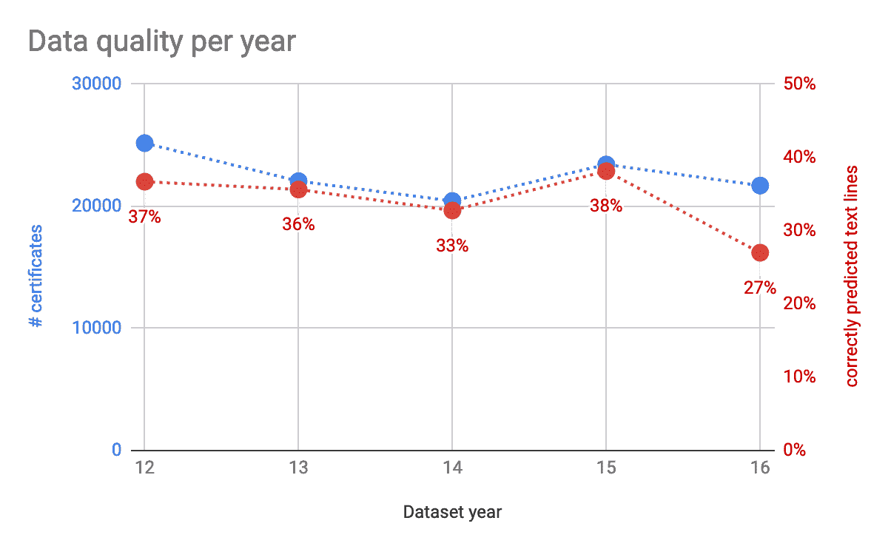
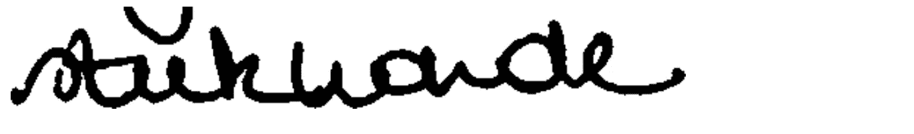

# 利用深度学习破译医生的笔迹

> 原文：<https://towardsdatascience.com/deciphering-doctors-handwriting-using-deep-learning-b3fce634f2e1?source=collection_archive---------6----------------------->

## 实际案例

我们建造了一个机器人，它可以自动读取医生在比利时死亡证明上的笔迹，正确预测的可用数据集的准确率为 47%。机器人支持政府官员进行正式的死亡登记，并允许更快的登记。

该解决方案由三个主要组件组成:图像处理模块、神经网络和输出医学术语预测的自然语言处理模块。

# 死亡证明

当一个人死亡时，医生必须证明这个人的死亡状态。医生要填写一份标准表格。这是通过在表格上手写声明“在现场”完成的，随后在密封的信封中转发给其他官员。

医生正式记录死亡的直接原因，以及任何已知的次要原因。这种死亡证明的一个例子如下。

*(所有的例子都是荷兰语，所以如果你认为你什么都看不懂，那很正常！)*

Example death certificate

上面的例子读起来相当简单，但是也存在众所周知的难以阅读的例子。

A hard-to-read handwriting

因为医生是在“现场”记录死亡原因的，所以 100%的数字解决方案是不可行的，并且大量的手写将会存在很多年。

# 数据管道

原始数据是一页纸的扫描件，以 PDF 格式提供。

第一步是匿名化数据。从文档 id 中计算散列，并从文档中切出一个感兴趣的区域(ROI ),其中包括笔迹，但*不包括*任何个人数据，如医生签名、死亡日期和地点等。

这会产生比原始图像更小的图像，并且没有从图像到原始扫描的链接。

第二步是清理图像。文档模板中有背景文本，并且有扫描错误。我们去除了背景，应用了降噪和轻微的模糊处理来消除手写线条中的小间隙，同时保留单词之间的空间。

第三步是将图像裁剪到包含手写内容的最小尺寸。

第四步，从字里行间切入。因此，当文本有 *n* 行时，我们最终得到每个原始证书的 *n* 个图像片段。

然后，我们应用神经网络(NN)来预测所写的内容，并计算 NN 对预测正确性的确信度。

包含未知单词的预测需要额外的自然语言处理(NLP)来将其映射到已知单词。我们再次计算置信水平。

总之，阅读笔迹的解决方案是图像处理、深度学习和自然语言处理的结合。

# 神经网络

构建神经网络最困难的部分之一是决定其架构。我们决定不重新发明轮子，从现有的神经网络架构开始。我们发现 H. Scheidl (2018，[https://towardsdatascience . com/build-a-handled-text-recognition-system-using-tensor flow-2326 a 3487 CD 5](/build-a-handwritten-text-recognition-system-using-tensorflow-2326a3487cd5))描述的 NN 工作得非常好，经过一些小的修改。

## 神经网络体系结构

H. Scheidl 的 NN 具有五层卷积神经网络(CNN)、两层递归神经网络(RNN)和连接主义时间分类(CTC)层。关于细节，我们可以参考 H. Scheidl 的出版物。

这个神经网络训练字符和标点符号识别，因此也可以识别由相同字符和标点符号组成的新文本。

我们必须对 Scheidl 的 NN 进行一些修改，使其能够处理正在研究的数据集:

*   增加单词长度；
*   禁用字束搜索(WBS)；
*   允许多个单词

**增加单词长度。**Scheidl 网络采用最多 32 个字符的单词。因为我们考虑的是完整的文本行，所以我们需要将它增加到 128 个字符。(这大于数据集中最长的标签。)

**禁用词束搜索。**神经网络(NN)可以被限制在单词字典中。如果您需要查找所有手写单词，这是有意义的。神经网络将把每个手写单词分配给字典中的一个已知单词。

我们用可用的标签字典对此进行了测试，但是我们发现这产生了很多误报。在我们的商业案例中，如果神经网络不能自信地阅读手写内容，最好不要分配一个单词。在这些情况下，我们更喜欢由人来做最后的决定。

出于这些原因，我们决定不使用 WBS，而是应用一个单独的单词匹配模型作为后处理 NLP 步骤。

**允许多个单词。**在医学术语中，某些词的组合经常一起出现。通过使用文本行而不是单词，神经网络能够识别这些，这增加了成功率。

## 训练数据

在训练神经网络之前，我们需要检查数据的质量。我们希望用我们有高度把握标签是正确的数据来训练神经网络。

神经网络的准确性高度依赖于数据的质量。我们有六年的标记数据，但从业务中我们知道

*   在 2012-2015 年期间，标签是手写的文字转录，而从 2016 年开始，有时还会对标签进行解释；和
*   一个难以辨认的单词用标签中的$符号来编码。

因此，标签中带有$符号的所有证书都被排除在训练、验证和测试集之外:这些标签被认为是不确定的。

我们排除的其他证书是那些在分割后识别的文本行数不等于证书的标签数的证书。在这些案例中，一个死亡原因被写在多行上。标记数据的人具有上下文领域的知识来了解这一点，并将其标记为单线。分段不能知道单个死因是否写在单行上。因此，我们排除这些证书；我们不能确定特定的标签对应于特定的手写行。

出于技术原因，长度超过 128 个字符的行也被排除在外，但这只是不到 0.5%的一小部分。

这些排除规则导致 344.365 个证书中的 128.794 个被排除，占总数的 38%。还剩下 215.571 张贴好标签的证书。

在标记良好的证书中，我们将 60%定义为训练集，20%定义为验证集，20%定义为测试集。

The number of certificates included in training, validation, and test sets across the years 2012–2016

训练发生在文本行上，而不是在完整的证书上，并且在分段之后，上述证书编号导致以下文本行号。

The number of text lines included in training, validation, and test sets across the years 2012–2017

标签的数据质量在这一点上是未知的。我们必须假设它们是基本的事实，即使我们知道不是所有的标签都是笔迹的精确表现。目测了解到在标记的数据集中至少存在以下情况。

*   标签中手写的拼写错误被改正了
*   标签中出现拼写错误
*   缩写在标签中被拼成一个完整的单词，反之亦然
*   标签中手写的标点符号不是逐字转录的

我们将在后面看到，我们可以在某种程度上量化数据质量。

## 最佳拟合神经网络模型

神经网络是出了名的黑箱，难以理解。因此，我们定义了一组模型并比较它们的结果。集合中的变化是数据包含在训练集、验证集和测试集中的变化。

集成技术有助于在开发过程中理解模型，并提高模型的健壮性。

我们的集合涵盖以下数据集组合。给出的准确度是由神经网络正确预测的验证集中文本行的百分比。对于*正确预测的*，我们指的是文本串的*精确匹配*:*所有的*字符和标点符号精确匹配。

在神经网络发展的早期阶段，两年的准确率在 40%到 75%之间波动。由于数据集中每年的证书数量几乎相同，这是非常出乎意料的，结果证明这是由于一个小错误，该错误过度拟合了某些数据集的模型。如果不进行集合测试，这些过度拟合的模型往往会被忽视。误差修正后，所有精度都符合预期。

当我们绘制每年的证书结果时，准确性随时间的变化是明显的。下面显示的是每年训练集中的证书数量(蓝色)和模型在该年达到的准确度(红色)。

The number of certificates and the accuracy of the trained model for each year

该图清楚地表明，前四年(2012 年至 2015 年)的精度相当稳定，平均精度为 36%，标准偏差为 2%。我们发现 2016 年的准确性明显较低，这可能是由于标签质量较低，这一点企业已经知道。

增加具有较低质量标签的数据集不会增加模型的准确性。反之，甚至可能降低。

最佳模型是具有最大数据集的模型，即 2012 年至 2016 年的合并数据。下面我们展示了当通过一次增加一年来增加数据集的大小时，精确度是如何提高的。

The accuracy of fives model applied to four different test sets.

将模型应用于 2017 年的完整数据比其他测试集的准确性稍低。这可能是 2016 年和 2017 年标签不太准确的结果。

最好的评分模型是 2012-2016 年的训练集。所达到的准确度是 53%的精确正确预测的文本行。我们将进一步研究这个最佳模型。

## 置信级别

神经网络模型为每个预测分配一个置信度。对于测试集，我们知道预测是否与标签完全匹配。对于每个预测，我们知道它是属于正确预测集还是不正确预测集。然后我们可以在一个置信范围内画出预测的数量。

置信度的范围在 0 到 1 之间。我们将该范围分成 20 个区间，每个区间宽 5%，并计算正确和错误预测集在该置信水平下的文本行预测数。

下图显示了两组的结果。正确的预测显示为蓝色，不正确的预测显示为红色。

The number of correct and incorrect text-line predictions as a function of NN confidence level.

我们的目标是高度可信的预测。这些预测应该是准确的。结果确实表明，正确预测的数量在 95–100%置信度时达到峰值，在较低的置信度时会降低。

然而，已知不正确但仍具有高置信度的预测表明存在所谓的假阳性。这些都是极不需要的！

低置信度的预测大多是不正确的预测，由置信度为 0–5%的(红色)峰值显示。这些是难以辨认的笔迹。(对机器来说难以辨认，对人来说不一定。)

具有低置信度的预测总是必须显示给必须判断该预测的人。通过用改进的数据对模型进行再训练，人类反馈可用于改进模型。

也有对低置信水平的正确预测。这些都是假阴性。机器将判断它们是不确定的，它们也将被送到人工检查。

**目标人群的例子**

让我们以较高的可信度检查一些正确预测的例子。

**来自假阳性人群的例子**

假阳性群体是神经网络非常确定的一组预测，但它与给定的标签不匹配。

在第一个例子中，我们看到预测实际上是正确的，但是标签增加了“COPD”。因此，我们的精确匹配测试使其落入“不正确”的集合中。这是一个标签与手写文本不完全匹配的例子。

在第二个例子中，我们看到了标签和预测之间的微小差异:v 与 e。标签在语言学上是正确的，但 e 上的分音符不是医生写的。只是因为我们在测试准确性上如此严格，所以这个预测才落入假阳性人群。

第三个例子显示了人为错误。它被标记为“uitdroging ”,但是“uitputting”的预测已经被业务部门确认为正确的。这表明人类也会犯错，因此也会产生假阳性。

第四个例子也是人为错误。标记为“verstikking ”,但它应该是“verslikking ”,这是由神经网络正确预测的。

当手动验证置信度大于 60%的 30 个假阳性的随机样本时，所有这些都表明神经网络是正确的，而标签是错误的。对于其中的两个，人类是错误的。有时差异非常小，但由于我们对正确性的严格测试，即使预测和标签之间的最小差异也会导致假阳性。

令人欣慰的是，确定的假阳性群体已经非常小，可能比包含人为错误的群体还要小。在假阳性组中，人为错误估计发生 2/30 = 7%。

**假阴性人群的例子**

下面是一个正确预测的文本行的示例，但是神经网络对预测的可信度非常低。这种具有低置信水平的情况将被标记以供人类判断。

**来自可理解群体的例子**

然后就是一整组 NN 看不懂的手写。所有这些都需要人工判断。

在第一个示例中，箭头没有被正确检测到，最后一个单词也没有被检测到，这也是标签是否正确的问题。不过，第一个单词找到了。

在第二个例子中，我们看到上面的文本行的一部分与文本重叠。这混淆了对单个字母的识别。但是其他单词的可读性也很差。人们希望这些案件得到人类的审判。

# 自然语言处理

神经网络主要被训练来识别字母。它不知道单词。这意味着 NN 预测形成一个字母序列，尽管它有一些顺序概率的意义，但一些字母组合可能没有意义。

如果 NN 预测与字典中的单词完全匹配，我们不执行进一步的文本匹配。如果已经有一个精确的匹配，我们只会冒险修改一个正确的预测，把它变成别的东西。因此，只有当 NN 预测与字典单词不完全匹配时，才进行下面描述的与单词匹配的*文本。*

请注意，这些知识也可以用于向词典中添加新单词。

我们已经尝试将神经网络限制为仅预测医学词典中的已知单词，但这导致了太多的假阳性。这种神经网络的输出总是字典中的一个单词。它不能识别其他单词。

因此，我们决定只在字符识别上训练神经网络，并作为后处理步骤执行与字典的匹配。

匹配基于两种算法。

*   Jaro 和 Damerau-Levenshtein 距离
*   二元距离

Jaro 和 Damerau-Levenshtein 距离将预测的字母序列与已知单词进行比较，并将纠正预测所需的“编辑”次数视为到单词的距离。

可以计算预测到字典中任何单词的距离，并且将具有最短距离的单词指定为最终预测。

如果文本行至少包含两个单词，则计算二元模型距离。从字典中可以知道有些词经常一起出现。这有助于从预测的字符序列中识别这样的单词。

## 置信级别

匹配的复杂性在于定义模型对于匹配的置信度。虽然预测到单词的距离是预测有多接近的度量，但它不是置信度的度量。

举个例子，看看下面的笔迹，上面写着“steekwonde”。

NN 预测是“stuikwonde”，比较接近，但不确切。在词典中，我们发现了两个相似的词:“stuitwonde”和“steekwonde”。第一个只有一个字母的距离，第二个有两个字母的距离。但是因为两者都很接近，所以模型应该很不确定选择哪一个。

因此，当我们将神经网络预测与词典中的单词进行匹配时，置信度应该考虑其他相近的单词。单词之间的距离越近，最终结果就越不确定。如果两个单词与 NN 预测等距，则匹配置信度为 50%。如果三个单词是等距离的，置信水平下降到 33%。

我们根据这些统计数据计算了文本匹配的置信度。这很重要，因为在最终产品中，在决定是否进行人工干预时，必须考虑神经网络和文本匹配的置信度。

# 完整的证书

文本识别模型在单个文本行上操作。平均每个证书有两行文本，作为可测试数据集一部分的证书上最多有四行文本。(标记良好的数据集。)

预计每个证书的文本行数越多，完全正确预测的证书比例就越低。下图显示了证书数量与证书上文本行数的函数关系。

我们证实，随着每个证书的文本行数的增加，完全正确预测的证书的比例下降。

让我们将正确预测证书的置信度定义为证书上任何文本行预测的最小*置信度。然后，我们可以将正确预测的证书数量绘制成置信度的函数。下图显示了这一点，其中颜色编码用于表示证书上的行数。*

对于没有被正确预测的证书，可以做出相同的图。

我们发现对于高置信水平，在证书水平上很少有不正确的预测。

# 难以辨认的笔迹

从训练和测试集中排除的是那些甚至人类也不能阅读的证书。这些标签中有$-符号。正如下面的例子所示，神经网络可以正确地读取其中一些，至少可以给试图破译文本的人提供有用的建议。

如果我们将文本行预测的数量绘制为神经网络置信度的函数，我们会看到该分布在 0–5%的置信度处显示一个大峰，这是预期的。如果人类看不懂，机器可能也看不懂。此外，NN 没有接受过阅读可理解证书的训练。

请注意，在某种意义上，神经网络模型中存在一个偏差，即那些不能被人类阅读的笔迹很可能是最差的笔迹，并且该模型不能在这些笔迹上进行训练，因为这些笔迹没有被标记。通过在系统中提供人类反馈，机器也可以慢慢地在这些情况下接受训练。

在第一个例子中，第一个单词不能被人类阅读。NN 预测单词匹配后接近最终预测的单词。(“PP”代表*后处理*，包括文字匹配。)最后的 PP 预测其实是正确的。因此，即使预测的可信度很低，该预测也会对人类法官起到很好的建议作用。

在第二个例子中，第二个单词是人类不可读的。神经网络预测只差一个字母:c 而不是 e。单词匹配后的最终预测是 100%正确的。

这表明，即使神经网络没有在这些情况下受过训练，它也能识别足够多的字母，对难以辨认的单词做出非常可信的预测。

# 决赛成绩

我们的最终结果显示，54%的神经网络预测的文本行与人类定义的标签完全匹配。如果我们将文本匹配作为后处理步骤添加到字典中，我们可以将它增加到 60%以上，如果我们考虑到每个证书平均有大约两行文本，我们有 47%的完整证书被正确预测。

对于人类不可读的文本行，即标签中带有$-符号的文本行，我们请两位业务专家手动验证我们的预测。我们随机抽取了 100 个这样的文本行。结果令人放心:100 个中有 20 个被正确预测。

这让我们相信，即使对于难以辨认的证书，模型算法也可以通过给出书写内容的建议来支持人类。

# 自动化

仍然存在的问题是，我们能在多大程度上自动识别医生的笔迹，并将其与现有的软件系统集成。这归结为一个问题，即我们可以定义一个阈值，在这个阈值之上，预测可以被认为是正确的，因此没有人必须干预。

为了理解这一点，我们必须回到预测的分布作为一个信心水平的函数。对于神经网络，这个函数已经在前面的图中显示了。为了清楚起见，我们在这里重复它。

让我们将阈值定义为 95%的置信度。这意味着所有置信度为 95-100%的预测文本行将被认为是正确的:不需要人工干预。这是上图最后一个框中的所有文本行。这大约是所有文本行的 11%。

我们也有一些误报，但在这种情况下，这只是所有文本行的 0.1%。可能低于人为错误，我们从分析中知道，许多假阳性是由于错误的标记，所以假阳性的真实数量甚至更少。

如果我们将阈值设置为 90%,我们会计算上图中最高的两个容器中的所有文本行。这导致 20%的正确率和 0.2%的误报率。

通过将阈值设置得越来越低，我们添加了更多正确的结果，但最终我们添加了令人难以忍受的许多假阳性。所有高于阈值的红色条柱都被视为误报。因此，当我们有正确预测的好结果，并且假阳性的数量仍然是可接受的低的时候，必须有一些阈值最佳值。什么是可接受的是一个有争议的问题，但假设人类也会犯错误，只要我们的表现不比人类差，我们就可以接受少量的误报。

到目前为止，我们只研究了神经网络的置信水平。如果我们将后处理(文本匹配)添加到图片中，我们可以有效地将一些预测从不正确的群体移动到正确的群体。如下图所示。

我们看到，对于不正确的总体，接近零置信度的峰值降低，而正确的总体升高，当然，特别是对于低置信度。

我们现在可以画出有多少高于阈值的预测是正确的和不正确的。这在下面的图中给出。

绿色显示的是正确预测的人口，红色显示的是错误预测的人口。虚线仅是神经网络预测，实线也包括后处理，这增加了正确群体并减少了错误群体。

垂直绿色条表示从 70%到 75%的阈值。如果我们在这里设置阈值，我们有 33%的正确预测和不到 1%的错误预测(假阳性)。

如果假阳性不相关，则在绿线和红线之间的差异最大化的阈值处获得最大数量的正确结果。这大约是 10%，这导致 59%的正确预测和 8%的错误预测。

在我们的用例中，我们需要在死亡证明的上下文中预测医学术语，如此高数量的假阳性是不可接受的。因此，我们必须谨慎行事。

可以开始将阈值设置为 95%，并且当验证具有较低置信水平的任何预测的人获得对模型预测的信心并向系统提供反馈时，使得模型变得更好，阈值可以降低。

当模型使用人类反馈并自我改进时，它将使用更高的置信度进行预测，这将通过置信度水平将预测的分布向右移动，从而将更多的预测推到阈值以上。

我们可以做出同样的图来预测完整的证书，而不仅仅是文本行。这在下面给出。

这里的数字有些低，因为证书上的所有文本行都必须正确预测。当我们将阈值设置为 30%到 35%的置信度时，我们现在达到了超过 30%的正确预测，但是假阳性的数量达到了 5%。

# 结论

我们得出结论，使用经过训练的神经网络来阅读医生的笔迹是可行的。

我们发现，神经网络结果对数据预处理的质量非常敏感，并将其切割成单词或文本行。仔细的图像处理是项目成功的关键。

我们还发现，让神经网络将文本与词典单词进行匹配会产生太多的假阳性结果，最好让神经网络只进行阅读，并使用其他 NLP 技术与词典进行匹配。

我们可以通过神经网络和文本匹配来计算预测的置信水平，这可以用于定义用于自动化目的的置信水平阈值。

# 承认

我们感谢佛兰德政府、Vlaams agents chap Zorg&Gezondheid，是他们使这个项目成为可能，特别感谢 Koenraad、Anne、Rita 和 Wilfried，他们提供了宝贵的指导和商业专业知识，以及他们富有挑战性的重要意见，使这个项目超过了平均水平。

这个项目是 Vectr 的一个合作项目。咨询(【https://medium.com/vectrconsulting】)，特别感谢布鲁诺和乔尼。