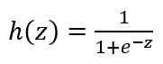
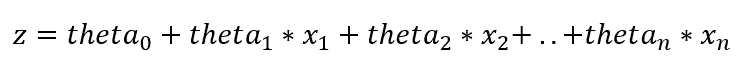
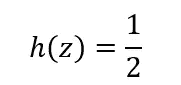
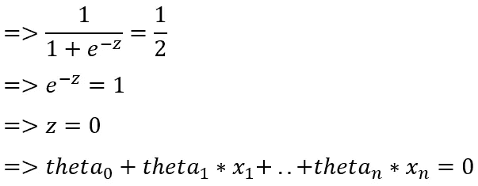
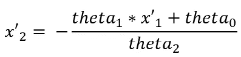
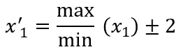
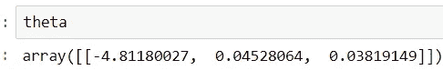
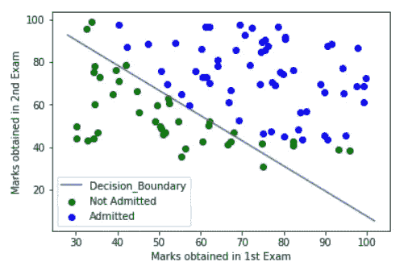
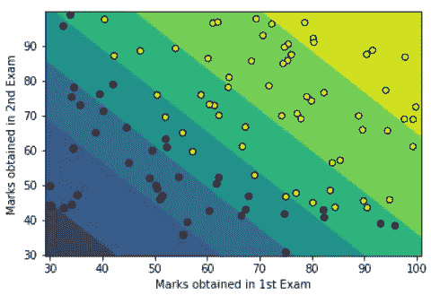

# 决策边界可视化(A-Z)

> 原文：<https://towardsdatascience.com/decision-boundary-visualization-a-z-6a63ae9cca7d?source=collection_archive---------4----------------------->

## 含义、意义、实施


分类问题是数据科学领域中非常普遍和重要的问题。例如:糖尿病视网膜病变、情绪或情感分析、数字识别、癌症类型预测(恶性或良性)等。这些问题往往通过机器学习或者深度学习来解决。此外，在计算机视觉中，像糖尿病视网膜病变或青光眼检测这样的项目中，纹理分析现在经常使用，而不是传统图像处理或深度学习的经典机器学习。虽然根据研究论文，深度学习已经成为糖尿病视网膜病变的最先进技术:

[](https://ieeexplore.ieee.org/document/8596839)*【1】一种检测糖尿病视网膜病变的深度学习方法。*

*在分类问题中，对一个特定类别的预测涉及到多个类别。换句话说，它也可以以这样的方式构成，即特定的实例(根据特征空间几何的数据点)需要保持在特定的区域(表示类)下，并且需要与其他区域分离(表示其他类)。这种与其他区域的分离可以通过被称为**决策边界**的边界来可视化。特征空间中决策边界的可视化是在散点图上完成的，其中每个点描述数据集的一个数据点，轴描述特征。决策边界将数据点分成区域，这些区域实际上是它们所属的类。*

***决策边界的重要性/显著性**:*

*在使用数据集训练机器学习模型之后，通常需要可视化特征空间中数据点的分类。散点图上的决策边界用于此目的，其中散点图包含属于不同类别的数据点(用颜色或形状表示),决策边界可以按照许多不同的策略绘制:*

1.  ***单线决策边界**:在散点图上绘制决策边界的基本策略是找到一条单线，将数据点分成表示不同类别的区域。现在，使用在训练模型之后获得的与机器学习算法相关的参数来找到这一单线。使用获得的参数和机器学习算法背后的直觉找到线坐标。如果不知道 ML 算法的直觉和工作机制，就不可能部署这种策略。*
2.  ***基于轮廓的决策边界**:另一种策略涉及绘制轮廓，这些轮廓是每个都用匹配或接近匹配的颜色包围数据点的区域——描绘数据点所属的类别，以及描绘预测类别的轮廓。这是最常遵循的策略，因为这不采用模型训练后获得的机器学习算法的参数和相关计算。但是另一方面，这并没有使用单线完美地分离数据点，所述单线只能由在训练和它们的坐标计算之后获得的参数给出。*

****单线判定边界的范例实现:****

*在这里，我将展示基于逻辑回归的机器学习模型的单线决策边界。*

*进入逻辑回归假设-*

**

*其中 z 定义为-*

**

***theta_1**, **theta_2, theta_3** , …., **theta_n** are the parameters of Logistic Regression and **x_1**, **x_2**, …, **x_n** are the features*

*因此，h(z)是一个 Sigmoid 函数，其范围是从 0 到 1 (0 和 1 包括在内)。*

*为了绘制决策边界，h(z)等于逻辑回归中使用的阈值，通常为 0.5。所以，如果*

**

*然后，*

**

*现在，为了绘制决策边界，需要考虑两个特征，并沿散点图的 x 轴和 y 轴绘制。所以，*

**

*在哪里，*

**

*where **x_1** is the original feature of the dataset*

*因此，获得了 x'_1 的 2 个值以及 2 个相应的 x'_2 值。x'_1 是单线判定边界的 x 极值，x'_2 是 y 极值。*

***虚拟数据集上的应用:***

*数据集包含 100 名学生在两次考试中获得的分数和标签(0/1)，该标签指示该学生是否将被大学录取(1 或负数)或不被大学录取(0 或正数)。该数据集位于*

*[](https://github.com/navoneel1092283/logistic_regression.git) [## navoneel 1092283/logistic _ 回归

### 在 GitHub 上创建一个帐户，为 navoneel 1092283/logistic _ regression 开发做出贡献。

github.com](https://github.com/navoneel1092283/logistic_regression.git) 

**问题陈述**:*给定两次考试的分数，用逻辑回归*预测学生是否会被大学录取

在这里，两次考试的分数将是被考虑的两个特征。

以下是在 3 个模块中实现的逻辑回归。文中给出了具体的实现方法，

[](https://hackernoon.com/logistic-regression-in-python-from-scratch-954c0196d258) [## Python 中的逻辑回归从零开始

### 分类是机器学习问题中一个非常普遍和重要的变体。很多机器算法都有…](https://hackernoon.com/logistic-regression-in-python-from-scratch-954c0196d258) 

```
import numpy as np
from math import *def logistic_regression(X, y, alpha):
    n = X.shape[1]
    one_column = np.ones((X.shape[0],1))
    X = np.concatenate((one_column, X), axis = 1)
    theta = np.zeros(n+1)
    h = hypothesis(theta, X, n)
    theta, theta_history, cost = Gradient_Descent(theta, alpha
                                 , 100000, h, X, y, n)
    return theta, theta_history, cost
def Gradient_Descent(theta, alpha, num_iters, h, X, y, n):
    theta_history = np.ones((num_iters,n+1))
    cost = np.ones(num_iters)
    for i in range(0,num_iters):
        theta[0] = theta[0] - (alpha/X.shape[0]) * sum(h - y)
        for j in range(1,n+1):
            theta[j] = theta[j] - (alpha/X.shape[0]) * sum((h - y) *
                                   X.transpose()[j])
        theta_history[i] = theta
        h = hypothesis(theta, X, n)
        cost[i] = (-1/X.shape[0]) * sum(y * np.log(h) + (1 - y) * 
                                        np.log(1 - h))
    theta = theta.reshape(1,n+1)
    return theta, theta_history, cost
def hypothesis(theta, X, n):
    h = np.ones((X.shape[0],1))
    theta = theta.reshape(1,n+1)
    for i in range(0,X.shape[0]):
        h[i] = 1 / (1 + exp(-float(np.matmul(theta, X[i]))))
    h = h.reshape(X.shape[0])
    return h
```

对数据集执行逻辑回归:

```
data = np.loadtxt('dataset.txt', delimiter=',')
X_train = data[:,[0,1]]
y_train = data[:,2]theta, theta_history, cost = logistic_regression(X_train, y_train
                                                 , 0.001)
```

获得的θ(参数)向量，



获得数据点的预测或预测类别:

```
Xp=np.concatenate((np.ones((X_train.shape[0],1)), X_train),axis= 1)
h=hypothesis(theta, Xp, Xp.shape[1] - 1)
```

绘制单线决策边界:

```
import matplotlib.pyplot as pltc0 = c1 = 0 # **Counter of label 0 and label 1 instances** if i in range(0, X.shape[0]):
    if y_train[i] == 0:
        c0 = c0 + 1
    else:
        c1 = c1 + 1x0 = np.ones((c0,2)) # **matrix** **label 0 instances**
x1 = np.ones((c1,2)) # **matrix** **label 1 instances**k0 = k1 = 0for i in range(0,y_train.shape[0]):
    if y_train[i] == 0:
        x0[k0] = X_train[i]
        k0 = k0 + 1
    else:
        x1[k1] = X_train[i]
        k1 = k1 + 1X = [x0, x1]
colors = ["green", "blue"] # **colours for Scatter Plot**
theta = theta.reshape(3)# **getting the x co-ordinates of the decision boundary** plot_x = np.array([min(X_train[:,0]) - 2, max(X_train[:,0]) + 2])
# **getting corresponding y co-ordinates of the decision boundary** plot_y = (-1/theta[2]) * (theta[1] * plot_x + theta[0])# **Plotting the Single Line Decision Boundary**
for x, c in zip(X, colors):
    if c == "green":
        plt.scatter(x[:,0], x[:,1], color = c, label = "Not
                                                        Admitted")
    else:
        plt.scatter(x[:,0], x[:,1], color = c, label = "Admitted")
plt.plot(plot_x, plot_y, label = "Decision_Boundary")
plt.legend()
plt.xlabel("Marks obtained in 1st Exam")
plt.ylabel("Marks obtained in 2nd Exam")
```



Obtained **Single Line Decision Boundary**

这样，可以为任何基于逻辑回归的机器学习模型绘制单线决策边界。对于其他基于机器学习算法的模型，必须知道相应的假设和直觉。

***基于轮廓的判定边界的范例实现:***

使用相同的虚构问题、数据集和训练模型，绘制基于轮廓的决策边界。

```
# Plotting decision regions
x_min, x_max = X_train[:, 0].min() - 1, X_train[:, 0].max() + 1
y_min, y_max = X_train[:, 1].min() - 1, X_train[:, 1].max() + 1xx, yy = np.meshgrid(np.arange(x_min, x_max, 0.1),
                     np.arange(y_min, y_max, 0.1))X = np.concatenate((np.ones((xx.shape[0]*xx.shape[1],1))
                 ,  np.c_[xx.ravel(), yy.ravel()]), axis = 1)
h = hypothesis(theta, X, 2)h = h.reshape(xx.shape)plt.contourf(xx, yy, h)
plt.scatter(X_train[:, 0], X_train[:, 1], c=y_train,
                              s=30, edgecolor='k')
plt.xlabel("Marks obtained in 1st Exam")
plt.ylabel("Marks obtained in 2nd Exam")
```



Obtained **Contour-Based Decision Boundary** where **yellow -> Admitted** and **blue -> Not Admitted**

这种方法显然更方便，因为不需要直觉和假设或者机器学习算法背后的任何数学。所需要的，就是高级 Python 编程的诀窍！！！！

因此，这是一种为任何机器学习模型绘制决策边界的通用方法。

在大多数实用的高级项目中，都涉及到许多特性。那么，如何在二维散点图中绘制决策边界呢？

在这些情况下，有多种出路:

1.  可以使用由随机森林分类器或额外树分类器给出的特征重要性分数，以获得 2 个最重要的特征，然后可以在散点图上绘制决策边界。
2.  像主成分分析(PCA)或线性判别分析(LDA)这样的降维技术可用于将 N 个特征降维为 2 个特征(n_components = 2 ),因为 N 个特征的信息或解释嵌入到这 2 个特征中。然后，考虑到这两个特征，可以在散点图上绘制决策边界。

这就是决策边界可视化的全部内容。

**参考文献**

[1] N. Chakrabarty，“一种检测糖尿病视网膜病变的深度学习方法”， *2018 年第 5 届 IEEE 北方邦分会国际电气、电子和计算机工程会议(UPCON)* ，印度戈拉克普尔，2018 年，第 1–5 页。多伊指数:10.1109/升。36860.88868688666*