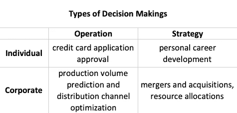

# 决策不仅仅是解决定量问题

> 原文：<https://towardsdatascience.com/decision-making-is-more-than-quantitative-problem-solving-ac6365a9ec16?source=collection_archive---------20----------------------->

> “我在生活和工作中所有最好的决定都是用心、凭直觉、凭勇气而非分析做出的。”—杰夫·贝索斯在 2018 年华盛顿经济俱乐部

多年来，我有一个心理模型，将决策等同于定量解决问题。在这个心智模型中，当一个定量问题被解决时，可以做出决定；例如，如果一种新药的治疗效果在统计学上并不比一种对照药物更好(定量解决问题)，它就不应该获得批准(决策)。我已经有这个心智模型很长时间了，因为这个心智模型不仅反映了我在学校如何定量处理教科书问题的经验，还直接谈到了工作场所中数据驱动决策的流行概念。这个心智模型将决策视为定量问题解决的平滑连续体，并让我相信我知道决策只是因为我知道定量问题解决。

与我想象中的决策不同，实地决策是一个动态的过程，既可以依赖也可以完全独立于定量问题的解决。通过我的工作，我对决策和定量解决问题之间的不匹配感到震惊；许多数据科学家也承认他们的数据结果没有被他们的商业伙伴很好地采纳。缺乏数据文化成为一个容易的借口，然而我相信一个严峻的事实是，决策制定首先不是定量问题的解决。到底什么是决策？我以前从来没有认真想过。这一次，我想走出数据科学花园，认真研究决策本身。

## **以下内容:**

1.  分析四种决策类型，为您的数据科学工作提供信息
2.  使用 N:N 模型帮助您驾驭当今复杂的决策过程

## 决策具有鲜明的特点

虽然我们可以普遍地将决策定义为从备选方案中选择一个选项的行为，但就选择达成一致的过程在不同的决策之间有很大的不同。利用不同利益相关者的数量，我们可以将决策分为个人决策和公司决策。大多数人都熟悉个人决策，因为这是日常生活的一部分。个人决策有一个或少数利益相关者，通常是决策者本人。个人决策是有重点的，有成本效益的，并有明确的责任。个人决策发生在个人生活和工作场所；你可以决定你的大学专业，也可以决定在工作中展示的最佳方式。个人决策通常影响有限。

> "决策涉及从两个或多个可能的选择中选择一个行动方案，以便找到一个特定问题的解决方案"。—特雷瓦萨和纽波特

当利益相关者的数量很大时，我们有公司决策。企业决策通常发生在各级组织中，并赢得了缓慢、昂贵、政治性和缺乏问责制的坏名声，尽管事实上在企业决策中考虑了更严格的评估和多种观点。在大型组织中，一个小的决定可能会以几轮会议和计划而告终。

在数据科学实践中，我们通常关注个人决策，而利益相关者管理根本不存在问题。然而，在现实世界的应用中，我们经常将数据科学应用于有许多利益相关者的组织环境中的决策制定，因此我们主要致力于公司决策制定。因为与利益相关者打交道从来不是数据科学家的事情，那些对建模技术有兴趣的数据科学家可能会对公司决策的复杂性感到震惊。在企业决策中，利益相关者有相互竞争的观点和利益，依赖定量和定性信息进行决策。面对官僚主义，数据科学的成果可能并不性感，而是无能为力。当数据科学家认为数据应该主导决策制定(数据驱动的决策制定思想)时，这位数据科学家可能会说，“结果很清楚，他们就是不听”。

我们可以进一步将决策分为经营决策和战略决策。运营决策的特点是循环性和结构化；此类决策关系到企业的日常运营，由中层经理和一线员工做出。战略决策的特点是非常规和非结构化的；此类决策涉及组织的政策和战略，由高层管理人员和执行人员做出。今天成功的数据科学应用主要是在运营决策中，因为运营决策更可量化，有大量可用数据用于建模，并且利益相关者较少。想想房价预估，贷款申请审批模型，用户留存预测。这些成功的数据科学应用以代码的形式运作，利益相关方的干预有限。当我们试图将这些成功推广到其他类别的决策时，我们需要理解决策具有独特的特征。

## **建立影响力说服一个村庄**

当今的决策环境极具挑战性。领导结构是扁平的，项目由跨职能团队管理，因此我们通常没有单一的决策权。为了支持分散决策，数据科学家需要说服一个村庄。正如我们前面谈到的公司决策，当人数增加时，决策的复杂性会大大增加。在扁平化的领导结构中，单个决策者或权力中心不太可能保留足够大的权力，因此最终的决策可能不会完全得到员工的尊重，这导致执行不力和决策结果不佳。在一个简化的世界里，一个数据科学家需要说服一个决策者；在当今的企业中，一个数据科学家只是众多说服众多决策者的人之一。我们需要从 1:1 模式转向 N:N 模式。

在 N:N 模型中，从数据科学家的角度来看，数据科学家需要从多个角度向多个团队领导交付数据故事。在我的工作中，成功的标志不是演讲结束时的掌声，而是我被推荐给另一位商业领袖。多一个演示听起来不错，但要向 N 个利益相关者讲述有说服力的数据故事并不容易，因为数据科学工作必须足够强大，足以应对 N 个维度的审查。在与 N 个利益相关者的交流中，数据科学家不仅应该了解他们不同的观点，还应该了解他们不同的决策偏好。有些人希望别人为他们做决定，有些人提出问题并解释结果，有些人可以谈论数据库系统和建模，有些人只希望数据能够证明现有的信念。数据科学家需要准备好面对 N 个决策者。

在 N:N 模型中，从决策者的角度来看，决策者从多个来源获取信息以形成观点。内部团队和外部顾问通过电子邮件、PowerPoint 和电子表格不断向决策者提供信息。在雇用数据科学家团队的大型企业中，由于数据源的变化和方法的差异，决策者可能会从不同的数据科学家那里听到相反的决策建议，因此数据科学家会与其他数据科学家和其他专业人士竞争，以提供最佳的决策洞察力。决策者从不依赖一个人的意见，因此，如果你的建议被忽视，不要把它当成个人意见。亿万富翁雷伊·达里奥完美地总结了这种动态。

> “最好的决策是由一个具有可信度加权决策的精英思想做出的。与能力较弱的决策者相比，更重视能力较强的决策者的意见要好得多。这就是我们所说的可信度加权。”**——**雷伊·达里奥，原则

# **领导力决定一切**

尽管数据科学取得了进步，但做出明智决策的能力是一种领导力特质。大胆的领导者能够听到不同的观点，仍然能够做出伟大的决策。数据科学家的工作是给决策者带来严谨的见解，但数据科学家无法改变决策者的领导特质。技术固然有帮助，但领导力才是一切。决策不仅仅是定量解决问题。数据科学家不应局限于解决问题的技能，而应在说服、影响和决策方面建立领导力。