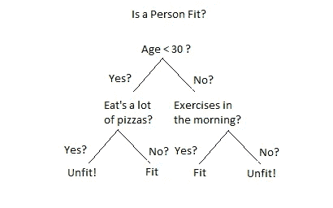

# 从零开始的决策树分类器:对学生的知识水平进行分类

> 原文：<https://towardsdatascience.com/decision-tree-classifier-from-scratch-classifying-students-knowledge-level-c810876d6c8f?source=collection_archive---------13----------------------->

## 向数据科学迈出一小步

## 使用 python 编程语言从头开始编写决策树分类器


Photo by on [**craftedbygc**](https://unsplash.com/@craftedbygc)

# 先决条件

您需要具备以下方面的基本知识:

1.  Python 编程语言
2.  科学计算图书馆
3.  熊猫

# 数据集

我将在这个项目中使用的数据集来自加州大学欧文分校用户知识建模数据集(UC Irvine)的 [**。**](https://archive.ics.uci.edu/ml/datasets/User+Knowledge+Modeling)
《UCI》一页提到了以下出版物作为数据集的原始来源:

> H.T. Kahraman，Sagiroglu，s .，Colak，I,“开发直观知识分类器和用户领域相关数据的建模”,基于知识的系统，第 37 卷，第 283–295 页，2013 年

# 介绍

## 1.1 什么是决策树分类器？

简单来说，决策树分类器就是用于**监督+分类问题**的 [**监督机器学习算法**](https://dataconomy.com/2015/01/whats-the-difference-between-supervised-and-unsupervised-learning/) 。在决策树中，每个节点都会询问一个关于某个特征的是非问题，并根据决策向左或向右移动。

你可以从 [**这里**](https://medium.com/@chiragsehra42/decision-trees-explained-easily-28f23241248) 了解更多关于决策树的知识。



[Example of decision tree](https://miro.medium.com/max/820/1*JAEY3KP7TU2Q6HN6LasMrw.png)

## 1.2 我们在建造什么？


Photo by [Andrik Langfield](https://unsplash.com/@andriklangfield?utm_source=medium&utm_medium=referral) on [Unsplash](https://unsplash.com?utm_source=medium&utm_medium=referral)

我们将使用机器学习算法来发现学生历史数据上的模式，并对他们的知识水平进行分类，为此，我们将使用 Python 编程语言从头开始编写我们自己的简单决策树分类器。

> 虽然我会一路解释每件事，但这不会是一个基本的解释。我将通过进一步的链接突出显示重要的概念，这样每个人都可以对该主题进行更多的探索。

# 代码部分

## 2.1 准备数据

我们将使用 **pandas** 进行数据处理和数据清理。


Data Dictionary

```
import **pandas** as **pd**df = **pd**.read_csv('data.csv')
df.head()
```

首先，我们导入 *data.csv* 文件，然后将其作为熊猫的数据帧进行处理，并查看数据。


Data Preview

正如我们看到的，我们的数据有 6 列。它包含 5 个功能和 1 个标签。既然这个数据已经被清理了，就不需要再进行数据清理和 [**扯皮**](https://www.datawatch.com/what-is-data-wrangling/) 。但是，在处理其他真实世界的数据集时，检查数据集中的空值和异常值并从中设计出最佳要素非常重要。

## 2.2 列车测试分割

```
train = df.values[-:20]
test = df.values[-20:]
```

在这里，我们将数据分为训练和测试，其中数据集的最后 20 个数据是测试数据，其余的是训练数据。

## 2.3 编写我们自己的机器学习模型

现在是时候编写决策树分类器了。

但是在深入研究代码之前，有一些东西需要学习:

1.  为了构建这棵树，我们使用了一种叫做 **CART** 的决策树学习算法。还有其他学习算法，如 **ID3，C4.5，C5.0，**等。你可以从[这里](https://medium.com/deep-math-machine-learning-ai/chapter-4-decision-trees-algorithms-b93975f7a1f1)了解更多。
2.  **CART** 代表分类和回归树。 **CART** 使用 **Gini** **杂质**作为其度量，以量化一个问题在多大程度上有助于解混数据，或者简单地说 CARD 使用 Gini 作为其成本函数来评估误差。
3.  在引擎盖下，所有的学习算法都给了我们一个决定何时问哪个问题的程序。
4.  为了检查这个问题帮助我们解混数据的正确程度，我们使用了**信息增益。**这有助于我们减少不确定性，我们利用这一点来选择要问的最佳问题，对于给定的问题，我们递归地构建树节点。然后，我们进一步继续划分节点，直到没有问题要问，我们将最后一个节点表示为叶子。

## **2.3.1 书写助手功能**

为了实现决策树分类器，我们需要知道什么时候对数据提出什么问题。让我们为此编写一个代码:

```
**class** CreateQuestion: **def** __init__(self, column, value):
        self.column = column
        self.value = value **def** check(self, data):
        val = data[self.column]
        return val >= self.value
    **def** __repr__(self):

        return "Is %s %s %s?" % (
            self.column[-1], ">=", str(self.value))
```

上面我们写了一个 **CreateQuestion** 类，它有两个输入:*列号*和*值*作为实例变量。它有一个用于比较特征值的**检查**方法。

*__repr__* 只是 python 的一个帮助显示问题的神奇函数。

让我们来看看它的实际应用:

```
q = **CreateQuestion**(0, 0.08)
```


Creating question

现在让我们检查一下我们的**检查**方法是否工作正常:

```
data = train[0]
q.check(data)
```


Testing check method


Cross validating check method

正如我们看到的，我们得到了一个错误的值。因为我们在训练集中的 0ᵗʰ值是 0.0，不大于或等于 0.08，所以我们的方法工作得很好。

现在是时候创建一个分区函数来帮助我们将数据分成两个子集:第一个集合包含所有为真的数据，第二个包含所有为假的数据。

让我们为此编写一个代码:

```
**def** partition(rows, qsn):

    true_rows, false_rows = [], []
    **for** row **in** rows:
        **if** qsn.check(row):
            true_rows.append(row)
        **else**:
            false_rows.append(row)
    **return** true_rows, false_rows
```

我们的分区函数接受两个输入:*行*和一个*问题*，然后返回一列*真行*和*假行*。

让我们也来看看实际情况:

```
true_rows, false_rows = partition(train, CreateQuestion(0, 0.08))
```


True and False row preview

这里 t *rue_rows* 包含所有大于或等于 0.08 的数据，而 *false_rows* 包含小于 0.08 的数据。

现在该写我们的**基尼杂质**算法了。正如我们之前讨论的，它帮助我们量化节点中有多少不确定性，而**信息增益**让我们量化一个问题减少了多少不确定性。

杂质指标范围在 0 到 1 之间，数值越低表示不确定性越小。


```
**def** gini(rows): counts = class_count(rows)
    impurity = 1
    **for** label **in** counts:
        probab_of_label = counts[label] / float(len(rows))
        impurity -= probab_of_label**2
    **return** impurity
```

在我们的**基尼**函数中，我们刚刚实现了**基尼的公式。**返回给定行的杂质值。

*counts* 变量保存数据集中给定值的总计数的字典。 *class_counts* 是一个帮助函数，用于计算某个类的数据集中出现的数据总数。

```
**def** class_counts(rows):

    **for** row **in** rows:

        label = row[-1]
        **if** label **not** **in** counts:
            counts[label] = 0
        counts[label] += 1
    **return** counts
```

让我们来看看**基尼**的作用:


Gini in action: 1


Gini in action: 2

正如您在图像 *1* 中看到的，有一些杂质，所以它返回 0.5，而在图像 *2* 中没有杂质，所以它返回 0。

现在我们要编写计算信息增益的代码:

```
**def** info_gain(left, right, current_uncertainty):

    p = float(len(left)) / (len(left) + len(right))
    **return** current_uncertainty - p * gini(left) \
            - (1 - p) * gini(right)
```

通过减去具有两个子节点的加权杂质的不确定性起始节点来计算信息增益。

## 2.3.2 将所有内容放在一起


Photo by [ryoji](https://unsplash.com/@ryoji__iwata)

现在是时候把所有东西放在一起了。

```
**def** find_best_split(rows):

    best_gain = 0
    best_question = None
    current_uncertainty = gini(rows)
    n_features = len(rows[0]) - 1

    **for** col **in** range(n_features):

        values = set([row[col] **for** row **in** rows])  

        **for** val **in** values:
            question = Question(col, val)
            true_rows, false_rows = partition(rows, question) **if** len(true_rows) == 0 **or** len(false_rows) == 0:
                **continue**

            gain = info_gain(true_rows, false_rows,\
                   current_uncertainty) **if** gain > best_gain:
                best_gain, best_question = gain, question

    **return** best_gain, best_question
```

我们编写了一个 **find_best_split** 函数，它通过迭代每个特征和标签找到最佳问题，然后计算信息增益。

让我们来看看这个函数的运行情况:

```
best_gain, best_question = find_best_split(train)
```


Finding best question

我们现在要编写我们的 **fit** 函数。

```
**def** fit(features, labels): data = features + labels gain, question = find_best_split(data)

    **if** gain == 0:
        **return** Leaf(rows)

    true_rows, false_rows = partition(rows, question)

    *# Recursively build the true branch.*
    true_branch = build_tree(true_rows)

    *# Recursively build the false branch.*
    false_branch = build_tree(false_rows)

    **return** Decision_Node(question, true_branch, false_branch)
```

我们的 **fit** 函数基本上为我们构建了一棵树。它从根节点开始，通过使用我们的 **find_best_split** 函数找到针对该节点的最佳问题。它迭代每个值，然后分割数据并计算信息增益。在这一过程中，它跟踪产生最大收益的问题。

之后，如果仍有有用的问题要问，增益将大于 0，因此行被分组为分支，并且它首先递归构建**真分支**，直到没有进一步的问题要问并且增益为 0。

该节点随后成为一个**叶节点**。

我们的 **Leaf** 类的代码如下所示:

```
**class** **Leaf**:

    **def** __init__(self, rows):
        self.predictions = class_counts(rows)
```

它保存了一个类别为*(“高”、“低”)*的字典，以及它在到达当前叶子的数据的行中出现的次数。

对于**假分支**也应用相同的过程。之后，它就变成了一个**决策 _ 节点**。

我们的 Decision_Node 类的代码如下所示:

```
**class** **Decision_Node**:     
   **def** __init__(self, question,\
                true_branch,false_branch):
       self.question = question
       self.true_branch = true_branch
       self.false_branch = false_branch
```

这个类只保存我们已经问过的问题的引用和产生的两个子节点。

现在我们回到根节点，建立**错误分支。**因为没有任何问题要问，所以它成为**叶节点**，并且根节点也成为**决策 _ 节点**。

让我们看看 **fit** 功能的实际应用:

```
_tree = fit(train)
```

为了打印树*_ 树*，我们必须编写一个特殊的函数。

```
**def** print_tree(node, spacing=""):

    *# Base case: we've reached a leaf*
    **if** isinstance(node, Leaf):
        **print** (spacing + "Predict", node.predictions)
        **return**

    *# Print the question at this node*
    **print** (spacing + str(node.question))

    *# Call this function recursively on the true branch*
    **print** (spacing + '--> True:')
    print_tree(node.true_branch, spacing + "  ")

    *# Call this function recursively on the false branch*
    **print** (spacing + '--> False:')
    print_tree(node.false_branch, spacing + "  ")
```

这个 **print_tree** 函数帮助我们以一种令人敬畏的方式可视化我们的树。


Sample of our tree

我们刚刚完成了决策树分类器的构建！

为了理解和查看我们构建的内容，让我们再编写一些帮助函数:

```
**def** classify(row, node):

    **if** isinstance(node, Leaf):
        **return** node.predictions

    **if** node.question.check(row):
        **return** classify(row, node.true_branch)
    **else**:
        **return** classify(row, node.false_branch)
```

**分类**功能帮助我们检查给定行和树的可信度。

```
classify(train[5], _tree)
```


Classification sample

正如你在上面看到的，我们的树把给定的值归类为 96 置信度的中间值。

```
**def** print_leaf(counts):

    total = sum(counts.values()) * 1.0
    probs = {}
    **for** lbl in counts.keys():
        probs[lbl] = str(int(counts[lbl] / total * 100)) + "%"
    **return** probs
```

函数帮助我们美化我们的预测。


Pretty print

## 2.4 模型评估

我们已经成功地建立，可视化，并看到我们的树在行动。

现在让我们执行一个简单的模型评估:

```
**for** row **in** testing_data:
    **print** ("Actual level: **%s**. Predicted level: **%s**" %
           (df['LABEL'], print_leaf(classify(row, _tree))))
```


Predicted on test data

如你所见，我们的树很好地预测了从训练数据中分离出来的测试数据。

# 结论

决策树分类器是一个很棒的学习算法。它对初学者很友好，也很容易实现。我们从头开始构建了一个非常简单的决策树分类器，没有使用任何抽象库来预测学生的知识水平。通过交换数据集和调整一些函数，您也可以将该算法用于另一个分类目的。

# 参考

[1] *H. T. Kahraman，Sagiroglu，s .，Colak，I.* ，开发直观知识分类器并对 web 中用户的领域相关数据建模，基于知识的系统，第 37 卷，第 283–295 页，2013 年

[2] *Aurelien Geron* ，用 Scikit-Learn 进行动手机器学习，Keras & TensorFlow，O'REILLY，第二版，2019