# 更好地使用决策树

> 原文：<https://towardsdatascience.com/decision-tree-for-better-usage-622c025ffeeb?source=collection_archive---------12----------------------->

## 从树叶，树，到森林


Photo by [pandu ior](https://unsplash.com/photos/0tBo5uqBovo?utm_source=unsplash&utm_medium=referral&utm_content=creditCopyText) on [Unsplash](https://unsplash.com/search/photos/leaf?utm_source=unsplash&utm_medium=referral&utm_content=creditCopyText)

当有大量关于决策树的资料时，写这篇文章的原因是为了给一个机会以不同的角度来看待这个话题。接触不同的理解方式是一种有效的学习方法，就好像你一部分一部分地触摸某物，你就知道它的整体形状。您将看到的主题可能会填补您在决策树中遗漏的内容，或者您可以简单地复习一下您已经知道的内容。这篇文章从决策树如何工作开始，涵盖了基本特征，并将其扩展到称为 Bagging 的技术。

**先决条件**

对模型评估的一些基本理解，尤其是对测试集的理解，将会非常有帮助。可以参考 [**我之前的帖子**](/ridge-regression-for-better-usage-2f19b3a202db) 里面涵盖了一部分。

**内容**

*   如何拆分—如何测量杂质来确定拆分
*   连续要素-如何在连续值上找到分割点
*   非线性和回归——为什么它是非线性的，如何回归
*   贪婪算法——决策树为什么找不到真正的最优解
*   过度拟合的趋势——为什么会发生过度拟合以及如何防止过度拟合
*   装袋和随机森林——装袋的工作原理
*   R 中的演示—贷款违约数据

# 怎么分

决策树的工作原理基本上是关于如何分割节点，因为这就是树的构建方式。让我们假设我们有一个二元分类问题；*可乐 vs 酱油*。当你想喝什么就喝什么的时候，你不会光看一眼就做出决定。你可能会闻到它，甚至尝一点。因此，颜色不是一个有用的特征，但气味应该是。

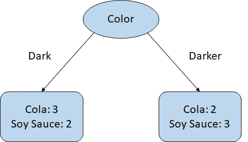

在这个例子中，每个人有 5 个杯子，总共 10 个，你的工作是用你的眼睛将它们分类。我们说左节点决定可乐，是因为可乐类比较多，反之亦然。结果不会有希望，你可能会以喝酱油告终。在这种情况下，底部节点是*而不是纯粹的*，因为这些类几乎都混在一起了。

> ***当一个类在一个节点中占优势时，我们说这个节点是“纯”的。***

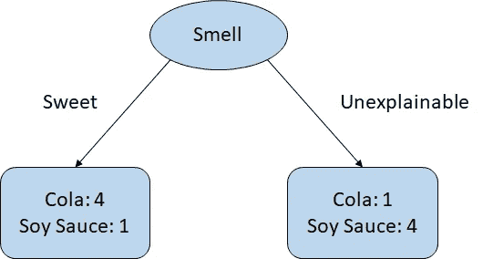

现在，你用你的鼻子。你仍然可能犯一些错误，但结果应该会好得多。因为节点大多有一个主导类，可乐在左边，酱油在右边，这样*更纯粹*。那么，问题就变成了**如何衡量‘纯度’**。答案可能很多，但我们可以谈谈基尼系数(T21)。

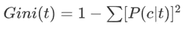

该公式是说，将一个类在每个节点上正确的所有平方概率相加，并从 1 中减去总和。好了，我们来看一些例子。

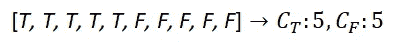

我们有一个有 10 个例子的节点，其中 5 个是真的，5 个是假的。你在这个节点上的决定可能是对的，也可能是错的。现在，你知道这个节点不是很纯。要衡量有多不纯，我们可以这样计算。


在 10 分中，真类的概率是 0.5，假类的概率也是如此。其实这是最不纯粹的案例，证明**最高基尼是 0.5** 。下面是另一个例子。

> ***更低的基尼更纯，所以更好。***

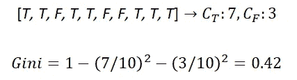

有更多的真实类，所以你可以更自信地宣称你的决定是真实的。同样，基尼系数现在也降低了。此时要提出的另一个问题是**何时拆分**。我们知道示例中的 7 比 3 是基尼系数的 0.42，但我们想使它更纯粹，并决定用另一个特征来划分 10 个等级。

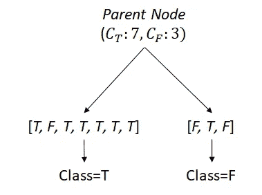

拆分为两个子节点。现在，我们说左边的节点是真实的，有更多的真实类，反之亦然。我们可以测量每个节点的纯度，但我们如何得出一个结果来与父节点进行比较？我们可以简单地根据节点大小给它们**权重，以达到父总数**。

> ***如果基尼系数下降，我们就说拆分获得了“信息”。***

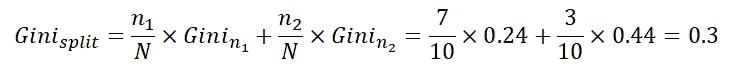

基尼系数 0.3 小于母公司的 0.42，因此，拆分获得了一些信息。如果一些分裂导致以下结果，那就太好了。

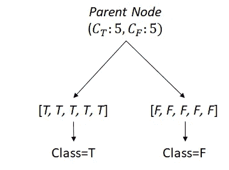

父母是如此的糟糕，他们的基尼系数是 0.5，但是一次分割就可以把基尼系数降到 0。请注意，这两个孩子在辨别真假方面做得非常好。似乎分裂总是有帮助的，然而，那不是真的。


我们直观地知道父节点的基尼系数不是最大值(0.5)，但子节点的基尼系数是最大值。换句话说，拆分使情况变得更糟(信息丢失)。即使父母及其子女的基尼系数相同，这仍然更糟，因为节点越多的模型意味着越复杂。事实上，现代决策树模型**通过添加更多节点**来破坏它。

还有一点需要注意的是，基尼并不是衡量纯度的唯一标准。还有很多，但下面两个值得一提。

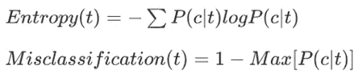

你可以像我们对基尼系数所做的那样去尝试，它会输出不同的结果。那么，哪一个比其他的好呢？答案是“视情况而定”。我们更应该关注它们是如何不同的。

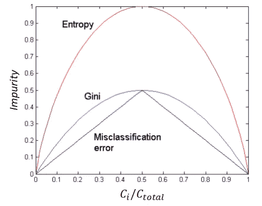

From Introduction to Data Mining

我们知道基尼系数的最大值是 0.5，这与熵的最大值不同。也就是说，**熵值上升的速度比基尼系数更快。这意味着它可以更严厉地惩罚不纯节点**。

另一个区别是误分类误差不像其他两个那样平滑。例如，*x*-轴从 0.1 增加到 0.2 会增加与从 0.3 增加到 0.4 相同的杂质，这是线性的。相反，基尼认为 0.4 的杂质和 0.5 的杂质几乎一样，熵也是如此。这意味着**基尼系数和熵值对杂质**更严格。而用哪个要看情况。

# 连续特征

我们从分类特征开始，这可能不会让任何人感到奇怪。但是决策树可以优雅地处理连续特征。让我们来看看这个例子。

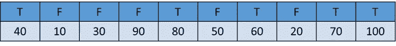

我们有一系列的价值观；10，20，…，100，每一个都被标为真或假。首先要做的是对它们排序，我们可以在两个值之间找到一个点。假设我们 45 岁分手。

> ***理论上，拆分连续值有无限种选择。***

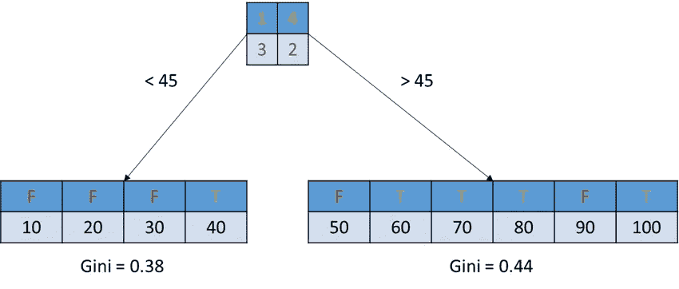

有四个值小于 45，其中三个为假，一个为真。相同的规则适用于大于 45°的右侧。现在，我们可以计算每个群体的基尼系数。当然，我们需要对它们进行加权，以得出最终的基尼系数。我们对值之间所有可能的分割点都这样做。

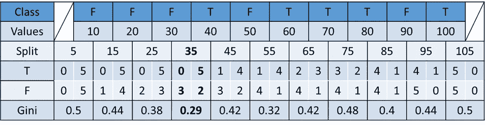

从表中可以看出，最低的基尼系数位于分裂点 35，其中左边是完全纯的(全部是假类)，右边有 7 个类，其中 5 个是真类。计算似乎很累，但是当你滑过这些值时，真或假的计数会一个接一个地改变。这意味着每次计算只需要为下一次计算做一点小小的改变(反正机器是为我们做的)。总之，**连续特征的处理与分类特征非常相似，但计算量更大**。

# 非线性和回归

直截了当地说，决策树是一个非线性模型。如果一个例子按特征节点分类，多少并不重要。

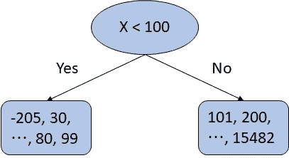

在图中，有一些极端值，如-205 或 15482。然而，它们都只属于一个节点，任何其他数量都满足该条件。他们没有任何特殊的头衔，如“超级肯定”或“双重否定”。此时，决策树似乎无法进行回归。但是是的，它可以。

我们来看一些类比。我们都知道 ANOVA 模型可以进行回归，其中分类预测值的平均值代表某组样本。类似的想法可以应用到决策树。

> ***某个节点中样本的均值或中值等统计量可以代表该节点***

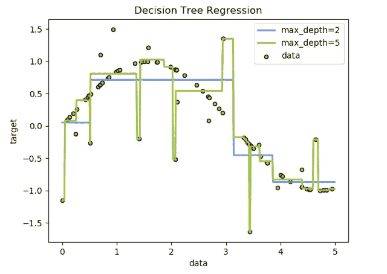

[From Scikit-Learn Website](https://scikit-learn.org/stable/auto_examples/tree/plot_tree_regression.html)

首先，从盒状线可以明显看出决策树是非线性的。这里的另一个要点是，它显示了决策树如何过度适应示例。“最大深度”控制着一棵树的复杂程度。我们可以看到，Max-depth 设置为 5 的树非常努力地适应所有遥远的例子，代价是模型非常复杂。

# 贪婪算法

决策树是一种贪婪算法，它在每一步都寻找最佳解。换句话说，**它可能找不到全局最优解**。当有多个特征时，决策树循环遍历这些特征，从以最纯粹的方式(最低基尼系数或最大信息增益)分割目标类的最佳特征开始。并且它一直这样做，直到不再有特征或者拆分没有意义。为什么这有时无法找到真正的最佳解决方案？

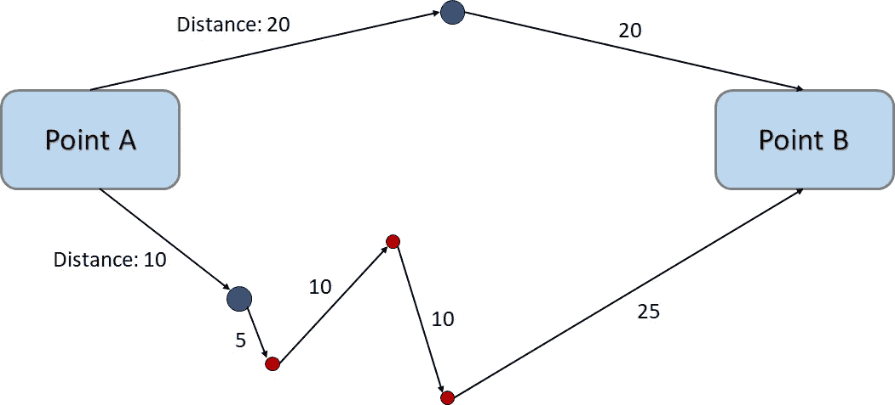

为了理解“贪婪”方式实际上发生了什么，我们假设我们从 A 点到 b 点。在贪婪标准下，我们看不到 A 点上的红色路径点，而只能看到蓝色点。站在点 A，我们决定底部，因为这比顶部短。但是在下一步，我们找到红点，以此类推，以一个更长的行程结束。

> ***每一步做出的最优选择并不能保证全局最优。***

同样的情况也可能发生在决策树中，因为**并没有将所有可能的对**组合在一起。想象一下，如果没有数千个特征，也有数百个特征，它们是分类的和连续混合的，每个特征都有不同的值和范围。尽可能将它们混合在一起应该是禁止的。知道决策树是贪婪的，对于理解为什么像*装袋*这样的高级方法有效很重要。

# 过度配合的趋势

像其他模型一样，决策树也有过度拟合的问题。在某种程度上，它可能比其他型号稍差一些。一个极端的例子是 ID 特征。无论如何，我们都不想把它作为一个特性，但是为了便于理解，让我们把它当作一个特性。

> ***如果还有任何特征需要分割，它将继续尝试分割***

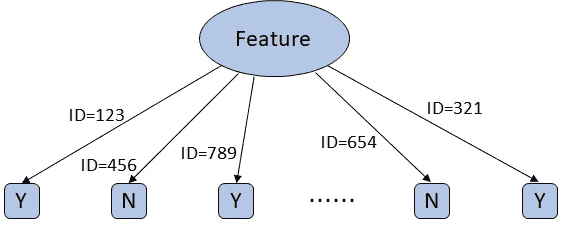

这是一个*多路分割*，其中每个 ID 都有一个分支，每个节点只有一个案例需要做出决策，因为 ID 是唯一的。现在，它变成了一个*查找表*。这只不过是一堆硬编码的“if 语句”。当它看到一个新的例子时，问题就出现了。然后，模型会因为里面没有任何功能而爆炸。如果是二叉分裂决策树，那么它的深度就和例子的数量一样。

实际上，我们永远不会使用 ID 作为一个特性，但是如果一个特性有各种各样的值，可以绘制如此多的微妙边界，或者我们让它在深度上增长到适合所有示例所需的程度，这种事件仍然可能发生。也有多种方法可以防止这种情况。修剪是防止树长得更深的方法之一。

> ***“预修剪”控制每个节点必须进一步分裂的样本数。“后期修剪”让它扩展，然后找到过度拟合的节点。***

以一种更复杂的方式，我们可以考虑集成方法，让多个学习者做出单独的决定，并把他们放在一起作出最终决定。

# 装袋和随机森林

*Bootstrap 聚合*，即所谓的 Bagging，一种集合模型，其中有多个学习者。它的目标是防止过度拟合，并找到更好的解决方案。正如我们从它的名字可以猜到的，它利用了 Bootstrap 抽样方法，这意味着**我们抽取‘有替换’的样本**。

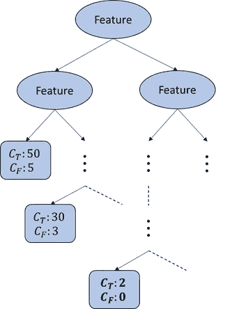

这是另一个过度拟合的例子，其中底部节点被分割得太多，仅适合 2 个例子。因此，这两个例子肯定非常特殊，因为所有的上层节点都无法唯一地将它们分开。同样，节点现在就像一个查找表。如果我们在构建树的时候不包括这两个例子呢？

> ***装袋随机抽取样品，让一些多抽或一些不抽***

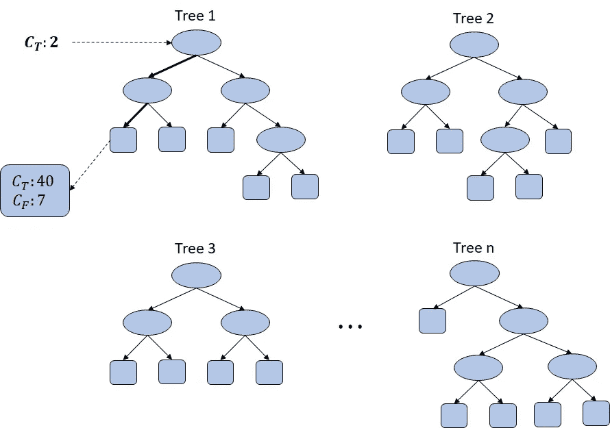

树 1 是在没有两个例外示例的情况下构建的。现在，我们给它测试的两个例外，它落在一个有很多例子的节点上。这不再像查找表一样工作，因为它甚至没有看到示例。它们在其他树中仍然可能是例外的，但是最终的决定是由所有“n”棵树*投票*做出的。简而言之，**随机抽样防止一个模型记忆例子，并集中于一个普遍共识**。

> ***装袋也可以随机选择特征。***

如果我们将 Bagging 应用于特征会怎么样？它的意思是**随机选择一些特征，而不是全部**。比如我们有 100 个特征，要猜一些类。我们可以像纯决策树一样使用它们，但我们只是随机选择其中的一些，比如只使用 30 或 50 个或任何一个。这听起来很奇怪，因为看起来我们没有充分利用功能。

还记得寻找更短路线的贪婪算法例子吗，如果我们连最底层路线的选择都没有呢？因为我们不知道那条路线，所以我们会选择最上面的路线，这样总的来说会缩短行程。

> 通过减少特征，我们可以防止导致局部最优而非全局最优的特征组合。

由于随机选择的性质，某些特性集可能会导致更糟的结果。这就是为什么我们应该多次重复随机抽样和随机特征选择，以便它能够找到偏向一般决策标准的最佳组合。但这可能仍然不是真正的全局最优，因为随机化所有这些并不意味着我们已经经历了所有的可能性( *NP-Complete* 问题)。

需要注意的一点是 **Bagging 是一种集成方法，可以应用于任何模型，而不仅仅是决策树**。当 Bagging 应用于决策树时，就像树木组成一个森林一样，它变成了*随机森林*。

# R 中的演示

贷款数据集直观易懂。我们有 300 个例子和 11 个特征，如年龄、性别、贷款金额、收入和贷款状态作为目标。这是一个二元分类，猜测贷款是否违约。

代码使用最少的库，因此它可以专注于模拟。此外，交叉验证没有用于评估，以保持简单(仍然公平，因为相同的训练/测试集用于所有模型)。完整的代码和数据可以在 [**Github**](https://github.com/Q-shick/decision_tree_posting_tds) 上找到。

*   **完整模型—根据训练集**进行评估

```
# Classification model with all features
clf <- rpart(formula = Loan_Status ~., data = training.set,
             control = rpart.control(minsplit = 1))# Predict from training set and calculate accuracy
pred <- predict(clf, newdata = training.set[, -12], type = 'class')
round(sum(training.set[, 12]==pred)/length(pred), 2)# Plot the tree
rpart.plot(clf, box.palette = 'RdBu', nn = T)
```

该模型是使用所有功能构建的，并且是针对训练集而不是测试集进行测试的。这是为了观察过度拟合是如何发生的。

**图上的文字可能不清晰，但此时并不重要。请注意形状，尤其是深度和节点的数量。*

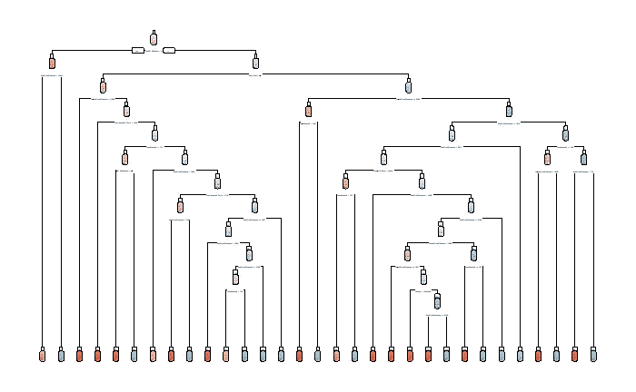

**Accuracy = 0.96**

这棵树又深又复杂。它的精度是 0.96，几乎完美，但根据自己的训练集进行了测试。现在，让我们根据测试集(看不见的数据)评估模型。

*   **完整模型—根据测试集**进行评估

```
# Evaluate against testing set
pred <- predict(clf, **newdata = testing.set**[-12], type = 'class')
round(sum(testing.set[, 12]==pred)/length(pred), 2)
```

请注意，参数“newdata”现在是“testing.set”。结果是 **0.63** ，远小于针对训练集测试的值。这意味着使用所有特征和所有例子的模型没有成功地概括它。

我们首先可以做的一件事是调整参数。限制深度会有所帮助，因为模型不会增长到那么深，从而防止过度拟合。此后的所有精度都是从测试集中计算出来的。

*   **具有深度限制的完整模型**

```
# Set maxdepth to 3
clf <- rpart(formula = Loan_Status ~., data = training.set,
             control = rpart.control(minsplit = 1, **maxdepth = 3**))# Evaluate against testing set
pred <- predict(clf, newdata = testing.set[-12], type = 'class')
round(sum(testing.set[, 12]==pred)/length(pred), 2)
```

根据测试集评估，现在的准确度为 **0.68** ，高于 0.63。此外，即使不使用所有的特性，树也要简单得多。

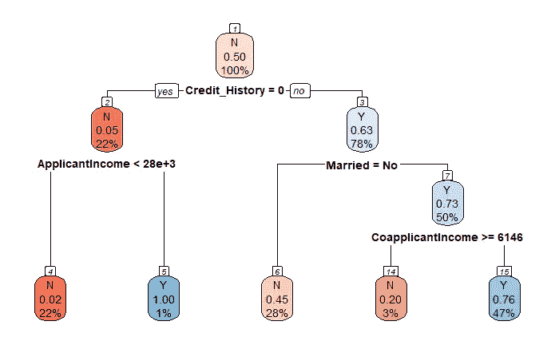

**Accuracy = 0.68**

*   **随机抽样的简化模型——随机森林**

```
# Build 100 trees with max node
clf <- randomForest(x = training.set[-12],
                    y = training.set$Loan_Status,
                    **ntree = 100**, **maxnodes = 5**)
```

我们构建了 100 棵树，每棵树最多有 5 个节点。精度为 **0.72** ，比以往更高。这意味着模型找到了一些处理异常例子的方法。当我们更想改善它的时候，我们应该仅仅增加树的数量吗？不幸的是，它可能不会太有帮助，因为随机森林不是魔法。如果足够幸运的话，在看到全新的数据之前，它可能会变得更好。

> ***这种改进是基于共识的，意味着它放弃了次要的例子，以适应更普遍的例子。***

# 结论

我们学习了决策树的基本原理，重点是分裂。分类值和连续值都显示了这一点。此外，我们还检验了决策树的一些特性，如非线性、回归能力和贪婪算法。对于过度拟合，控制深度和装袋介绍了示范在 r。

在现实世界中，这些并不总是有效的，因为我们不应该期望数据像我们希望的那样干净。然而，了解这些属性和参数将是创造性尝试的良好开端。

**好的读数**

*   [数据挖掘简介](https://www.goodreads.com/book/show/1233968.Introduction_to_Data_Mining):第 4 章。分类
*   [Scikit-Learn 示例](https://scikit-learn.org/stable/auto_examples/tree/plot_tree_regression.html):决策树回归
*   [随机森林视频指南](https://www.youtube.com/watch?v=J4Wdy0Wc_xQ&t=407s):基本思路介绍
*   [‘R part’R 库](https://www.statmethods.net/advstats/cart.html):教程及更多详情
*   [randomForest R 库](https://www.tutorialspoint.com/r/r_random_forest.htm):简单教程

我们鼓励你提出你的意见。在此评论！或者通过 [**LinkedIn**](https://www.linkedin.com/in/kyoosik-kim-080b17126/) 跟我说话，如果你想悄悄地指出这篇帖子中的错误……同时，欢迎你访问 [**我的作品集网站**](https://q-shick.github.io/portfolio/) ！