# Python 中从头开始的决策树

> 原文：<https://towardsdatascience.com/decision-tree-from-scratch-in-python-46e99dfea775?source=collection_archive---------1----------------------->

**决策树**是当今可用的最强大的机器学习工具之一，被广泛用于各种现实世界的应用中，从脸书的[广告点击预测](https://quinonero.net/Publications/predicting-clicks-facebook.pdf)到 Airbnb 体验的[排名](https://medium.com/airbnb-engineering/machine-learning-powered-search-ranking-of-airbnb-experiences-110b4b1a0789)。然而，它们是直观的、易于解释的——并且易于实现。在本文**中，我们将用 66 行 Python 代码**训练我们自己的决策树分类器。

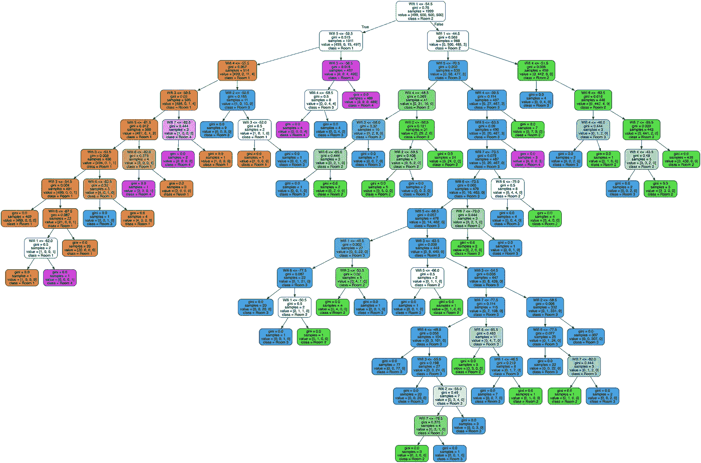

Let’s build this!

# 什么是决策树？

决策树可用于**回归**(连续实值输出，
*例如*预测房屋价格)或**分类**(分类输出，
*例如*预测垃圾邮件与无垃圾邮件)，但这里我们将重点讨论分类。决策树分类器是一个**二叉树**，其中通过从根到叶遍历树来进行预测——在每个节点，**如果特征小于阈值，我们向左，否则向右**。最后，每个叶子与一个**类**相关联，这是预测器的输出。

例如，考虑这个[无线室内定位数据集](https://archive.ics.uci.edu/ml/datasets/Wireless+Indoor+Localization)。它给出了 7 个特征，代表公寓中手机感知的 7 个 Wi-Fi 信号的强度，以及手机的室内位置，可能是 1、2、3 或 4 号房间。

```
+-------+-------+-------+-------+-------+-------+-------+------+
| Wifi1 | Wifi2 | Wifi3 | Wifi4 | Wifi5 | Wifi6 | Wifi7 | Room |
+-------+-------+-------+-------+-------+-------+-------+------+
|  -64  |  -55  |  -63  |  -66  |  -76  |  -88  |  -83  |   1  |
|  -49  |  -52  |  -57  |  -54  |  -59  |  -85  |  -88  |   3  |
|  -36  |  -60  |  -53  |  -36  |  -63  |  -70  |  -77  |   2  |
|  -61  |  -56  |  -55  |  -63  |  -52  |  -84  |  -87  |   4  |
|  -36  |  -61  |  -57  |  -27  |  -71  |  -73  |  -70  |   2  |
                               ...
```

目标是根据 Wi-Fi 信号 1 到 7 的强度来预测手机位于哪个房间。深度为**2 的经过训练的决策树可能如下所示:**

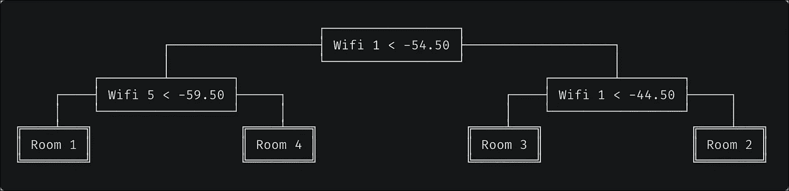

Trained decision tree. Predictions are performed by traversing the tree from root to leaf and going left when the condition is true. For example, if Wifi 1 strength is -60 and Wifi 5 strength is -50, we would predict the phone is located in room 4.

# 基尼杂质

在我们深入研究代码之前，让我们定义算法中使用的度量。决策树使用**基尼杂质**的概念来描述一个节点的**同质性**或“纯”程度。如果一个节点的所有样本都属于同一个类，则该节点是纯的( *G = 0* ),而具有来自许多不同类的许多样本的节点将具有更接近 1 的基尼系数。

更正式的说法是，跨 *k* 个类别划分的 *n* 个训练样本的基尼系数被定义为

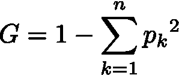

其中 *p[k]* 是属于类别 *k* 的样本分数。

例如，如果一个节点包含五个样本，其中两个是教室 1，两个是教室 2，一个是教室 3，而没有教室 4，那么

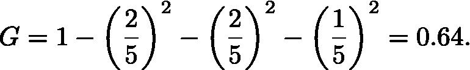

# CART 算法

训练算法是一种叫做 CART 的**递归**算法，是*分类和回归树*的简称。每个节点都被分割，以使子节点的基尼系数杂质(更具体地说，是按大小加权的子节点的基尼系数平均值)最小化。

当达到**最大深度**、超参数**、时，或者当没有分裂可以导致两个孩子比他们的父母更纯时，递归停止。[其他超参数](https://scikit-learn.org/stable/modules/generated/sklearn.tree.DecisionTreeClassifier.html)可以控制这个停止标准(在实践中对避免过度拟合至关重要)，但我们不会在这里讨论它们。**

**例如，如果`X = [[1.5], [1.7], [2.3], [2.7], [2.7]]`和`y = [1, 1, 2, 2, 3]`，那么最优分割是`feature_0 < 2`，因为如上计算，父母的基尼系数是 0.64，分割后子女的基尼系数是**

**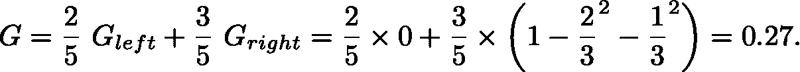**

**你可以说服自己，没有任何其他分割方式能产生更低的基尼系数。**

## **寻找最佳特征和阈值**

**CART 算法的关键是找到最优特征和阈值，使得基尼系数杂质最小。为此，我们尝试了所有可能的分裂，并计算了由此产生的基尼系数。**

**但是我们如何尝试连续值的所有可能的阈值呢？有一个简单的技巧-对给定特性的值进行排序，并考虑两个相邻值之间的所有中点。排序是昂贵的，但我们很快就会看到，无论如何它是需要的。**

**现在，我们如何计算所有可能分裂的基尼系数呢？**

**第一种解决方案是实际执行每次分割，并计算得出的基尼系数。不幸的是，这很慢，因为我们需要查看所有的样本，将它们分成左和右。更准确地说，这将是 *n* 个拆分，每个拆分有*个 O(n)* 个操作，使得整个操作为 *O(n )* 。**

**更快的方法是 **1。**遍历排序后的特征值作为可能的阈值， **2。**记录左侧和右侧每类样品的数量，以及 **3。**在每个阈值后，将它们递增/递减 1。从它们我们可以很容易地计算出常数时间内的基尼系数。**

**实际上，如果 *m* 是节点的大小，并且*m【k】*是节点中类别 *k* 的样本数，那么**

**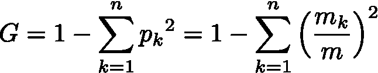**

**由于在看到第 *i* 个阈值后，左边有 *i* 元素，右边有*m–I*，**

**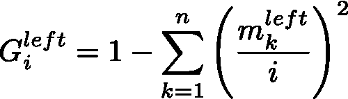**

**和**

**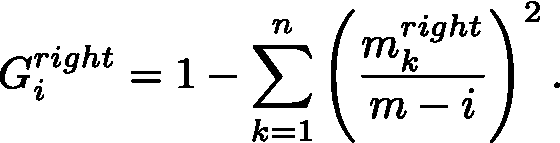**

**由此得出的基尼系数是一个简单的加权平均数:**

**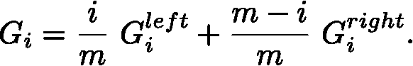**

**下面是完整的`_best_split`方法。**

**第 61 行的条件是最后一个微妙之处。通过遍历所有特征值，我们允许对具有相同值的样本进行分割。实际上，我们只能在它们对于该特性有独特的值的情况下对它们进行分割，因此需要额外的检查。**

## **递归**

**难的部分完成了！现在我们要做的就是递归地分割每个节点，直到达到最大深度。**

**但是首先让我们定义一个`Node`类:**

**将决策树拟合到数据`X`和目标`y`是通过调用递归方法`_grow_tree()`的`fit()`方法完成的:**

## **预言**

**我们已经看到了如何**拟合**决策树，现在我们如何用它来**预测**看不见的数据的类？再简单不过了——如果特征值低于阈值，则*向左*，否则*向右*。**

# **训练模型**

**我们的`DecisionTreeClassifier`准备好了！让我们在无线室内定位数据集上训练一个模型:**

**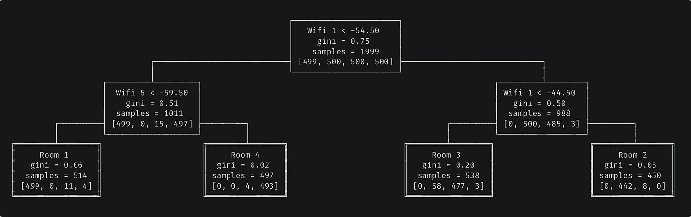**

**Our trained decision tree. For the ASCII visualization — not in the scope of this article — check out [the full code](https://github.com/joachimvalente/decision-tree-cart/blob/master/tree.py) for the Node class.**

**作为健全性检查，下面是 [Scikit-Learn](https://scikit-learn.org/stable/) 实现的输出:**

**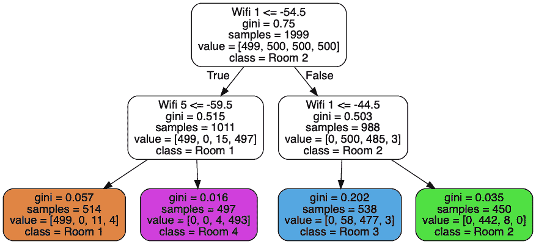**

# **复杂性**

**很容易看出，预测在 ***O(log m)*** ，其中 *m* 是树的深度。**

**但是训练呢？ [**主定理**](https://en.wikipedia.org/wiki/Master_theorem_(analysis_of_algorithms)) 在这里会很有帮助。在具有 *n* 个样本的数据集上拟合树的时间复杂度可以用下面的**递归**关系来表示:**

**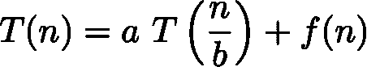**

**其中，假设左右孩子大小相同的最佳情况， *a* = 2，*b*= 2；而 *f(n)* 是将节点拆分成两个子节点的复杂度，换句话说就是`_best_split`的复杂度。第一个`for`循环对特性进行迭代，对于每次迭代，都有一个复杂度为 *O(n log n)* 的**排序** 和 *O(n)* 中的另一个`for`循环。因此 *f(n)* 是 *O(k n log n)* 其中 *k* 是特征的数量。**

**在这些假设下，主定理告诉我们总时间复杂度是**

**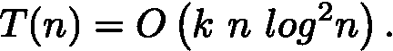**

**这与 [Scikit-Learn 实现](https://scikit-learn.org/stable/modules/tree.html#complexity)的复杂性差不太远，但仍然比它差，显然是在 *O(k n log n)中。*如果有人知道这怎么可能，请在评论里告诉我！**

# **完全码**

**完整的代码可以在这个 [Github repo](https://github.com/joachimvalente/decision-tree-cart) 上找到。正如承诺的那样，为了好玩，这里有一个精简到 66 行的版本[。](https://github.com/joachimvalente/decision-tree-cart/blob/master/minimal_cart.py#L14-L79)**

> **何、、欧瑾、、徐、、、史、、安托万·阿塔拉、拉尔夫·赫布里希、斯图尔特·鲍尔斯和华金·基诺内罗·坎德拉。2014.预测脸书广告点击率的实践经验。《第八届在线广告数据挖掘国际研讨会论文集》(ADKDD'14)。美国纽约州纽约市 ACM，第 5 条，9 页。DOI = http://dx . DOI . org/10.1145/26484848364**
> 
> **Jayant G Rohra、Boominathan Perumal、Swathi Jamjala Narayanan、Priya Thakur 和 Rajen B Bhatt，“使用粒子群优化和重力搜索算法与神经网络的模糊混合在室内环境中的用户定位”，载于第六届软计算解决问题国际会议论文集，2017 年，第 286-295 页。**
> 
> **布雷曼，利奥；J. H .弗里德曼；奥尔申。斯通，C. J. (1984)。*分类和回归树*。加利福尼亚州蒙特雷:沃兹沃斯&布鲁克斯/科尔高级图书&软件。**