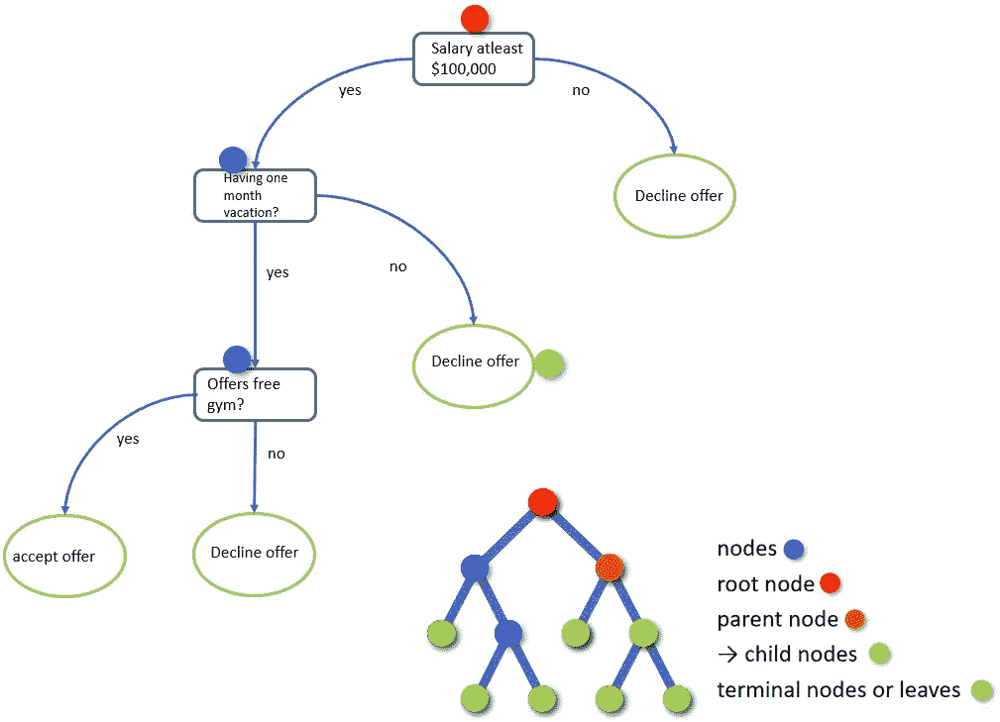

# 通俗地说就是决策树

> 原文：<https://towardsdatascience.com/decision-tree-in-laymans-terms-part-1-76e1f1a6b672?source=collection_archive---------20----------------------->

Image by [Johannes Plenio](https://pixabay.com/users/jplenio-7645255/?utm_source=link-attribution&utm_medium=referral&utm_campaign=image&utm_content=3097419) from [Pixabay](https://pixabay.com/?utm_source=link-attribution&utm_medium=referral&utm_campaign=image&utm_content=3097419)

## 什么是决策树？

> 决策树是基于特定条件的决策的所有可能解决方案的图形表示。目标变量可以取一组有限值的树模型称为**分类树**，目标变量可以取连续值(数字)的树模型称为**回归树**。

让我们举一个现实生活中的例子，

Toll-Free

每当你拨打银行的免费电话时，它会将你转接到他们的智能电脑助手那里，询问你一系列问题，如英语请按 1，西班牙语请按 2 等。一旦你选择了你想要的，它会再次将你重定向到一系列特定的问题，比如贷款请按 1，储蓄账户请按 2，信用卡请按 3 等等。这样不断重复，直到你最终找到合适的人或服务。你可能认为这只是一个语音邮件流程，但实际上，银行实施决策树是为了让你进入正确的产品或服务。

考虑一下上面的图片，我是否应该接受一份新的工作邀请？为此，我们需要创建一个决策树，从基本条件或根节点(蓝色)开始，即最低工资应为 100，000 美元，如果没有 100，000 美元，则您不会接受该提议。所以，如果你的薪水高于 10 万英镑，那么你会进一步检查公司是否给你一个月的假期？如果他们不给，那么你就是在拒绝这个提议。如果他们给你一个假期，那么你会进一步检查该公司是否提供免费健身房？如果他们不提供免费健身房，那么你是在拒绝这个提议。如果他们提供免费健身房，那么你很乐意接受这个提议。这只是决策树的一个例子。

# 好了，怎么建树？

有许多具体的决策树算法可用。值得注意的包括:

*   ID3(迭代二分法 3)
*   分类和回归树
*   卡方自动交互检测(CHAID)。计算分类树时执行多级拆分。

在这个博客中，我们将看到 ID3。决策树常用的杂质度量有三种:**熵**、**基尼指数**、**分类误差**。决策树算法使用**信息增益**来分割节点。基尼指数或熵是计算信息增益的标准。CART 算法使用的基尼指数和 ID3 算法使用的熵。在进入细节之前，我们先来看看杂质。

## 什么是杂质？

假设你有一个装满苹果的篮子，而另一个碗里装满了同样的苹果标签。如果你被要求从每个篮子和碗中挑选一件物品，那么得到苹果及其正确标签的概率是 1，所以在这种情况下，你可以说杂质是 0

假设现在篮子里有三种不同的水果，碗里有三种不同的标签，那么水果与标签匹配的概率显然不是 1，而是小于 1。如果我们从篮子里拿一根香蕉，然后从碗里随机拿一个标签，上面写着葡萄，这是有可能的。所以在这里，任何随机的排列组合都是可能的。在这种情况下，我们可以说杂质不为零。

## 熵

熵是你的数据有多杂乱的一个指标。

熵是对数据集中随机性或不可预测性的度量。换句话说，它控制决策树决定如何分割数据。熵是数据同质性的度量。它的值范围从 0 到 1。如果一个节点的所有样本都属于同一个类，则熵为 0(这对训练数据集不利)，如果我们具有均匀的类分布，则熵最大(对训练数据集有利)。熵的等式是

## **信息增益**

***信息增益(IG)*** *度量一个特征给我们多少关于类的“信息”。*信息增益基于数据集在属性上拆分后熵的减少。它是用于构建决策树的主要参数。**具有最高信息增益的属性将首先被测试/分割。**

**信息增益=基础熵—新熵**

让我们以下面的卡通数据集为例。感谢 Minsuk Heo 分享这个例子。你可以点击查看他的 youtube 频道

数据集有一个卡通，冬天，> 1 属性。家庭冬季照是我们的目标。共 8 张图片。我们需要教宝宝挑选正确的冬季家庭度假照片。

## 如何拆分数据？

我们必须以信息增益最高的方式构建分割数据的条件。请注意，增益是分裂后熵减少的量度。首先，将计算上述数据集的熵。

共 8 张照片。冬季全家福— 1(是)，现在冬季全家福— 7(否)。如果我们代入上面的熵公式，

=-(1/8)* log2(1/8)——(7/8)* log2(7/8)

**熵= 0.543**

我们得到了三个属性，即卡通、冬天和> 1。那么哪种属性最适合构建决策树呢？我们需要计算所有三个属性的信息增益，以便选择最佳的一个或根节点。我们的基本熵是 0.543

卡通片《冬天》的信息增益，

卡通的信息增益高，所以根节点是一个卡通人物。

根节点是一个卡通人物。我们需要根据另外两个属性 winter 或> 1 再次进行拆分。再次计算信息增益并选择最高的一个用于选择下一次分裂。

> 1 属性具有高信息增益，相应地拆分树。最终的树如下

# 决策树的优点

1.  决策树易于可视化和解释。
2.  它可以很容易地捕捉非线性模式。
3.  它可以处理数字和分类数据。
4.  数据准备所需的工作量很小。(例如，不需要标准化数据)

# 决策树的缺点

1.  过拟合是决策树模型最实际的困难之一。
2.  连续变量精度低:在处理连续数值变量时，决策树在对不同类别的变量进行分类时会丢失信息。
3.  它是不稳定的，意味着数据的微小变化会导致最优决策树结构的巨大变化。
4.  决策树偏向于不平衡数据集，因此建议在创建决策树之前平衡数据集。

我将在下一篇文章中使用 Python 解释 CART 算法和过度拟合问题。

请继续学习，并关注更多内容！

如果您发现任何错误或需要改进的地方，请随时在下面发表评论。