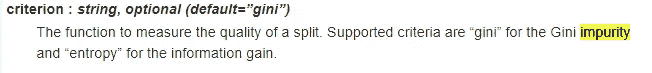
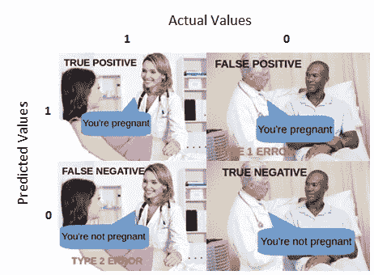

# Python 中的决策树

> 原文：<https://towardsdatascience.com/decision-tree-in-python-b433ae57fb93?source=collection_archive---------2----------------------->


[https://www.pexels.com/photo/from-above-of-ethnic-scientist-exploring-details-of-aircraft-using-magnifier-3825540/](https://www.pexels.com/photo/from-above-of-ethnic-scientist-exploring-details-of-aircraft-using-magnifier-3825540/)

在我看来，决策树模型有助于突出我们如何使用机器学习来增强我们的决策能力。我们都曾在某个时候遇到过决策树。然而，决策树机器学习模型的不同之处在于，它们使用逻辑和数学来生成规则，而不是根据直觉和主观性来选择规则。

# 算法

在尝试构建决策树时，应该立即想到的问题是:

> 我们应该在什么基础上做决定？

换句话说，我们应该选择什么作为是或否问题*来对我们的数据进行分类。我们可以进行有根据的猜测(即所有体重超过 5 磅的小鼠都是肥胖的)。然而，这不一定是对我们的样本进行分类的最佳方式。如果我们可以使用某种机器学习算法来学习问什么问题，以便在分类数据方面做得最好，会怎么样？这就是决策树模型背后的目的。*

假设我们试图建立一个决策树来预测一个人是否结婚。因此，我们在附近挨家挨户地敲门，礼貌地请他们为我们的小研究项目提供他们的年龄、性别和收入。在我们询问的几千人中，有 240 人没有把我们拒之门外。

现在，在我们继续之前，掌握以下术语很重要。树的顶部(或者底部，取决于你如何看待它)被称为**根节点**。中间**节点**有指向和远离它们的箭头。最后，树底部没有任何边缘指向远离它们的节点被称为**叶**。叶子告诉你每个样本属于哪一类。

回到我们的例子，我们需要弄清楚如何从数据表到决策树。我们决定使用机器学习算法来为我们构建决策树，而不是自己选择分支。该模型着眼于每个特征如何区分已婚和未婚人群。由于收入是一个连续变量，我们设置一个任意值。


为了确定三个分裂中哪一个更好，我们引入一个叫做 ***杂质的概念。*** 杂质是指没有一片叶子有 100%的“是嫁”。有几种方法可以测量杂质(分割的质量)，然而，默认情况下，`DecisionTreeClassifer`的`scikit-learn`实现使用 ***gini*** ，因此，这就是我们在本文中要讨论的。



[https://scikit-learn.org/stable/modules/generated/sklearn.tree.DecisionTreeClassifier.html](https://scikit-learn.org/stable/modules/generated/sklearn.tree.DecisionTreeClassifier.html)

为了计算左叶的基尼系数，我们用已婚人口比例的平方和未婚人口比例的平方减去 1。


等式对于右叶的杂质是完全相同的。


节点本身的基尼系数等于 1 减去左子节点的样本分数，再减去右子节点的样本分数。


信息增益(带基尼指数)写如下。


这个过程在收入和性别上重复进行。我们最终决定具有最大信息增益的分割。在这种情况下，这是收入，这是有道理的，因为收入超过 5 万英镑和已婚之间有很强的相关性。如果我们马上问这个问题，我们就向正确分类数据迈出了一大步。


一旦我们决定了根，我们对树中的其他节点重复这个过程。值得注意的是:

a)我们可以在*收入*上再次平分

b)每个分支中的样本数量可以不同


我们不能无限期地分开。因此，我们需要一种方法来告诉树何时停止。`DecisionTreeClassifer`的`scikit-learn`实现使用*最小杂质减少量*来确定是否应该分割节点。


[https://scikit-learn.org/stable/modules/generated/sklearn.tree.DecisionTreeClassifier.html](https://scikit-learn.org/stable/modules/generated/sklearn.tree.DecisionTreeClassifier.html)

假设我们在更多的迭代之后，我们在树的左侧得到了下面的节点。


结果大于默认阈值 0。因此，节点将被拆分。如果它低于 0，节点的子节点将被视为树叶。

# Python 代码

让我们看看如何用 Python 实现决策树分类器。首先，我们导入以下库。

```
from sklearn.datasets import load_iris
from sklearn.tree import DecisionTreeClassifier
from sklearn.model_selection import train_test_split
from sklearn.metrics import confusion_matrix
from sklearn.tree import export_graphviz
from sklearn.externals.six import StringIO 
from IPython.display import Image 
from pydot import graph_from_dot_data
import pandas as pd
import numpy as np
```

在本教程中，我们将使用机器学习领域最流行的数据集，来自加州大学欧文分校机器学习知识库的虹膜数据集。

```
iris = load_iris()
X = pd.DataFrame(iris.data, columns=iris.feature_names)
y = pd.Categorical.from_codes(iris.target, iris.target_names)
```

在接下来的部分中，我们将尝试构建一个决策树分类器，根据花的尺寸来确定花的种类。

```
X.head()
```


尽管决策树可以处理分类数据，但我们仍然根据数字对目标进行编码(即 setosa=0，versicolor=1，virginica=2 ),以便在稍后创建混淆矩阵。幸运的是，`pandas`图书馆为此提供了一种方法。

```
y = pd.get_dummies(y)
```


我们需要评估模型的性能。因此，我们留出四分之一的数据进行测试。

```
X_train, X_test, y_train, y_test = train_test_split(X, y, random_state=1)
```

接下来，我们创建并训练一个`DecisionTreeClassifer`类的实例。我们提供 y 值是因为我们的模型使用了监督机器学习算法。

```
dt = DecisionTreeClassifier()dt.fit(X_train, y_train)
```

我们可以通过运行下面的代码块来查看模型生成的实际决策树。

```
dot_data = StringIO()export_graphviz(dt, out_file=dot_data, feature_names=iris.feature_names)(graph, ) = graph_from_dot_data(dot_data.getvalue())Image(graph.create_png())
```

请注意它是如何提供基尼系数杂质、样本总数、分类标准以及左侧/右侧的样本数的。


让我们看看我们的决策树在测试数据面前表现如何。

```
y_pred = dt.predict(X_test)
```

如果这是一个回归问题，我们将使用某种损失函数，如均方差(MSE)。然而，由于这是一个分类问题，我们利用混淆矩阵来衡量我们的模型的准确性。混淆矩阵最好用一个例子来解释。

假设你的朋友刚刚做了怀孕测试。结果可能属于以下 4 个类别之一。



**真阳性:**

解读:你预测的是正的，这是真的。

你预言一个女人怀孕了，她真的怀孕了。

**真阴性:**

解读:你预测的是负数，这是真的。

你预言一个男人不会怀孕，他实际上也没有。

**假阳性:(1 型错误)**

解读:你预测的是正的，是假的。

你预言一个男人怀孕了，但他实际上没有。

**假阴性:(2 型错误)**

解读:你预测的是负数，这是假的。

你预测一个女人不会怀孕，但她确实怀孕了。

也就是说，混淆矩阵对角线上的数字对应着正确的预测。当有两个以上的潜在结果时，我们简单地扩展混淆矩阵中的列和行的数量。

```
species = np.array(y_test).argmax(axis=1)
predictions = np.array(y_pred).argmax(axis=1)
confusion_matrix(species, predictions)
```


正如我们所看到的，我们的决策树分类器正确地分类了 37/38 株植物。

# 结论

决策树很容易解释，不需要任何规范化，并且可以应用于回归和分类问题。不幸的是，决策树在实践中很少使用，因为它们不能很好地概括。请继续关注下一篇文章，我们将讨论**随机森林**，这是一种组合多个决策树以实现更高准确性的方法。