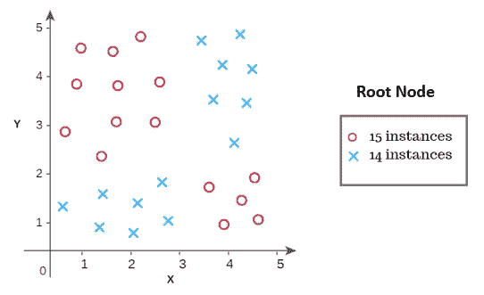
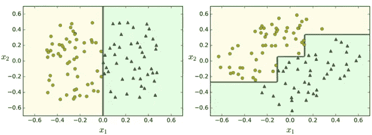

# 决策树:第 1/2 部分

> 原文：<https://towardsdatascience.com/decision-tree-overview-with-no-maths-66b256281e2b?source=collection_archive---------15----------------------->

## 培养对决策树的直觉

Photo by [Subtle Cinematics](https://unsplash.com/@subtlecinematics?utm_source=medium&utm_medium=referral) on [Unsplash](https://unsplash.com?utm_source=medium&utm_medium=referral)

大约 70 年前，我发明了决策树，它是最古老的机器学习算法之一，现在用于预测建模。它们可能是最容易理解的 ML 算法之一，但是不要让它的简单性欺骗了你，让你低估了它的能力。

# 🌰简单地

这篇文章旨在建立一个关于决策树的直觉。我们将讨论线性可分和不可分数据集、决策边界和区域，解释为什么决策边界平行于轴，并指出使用决策树的优点和问题(以及补救措施)。

所以让我们开始吧！

Photo by [Victor Rodriguez](https://unsplash.com/@vimarovi?utm_source=medium&utm_medium=referral) on [Unsplash](https://unsplash.com?utm_source=medium&utm_medium=referral)

# 优点:

决策树是最容易理解的算法之一，你可以很容易地解释它们的推理，因为它们属于**“白盒”**方法。它们[足够强大](https://www.youtube.com/watch?v=o6b9JpBFjd4)以**适应复杂数据集**，并且足够通用以至于它们可以用于**分类以及回归任务**而不需要太多的数据预处理。

此外，决策树是广泛使用的**“随机森林”**方法的构建模块，这是当今最强大的机器学习算法之一。

与线性模型不同，**决策树可以线性拟合不可分的**数据集。不可分数据集是指不同类的数据点不能用一条线分开的数据集，而线性可分数据集则用一条线就足够了。下图描述了这些情况:

Figure 1

在图 1 中，左边的图表显示了线性分类器如何确定其决策边界——虚线。右边的一个表示决策树如何构造它的决策边界来适应线性不可分的数据集。

# 轴平行决策边界

您可能会注意到，决策树做出的决策边界与轴平行，并且它们总是这样:与轴平行。其原因是决策树基于特征值分割数据，并且该值在一个决策边界内始终保持不变，例如 **x=2** 或 **y=3** ，其中 **x** 和 **y** 是两个不同的特征。而在线性分类器中，判定边界可以是例如:y=mx+c

在决策树中，为每个决策区域迭代地绘制这些决策边界，并构建一棵树。要获得直观的解释，请按照下面的一系列图表进行操作！👇

# 划清界限！

让我们看看下面的例子，看看这是如何发生的，只用我们人类的本能，而不是数学！

Dataset to fit the decision tree on along with its corresponding tree structure

称为“根节点”的树的第一个节点分别包含所有类的实例数。

基本上，我们必须画一条称为“决策边界”的线，将不同类的实例分成称为“决策区域”的不同区域。请记住，这条线必须与轴线平行。

# 开始分吧！

第一个决策边界应该在上图的 **X=3** 处做出。

Photo by [Abby Savage](https://unsplash.com/@abbysavagecreative?utm_source=medium&utm_medium=referral) on [Unsplash](https://unsplash.com?utm_source=medium&utm_medium=referral)

以 **X=3** 为分界点，产生如下图。既然现在我们有了两个决策区域，我们将把这两个区域作为树的两个不同节点添加，其中每个节点包含相应实例的数量。

Split point is X=3

因为一个决策区域应该包含一个类的绝大多数，所以我们需要进一步划分。我们将在 **Y=2 处分割结果图的左侧区域。**右区跟着 **Y=2.5** 。

Split point is Y=2

The split point is Y=2.5

现在，每个决策区域只包含一个类的实例，这是我们停止分裂的提示(因为我们没有定义任何其他停止标准)。

> ⚠️请注意，不设置其他停止标准可能对你的模型有害。(下文详述)

# 缺点:

Photo by [Tim Collins](https://unsplash.com/@timcollinsphoto?utm_source=medium&utm_medium=referral) on [Unsplash](https://unsplash.com?utm_source=medium&utm_medium=referral)

## 👎过度拟合

这里需要注意的是，正如我们上面所做的，分裂到最后一个实例并不是停止分裂的唯一标准。事实上，这可能会导致过度拟合的模型。

> **过拟合模型**:模型对数据的学习非常好，以至于它不能很好地对看不见的数据进行归纳。

💡**修复:**停止的一些其他条件可以是树的深度、节点在进一步分裂之前必须具有的最小实例数、或者多数类或少数类之间的比率，例如，如果 80%的数据点属于一个类，则停止分裂以避免过度拟合。

Image source: *Hands-On Machine Learning with Scikit-Learn & TensorFlow*

## 👎不稳定

由于决策树使轴平行于边界，所以它们对数据旋转很敏感。看看下面的图表。可以很容易地被一条对角线分割的数据被多个决策边界分割，我们几乎可以通过观察就可以看出，对于这个特定的问题，更简单的模型会概括得更好。

Image source: *Hands-On Machine Learning with Scikit-Learn & TensorFlow*

💡**修复:**这个问题可以通过使用像 PCA 这样的降维技术来限制，它可以更好地确定数据的方向。

💡**修复:**一般来说，决策树对微小的数据变化很敏感，会导致不同的树结构。通过一起使用大量决策树并对它们的预测值进行平均并将其用作最终预测，可以增强决策树的健壮性。这种分类器被称为随机森林。

优点仍然大于缺点，通过一些超参数调整，决策树可以表现得非常好。

Photo by [Raul Varzar](https://unsplash.com/@calypso999?utm_source=medium&utm_medium=referral) on [Unsplash](https://unsplash.com?utm_source=medium&utm_medium=referral)

在我接受的所有与数据科学相关的采访中，几乎每次都有人要求我解释决策树算法。所以，我决定写一篇文章，集中在树的方面，通常没有给予太多的关注。

如果你想了解更多关于决策树及其背后的数学知识，你可以查看本系列的 [***第二部分***](https://medium.com/@azika/decision-tree-part-2-34b31b1dc328?sk=3ce477bb2ee7001988eee05239313008) 。在那里，我们将讨论寻找最佳分割的熵和信息增益及其背后的数学原理。至于这个帖子，*那都是乡亲们！*

如果你觉得这篇文章有帮助，请鼓掌👏拍手可以让更多的人看到一个帖子。🐦

> 如果您有任何问题或建议，请随时在下面发表。你也可以在 [**Linkedin**](https://www.linkedin.com/in/azika-amelia/) 上和我联系。*💼*
> 
> 直到那时和平结束。 *✌*