# 决策树:第二部分

> 原文：<https://towardsdatascience.com/decision-tree-part-2-34b31b1dc328?source=collection_archive---------9----------------------->

## 手动计算熵和信息增益

Photo by [Subtle Cinematics](https://unsplash.com/@subtlecinematics?utm_source=medium&utm_medium=referral) on [Unsplash](https://unsplash.com?utm_source=medium&utm_medium=referral)

T 他的文章是“决策树”系列的第二篇，本系列的 [***第一篇***](/decision-tree-overview-with-no-maths-66b256281e2b) 发展了关于决策树的直觉，并给你一个在哪里画决策边界的想法。在这篇文章中，我们将看到决策树是如何做到这一点的。

> *🙊* ***剧透:*** *这涉及到一些数学。*

我们将使用一个非常小的数据集，以便于可视化和跟踪。然而，在实践中，这样的数据集肯定会过度拟合。这个数据集决定你是否应该买一辆有 3 个特征的车:年龄，里程，以及这辆车是否是路试。

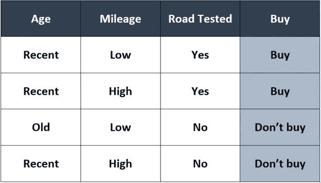

在上一篇文章中，我们仅通过查看图表来绘制决策边界。但是树做不到这一点。作为人类的好处，对吧？决策树使用熵来寻找分割点和要分割的特征。

# 熵

熵的定义是缺乏秩序或可预测性。在一堆例子中，它是杂质的量度。如果节点只有一个类的实例，那么它就是最纯的。

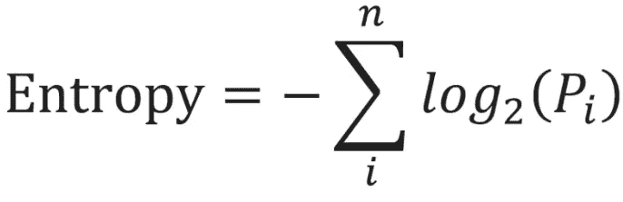

> 其中 *n* =特征数量
> 
> *i* =特征
> 
> P =概率 *i*

为每个特征计算熵，并且选择产生最小值的一个用于分割。熵的数学范围是从 0 到 1。

# 我们开始吧！

现在让我们把它付诸实践。为每个节点计算熵。第一个节点，即根节点，总是具有数据集中的所有示例。

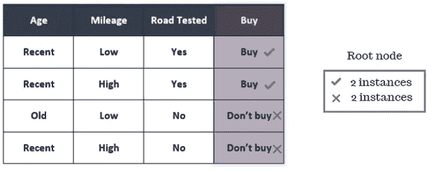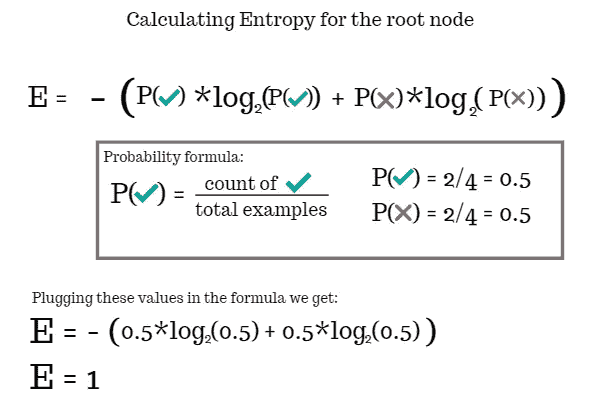

正如你所看到的，父节点的熵是 1 。请记住这个值，我们将在接下来的步骤中计算信息增益时使用它。

# 信息增益

下一步是找到信息增益(IG)，它的值也在 0-1 的范围内。信息增益帮助树决定分割哪个特征:给出最大信息增益的特征。我们现在将逐个计算每个特征的信息增益。对于这个迭代，父节点的熵是我们上面计算的 1。

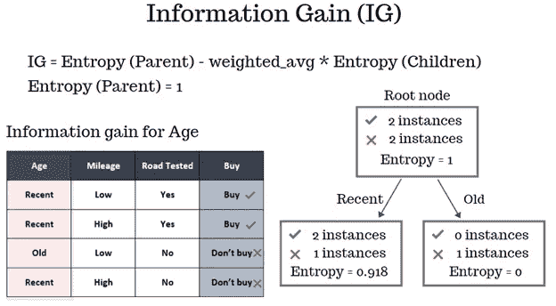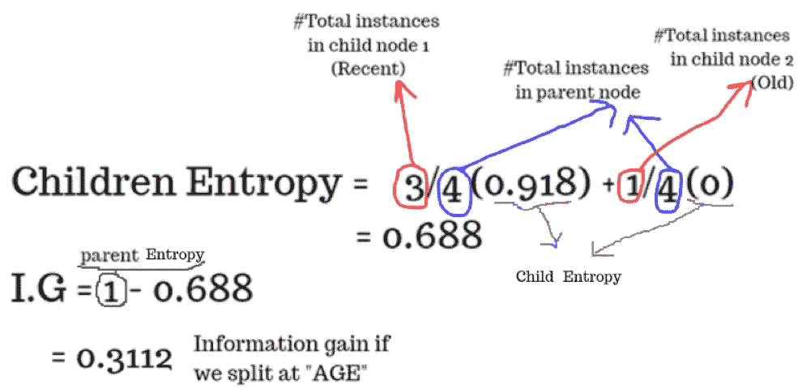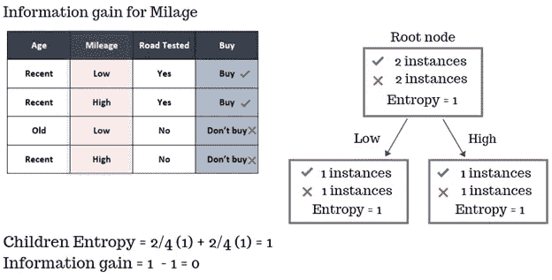

在上图中，我们可以看到左边子节点的熵是 1，因为类实例的比率是 1:1。这是最不纯的一个节点。右边的子节点也是如此。

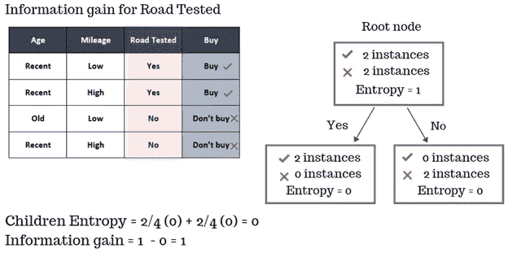

这里，子节点的熵值为 0，因为每个子节点只有一个类的实例:最纯粹的节点。

总而言之，下表显示了每个特征的**信息增益**:

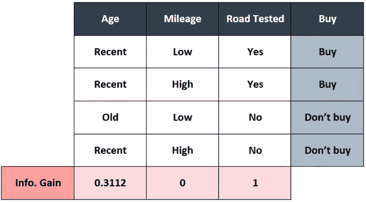

Information gain for every feature

最大信息增益是针对特征**“路试”**的，因此我们将选择它作为我们的第一个分割特征。这样做将生成下面给出的树结构:

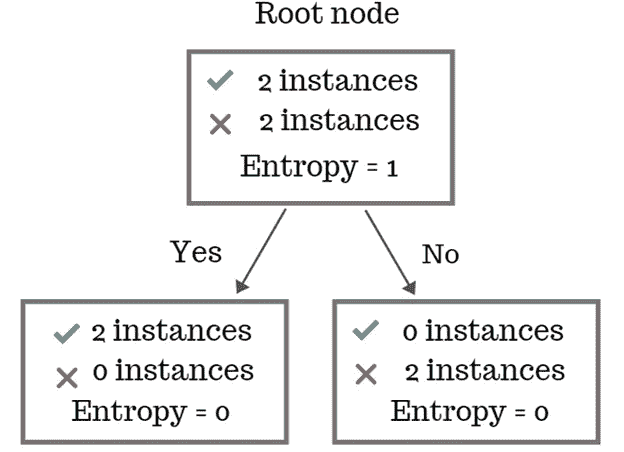

由于叶节点的熵为零，我们将停止切割。如果不是这种情况，那么我们将继续寻找前面的父节点和子节点的信息增益，直到满足任何一个停止标准。

# 基尼杂质

和熵一样，基尼杂质也是计算节点杂质的一种度量，具有相同的数学范围[0–1]。其中 1 表示最大杂质，0 表示最小杂质。

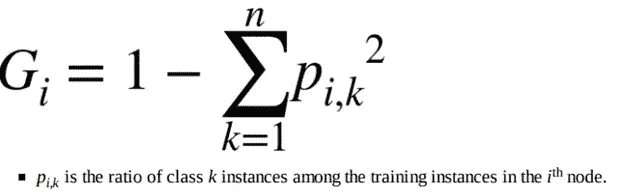

Image source: *Hands-On Machine Learning with Scikit-Learn & TensorFlow*

# 基尼还是熵？

Photo by [Joshua J. Cotten](https://unsplash.com/@jcotten?utm_source=medium&utm_medium=referral) on [Unsplash](https://unsplash.com?utm_source=medium&utm_medium=referral)

也可以用*基尼杂质*代替*熵*。尽管如此，无论您使用哪一种，结果都不会有太大的不同。但是计算 Gini 杂质比熵稍微快一点。熵产生更平衡的树，而基尼不纯倾向于将多数阶级分成自己的分支。

Photo by [Hanny Naibaho](https://unsplash.com/@hannynaibaho?utm_source=medium&utm_medium=referral) on [Unsplash](https://unsplash.com?utm_source=medium&utm_medium=referral)

> 如果您有任何问题或建议，请随时在下面发表。你也可以在 [**Linkedin**](https://www.linkedin.com/in/azika-amelia/) 上和我联系。*💼*
> 
> 直到那时和平结束。 *✌*