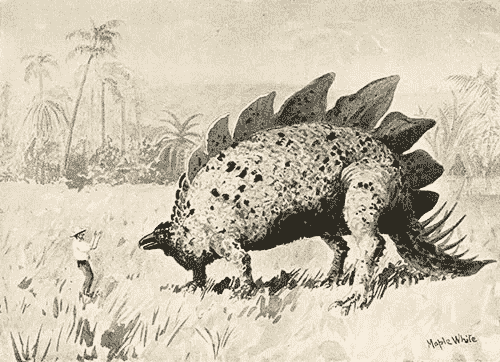
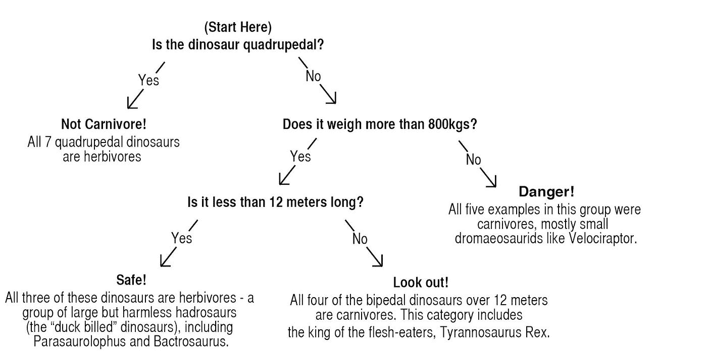
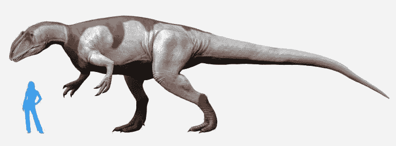
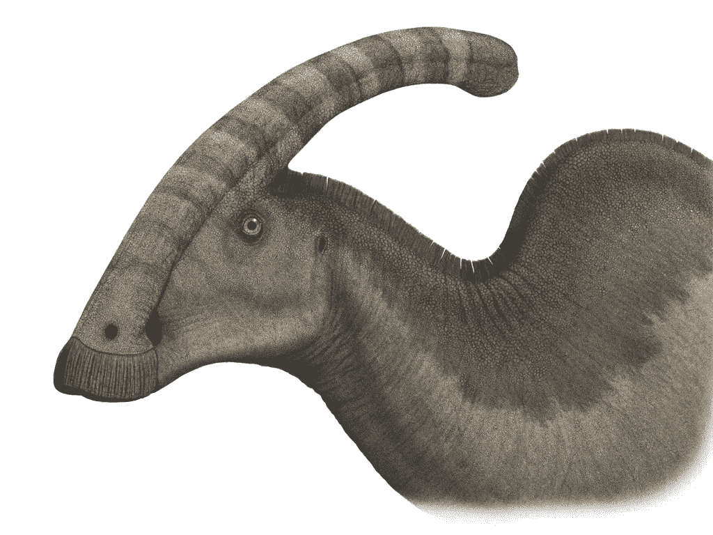
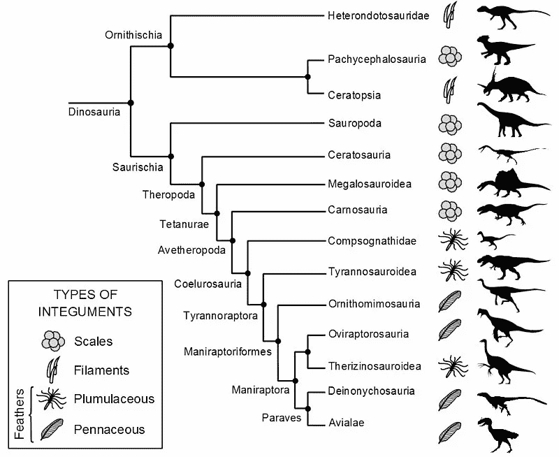
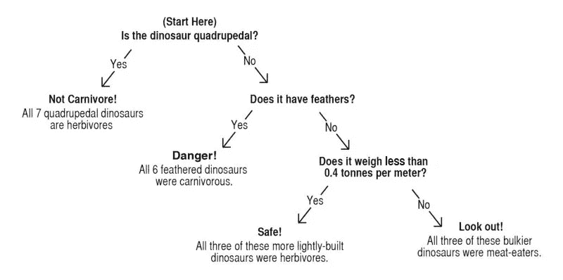

# 决策树和恐龙

> 原文：<https://towardsdatascience.com/decision-trees-and-dinosaurs-c14339a37ad8?source=collection_archive---------23----------------------->

## 计算机如何思考:第一部分

想象你和我一起计划一次旅行。这次旅行需要很多准备，因为这是一次穿越时间的旅行，到地球遥远的史前时代。我们的旅行是一次观光探险。我们计划去看各种奇妙的生物，尤其是原始动物展览中的明星，恐龙。但是我们必须小心！这不是去动物园！恐龙看到我们的次数和我们看到它们的次数一样多，而且并不是所有的恐龙都有善良的意图。如果我们不想被这个古老世界的居民打扰，我们就必须准确地区分恐龙的两个主要分支:无害的食草动物，当我们看着它们时，它们可能会简单地盯着我们；以及致命的食肉动物，它们更喜欢吃我们。

This could be us

如何最好地实现这种朋友和敌人的确定？恐龙有很多种，其中一些鲜为人知，对它们进行详尽的研究是不切实际的。在侏罗纪时代，我们将无法获得电力或互联网，即使我们能够记住目前科学已知的每个物种的每个细节，任何未知物种对我们来说都将是一个完全的谜。我们需要能从我们现在所知道的东西中归纳出一些东西来处理新的情况。我们需要的是一些能适用于这个问题的简单规则。我们将创建一个“模型”——一套规则——来帮助我们更容易地做出决定，而不是学习恐龙生物学的每个细节。在计算机处理数据的帮助下，我们可以提出一套识别恐龙饮食的最佳规则，让我们能够安全地穿越时间，而不必在我们的时间机器中打包一堆百科全书。

这类问题的名称是“分类”，它是广泛采用的计算机学习的最早例子之一。它的应用包括识别收件箱中的垃圾邮件，为电话销售人员标记可能的线索，最复杂的是，从照片中识别人脸。

为了防止我们的史前冒险以死于食肉爬行动物的口中而告终，我们将构建一个“两类决策树分类器”，这是一个极其简单的模型，通过几个数字输入，它将告诉我们任何给定的恐龙物种是无害的好奇心，还是致命的威胁。它是“两个纲”，因为它只确定了两个不同的恐龙纲:食肉恐龙或非食肉恐龙。它是一个“决策树”,因为它用来区分这两个类别的方法采取了一系列分支决策的形式，就像一个流程图(或一棵树),引导我们做出关于最可能的类别的决策。

这种计算机辅助分类的核心是一种洞察力，即在一些聪明的数学的帮助下，计算机可以比人更准确地找到一组数据中的模式。我们可以让专家检查每个恐龙物种，记录它们的饮食偏好，然后每当我们遇到新的恐龙，翻阅我们的年鉴，直到我们找到这个物种的条目。但是对于书中没有的物种，我们就没那么幸运了。相反，我们可以让我们的人类专家教我们一套规则，通过这些规则我们可以做出决定。但是分析如此大量的数据，权衡每一个异常和排列，是一项巨大的任务，而人类往往做得很差。计算机可以更快、更准确地完成同样的工作，并处理大量数据，其规模甚至是人类无法尝试的。

为了开始构建一个分类器，我们必须收集一些关于一组恐龙物种的事实，并以这样一种方式对其进行编码，以使其适合我们的算法。我们将制作一个表，其中每一行代表一只恐龙，每一列是一个数值，代表关于那只恐龙的一些信息。因此，举例来说，侏罗纪时期温和的巨人剑龙和白垩纪晚期凶残的暴君霸王龙可以用下面两行来表示:

*Table One: Data for two dinosaur species*

您会注意到，这些数据中有一些是以稍微不同寻常的方式表示的。我们没有一个名为“步态”或类似的包含“两足动物”或“四足动物”的列，而是有一个名为“两足动物”的列，包含 1(这种恐龙是两足动物)或 0(它不是两足动物)。这将类别编码为算法能够解释的数字格式。

我收集了 20 种最著名的恐龙物种的信息来训练我们的分类器。这些恐龙包括食草恐龙和食肉恐龙、四足恐龙和两足恐龙、小型恐龙和大型恐龙，以及来自原始侏罗纪茂盛丛林和白垩纪晚期茂密森林的恐龙。

在这些方面，我让决策树算法——一系列重复的简单步骤——来完成它的工作。这个算法非常简单，我们自己也可以遵循:

我们检查了数据表中的每一列，找到了单个列，以及该列的单个值，这最能区分食肉动物和它们的食叶兄弟。在本例中，它是“两足动物”列。四足恐龙是严格的素食者，在我们目前的数据中没有例外。这个决策成为我们决策树的“主干”——第一个决策节点，其他决策从这个节点分支。对于我们的四足动物，算法是完整的，不需要进一步的决定。但是对于两足动物，我们剩下的是食肉动物和食草动物的混合体，我们必须构建额外的节点。在这种情况下，其余示例的最佳分割是测量主体的长度。如果你的恐龙从鼻子到尾巴超过 12 米，那么你就有麻烦了——它是食肉动物，你拿着梯子和卷尺站在它旁边。然而，较小的两足动物仍然是食肉动物和食草动物的混合体，我们可以继续构建节点。

最终的决策树有点像一本“选择你自己的冒险”的书。为了决定一只给定的恐龙是否安全，我们浏览节点，在每个节点上做一个选择，直到我们到达一个“叶子”节点，它告诉我们最可能的类。这是树:

Figure One: Decision tree diagram

算法已经学习了一些关于恐龙的规则:所有的四足动物都是食草动物，超过 12 米长的两足动物是食肉动物。对于 12 米以下的两足动物，最轻的(800 公斤以下)更可能是食肉动物，较重的是食草动物。

这对我们 20 只恐龙来说很好，但是这些规则在野外会有多好呢？我们会度过一次平静而愉快的时光之旅吗？还是我们的假期会被一只巨大爬行动物意想不到的胃口所破坏？我们可以通过找到一组新的恐龙来测试这一点，用我们学到的这些规则进行分类，并检查我们正确预测了多少。请记住，我们在模型中寻找的关键品质之一是*通用性*。即使我们找到了所有已知恐龙物种的数据，在遥远的过去，我们肯定会遇到各种迄今未发现的物种。我们希望尽最大努力确保我们的模式也适用于他们。

为了测试这一点，我列出了另一个稍微不太常见的恐龙列表，并通过决策树模型运行它们，根据它们的步态(两足与四足)、长度和重量对它们进行预测。结果是……不好。

恐爪龙和阿尔伯特龙被正确地归类为食肉动物(虽然，后者的大小和火鸡差不多，不太可能构成太大的威胁)。同样，根据龙的四足步态，甲龙被正确地归类为食草动物。但是无害的厚头龙，其加厚的头骨被认为是为了用头撞击竞争对手，被归类为食肉动物——它不到 12 米，体重超过 800 公斤。更麻烦的是，三种危险的食肉动物，阿尔伯特龙、巨龙和阳川龙都被归类为食草动物，这可能会给我们带来一个不受欢迎的惊喜。

Yangchuanosaurus. I hadn’t heard of it either.

我们的模型出了问题！实际情况是，该算法学习了一种偶然出现在我们数据中的模式，但并没有推广到更广泛的人群。虽然我们的训练数据中很少有小而重的食肉动物，但事实上它们很常见。这是许多算法的弱点，尤其是决策树，尤其是对于这样一个小数据集。当你有少量的例子可以学习，并且有大量不同的方法可以将这些例子分开——按重量，按长度，等等，那么就很容易找到虚假的规则。

该算法发现四足动物普遍是素食者，这一规则似乎也适用于我们数据集之外的其他物种。但是关于重量和长度的规则似乎很可疑。算法发现的分界线——12 米的长度和 800 公斤的重量——似乎不太可能是恐龙进化的一般规则，更有可能是哪个物种碰巧被纳入我们的数据的一个意外。

我们有几个选项来尝试解决这个问题:

我们可以添加更多的数据。有了更多的数据，找到偶然模式的机会就少了，我们更有可能发现恐龙的真正规律。但是获取更多的数据可能会很困难，而且也不能保证我们会找到我们想要的规则——我们正在查看的特征(重量、长度等)中可能不存在真正的模式。

我们可以尝试不同的算法。我们可以用很多其他的方法来建立分类模型，其中很多不像我们的决策树那样容易发现任意的规则。但是这些算法要复杂得多，为了本章的目的，我想把重点放在这个非常简单的方法上。

第三个选项，也是我们将选择的选项，是寻找新的特性添加到我们的数据中。这意味着在我们的化石中找到更多关于恐龙的信息，并将其添加到我们已经知道的信息中。有希望的是，这些新信息将更有助于建立关于食肉恐龙和食草恐龙的通用规则。

这让我进入了令人困惑和有争议的恐龙进化世界。古生物学中几乎没有无懈可击的正统学说，甚至连恐龙的基本家谱也不断地被连根拔起、重新种植、嫁接和修剪。

然而有几个主题保持不变。恐龙谱系的主要分界线在蜥龙类和鸟龙类之间。这些贵族住宅主要根据臀部的方向来划分——“蜥蜴臀”的蜥脚类恐龙保持臀部向下并远离身体，而“鸟类臀”的鸟臀目恐龙更喜欢臀部朝后，与现代鸟类的方向相似。然而，令人困惑的是，是蜥脚类动物成为了今天鸟类的祖先，而不是表面上更相似的鸟臀目动物。

对我们的分析有用的是，它是蜥蜴类的一个分支，代表了大量的食肉恐龙。蜥蜴类的这个分支，兽脚亚目恐龙，在它们的数量中既有纤细小巧的恐爪龙，也有体型巨大健壮的霸王龙。兽脚亚目恐龙几乎完全是肉食动物。如果我们能确定兽脚亚目恐龙的共同特征，我们就能极大地改善我们模型的性能。

我添加的第一个额外功能是一个简单的“每米吨数”计算，我推断，虽然之前的模型发现的关于重量和长度的规则可能不成立，但食肉恐龙的体型可能存在差异，一般来说，它们的体型可能比食草恐龙更重或更轻。

我还观察了一些恐龙更奇特的特征。剑龙有板状的刺，这被认为是为了展示或防御，或者可能是调节热量。副栉龙，我最喜欢的恐龙，有一个鼻冠，这被认为是允许它发出响亮的交配叫声，或者它可能有一个装饰性的褶边。我希望，食草动物可能更有可能具有这些防御或展示特征，因为它们更多地生活在群体中，不得不保护自己免受捕食者的伤害。

Parasaurolophus. The best dinosaur.

最后，也许是有争议的，根据目前的研究，我研究了哪些物种被认为有大量的羽毛。这份名单包括了数量惊人的众所周知的恐龙。事实证明，这也非常复杂，仍有几个问题存在争议。

但这是一条充满希望的道路！我们食草的鸟臀目动物都有鳞片或覆盖着丝状毛发。笨重的蜥脚类动物普遍有鳞。只有在食肉兽脚亚目恐龙中，我们才发现像现代鸟类一样的有翼羽毛，现在人们认为这种“羽状体被”(或“绒毛外套”)可能使可怕的霸王龙及其亲属更像一只巨大的毛茸茸的火鸡。

将这些添加的数据编码到我的数据中，我重新运行决策树算法，让它重新计算拆分数据行的最佳方式，以区分食草动物和食肉动物。

这是它生成的决策树:

Figure Two: A more effective tree

它发现的第一条规则和以前一样——四足恐龙从不食肉。但从那里开始，情况就大不一样了。所有长有羽毛的恐龙都是食肉动物，在那些幸存的无羽毛物种中，我们可以通过观察它们的体重与长度的比例来巧妙地将食草动物与食肉动物区分开来。

对照我们的测试集检查这些新规则，我们现在达到了完美的准确性，将无害的龙和厚头龙归类为食草动物，而危险的阿尔伯特龙、巨龙和阳川龙都被标记为食肉动物。有了这个新的分类系统，我们可以满怀信心地穿越史前史。我们可以在一张纸上画出这个流程图，带上卷尺和一套结实的天平，启动时间机器，然后出发。

但是真的这么简单吗？在测试了我们的模型并获得了完美的准确性之后，我们可能会假设我们将在实践中继续获得类似的结果。这是一个危险的假设。

任何分类模型的好坏取决于对其进行训练的数据以及对该数据所做的假设。任何模型中都隐含着无数的偏见、盲点和疏忽，这个模型也不例外。

例如，如果在一次即兴的史前游泳探险中，我们遇到了蛇颈龙，我们将很难用我们的模型将其分类。到底是不是两足动物？它很可能是由前侏罗纪二叠纪或三叠纪时期的四足鳄鱼祖先进化而来，但在侏罗纪，它用四只巨大的鳍状肢游泳。我们的模型是在陆地物种上训练的，对于如何对水生恐龙进行分类却保持沉默。

同样，我们的模型假设恐龙来自白垩纪或侏罗纪。更早的二叠纪是类似恐龙的突触体(事实上更接近哺乳动物)的家园，如帆背和食肉的双足类恐龙。Dimetrodon 是食肉动物，像二叠纪的大多数顶级食肉动物一样，是四足动物。去二叠纪的旅行者会被我们的模型严重误导。

更阴险的是我们的模型中的偏见，这些偏见是我们看不见的，因为模型是在文化或历史背景下创建的。我们的模型是在一些最知名的恐龙物种上训练的，等等知名的物种上，它表现的很好。但是，哪些物种广为人知，哪些不为人知，这是历史偶然事件的产物。古生物学主流发展的国家的本土恐龙几乎肯定会更出名。那些最先被发掘、鉴定和公布的少数物种不可避免地引起了公众的注意，这是最近的发现所没有的。

我们的模型告诉我们，有羽毛的两足动物总是食肉动物，这在美国和西欧发现的物种中很大程度上是正确的。但是最近的研究打乱了这个简洁的启发。这些发现包括西伯利亚恐龙，如长有羽毛的食草恐龙*jianianhualongi，*或 *Kulindadromeus，*一种长有羽毛状结构涂层的鸟臀目恐龙，以前被认为是兽脚亚目恐龙的专属物种。中国物种，如长爪、有绒毛的兽脚亚目食草恐龙兽暴龙，进一步混淆了画面。如果我们在中国和西伯利亚常见的恐龙物种上训练我们的模型，我们可能会创造出一个完全不同的模型，而希望参观他们祖国史前史的中国时间旅行者将不会被我们当前的算法所服务。

A friendly Therizinosaurus, a feathered herbivore

大多数分类算法的现代实现比我们在这里创建的简单模型要复杂得多。它们涉及更多的要素，对数据中的模式进行更复杂的解析，以及要学习的更大的数据集。这些模型中的许多都非常精确，它们的分类基于从数据中通过算法得出的规则，与人类驱动的决策相比具有无数优势。它们更快、更可靠、更一致，并且经常能够察觉到即使是观察力最敏锐的人也无法察觉的模式。

但是支撑我们简单恐龙模型的基本概念也适用于最复杂的分类器。该算法在给定的数据中发现模式，并使用这些模式来建立关于如何对新示例进行分类的规则。根据初始数据，该模型对更广泛的人群进行概括，这种概括就是它进行预测的方式。这些规则和归纳可能非常复杂，也非常准确，但它们只能和最初创建它们的数据以及对这些数据做出的假设一样好。这些复杂的模型和我们非常简单的模型一样容易受到偏见和限制。作为人类思维的产物，经过人类数据的训练，它们会受到人类易犯错误的影响。在我们穿越时空的旅行中，我们将把现代世界和它的失败抛在身后。但从某种意义上说，我们也会把它们带在身边，嵌入我们做出的假设中。

[*本文代码可以在这里找到*](https://github.com/SimonCarryer/dinosaurs/blob/master/Dino%20model.ipynb) *。*

*第二部分，“线性回归与线的继承”是* [*此处可用*](https://medium.com/@simoncarryer/linear-regression-and-lines-of-succession-451569c39016) *。*