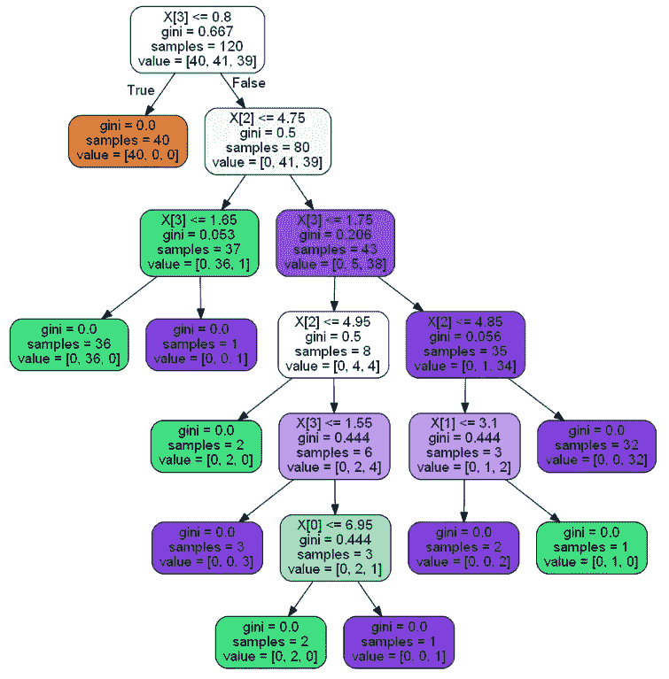
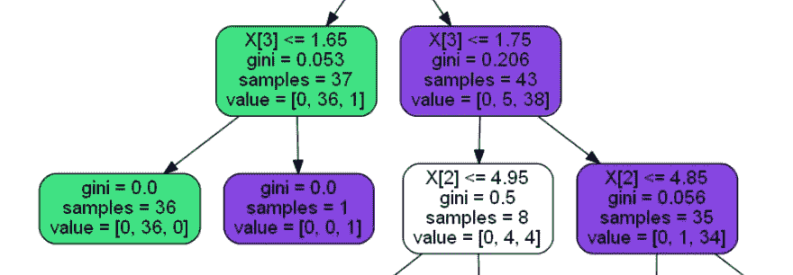
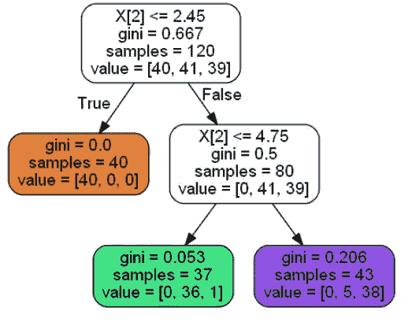

# 决策树和随机森林:

> 原文：<https://towardsdatascience.com/decision-trees-and-random-forests-74b89a374db?source=collection_archive---------17----------------------->

## min _ 杂质 _ 减少是做什么的，应该怎么用？


Photo by [Filip Zrnzević](https://unsplash.com/@filipz?utm_source=unsplash&utm_medium=referral&utm_content=creditCopyText) on [Unsplash](https://unsplash.com/search/photos/trees?utm_source=unsplash&utm_medium=referral&utm_content=creditCopyText)

在我学习决策树和随机森林的过程中，我注意到许多超参数被广泛讨论和使用。最大深度、最小样本叶等。，包括仅适用于随机森林的超级参数。一个似乎很少被关注的超参数是最小杂质减少。

## **最小杂质减少是什么意思，有什么作用？**

要理解这一点，你首先要理解超参数的基本标准是什么。所用的标准是测量每次分裂的杂质，从而计算出通过分裂获得的信息。然后，它可以决定如何进行最佳分割。当杂质为 0 时，则该叶子中的所有项目都被正确分类。

关于基尼指数和熵的更长的解释可以在这篇文章中看到:

[](/gini-index-vs-information-entropy-7a7e4fed3fcb) [## 基尼指数与信息熵

### 关于杂质测量和信息增益，您需要了解的一切

towardsdatascience.com](/gini-index-vs-information-entropy-7a7e4fed3fcb) 

min _ infinity _ decrease 的作用是在分解的减少额小于输入额时停止分解。当我们继续将它形象化时，这将更容易理解。

## 可视化决策树以查看正在进行哪些拆分

让我们看看我用虹膜数据集和所有默认的超参数做的决策树。请注意，由于这个数据集的情况，从这个树上得到的分数对于训练和测试来说几乎是完美的。因此，我不会在本文中显示每个模型运行的分数，我只是试图展示如何使用 min _ infinity _ decrease 超参数。

这是训练数据的决策树的可视化，每个节点和叶都有基尼指数:



在训练集中有 120 个样本，我们试图对 3 种类型的虹膜进行分类。第一次拆分右侧的值= [0，41，39]意味着第一组中没有任何项目被错误分类，第二组和第三组中的项目数量几乎相等。因此，该节点的杂质被舍入到 0.5，这意味着它们中的大约一半被正确分类，而大约一半被错误分类。

我们在建模中试图最小化的事情之一是过度拟合。其原因是，如果我们过度适应我们的训练数据，那么我们可能会对我们的测试数据或真实数据进行错误分类。因此，我们希望尽量减少分裂成很小数量的叶子。

这也是最小杂质减少可以帮助我们的地方。如果分裂的不纯度上升，那么这将意味着我们正在进行分裂，这对我们没有帮助，而是过度适应训练数据。

让我们看看上面决策树中的一个例子:



这是正在进行的第三级分割。
从右侧可以看出，我们对 5 个分类错误的项目进行了拆分。在这条分界线的左边，有 4 个正确的和 4 个不正确的，基尼系数为 0.5。在右边，有 34 个正确的和 1 个不正确的。
我们似乎在这方面做得太多了，而且这样做并没有获得太多。
在左边，我们有 36 个正确的和一个不正确的，然后我们做一个分割来捕捉最后一个。这也过度拟合了我们的训练数据。

我们如何处理这两种分裂？

## 最小杂质减少量的计算

这个超参数是怎么计算出来的？如果我们检查它的文档，可以在这里找到[，那么我们会看到这个:](https://scikit-learn.org/stable/modules/generated/sklearn.tree.DecisionTreeClassifier.html)

```
min_impurity_decrease : float, optional (default=0.)A node will be split if this split induces a decrease of the impurity greater than or equal to this value.The weighted impurity decrease equation is the following::N_t / N * (impurity — N_t_R / N_t * right_impurity
 — N_t_L / N_t * left_impurity)where ``N`` is the total number of samples, ``N_t`` is the number of
samples at the current node, ``N_t_L`` is the number of samples in the left child, and ``N_t_R`` is the number of samples in the right child.``N``, ``N_t``, ``N_t_R`` and ``N_t_L`` all refer to the weighted sum, if ``sample_weight`` is passed.
```

让我们分解这个计算，以便更好地理解它:
**N _ t _ R/N _ t * right _ infinity:**取分裂右侧的杂质，并根据来自节点的右侧分裂中的样本百分比对其进行加权。

**N _ t _ L/N _ t * left _ infinity:**取左侧分裂的杂质，用左侧分裂中样本占节点的百分比进行加权。

然后我们从节点杂质中减去这两者。
然后，我们根据节点中样本占样本总数的百分比对该数量进行加权。

让我们把它写在分割的右边:

```
43/120 * (.206 - 35/43 * .056 - 8/43*.5)
```

我们得到的总数是 0.024149999999999999998，或者四舍五入到 0.024。

43 是正在分裂的节点中的样本总数
120 是样本总数
206 是节点的杂质
35 是分裂右侧的样本总数
056 是分裂右侧的杂质
8 是分裂左侧的样本总数
5 是分裂左侧的杂质

手动计算这一切并不容易，我制作了一个函数，允许您输入上述数字，它将为您计算分裂的杂质:

```
def get_impurity_score(n=None, n_t=None, n_t_l=None, n_t_r=None, node_impurity=None, left_impurity=None, right_impurity=None):
    '''
    n = Total number of samples overall
    n_t = Samples in the node you are checking out
    n_t_l = Samples in the left split from the node
    n_t_r = Samples in the right split from the node
    node_impurity = Impurity score of the node
    left_impurity = Impurity score of the left split from the node
    right_impurity = Impurity score of the right split from the node

    Returns impurity decrease total of the 2 splits from the node impurity weighted by the total number of samples
    '''
    if n == None or n_t == None or n_t_l == None or n_t_r == None or node_impurity == None or left_impurity == None or right_impurity == None:
        print('-----error------ missing values. Check inputs') return(n_t / n * (node_impurity - (n_t_r / n_t * right_impurity) - (n_t_l / n_t * left_impurity)))
```

左侧分离的杂质分数为 0.016341666666666666666，或四舍五入至 0.016。

## **用这个来修复我们的决策树**

如果我们现在将最小杂质减少量设置为 0.025，则不会发生分裂，并且我们将减少模型中的过拟合。

我们更新的树:



我们现在确实阻止了这两种分裂的发生，以帮助防止我们的决策树过度拟合。

## 在随机森林中使用最小杂质减少

要在随机森林中使用它，我建议使用 GridsearchCV 来帮助找到对您试图构建的模型有益的超参数。

一般来说，我会建议使用这个和其他超参数来防止过度拟合。

我希望这有助于你理解最小杂质减少和如何使用它。如果您有任何问题或意见，请在下面的评论区提出。