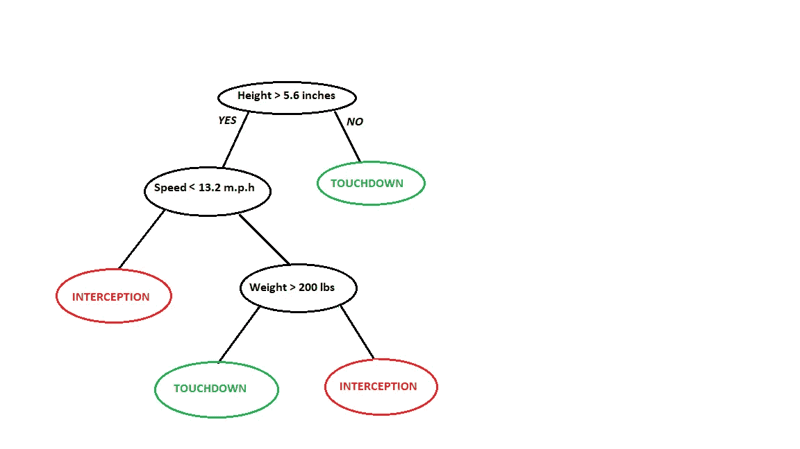
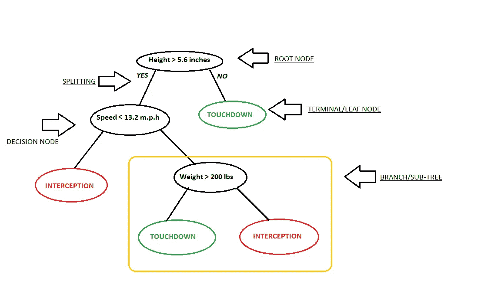
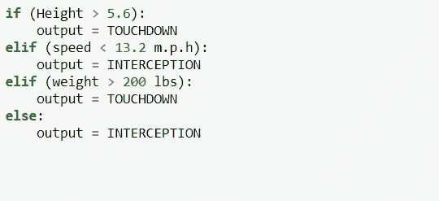
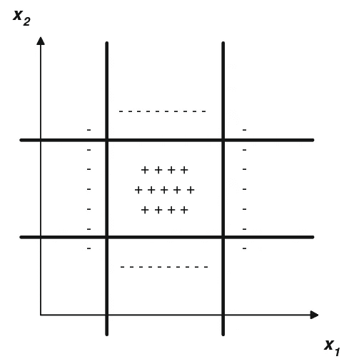
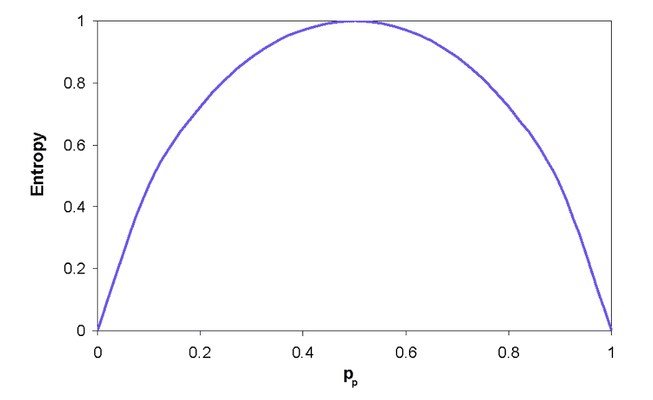
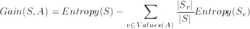
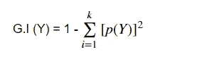
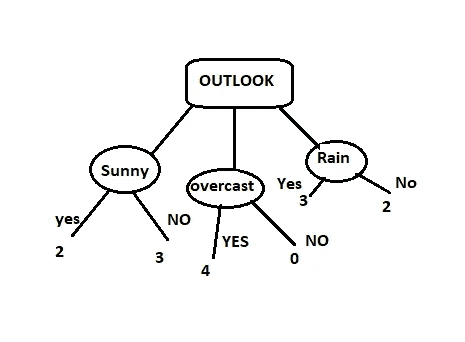

# 决策树

> 原文：<https://towardsdatascience.com/decision-trees-d07e0f420175?source=collection_archive---------3----------------------->

# 映射的概念:

## 0.引言。

*   ***什么是决策树？***
*   ***为什么要使用决策树？***

## 1.CART 是如何工作的？

*   ***购物车中使用的术语。***
*   ***几何分析。***
*   ***直觉发展。***

## 2.什么是熵值法？

*   ***用图形表示。***
*   ***数学公式&解释。***

## 3.信息增益。

*   ***数学公式&解释。***

## 4.基尼杂质。

*   ***为什么基尼不纯比熵好？***

## 5.纯节点的概念。

## 6.购物车中的过装和欠装。

## 7.停止标准。

*   ***克服过拟合&欠拟合的方法。***

## 8.推车的优点。

## 9.推车的缺点。

## 10.正在为购物车准备数据。

*   ***如何进行数值特征的拆分？***
*   ***列标准化的效果。***
*   ***如何处理分类特征？***
*   ***什么是决策树桩？***
*   ***不平衡类的效果。***
*   ***高维度的效果。***
*   ***离群值的影响。***
*   ***如何确定特征重要性？***

# 0.简介:

在深入决策树的理论概念之前，让我们先澄清什么是决策树？以及我们为什么要使用它们。

## 什么是决策树？

决策树是由 Leo brei man*提出来的，在现代也被称为 ***分类和回归树(CART)*** 。它们是有预定义目标变量的监督学习算法&，主要用于简单线性决策面的非线性决策。换句话说，它们适用于解决手边的任何类型的问题(分类或回归)。*

## *为什么要使用决策树？*

****最好也是最常用的监督学习方法之一*** 是基于树的算法。它们 ***赋予预测建模*** 以 ***更高的准确性、更好的稳定性，并提供了易于解释的*** 。与线性建模技术不同，它们很好地映射了非线性关系。决策树、随机森林、梯度推进等方法在各种数据科学问题中得到了广泛应用。因此，对于每个分析师来说，学习这些算法并在建模时应用它们是很重要的。*

# *1.CART 是如何工作的？*

*考虑下面给出的一个非常基本的例子，该例子使用 ***NFL 数据集*** 来预测球员是否会触地得分。下面的模型使用了 ***数据集中的 3 个特征/属性/列，即身高、速度和力量。****

**

*在这个问题中，我们需要根据三者之间高度重要的输入变量来隔离将在比赛期间得分的球员。这就是决策树帮助的地方，它将基于三个变量的所有值隔离玩家，并识别变量，这创建了玩家的最佳同质集合(彼此异质)。*

**

*   ****所用术语:****

*决策树由 ***根/内部节点*** 组成，其进一步分裂成 ***决策节点/分支*** ，根据分支的结果形成下一个分支或 ***终端/叶节点*** 。*

*   ****直觉发展:****

*或者，我们可以认为决策树是一组嵌套的 IF-ELSE 条件 的集合，它们可以被建模为一棵树，其中在内部节点做出决策，在叶节点获得输出。*

**

*NESTED IF..ELIF..ELSE*

*   ****几何类比:****

*几何上我们可以认为 ***决策树是一组轴平行的超平面，在推理过程中将空间划分为多个超立方体。*** 我们根据点属于哪个超立方体来对点进行分类。*

**

*Axis-parallel hyperplanes.*

# *2.什么是熵值法？*

*创建决策树只是选择在树的每个节点上应该测试哪个属性的问题。然而，信息增益是将用于决定在每个节点应该测试哪个属性/特征的度量。信息增益本身是使用称为熵的度量来计算的，我们首先为二元决策问题的情况定义熵，然后为一般情况定义熵。我们首先为二元决策问题定义熵的原因是因为它更容易理解它试图计算什么。汤姆·米切尔说得很好:*

> ****“为了精确定义信息增益，我们首先定义信息论中常用的一种度量，称为熵，它表征任意样本集合的(不)纯度。”****

*   ***图示:***

**

**数学上，熵可以表示为:**

**

*   ***方程式说明:***

*这个度量满足我们的标准，因为有了 *-p*log2(p)* 结构:当 *p* 接近于零时(即类别中只有几个例子)，那么 *log(p)* 就变成了一个大负数，但是 *p* 部分在计算中占主导地位，所以熵计算出来接近于零。记住熵是计算数据中的无序度的，这个低分数是好的，因为它反映了我们想要奖励例子很少的类别。类似地，如果 *p* 接近 1(即，该类别具有中的大部分示例)，那么 *log(p)* 部分非常接近 0，并且“p”再次主导计算，因此整体值接近 0。因此，我们看到，当类别几乎或完全为空时，或者当类别几乎包含或完全包含所有示例时，类别的得分接近于零，这是我们想要的模型。注意 ***0*ln(0)按惯例取为零。****

# *3.信息增益*

*让我们回到尝试确定为树中的特定节点选择最佳特征的问题。下述方法计算给定特征(A)的数值。关于一组示例。注意，属性 A 的值将在我们称为值(A)的一组可能性的范围内，并且，对于该组中的特定值 v，我们为属性 A 具有值 v 的示例组写 Sv。*

*属性 A 相对于示例集合 S 的信息增益计算如下:*

**

*基本上，信息增益取决于数据集被分割成属性后熵的减少。创建决策树围绕着寻找返回最高信息增益的属性的思想。*

*一般来说，如果所有的结果都有相同的可能性，如果一些结果比其他结果更有可能比熵减少，则熵最大。*

# *4.基尼杂质:*

*基尼系数可以作为熵值法的替代方法。Gini 杂质是一种度量，用于衡量从集合中随机选择的元素被错误标记的频率，前提是根据子集中的标签分布对其进行随机标记。*

**数学上可以表示为:**

**

*基尼系数法中熵的计算方式相同，但熵涉及对数计算，基尼系数杂质涉及平方计算。由于计算平方比对数函数更便宜，我们更喜欢基尼系数杂质而不是熵。*

# *5.纯节点的概念:*

*纯节点是其中所有数据点都属于同一类的节点，因此在这样的节点进行预测是非常容易的。*

**

*Here overcast is a pure node.*

# *6.购物车中的超配和欠配:*

*过拟合和欠拟合的后果及其原因将在后面讨论(停止标准)。*

1.  *树的深度越大，变化的可能性就越大(过度拟合)。*
2.  *而树的深度越小，偏向树的可能性就越大(欠拟合)。*

# *7.停止标准。*

*如果我们继续完全增长树，直到每个叶节点对应于最低的杂质，那么数据通常是过度拟合的。如果分割过早停止，训练数据的误差不会足够高，并且性能会由于偏差而受到影响。因此，在对决策树建模时，防止过拟合和欠拟合是至关重要的，这可以通过两种方式实现:*

1.  ***设置树大小的约束***
2.  ***树木修剪***
3.  ***设置树大小的约束:***

*   *为节点分裂提供最小数量的样本。*
*   *为终端节点(叶子)部署最小数量的样本。*
*   *允许树的最大深度(垂直深度)。*
*   *最大终端节点数。*
*   *分割时要考虑的最大特征。*

***2。树修剪:**修剪是机器学习中的一种技术*通过移除树的部分来减小决策树*的大小。它还降低了最终分类器的复杂性，并因此通过减少过拟合来提高预测精度。修剪树木有两种方式:修剪前或修剪后。*

****——预修剪:****

*   *如果当前节点没有将熵提高至少某个预设(阈值)值，则停止分裂当前节点。*
*   *如果数据点的数量小于某个预设(阈值)值，则停止分区。*
*   *将树的深度限制在某个预设(阈值)值。*

****-剪后:****

*   *这可以通过首先允许树增长到其全部潜力，然后在计算每一层的交叉验证准确性之后修剪每一层的树来实现。*

# *8.购物车的优势:*

1.  *决策树可以固有地执行 ***多类分类*** 。*
2.  *它们提供了 ***大多数模型的可解释性*** ，因为它们只是一系列 if-else 条件。*
3.  *它们既可以处理 ***数值*** 也可以处理 ***分类数据*** 。*
4.  ****特征间的非线性关系*** 不影响决策树的性能。*

# *9.购物车的缺点:*

1.  *数据集中的微小变化会使树结构不稳定，从而导致变化。*
2.  *决策树学习者创建***欠适应树*** 如果某些类不平衡。因此，建议在拟合决策树之前平衡数据集。*

# *10.为购物车准备数据:*

*   *数字特征 的 ***分裂可以通过按升序对特征进行排序并尝试将每个值作为阈值点并计算每个值的信息增益作为阈值来执行。最后，如果获得的值等于给出最大 I.G .值的阈值，则欢呼..！！****
*   ****特征缩放*** (列标准化)不需要在决策树中执行。但是，它有助于数据可视化/操作，如果您打算将性能与其他数据或其他方法(如 SVM)进行比较，它可能会很有用。*
*   *为了让 ***处理决策树中的分类特征*** ，我们绝不能对分类变量执行一次热编码，即使分类变量是名义变量，因为大多数库可以自动处理分类变量。如果需要，我们仍然可以为每个变量分配一个数字。*
*   *如果树的高度或深度正好是 1，那么这样的树称为 ***决策树桩。****
*   ****不平衡类*** 确实对树的结构有不利影响，因此可以根据数据集使用上采样或下采样来避免。*
*   *除了偏斜的类之外， ***高维度*** 也会对树的结构产生不利影响，如果维数非常高，这意味着我们有很多特征，这意味着在每个节点上找到分裂标准将耗费大量时间。*
*   ****离群点也会影响*** 树的结构随着深度的增加树中离群点的几率增加。*
*   ****特征重要性*** 可以通过计算每一层的归一化总和来确定，因为我们必须降低熵，然后我们选择有助于大幅降低熵的特征。因此，对于归一化总和最高的特征，我们可以认为它是最重要的特征。类似地，具有第二高归一化总和的特征可以被认为是第二重要的特征。*

# *参考资料:*

*   *[基于树的建模](https://www.analyticsvidhya.com/blog/2016/04/complete-tutorial-tree-based-modeling-scratch-in-python/#one)。*
*   *[维基百科](https://en.wikipedia.org/wiki/Decision_tree_learning#Implementations)。*
*   *[决策树学习](http://www.doc.ic.ac.uk/~sgc/teaching/pre2012/v231/lecture11.html)*

# *导师:*

*Harshall Lamba，新潘韦尔皮莱工程学院助理教授。*