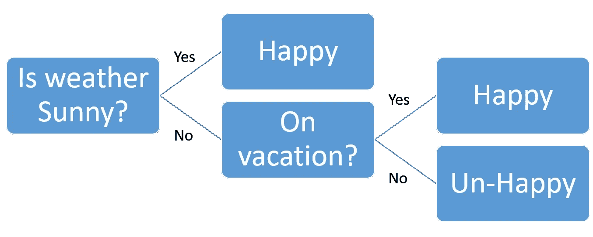

# 用于网上购物分析的决策树

> 原文：<https://towardsdatascience.com/decision-trees-for-online-shopping-analysis-9010e84f0bb2?source=collection_archive---------12----------------------->


如今有一种使用在线购物解决方案的趋势，如[亚马逊](https://www.amazon.com/)、[易贝](https://www.ebay.com/)、[全球速卖通](https://www.googleadservices.com/pagead/aclk?sa=L&ai=DChcSEwitqYzJiLXlAhXVko8KHWyRCsIYABAAGgJzYg&ae=1&ohost=www.google.com&cid=CAESQeD2YnHSec5n21hXfeC6w9gzPL_eCjp8uTTi2gzS6_Bj3DWJhHunOms85vjm6-1m27g-JonyJAVrkKFfGDoj7wa1&sig=AOD64_3tafIcM-6CpzEFbiUty2aOQumr0g&q=&ved=2ahUKEwiLzILJiLXlAhW0V3wKHdiHDKsQ0Qx6BAgOEAE&adurl=https://www.aliexpress.com%3Fsrc%3Dgoogle%26albch%3Dfbrnd%26acnt%3D304-410-9721%26isdl%3Dy%26aff_short_key%3DUneMJZVf%26albcp%3D2046244024%26albag%3D71280339814%26slnk%3D%26trgt%3Dkwd-489206970953%26plac%3D%26crea%3D358297651412%26netw%3Dg%26device%3Dc%26mtctp%3De%26memo1%3D1t1%26albbt%3DGoogle_7_fbrnd%26aff_platform%3Dgoogle%26albagn%3D888888%26gclid%3DCj0KCQjwl8XtBRDAARIsAKfwtxDsRTJQSmryb5vDmq9GFaiaa4CEKxzpI6jAYfV2y_YY-5Uveo2IqH8aAhZnEALw_wcB)。这些网站为卖家提供了一个向大量客户销售产品的平台。由于许多送货服务与这些在线购物平台相关联，因此来自不同国家的客户购买产品。与传统商店不同，每个卖家的评分和美誉度直接显示在购物平台上。因此，如果顾客不喜欢产品或产品有任何缺陷，卖家会让他们退货。如果顾客抱怨商品没有在承诺的期限内送达，一些卖家会全额退款。一些顾客滥用这些设施，欺骗销售者。因此，网络购物平台上的卖家遭受了巨大的利润损失。让我们讨论如何通过开发一个简单的机器学习模型来发现这些类型的客户；决策树。

如果你不熟悉决策树，可以看看这篇[中型文章。快速回顾一下，决策树是机器学习中的一个模型，它包括我们对数据进行分类的条件(用于标记问题)。举个例子，想一个简单的情况，一个男人很开心，因为天气晴朗或者他在度假。这个场景的模型如下。注意，在这个模型中，你可以用天气和假期状况来预测这个男人的快乐程度。](/decision-trees-in-machine-learning-641b9c4e8052)



A simple Decision Tree model

# 网购商品退货问题

当我参加 Datathon(数据黑客马拉松)比赛时，我从一家数据分析公司获得了一个包含在线购物平台详细信息的数据集。数据集经过编码，因此不会暴露客户和卖家的详细信息。然而，该数据集包括大量关于卖家、客户和产品的数据(以编码的方式)。上面提到的 datathon 的主要任务之一是发现项目返回模式。这包括经常返回的客户属性、一年中的月份、经常返回的商品详细信息和卖家详细信息。完整的数据集包括一年的完整数据。查看数据集架构以了解数据集。

Dataset schema

# 数据集加载和预处理

数据集非常庞大。即使它包含一年的数据，大小也大约是 25GB。被写成 4 个`.csv`文件(一年每季度一个文件)。即使电脑有 16GB 内存和固态硬盘，文件也很难处理。因此， [pandas](https://pandas.pydata.org/pandas-docs/stable/index.html) python 包被用来分块读取数据集。

```
chunks = pd.read_csv('dataset/DataSet01.csv', chunksize=1000000)for chunk in chunks:
    df = chunk
    ## Perform task on dataframe; df
```

请注意，`chunksize`参数表示仅来自给定的 1000000 条记录。csv 文件被读取。当预处理数据、训练机器学习模型(这里是决策树)和测试模型时，我们可以逐块执行这些任务。

至于预处理，缺少属性的记录被忽略，因为有数百万条记录具有必需的属性。通过观察与退货的相关性，给定属性的子集被选择用于项目退货分析。请看这个 [GitHub 库](https://github.com/chathuranga95/online-shopping-analysis)以获得更多关于相关性分析的细节和代码。最后，通过相关性分析和领域知识选择以下属性。

`selected_atributes = [‘ONLINE_STORE_CATEGORY’, ‘SIZE_CDE’, ‘CLOR_CDE’, ‘SELLING_PRICE’, ‘PRODUCT_CLASS_02’, ‘FMALE_IND’, ‘MRYD_IND’, ‘BRAND_CODE’, ‘EDUC_LVL_NBR’, ‘MRYD’, ‘AGE’, ‘2017_M7_PURCHASE_AMT’, ‘2017_M7_RETURNED_AMT’,’PRODUCT_CLASS_01', ‘PRODUCT_CLASS_02’]`

注意:这些属性包括商品的类别、尺寸、颜色、性别、年龄和顾客的婚姻状况、过去几个月的购买和退货金额、教育水平等。

# 构建决策树模型

让我们使用 sklearn 的[决策树分类器](https://scikit-learn.org/stable/modules/generated/sklearn.tree.DecisionTreeClassifier.html)来构建我们的决策树模型。

```
from sklearn.tree import DecisionTreeClassifier
from sklearn.model_selection import train_test_split
from sklearn import metrics# load selected attributes and return indication as X and y
X = df[selected_atributes]
y = df.RETURN_INDICATION## Split dataset into training set and test set
X_train, X_test, y_train, y_test = train_test_split(X, y, test_size=0.3, random_state=1) # 70% training and 30% testmodel = DecisionTreeClassifier()# train the model
model= model.fit(X_train,y_train)# testing the model
y_pred = model.predict(X_test)# Accuracy calculation
print("Accuracy:", metrics.accuracy_score(y_test, y_pred))
```

保留所有的超参数默认值，我获得了 89%的准确率。您还可以通过更改官方[文档](https://scikit-learn.org/stable/modules/generated/sklearn.tree.DecisionTreeClassifier.html])中提到的参数来更改决策树的超参数。

# 可视化模型

现在，我们已经构建了决策树，我们希望看到客户记录被归类为退货或不退货的条件(决策)。决策树可视化是理解这些条件的好方法。让我们使用`sklern.tree`中的`plot_tree`选项来生成树。

```
tree.plot_tree(model, max_depth=5, filled=True)
```

注意`max_depth=5`表示可视化树的前 5 个深度级别。我们的树非常复杂。因此，绘制完整的树需要大量的时间和内存。

您可以使用选项`sklearn.tree.export.export_text`以文本形式导出树。这样，可以很容易地生成完整的树。

```
from sklearn.tree.export import export_text
r = export_text(model)
print(r)
```

进入 [GitHub 库](https://github.com/chathuranga95/online-shopping-analysis)查看生成的情节和决策树的文本结构。

# 存储和重用模型

你可以使用`pickle`来保存模型。

```
pickle.dump(clf, open('finalized_model.sav', 'wb'))
```

以及从转储文件中加载模型。

```
loaded_model = pickle.load(open('finalized_model.sav', 'rb'))
```

# 使用模型进行预测(使用模型)

要将给定的客户记录分类为退货或不退货，我们可以使用 sklearn 树模型中的`predict`方法。请注意，您首先必须按照与您在模型构建步骤中相同的顺序加载相同的属性。让我们预测测试数据，因为我们将数据集分为训练集和测试集。

```
y_pred_loaded = loaded_model.predict(X_test)
```

这将返回一个预测列表(商品退货指示)，可以将该列表与实际退货指示进行比较，以评估我们的模型。

```
print(“Accuracy:”, metrics.accuracy_score(y_test, y_pred_loaded))
>>> 0.96
```

更重要的是，我们可以用这个模型来预测一些看不见的数据。如**网购商品退货问题**小节所述，数据集有 4 个。csv 文件。我们已经使用第一个文件来训练我们的模型。让我们使用第四个文件来预测返回指示。请注意，我们使用 pandas 来分块加载数据。

```
selected_atributes= ['ONLINE_STORE_CATEGORY', 'SIZE_CDE', 'CLOR_CDE', 'SELLING_PRICE', 'PRODUCT_CLASS_02', 'FMALE_IND', 'MRYD_IND', 'BRAND_CODE', 'EDUC_LVL_NBR', 'MRYD', 'AGE', '2017_M7_PURCHASE_AMT', '2017_M7_RETURNED_AMT','PRODUCT_CLASS_01', 'PRODUCT_CLASS_02']
chunks = pd.read_csv('dataset/DataSet04.csv',chunksize=1000000)i = 0
for chunk in chunks:
    i = i +1
    if(i>10):
        break
    df = chunk# load features and target seperately
    X_test = df[selected_atributes]
    y_test = df.RETURN_INDICATION

    y_pred = loaded_model.predict(X_test)

    print("Accuracy for chunk ", i, metrics.accuracy_score(y_test, y_pred))>>> Accuracy for chunk  1 0.865241
>>> Accuracy for chunk  2 0.860326
>>> Accuracy for chunk  3 0.859471
>>> Accuracy for chunk  4 0.853036
>>> Accuracy for chunk  5 0.852454
>>> Accuracy for chunk  6 0.859550
>>> Accuracy for chunk  7 0.869302
>>> Accuracy for chunk  8 0.866371
>>> Accuracy for chunk  9 0.867436
>>> Accuracy for chunk  10 0.89067
```

在测试步骤中，我们获得了 96%的准确率。然而，这将导致 80 年代中期的精度。这是因为该模型在一年的第一季度过度适应了季节变化。(回想一下，我们只使用第一个。4 个文件的 csv 文件)因此，它没有捕获一年最后一个季度的季节性变化。然而，在使用所有 4 个训练模型之后。csv 文件可以解决这个问题。您仍然可以从所有 4 个小块中加载数据。csv 文件并训练模型。

在这个 [GitHub 库](https://github.com/chathuranga95/online-shopping-analysis)查看代码。希望这篇文章对你有用。