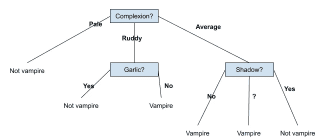
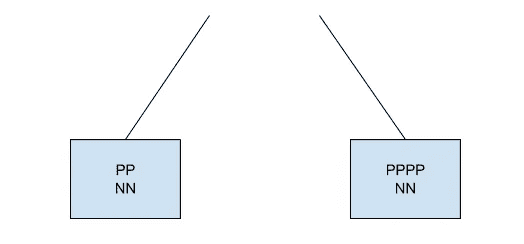

# 决策树—简介(ID3)

> 原文：<https://towardsdatascience.com/decision-trees-introduction-id3-8447fd5213e9?source=collection_archive---------10----------------------->

## 你有没有想过如何从过去的经验中学习？

你一生中会遇到不同类型的人，经过一些经历后，你会知道你喜欢什么样的人，对吗？我的意思是，在与许多人有过几次经历之后，当你遇到一个新的人时，大多数时候你会知道你是否喜欢他们。你是怎么做到的？有了**‘经验’**！对吗？但是你不会一直将多年的经验保存在大脑的顶部，而不是感觉到一些简单快速的决策机制在你的大脑中工作。

因此，与其深入研究大脑的生物学，不如让我们尝试在更简单的层面上建立一个类似的机制。

假设在你与几个人相遇后，你不想让吸血鬼成为你未来的朋友:P

所以你列出了你遇到的几个人，他们的特征，以及他们是否是吸血鬼。( "?"在阴影中属性是因为你只在黑暗的条件下遇到那些人，所以你无法验证他们是否投下阴影)

在观察了**这个数据**之后，我们可能会得出一个像这棵树一样的幼稚模型，

因为有了那棵树的帮助，我们可以做出决定，所以我们称之为“决策树”。这个树必须满足给定数据集中的所有数据，我们希望它也能满足未来的输入。

但是我们怎么能做出这样的树呢？上面给出的树只是通过对数据的一些随机观察…

根据观察结果…

*   所有肤色苍白的人**都不是吸血鬼**。
*   所有面色红润吃大蒜的人都不是吸血鬼，如果他们不吃大蒜，那么他们就是吸血鬼。
*   所有肤色普通的人，如果他们没有影子或者我们不知道他们是否有影子，那么他们**是吸血鬼**，或者如果他们有影子，那么他们**不是吸血鬼**。

但是，这是建立决策树的正确方法吗？那棵树是我们能从给定的数据集中得到的最简单的树。

这种对大型数据集的随机分析是不可行的。我们需要一些系统的方法来解决这个问题。

## 让我们尝试用贪婪的方法来解决这个问题…

首先，我们查看数据集并决定我们应该为树的根节点选择哪个属性…

这是一个布尔分类，所以在决策树的末尾我们会有 2 个可能的结果(要么他们是吸血鬼，要么不是)，所以每个输入的例子会被分类为真(正面例子)和假(负面例子)。

这里' **P'** 指阳性，表示一个人**是吸血鬼，**，‘N’指阴性，表示这个人**不是吸血鬼。**

我们希望属性将更多的数据分成同质的集合，这意味着在这样的集合中，只有 P 或 N 存在，因为如果我们有，我们肯定可以回答关于吸血鬼或没有，因此这些将是树的叶节点。

检查每个属性，看哪一个属性在同构集中的元素数量最多。在这里，我们发现**‘Shadow’**属性在同质集合中具有最高的元素计数，所以我们选择这个属性。

所以到目前为止，我们有这么多的树…

对于影子属性**【是】****【否】**，我们可以决定一个人是不是吸血鬼，但是万一**【呢？”**我们不知道，我们需要决定当 **shadow = '？'时，哪个属性划分数据好**

所以，让我们在阴影未知的情况下分析另一个属性…

这里我们发现“大蒜？”属性划分最大元素，实际上是同质集合中的所有元素。

所以，我们的树现在看起来像这样，

这个树看起来比我们通过选择随机属性创建的树更简单，所以我们观察到贪婪方法帮助我们获得更好的结果。

但是，这是正确的做法吗？

不会，因为如果数据集很大，我们不需要将属性划分到同质集合中，我们可能会发现同质集合中的所有属性元素都是 0。

## 那么我们应该如何进行呢？

所以现在让我们深入研究用于生成决策树的 **ID3 算法**，它使用了**信息增益**的概念，这是根据信息论中的基本量**熵**定义的。

想象一下某一属性的这两个部分…

我们观察到左边的那个有相同数量的 **P** s 和 **N** s，所以这并没有给我们任何关于决定的暗示，但是右边的一个比 **N** s 有更多的 **P** s，所以它可能在某种程度上把我们引向 **P** ，所以在这两个中我们可以考虑右边的一个。

所以，现在不要马上给他们 0 分，让我们用另一种方法。比方说， **P** s 和 **N** s 是相等数的一个熵最高(1)，只有 **P** s 或 **N** s 的一个熵最低(0)。我们可以有这样的东西， **P/(P+N) vs 熵**图。

(Graph created on Desmos)

所以，当 **P=N** ，从而 **P/(P+N) = 0.5** 那么**熵= 1** ，
如果**P = k**&**N = 0**那么**熵= 0** 。

这感觉像是一个非常合适的图表来实现我们想要的，那么有没有一些数学方法来得到这个图表…

幸运的是，这条曲线可以通过下面的等式得到

可以写成 **P/(P+N)** 和**熵**，
替换 **x= P/( P+N )** 和 **y =熵**，

其中 P 和 N 是我们正在寻找属性的属性的 **P** s 和 **N** s 的计数，

我们想从属性中找到信息增益，它被定义为，
( IG —来自某个属性的信息增益 **A** 是熵的预期减少)

**IG(Attribute) =属性熵—每个子集熵的加权平均值**

举个例子，

^ ( Example calculation of IG )

既然现在你已经了解了**熵**和**信息增益**的概念，让我们用这种新方法从头开始重新构建我们的决策树！

我们在这里观察到，我们从影子属性中获得了最大信息增益，选择它作为我们的根节点，

我们需要为 **Shadow = '？'决定另一个属性**

我们从大蒜中获得最大的信息增益，
所以我们的树看起来像这样，

这与前一种方法完全相同，因为幸运的是，在每一步中，我们都能够找到一些划分为同质集的属性，但是具有信息增益的方法更加健壮，可以应用于从大型数据集生成决策树。

**参考:** [识别树| MIT OCW](https://www.youtube.com/watch?v=SXBG3RGr_Rc)